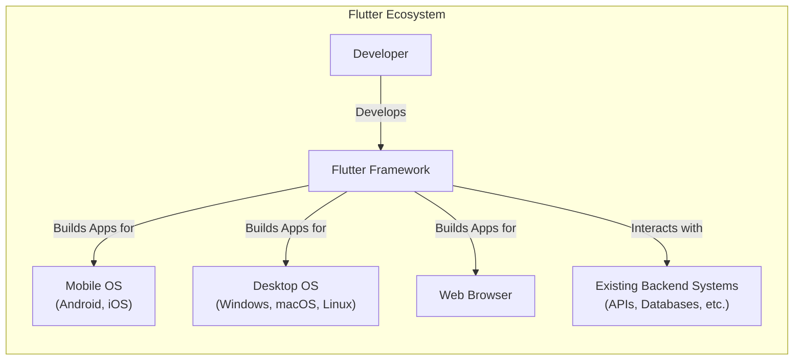
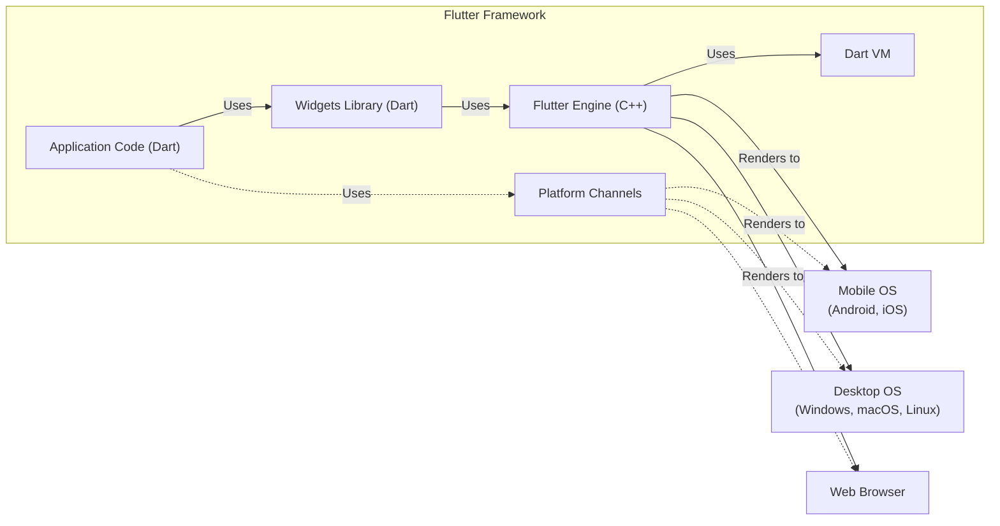
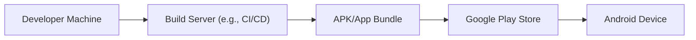
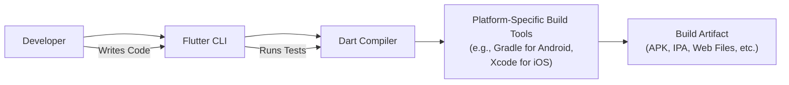

Okay, let's create a design document for the Flutter project, focusing on aspects relevant for threat modeling.

# BUSINESS POSTURE

Flutter is an open-source UI software development kit created by Google. It is used to develop cross-platform applications for Android, iOS, Linux, macOS, Windows, Google Fuchsia, and the web from a single codebase.  The primary business goal is to enable developers to build high-performance, visually appealing applications across multiple platforms efficiently, reducing development time and cost.  The project's success hinges on widespread adoption by developers and businesses.

Business Priorities:

*   Developer adoption and community growth.
*   Cross-platform compatibility and performance.
*   Ease of use and rapid development.
*   Extensibility and customization.
*   Maintaining a positive reputation for reliability and security.

Business Goals:

*   Become the leading cross-platform development framework.
*   Attract a large and active developer community.
*   Enable the creation of high-quality applications across various platforms.
*   Provide a robust and reliable platform for businesses to build upon.

Most Important Business Risks:

*   Loss of developer trust due to security vulnerabilities or instability.
*   Failure to keep pace with evolving platform requirements (e.g., new OS versions).
*   Competition from other cross-platform frameworks.
*   Fragmentation of the ecosystem due to uncontrolled extensions or forks.
*   Inability to address critical bugs or security issues in a timely manner.

# SECURITY POSTURE

The Flutter project, being an open-source framework, has a distributed security responsibility model. Google, as the primary maintainer, implements core security controls, but individual developers and organizations using Flutter are responsible for securing their applications built upon the framework.

Existing Security Controls:

*   security control: Code reviews: Implemented through the GitHub pull request process. All code changes are reviewed by multiple contributors before being merged.
*   security control: Static analysis: Integrated into the development workflow, using tools like the Dart analyzer to identify potential code quality and security issues. Described in contributing guide.
*   security control: Continuous integration (CI): Automated builds and tests are run on every commit to ensure code quality and prevent regressions. Described in contributing guide.
*   security control: Fuzzing: Flutter uses fuzz testing to find potential vulnerabilities. Described in `flutter/test/widgets/image_test.dart` and other test files.
*   security control: Dependency management: Flutter uses `pubspec.yaml` and `pubspec.lock` files to manage dependencies and ensure consistent builds. Described in Flutter documentation.
*   security control: Security advisories: Google publishes security advisories for Flutter vulnerabilities through its vulnerability rewards program and public disclosures.
*   security control: Sandboxing: On mobile platforms (Android and iOS), Flutter applications run within the operating system's sandbox, limiting their access to system resources. Enforced by the operating systems.

Accepted Risks:

*   accepted risk: Reliance on third-party packages: Developers may use third-party packages from the pub.dev repository, which may introduce security vulnerabilities.
*   accepted risk: Developer error: The security of applications built with Flutter ultimately depends on the developers' secure coding practices.
*   accepted risk: Platform-specific vulnerabilities: Flutter applications are subject to the security vulnerabilities of the underlying operating systems.

Recommended Security Controls:

*   security control: Software Composition Analysis (SCA): Implement SCA tooling to identify known vulnerabilities in third-party dependencies.
*   security control: Dynamic Application Security Testing (DAST): Incorporate DAST tools to test running applications for vulnerabilities.
*   security control: Regular security audits: Conduct periodic security audits of the Flutter framework and its core components.
*   security control: Enhanced documentation on secure coding practices: Provide more comprehensive guidance to developers on building secure Flutter applications.

Security Requirements:

*   Authentication:
    *   Flutter itself does not provide built-in authentication mechanisms. Developers must implement authentication using platform-specific APIs or third-party libraries.
    *   Requirement: Support secure storage of authentication tokens (e.g., using platform-specific secure storage APIs).
    *   Requirement: Provide guidance on implementing secure authentication flows (e.g., OAuth 2.0, OpenID Connect).
*   Authorization:
    *   Flutter does not provide built-in authorization mechanisms. Developers must implement authorization logic within their applications.
    *   Requirement: Provide examples and best practices for implementing role-based access control (RBAC) or other authorization models.
*   Input Validation:
    *   Flutter provides widgets for user input (e.g., TextField), but developers are responsible for validating the input.
    *   Requirement: Provide clear guidance and examples on how to validate user input to prevent common vulnerabilities like cross-site scripting (XSS) and injection attacks.
    *   Requirement: Encourage the use of input sanitization libraries.
*   Cryptography:
    *   Flutter does not provide its own cryptographic libraries. Developers should use platform-specific cryptographic APIs or well-vetted third-party libraries.
    *   Requirement: Provide guidance on using secure cryptographic practices (e.g., using strong algorithms, securely managing keys).
    *   Requirement: Discourage the use of custom cryptographic implementations.

# DESIGN

## C4 CONTEXT

C4 Context Element Descriptions:

*   Element:
    *   Name: Developer
    *   Type: Person
    *   Description: A software developer who uses the Flutter framework to build applications.
    *   Responsibilities: Writing code, testing, debugging, and deploying Flutter applications.
    *   Security controls: Adhering to secure coding practices, using strong authentication, and protecting their development environment.

*   Element:
    *   Name: Flutter Framework
    *   Type: Software System
    *   Description: The core Flutter framework, including the engine, widgets, and libraries.
    *   Responsibilities: Providing the tools and APIs for building cross-platform applications. Rendering UI, handling user input, and managing application state.
    *   Security controls: Code reviews, static analysis, fuzzing, CI, dependency management.

*   Element:
    *   Name: Existing Backend Systems (APIs, Databases, etc.)
    *   Type: Software System
    *   Description: Existing backend systems that Flutter applications may interact with.
    *   Responsibilities: Providing data and services to Flutter applications.
    *   Security controls: Authentication, authorization, input validation, encryption, access controls.

*   Element:
    *   Name: Mobile OS (Android, iOS)
    *   Type: Software System
    *   Description: Mobile operating systems that Flutter applications run on.
    *   Responsibilities: Providing the underlying platform for Flutter applications, including UI rendering, system services, and security features.
    *   Security controls: Sandboxing, permission system, secure boot, OS updates.

*   Element:
    *   Name: Desktop OS (Windows, macOS, Linux)
    *   Type: Software System
    *   Description: Desktop operating systems that Flutter applications run on.
    *   Responsibilities: Providing the underlying platform for Flutter applications, including UI rendering, system services, and security features.
    *   Security controls: Sandboxing (if applicable), permission system, secure boot, OS updates.

*   Element:
    *   Name: Web Browser
    *   Type: Software System
    *   Description: Web browsers that Flutter web applications run in.
    *   Responsibilities: Rendering Flutter web applications, providing the JavaScript runtime, and enforcing web security policies.
    *   Security controls: Same-origin policy, Content Security Policy (CSP), sandboxing.

## C4 CONTAINER

C4 Container Element Descriptions:

*   Element:
    *   Name: Dart VM
    *   Type: Runtime Environment
    *   Description: The virtual machine that executes Dart code.
    *   Responsibilities: Running Dart code, managing memory, and providing just-in-time (JIT) or ahead-of-time (AOT) compilation.
    *   Security controls: Sandboxing (in some environments), memory safety features.

*   Element:
    *   Name: Flutter Engine (C++)
    *   Type: Library
    *   Description: The core rendering engine, written in C++.
    *   Responsibilities: Rendering the UI, handling user input, and communicating with the underlying platform.
    *   Security controls: Code reviews, fuzzing, static analysis.

*   Element:
    *   Name: Widgets Library (Dart)
    *   Type: Library
    *   Description: A library of pre-built UI components (widgets).
    *   Responsibilities: Providing a rich set of UI elements for building applications.
    *   Security controls: Code reviews, static analysis.

*   Element:
    *   Name: Platform Channels
    *   Type: Communication Mechanism
    *   Description: A mechanism for communicating between Dart code and platform-specific code (e.g., Java/Kotlin on Android, Objective-C/Swift on iOS).
    *   Responsibilities: Enabling access to platform-specific APIs and features.
    *   Security controls: Data serialization and deserialization, input validation on both sides of the channel.

*   Element:
    *   Name: Application Code (Dart)
    *   Type: Code
    *   Description: The code written by developers to build their Flutter applications.
    *   Responsibilities: Implementing the application's logic, UI, and interactions with backend systems.
    *   Security controls: Developer-implemented security controls, secure coding practices.

## DEPLOYMENT

Flutter applications can be deployed to various platforms, each with its own deployment process.

Possible Deployment Solutions:

1.  Mobile (Android): APK or App Bundle to Google Play Store.
2.  Mobile (iOS): IPA to Apple App Store.
3.  Web: Static files (HTML, JavaScript, CSS) to a web server.
4.  Desktop (Windows): Executable (.exe) or MSI installer.
5.  Desktop (macOS): .app bundle.
6.  Desktop (Linux): Various package formats (e.g., .deb, .rpm, Snap).

Chosen Deployment Solution (Android):

Deployment Element Descriptions:

*   Element:
    *   Name: Developer Machine
    *   Type: Infrastructure
    *   Description: The developer's local machine where the code is written and tested.
    *   Responsibilities: Providing the development environment.
    *   Security controls: Local security measures (e.g., firewall, antivirus).

*   Element:
    *   Name: Build Server (e.g., CI/CD)
    *   Type: Infrastructure
    *   Description: A server that automates the build and deployment process.
    *   Responsibilities: Building the application, running tests, and creating the deployment artifacts.
    *   Security controls: Access controls, secure build environment, vulnerability scanning.

*   Element:
    *   Name: APK/App Bundle
    *   Type: Artifact
    *   Description: The Android application package or App Bundle.
    *   Responsibilities: Containing the compiled code, resources, and manifest file.
    *   Security controls: Code signing, ProGuard/R8 obfuscation and shrinking.

*   Element:
    *   Name: Google Play Store
    *   Type: Platform
    *   Description: Google's official app store for Android applications.
    *   Responsibilities: Distributing the application to users.
    *   Security controls: Google Play Protect, app review process.

*   Element:
    *   Name: Android Device
    *   Type: Device
    *   Description: An Android device that runs the Flutter application.
    *   Responsibilities: Running the application.
    *   Security controls: Operating system security features (sandboxing, permissions).

## BUILD

The Flutter build process involves several steps, from compiling the Dart code to creating platform-specific packages.

Build Process Description:

1.  Developer: The developer writes Dart code and uses the Flutter CLI to initiate the build process.
2.  Flutter CLI: The Flutter command-line interface handles the build commands (e.g., `flutter build apk`, `flutter build ios`, `flutter build web`).
3.  Dart Compiler: The Dart compiler compiles the Dart code into native machine code (for mobile and desktop) or JavaScript (for web).
4.  Platform-Specific Build Tools: The build process utilizes platform-specific tools (e.g., Gradle for Android, Xcode for iOS) to create the final application package.
5.  Build Artifact: The output of the build process is a platform-specific build artifact (e.g., APK, IPA, web files).

Security Controls in Build Process:

*   security control: Dependency management: Using `pubspec.yaml` and `pubspec.lock` to manage dependencies and ensure consistent builds.
*   security control: Static analysis: The Dart analyzer is used to identify potential code quality and security issues during development and build.
*   security control: Code signing: Mobile and desktop applications are typically code-signed to ensure their authenticity and integrity.
*   security control: Obfuscation and shrinking: Tools like ProGuard (Android) and R8 (Android) can be used to obfuscate and shrink the code, making it more difficult to reverse engineer.
*   security control: CI/CD integration: Automated builds and tests on CI/CD systems help ensure code quality and prevent regressions.

# RISK ASSESSMENT

Critical Business Processes to Protect:

*   The Flutter build process itself: Ensuring the integrity and security of the build pipeline is crucial to prevent malicious code from being injected into Flutter applications.
*   The Flutter framework's reputation: Maintaining a positive reputation for security is essential for developer trust and adoption.
*   Developer workflows: Protecting developers' machines and development environments from compromise.

Data to Protect and Sensitivity:

*   Source code (of both the framework and applications built with it): Sensitivity: High (Confidentiality).  Compromise could lead to intellectual property theft or the introduction of vulnerabilities.
*   Developer credentials (e.g., API keys, signing keys): Sensitivity: High (Confidentiality). Compromise could allow attackers to impersonate developers or publish malicious applications.
*   User data handled by Flutter applications: Sensitivity: Varies depending on the application.  Developers are responsible for protecting user data according to relevant privacy regulations and best practices.  Flutter itself does not handle user data directly.
*   Build artifacts: Sensitivity: High (Integrity). Compromise could lead to distribution of malicious applications.

# QUESTIONS & ASSUMPTIONS

Questions:

*   What specific threat actors are we most concerned about (e.g., script kiddies, organized crime, nation-states)? This helps prioritize threat modeling scenarios.
*   Are there any specific regulatory compliance requirements (e.g., GDPR, HIPAA) that apply to applications built with Flutter?
*   What is the expected lifespan of applications built with Flutter? This impacts the long-term security maintenance strategy.
*   What level of support is provided to developers for addressing security vulnerabilities in their applications?

Assumptions:

*   BUSINESS POSTURE: We assume that Google will continue to invest in the security of the Flutter framework.
*   BUSINESS POSTURE: We assume that the Flutter community will actively participate in identifying and reporting security vulnerabilities.
*   SECURITY POSTURE: We assume that developers using Flutter will follow secure coding practices.
*   SECURITY POSTURE: We assume that the underlying operating systems (Android, iOS, Windows, macOS, Linux, web browsers) provide a reasonable level of security.
*   DESIGN: We assume that most Flutter applications will interact with backend systems, requiring secure communication and authentication.
*   DESIGN: We assume that developers will use the recommended platform channels for accessing platform-specific APIs.
*   DESIGN: We assume that the build process will be automated using CI/CD systems.