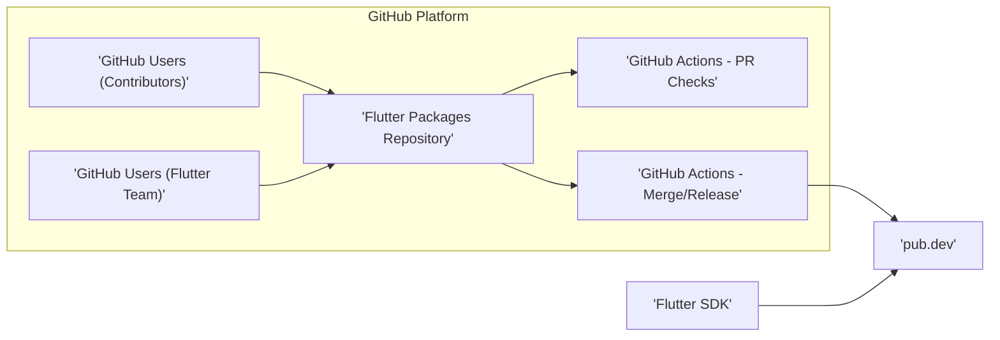

## Project Design Document: Flutter Packages Repository (Improved)

**1. Introduction**

This document provides an enhanced design overview of the Flutter Packages repository hosted on GitHub (https://github.com/flutter/packages). It details the system's architecture, components, and data flow with a specific focus on security considerations to facilitate effective threat modeling. The intended audience includes security engineers, developers, and anyone involved in the security assessment of the Flutter package ecosystem.

**2. Project Goals**

The primary objectives of the Flutter Packages repository are:

* To serve as the authoritative source for the development and maintenance of official Flutter packages.
* To enable seamless collaboration among Flutter team members and external contributors in package development.
* To uphold the quality, reliability, and security of official Flutter packages.
* To act as the staging ground for official Flutter packages before their publication to the public package registry, pub.dev.

**3. Scope**

This design document encompasses the following elements of the Flutter Packages repository:

* The GitHub repository itself, including its organizational structure, access management, and defined workflows.
* The various Continuous Integration and Continuous Deployment (CI/CD) pipelines associated with the repository, including their triggers and actions.
* The interactions and data exchange between the repository and pub.dev (the official package registry for Dart and Flutter).
* The distinct roles and responsibilities of individuals and automated systems interacting with the repository.

This document explicitly **excludes**:

* The internal architectural and implementation specifics of individual Flutter packages residing within the repository.
* The security posture and infrastructure of the pub.dev website and its underlying systems.
* The security aspects of the Flutter SDK itself, beyond its interaction with the repository and pub.dev.
* The security practices and vulnerabilities introduced by developers utilizing the published packages in their applications.

**4. System Architecture**

The Flutter Packages repository system comprises several interconnected components and automated processes.

**Components:**

* **Flutter Packages Repository ('Flutter Packages Repository'):** The central Git repository hosted on GitHub containing the source code, documentation, and issue tracking for official Flutter packages.
    * Leverages Git for version control and change management.
    * Employs GitHub's features for managing pull requests, conducting code reviews, and tracking issues.
    * Utilizes a branching strategy (e.g., `main`, release branches, feature branches) to manage development stages.
    * Access control is managed through GitHub's permissions model.
* **GitHub Users (Flutter Team) ('GitHub Users (Flutter Team)'):**  Authenticated individuals who are members of the Flutter team with elevated privileges within the repository.
    * Possess write access to the repository, enabling them to merge pull requests and manage branches.
    * Authentication typically relies on GitHub accounts, potentially with enforced multi-factor authentication (MFA).
    * Authorization is managed through GitHub's organization and repository roles.
* **GitHub Users (Contributors) ('GitHub Users (Contributors)'):** Authenticated individuals external to the core Flutter team who can contribute to the repository.
    * Can submit pull requests proposing changes to the codebase.
    * Do not have direct write access to protected branches.
    * Authentication is handled by GitHub accounts.
* **GitHub Actions - PR Checks ('GitHub Actions - PR Checks'):** Automated workflows triggered by pull request events (creation, updates) within the repository.
    * Executes a series of checks, including:
        * Running unit and integration tests.
        * Performing static code analysis (linting, formatting).
        * Running security scans (if configured).
        * Verifying code style and conventions.
    * Provides feedback on the pull request status, indicating success or failure of the checks.
* **GitHub Actions - Merge/Release ('GitHub Actions - Merge/Release'):** Automated workflows triggered by merge events to specific branches or the creation of tags (indicating a release).
    * Performs actions such as:
        * Building package artifacts (e.g., compiled code, documentation).
        * Running more extensive integration or end-to-end tests.
        * Publishing packages to pub.dev.
        * Updating documentation and release notes.
    * Requires secure storage and management of sensitive credentials for publishing to pub.dev.
* **pub.dev ('pub.dev'):** The official public package registry for Dart and Flutter packages.
    * Receives and hosts published packages originating from the Flutter Packages repository's CI/CD pipeline.
    * Serves as the primary distribution point for Flutter packages to the wider developer community.
    * Provides metadata about packages, including version history, dependencies, and documentation.
* **Flutter SDK ('Flutter SDK'):** The software development kit used by developers to build Flutter applications.
    * Developers utilize the Flutter SDK's tooling (e.g., `flutter pub add`) to declare dependencies on packages hosted on pub.dev.
    * The Flutter SDK interacts with pub.dev to download and manage package dependencies for projects.

**5. Data Flow**

The typical flow of data and actions within the Flutter Packages repository involves the following stages:

* **Code Contribution Initiation:**
    * A contributor (Flutter team member or external) identifies a need for a new feature or a bug fix within a specific package.
    * They fork the main repository to their personal GitHub account.
    * They create a new branch within their forked repository to isolate their changes.
* **Code Development and Commit:**
    * The contributor implements the necessary code changes and commits them to their branch.
* **Pull Request Submission:**
    * The contributor submits a pull request (PR) from their branch in their forked repository to the target branch in the main Flutter Packages repository.
* **Automated Checks (GitHub Actions - PR Checks):**
    * The submission of a PR triggers the "PR Checks" GitHub Actions workflow.
    * This workflow retrieves the code changes and executes predefined checks (tests, linting, security scans).
    * The results of these checks are reported back to the pull request.
* **Code Review and Iteration:**
    * Flutter team members review the submitted pull request, examining the code for correctness, quality, and security.
    * Feedback is provided to the contributor, who may then make revisions and push updated commits to their branch, automatically re-triggering the PR checks.
* **Merging and Integration:**
    * Once the pull request is approved by reviewers and all automated checks have passed successfully, a Flutter team member with write access merges the changes into the target branch (e.g., `main`).
* **Release Process Initiation (Manual or Triggered):**
    * A release process is initiated, often by tagging a specific commit on a designated release branch or through a manual trigger.
* **Package Building and Publishing (GitHub Actions - Merge/Release):**
    * The merge or tag creation event triggers the "Merge/Release" GitHub Actions workflow.
    * This workflow retrieves the code, builds the package artifacts, and potentially runs more comprehensive tests.
    * The workflow authenticates with pub.dev using securely stored credentials.
    * The package is published to pub.dev, making it available to the public.
* **Package Metadata Update:**
    * pub.dev updates its metadata for the newly published package, including version information, dependencies, and documentation.
* **Package Consumption by Developers:**
    * Flutter developers add the newly released package as a dependency in their application's `pubspec.yaml` file.
    * The Flutter SDK interacts with pub.dev to download the specified package version and its dependencies.

**6. Security Considerations**

This section details potential security considerations relevant to the Flutter Packages repository, categorized for clarity.

* **Authentication and Authorization:**
    * **Compromised GitHub Accounts:** Unauthorized access due to compromised GitHub accounts of Flutter team members poses a significant risk.
        * Could lead to malicious code injection, unauthorized package releases, or modification of repository settings.
        * Mitigation: Enforce strong password policies, mandatory multi-factor authentication (MFA), and regular security awareness training for team members.
    * **Stolen or Leaked CI/CD Secrets:** Exposure of credentials used by GitHub Actions to publish to pub.dev could allow unauthorized package releases.
        * Mitigation: Securely store secrets using GitHub's secrets management, adhere to the principle of least privilege when granting access to secrets, implement regular secret rotation, and monitor for accidental secret exposure.
    * **Insufficient Access Controls:** Improperly configured repository permissions could grant excessive privileges to contributors or automated systems.
        * Mitigation: Regularly review and audit repository access controls, enforce branch protection rules, and utilize role-based access control effectively.

* **Code Integrity and Supply Chain Security:**
    * **Malicious Code Injection via Pull Requests:** Malicious actors could attempt to introduce vulnerabilities or backdoors through seemingly benign pull requests.
        * Mitigation: Implement mandatory code reviews by multiple trusted team members, utilize automated static analysis security testing (SAST) tools within the CI/CD pipeline, and maintain a clear understanding of the contribution process.
    * **Compromised Dependencies:** Packages within the repository might depend on other external libraries that could be compromised.
        * Mitigation: Implement Software Bill of Materials (SBOM) generation and analysis, regularly scan dependencies for known vulnerabilities using Software Composition Analysis (SCA) tools, and pin dependency versions to avoid unexpected updates.
    * **Dependency Confusion/Substitution:** Attackers might attempt to introduce malicious packages with similar names to internal dependencies.
        * Mitigation: Carefully manage internal and external dependency resolution within the build process and CI/CD pipelines.

* **CI/CD Pipeline Security:**
    * **Compromised CI/CD Workflows:** Attackers could attempt to modify CI/CD workflows to inject malicious code into builds or exfiltrate secrets.
        * Mitigation: Treat CI/CD configurations as code and subject them to version control and review processes, restrict write access to CI/CD configurations, and regularly audit workflow definitions.
    * **Insecure Workflow Execution Environment:** Vulnerabilities in the environment where CI/CD workflows are executed could be exploited.
        * Mitigation: Keep runner environments up-to-date with security patches, minimize the software installed on runner environments, and consider using ephemeral runners.

* **Repository Infrastructure Security:**
    * **GitHub Platform Vulnerabilities:** The security of the repository ultimately relies on the security of the GitHub platform itself.
        * Mitigation: Stay informed about GitHub's security practices and any reported vulnerabilities.
    * **Accidental Data Exposure:** Sensitive information (e.g., API keys, internal documentation) could be unintentionally committed to the repository.
        * Mitigation: Implement pre-commit hooks to prevent the commit of sensitive data, regularly scan the repository history for secrets, and educate developers on secure coding practices.

* **Vulnerability Management:**
    * **Lack of a Clear Vulnerability Disclosure Process:**  Absence of a defined process for reporting and addressing security vulnerabilities can delay mitigation efforts.
        * Mitigation: Establish a clear and publicly documented vulnerability disclosure policy and process.

**7. Conclusion**

This enhanced design document provides a comprehensive overview of the Flutter Packages repository, emphasizing security considerations relevant for threat modeling. It details the system's architecture, data flow, and potential security vulnerabilities across various components and processes. This document serves as a crucial resource for security assessments, risk identification, and the development of mitigation strategies to ensure the integrity and security of the official Flutter packages and the broader Flutter ecosystem. Continuous review and updates to this document are essential to reflect changes in the system and the evolving threat landscape.