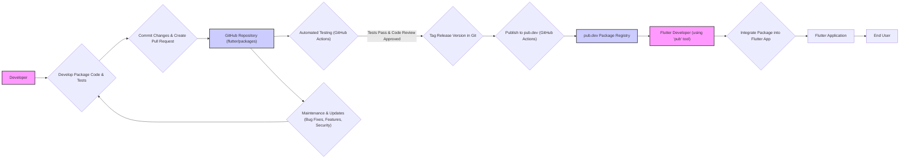
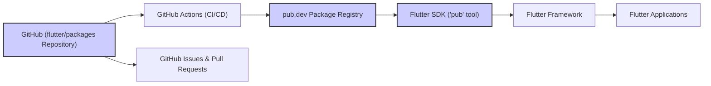
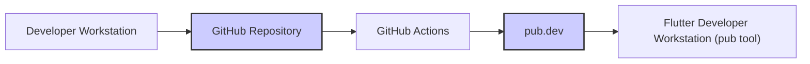

# Project Design Document: Flutter Packages Repository

**Document Version:** 1.1
**Date:** October 26, 2023
**Author:** AI Software Architect

## 1. Project Overview

This document details the design of the Flutter Packages repository, publicly accessible at [https://github.com/flutter/packages](https://github.com/flutter/packages). This repository is a cornerstone of the Flutter ecosystem, serving as a central hub for a wide array of packages developed by both the Flutter team and the broader community. These packages are designed to extend the core functionalities of the Flutter framework, offering developers readily available, pre-built components and solutions for common development needs and advanced features.

The primary purpose of this design document is to provide a clear and comprehensive understanding of the repository's architecture and its interconnected systems. This document will be the foundational resource for subsequent threat modeling exercises, aimed at proactively identifying potential security vulnerabilities and risks inherent within the Flutter packages ecosystem.  Understanding this design is crucial for ensuring the integrity, security, and reliability of the packages consumed by Flutter developers worldwide.

## 2. Goals and Objectives

The Flutter Packages repository is designed to achieve the following key objectives:

* **Extensibility of Flutter:** To significantly expand the capabilities of the base Flutter framework by providing a rich set of packages addressing diverse functionalities.
* **Code Reusability and Efficiency:** To promote and facilitate the creation and sharing of reusable code components, thereby accelerating Flutter development cycles and reducing redundant effort.
* **Community-Driven Innovation:** To actively encourage and support contributions from the global Flutter community, fostering a dynamic and continuously evolving collection of packages.
* **Quality Assurance and Reliability:** To uphold stringent standards for quality, performance, and security for all packages within the repository, ensuring developer trust and application stability.
* **Accessibility and Usability:** To provide clear, comprehensive documentation, practical examples, and well-structured APIs for each package, making them easily understandable and implementable by Flutter developers.
* **Seamless Package Management:** To ensure tight integration with Flutter development tools and `pub.dev` (the official Dart package registry), streamlining the entire package management workflow for developers.
* **Discoverability:** To make packages easily discoverable by Flutter developers based on their needs, through clear categorization and effective search mechanisms on `pub.dev`.

## 3. Target Audience

This document is specifically tailored for the following groups:

* **Security Professionals:** Including security engineers and architects, who will use this document to perform threat modeling, security audits, and vulnerability assessments of the Flutter packages ecosystem.
* **Flutter Engineering Team:**  Serving as official documentation of the design and architecture of the packages repository and its associated processes, aiding in onboarding new team members and maintaining system knowledge.
* **Package Maintainers and Contributors:** Providing context and architectural understanding to individuals contributing to or maintaining packages within the repository, ensuring alignment with overall project goals and standards.
* **Flutter Developers:**  Offering a deeper insight into the Flutter ecosystem, clarifying how packages are structured, managed, and distributed, empowering them to effectively utilize and contribute to the package ecosystem.

## 4. System Architecture

The Flutter Packages repository is fundamentally a structured collection of packages hosted on GitHub, deeply integrated with the broader Flutter development ecosystem.  Its architecture can be analyzed through three key perspectives: the organization of the repository itself, the lifecycle of individual packages within it, and its interactions with external systems.

### 4.1. Repository Structure

The `flutter/packages` GitHub repository is structured hierarchically to manage a large number of packages effectively:

* **Root Level:** Contains essential repository-wide configuration and information files, such as `.gitignore`, `README.md` (for the entire repository), `LICENSE`, and potentially tooling for repository management.
* **Package Directories (Subdirectories):** Each subdirectory directly under the root represents a distinct Flutter package.  Examples include packages like `animation`, `cupertino_icons`, `integration_test`, `url_launcher`, and many others.  The name of the subdirectory typically corresponds to the package name.
* **Internal Package Structure (within each Package Directory):**  Each package directory follows a standardized structure to ensure consistency and ease of navigation:
    * `"lib/"`:  This directory is mandatory and contains the public Dart source code of the package, which is the core functionality exposed to developers.
    * `"example/"`:  Provides a working Flutter application demonstrating practical usage of the package. This is crucial for developers to quickly understand and adopt the package.
    * `"test/"`: Contains unit tests, integration tests, and potentially widget tests to ensure the quality and reliability of the package code.
    * `"pubspec.yaml"`:  A critical metadata file in YAML format. It defines the package's name, version, description, author, dependencies (on other packages or SDK features), and publishing information.
    * `"CHANGELOG.md"`:  A markdown file documenting the version history of the package, detailing changes, bug fixes, and new features introduced in each release.
    * `"README.md"`:  A markdown file providing comprehensive documentation for the package, including installation instructions, usage examples, API descriptions, and links to further resources.
    * `"Other Files"`:  May include additional configuration files like `analysis_options.yaml` (for Dart static analysis), `.github/workflows/` (for CI/CD workflows), license files specific to the package, or other supporting documentation.

**Mermaid Diagram: Repository Structure**

```mermaid
graph LR
    subgraph "flutter/packages Repository on GitHub"
        "Root Directory" --> "Package Directory 1";
        "Root Directory" --> "Package Directory 2";
        "Root Directory" --> "Package Directory N";
        subgraph "Package Directory 1 (e.g., 'animation')"
            "Package Directory 1" --> "lib/";
            "Package Directory 1" --> "example/";
            "Package Directory 1" --> "test/";
            "Package Directory 1" --> "pubspec.yaml";
            "Package Directory 1" --> "CHANGELOG.md";
            "Package Directory 1" --> "README.md";
            "Package Directory 1" --> "Other Files (e.g., analysis_options.yaml, .github/)";
        end
        subgraph "Package Directory 2 (e.g., 'cupertino_icons')"
            "Package Directory 2" --> "lib/";
            "Package Directory 2" --> "example/";
            "Package Directory 2" --> "test/";
            "Package Directory 2" --> "pubspec.yaml";
            "Package Directory 2" --> "CHANGELOG.md";
            "Package Directory 2" --> "README.md";
            "Package Directory 2" --> "Other Files";
        end
        subgraph "Package Directory N (e.g., 'url_launcher')"
            "Package Directory N" --> "lib/";
            "Package Directory N" --> "example/";
            "Package Directory N" --> "test/";
            "Package Directory N" --> "pubspec.yaml";
            "Package Directory N" --> "CHANGELOG.md";
            "Package Directory N" --> "README.md";
            "Package Directory N" --> "Other Files";
        end
    end
```

### 4.2. Package Lifecycle

The journey of a package from development to consumption and maintenance within the Flutter ecosystem follows these stages:

1. **Development Phase:** Package developers (Flutter team members or community contributors) write the Dart code, create examples, and write tests within the designated package directory in a local development environment.
2. **Version Control and Collaboration:** Code changes are meticulously tracked and managed using Git within the `flutter/packages` repository hosted on GitHub. Collaboration occurs through branching, pull requests, and issue tracking.
3. **Automated Testing and Continuous Integration (CI):** Upon code commits and pull requests, automated tests are executed using GitHub Actions. These tests cover unit, integration, and potentially widget tests to ensure code quality, catch regressions, and maintain stability across different Flutter environments.
4. **Pre-release and Versioning:** Before publishing, packages often undergo pre-release testing and versioning according to semantic versioning principles.  Version numbers are defined in `pubspec.yaml` and reflected in Git tags.
5. **Publishing to pub.dev (Dart Package Registry):**  When a new version is ready for public consumption, the package is published to `pub.dev`, the official Dart package registry. This process is typically automated using GitHub Actions triggered by tagging a new release version in Git. The publishing process involves packaging the package contents and uploading them to `pub.dev` along with metadata from `pubspec.yaml`.
6. **Consumption by Flutter Developers:** Flutter developers utilize the `pub` tool (integrated within the Flutter SDK) to declare dependencies on packages in their Flutter projects by adding entries to their project's `pubspec.yaml` file. The `pub` tool then resolves and fetches these packages from `pub.dev`.
7. **Integration into Flutter Applications:** Once downloaded by the `pub` tool, packages become available for import and use within Flutter applications, extending their functionality.
8. **Ongoing Maintenance and Updates:** Packages are continuously maintained by their developers. This includes addressing bug reports, implementing new features, improving performance, and applying security patches.  The lifecycle then repeats with new development, testing, and publishing of updated package versions.

**Mermaid Diagram: Package Lifecycle**



### 4.3. Integration with External Systems

The Flutter Packages repository is not isolated; it interacts with several critical external systems to function effectively:

* **GitHub Platform:**
    * **Source Code Management (SCM):**  Primary hosting platform for the Git repository, enabling version control, branching, and collaborative development.
    * **Issue Tracking System:**  Used for managing bug reports, feature requests, enhancement proposals, and general discussions related to individual packages and the repository as a whole.
    * **Pull Request (PR) Workflow:**  The mechanism for community contributions and code reviews. All code changes are submitted as PRs, reviewed, and merged by maintainers.
    * **GitHub Actions for CI/CD:** Provides the infrastructure for automated workflows, including testing, static analysis, code formatting checks, and automated package publishing to `pub.dev`.
    * **Access Control and Permissions:** Manages access levels and permissions for different roles (e.g., maintainers, contributors, read-only access) to the repository and its resources.

* **pub.dev (Dart Package Registry):**
    * **Package Distribution and Hosting:**  Serves as the central repository for hosting and distributing published Flutter packages to the global Flutter developer community.
    * **Package Metadata Storage and Indexing:** Stores comprehensive package information, including versions, dependencies, author details, descriptions, documentation links, and provides search and indexing capabilities for package discovery.
    * **API for Package Management Tools:**  Provides APIs that are consumed by the `pub` tool and other clients to interact with the registry, enabling package search, download, and dependency resolution.
    * **Package Scoring and Ranking:**  Implements a scoring system to evaluate package quality based on factors like documentation, tests, and popularity, influencing package discoverability and developer trust.

* **Flutter SDK (Software Development Kit):**
    * **`pub` Package Manager Tool:**  An integral command-line tool within the Flutter SDK. It is used by Flutter developers to:
        * **Download and Install Packages:** Fetch packages from `pub.dev` and add them to Flutter projects.
        * **Manage Dependencies:** Resolve and manage package dependencies declared in `pubspec.yaml` files.
        * **Publish Packages:**  Facilitate the publishing of new packages or package updates to `pub.dev` (though typically automated for `flutter/packages`).
    * **Flutter Framework Core:** Packages within the repository are designed to extend and integrate seamlessly with the core Flutter framework, providing building blocks for Flutter application development.

**Mermaid Diagram: System Integration**



## 5. Data Flow

The primary data flow within the Flutter Packages ecosystem is centered around the package lifecycle and developer interaction:

1. **Code Contribution Flow:** Developers write package code and tests locally. This code, in the form of Dart source files (text-based), is then committed and pushed to the GitHub repository. Metadata, defined in `pubspec.yaml` (also text-based YAML), is also part of this flow.
2. **Metadata and Configuration Flow:** Package metadata (from `pubspec.yaml`), CI/CD configurations (GitHub Actions workflows in `.github/workflows/`), and documentation (Markdown files) are stored as text files within the Git repository on GitHub.
3. **Automated Testing Data Flow:** GitHub Actions orchestrates automated tests. Test execution generates logs, reports, and potentially code coverage data. This data is primarily stored within GitHub Actions' execution environment and may be accessible through GitHub's UI and APIs.
4. **Package Publishing Flow:** When a package version is released, GitHub Actions packages the relevant files (code, metadata, documentation) into an archive (likely `.tar.gz`). This archive, along with metadata, is securely transmitted over HTTPS to `pub.dev` for publishing.
5. **Package Registry Data Storage:** `pub.dev` stores package data, including package archives, metadata, documentation, and package scores, in its backend infrastructure. The specific storage mechanisms are implementation details of `pub.dev` but likely involve databases for metadata and file storage for package archives.
6. **Package Download Flow:** Flutter developers, using the `pub` tool, initiate package downloads. The `pub` tool communicates with `pub.dev` over HTTPS, requesting package archives. `pub.dev` responds by serving the requested package archive (downloaded over HTTPS).
7. **Dependency Resolution Data Flow:** The `pub` tool performs dependency resolution. This involves fetching `pubspec.yaml` files from both the local Flutter project and from packages on `pub.dev`. This data exchange (fetching `pubspec.yaml` files) occurs over HTTPS. The `pub` tool then processes this data locally to determine the dependency tree.

**Mermaid Diagram: Data Flow (Simplified)**



## 6. Key Technologies and Dependencies

* **GitHub:**  Central platform for version control, collaborative development, CI/CD automation, and issue tracking.
* **Git:** Distributed version control system, the foundation for source code management.
* **Dart Programming Language:** The primary programming language for Flutter packages and the Flutter framework itself.
* **Flutter SDK:** Provides essential tools and libraries, including the `pub` tool, Flutter framework libraries, and the Dart SDK.
* **pub.dev (Dart Package Registry):** The official repository for hosting and distributing Dart and Flutter packages.
* **GitHub Actions:** GitHub's integrated CI/CD platform, used for automating testing, publishing, and other workflows.
* **YAML (YAML Ain't Markup Language):** Human-readable data serialization language, used for `pubspec.yaml` configuration files.
* **Markdown:** Lightweight markup language used for documentation files (`README.md`, `CHANGELOG.md`).
* **HTTPS (Hypertext Transfer Protocol Secure):** Secure communication protocol, essential for protecting data in transit between systems (GitHub, pub.dev, developer workstations).
* **Semantic Versioning (SemVer):** Versioning scheme used for packages to communicate the type of changes in each release (major, minor, patch).

## 7. Security Considerations (Detailed Initial Assessment)

This section outlines initial security considerations based on the system design, providing a starting point for a more in-depth threat model.

* **Supply Chain Security Risks:**
    * **Compromised Packages:** Malicious actors could attempt to introduce compromised packages into the repository or `pub.dev`. This could involve injecting malware, backdoors, or vulnerabilities into package code, potentially affecting a wide range of Flutter applications that depend on these packages.
    * **Dependency Confusion Attacks:** Attackers might try to publish packages with names similar to internal or private packages, hoping developers will mistakenly depend on the malicious public package.
* **Vulnerabilities within Packages:**
    * **Code Vulnerabilities:** Packages, like any software, can contain security vulnerabilities (e.g., injection flaws, insecure data handling, logic errors). These vulnerabilities could be exploited by attackers targeting applications using these packages.
    * **Outdated Dependencies:** Packages might depend on other packages or libraries that have known vulnerabilities. Failure to update dependencies can inherit these vulnerabilities.
* **Access Control and Authentication:**
    * **GitHub Repository Access:**  Insufficiently restrictive access controls to the `flutter/packages` GitHub repository could allow unauthorized individuals to modify package code, configurations, or publishing workflows.
    * **pub.dev Publishing Credentials:** Compromise of credentials used to publish packages to `pub.dev` could enable malicious package updates or takeovers.
* **Security of Automated Processes (GitHub Actions):**
    * **Workflow Vulnerabilities:**  GitHub Actions workflows themselves could contain vulnerabilities (e.g., insecure secrets management, command injection risks) that could be exploited to compromise the publishing process or repository integrity.
    * **Dependency on GitHub Actions Security:** The security of the package publishing process relies on the security of the GitHub Actions platform itself.
* **Integrity of Package Publishing and Distribution:**
    * **Man-in-the-Middle Attacks:** While HTTPS is used, there's a theoretical risk of man-in-the-middle attacks during package download from `pub.dev` if certificate validation is bypassed or compromised.
    * **Compromised pub.dev Infrastructure:** Although less directly related to the `flutter/packages` repository itself, a compromise of `pub.dev` infrastructure would have a catastrophic impact on the entire Flutter ecosystem.
* **Data Security and Privacy:**
    * **Exposure of Sensitive Information:**  Accidental inclusion of sensitive information (API keys, credentials, internal paths) within package code or repository configurations could lead to data breaches.
    * **Privacy Risks in Example Applications:** Example applications within packages might inadvertently collect or expose user data if not carefully designed with privacy in mind.
* **Code Review and Quality Assurance Gaps:**
    * **Insufficient Security Review:**  If code reviews do not adequately focus on security aspects, vulnerabilities might be missed and introduced into packages.
    * **Lack of Automated Security Scanning:** Absence of automated security scanning tools in the CI/CD pipeline could result in undetected vulnerabilities being published.

## 8. Glossary

* **Flutter SDK (Software Development Kit):** A comprehensive set of tools and libraries for building cross-platform applications using Flutter.
* **pub.dev (Dart Package Registry):** The official central repository for discovering, publishing, and managing Dart and Flutter packages.
* **pub tool:** The command-line package manager included in the Flutter SDK, used for managing package dependencies and publishing.
* **Package:** A modular, reusable unit of Dart code that extends the functionality of the Flutter framework.
* **Repository:** In this context, specifically refers to the `flutter/packages` GitHub repository.
* **CI/CD (Continuous Integration/Continuous Delivery):**  Automated processes for building, testing, and deploying software changes.
* **GitHub Actions:** GitHub's platform for automating software workflows, including CI/CD.
* **YAML (YAML Ain't Markup Language):** A human-readable data serialization language, commonly used for configuration files.
* **Markdown:** A lightweight markup language used for creating formatted text documents, often used for documentation.
* **HTTPS (Hypertext Transfer Protocol Secure):** A secure protocol for communication over the internet, encrypting data in transit.
* **Semantic Versioning (SemVer):** A versioning scheme (Major.Minor.Patch) that conveys the type of changes introduced in a software release.

## 9. Future Considerations and Security Enhancements

* **Automated Package Security Scanning:** Implement automated security vulnerability scanning tools within the CI/CD pipeline to proactively detect known vulnerabilities in package code and dependencies before publishing.
* **Strengthened Code Review Processes:** Enhance code review guidelines and training for reviewers to specifically focus on security best practices and common vulnerability patterns. Integrate security-focused static analysis tools into the code review process.
* **Regular Security Audits:** Conduct periodic, in-depth security audits of critical packages and the overall repository infrastructure by external security experts to identify and address potential weaknesses.
* **Community Security Engagement Program:** Establish a program to actively engage with the Flutter community on security topics, promoting security awareness, responsible package development practices, and vulnerability reporting mechanisms.
* **Dependency Vulnerability Monitoring:** Implement automated monitoring of package dependencies for known vulnerabilities and trigger alerts and updates when vulnerabilities are detected in dependencies.
* **Package Signing and Verification:** Explore package signing mechanisms to ensure the integrity and authenticity of packages downloaded from `pub.dev`, preventing tampering or malicious replacements.
* **Security Policy and Guidelines for Package Contributors:** Develop and publish clear security policies and guidelines for package contributors, outlining security requirements and best practices for package development.

This improved document provides a more detailed and comprehensive design overview of the Flutter Packages repository, with enhanced security considerations. It serves as a robust foundation for conducting thorough threat modeling and implementing security enhancements to strengthen the Flutter ecosystem.