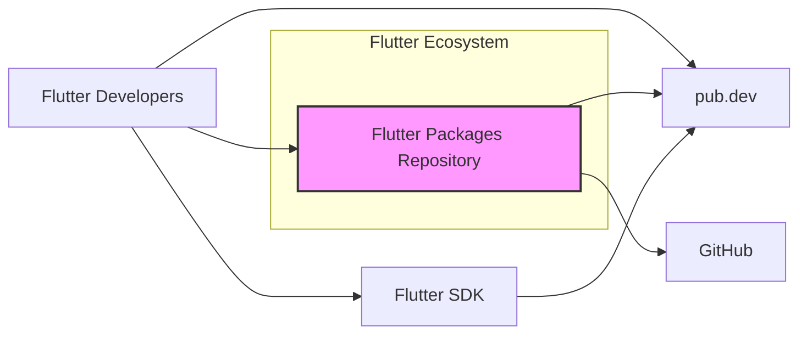
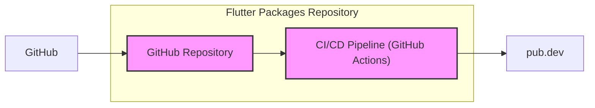
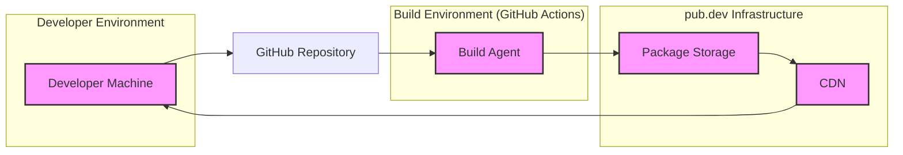

# BUSINESS POSTURE

The Flutter packages repository provides a collection of officially maintained packages that extend the core functionality of the Flutter framework. This repository is crucial for the Flutter ecosystem, enabling developers to build more complex and feature-rich applications.

- Business priorities and goals:
  - Provide high-quality, reliable, and secure packages to the Flutter developer community.
  - Expand the capabilities of the Flutter framework through well-maintained and feature-rich packages.
  - Encourage adoption of Flutter by providing a comprehensive ecosystem of tools and libraries.
  - Maintain the reputation and trust of the Flutter framework and ecosystem.

- Most important business risks:
  - Security vulnerabilities in packages could compromise applications built using them, damaging the reputation of Flutter and the packages repository.
  - Unreliable or poorly maintained packages could hinder developer productivity and adoption of Flutter.
  - Supply chain attacks targeting the packages repository could distribute malicious code to a large number of developers.
  - Downtime or unavailability of the packages repository or related services (like pub.dev) could disrupt Flutter development workflows.

# SECURITY POSTURE

- Security controls:
  - security control: Code review process for contributions to the repository. (Implemented in: GitHub pull request review process)
  - security control: Automated testing (unit, integration, etc.) to ensure package quality and identify potential issues. (Implemented in: GitHub Actions workflows within the repository)
  - security control: Static analysis and linting tools to enforce code quality and security best practices. (Implemented in: GitHub Actions workflows within the repository)
  - security control: Dependency scanning to identify known vulnerabilities in package dependencies. (Likely implemented in: GitHub Actions workflows or internal Google security tooling)
  - security control: Access control to the repository via GitHub permissions, limiting who can commit and merge code. (Implemented in: GitHub repository settings)
  - security control: Usage of GitHub's security features like Dependabot for vulnerability alerts. (Implemented in: GitHub repository settings)
  - security control: Publicly accessible repository, allowing community scrutiny and vulnerability reporting. (Implemented in: GitHub repository settings)

- Accepted risks:
  - accepted risk: Potential for undiscovered vulnerabilities in packages due to the complexity of software and the open-source nature of the project.
  - accepted risk: Risk of malicious contributions being merged despite code review, although mitigated by review processes and community scrutiny.
  - accepted risk: Reliance on third-party dependencies, which may introduce vulnerabilities outside of the direct control of the Flutter team.

- Recommended security controls:
  - security control: Implement a Software Bill of Materials (SBOM) generation process for each package to improve supply chain transparency.
  - security control: Integrate automated security scanning tools (SAST/DAST) into the CI/CD pipeline to proactively identify vulnerabilities.
  - security control: Establish a clear vulnerability reporting and response process, including a security contact and public security policy.
  - security control: Perform regular security audits and penetration testing of critical packages and infrastructure.
  - security control: Implement signing of packages to ensure integrity and authenticity when distributed via pub.dev.

- Security requirements:
  - Authentication:
    - Only authorized Flutter team members should be able to commit and publish packages. (Implemented via GitHub authentication and repository permissions)
  - Authorization:
    - Granular access control within the repository to manage permissions for different packages and functionalities. (Implemented via GitHub teams and repository settings)
  - Input validation:
    - Ensure all inputs to the packages (e.g., API parameters, configuration files) are properly validated to prevent injection attacks and other input-related vulnerabilities. (Responsibility of package developers, enforced through code review and testing)
  - Cryptography:
    - Packages should utilize cryptography correctly and securely when handling sensitive data. (Responsibility of package developers, guided by security best practices and code review)
    - Protect sensitive data used in the build and deployment process, such as API keys and signing certificates. (Implemented via secure secret management in CI/CD pipelines and infrastructure)

# DESIGN

## C4 CONTEXT

- C4 Context elements description:
  - - Name: Flutter Packages Repository
    - Type: Software System
    - Description: GitHub repository containing officially maintained Flutter packages.
    - Responsibilities:
      - Source code management for Flutter packages.
      - Development and maintenance of Flutter packages.
      - Collaboration platform for Flutter package development.
    - Security controls:
      - security control: GitHub access control.
      - security control: Code review process.
      - security control: Automated testing and security scanning.

  - - Name: Flutter Developers
    - Type: Person
    - Description: Developers who use Flutter to build applications and rely on Flutter packages.
    - Responsibilities:
      - Consume Flutter packages in their applications.
      - Report issues and contribute to Flutter packages.
    - Security controls:
      - security control: Secure development practices when using packages.
      - security control: Verification of package integrity and authenticity (ideally via package signing).

  - - Name: pub.dev
    - Type: Software System
    - Description: The official package repository for Dart and Flutter, distributing Flutter packages to developers.
    - Responsibilities:
      - Package hosting and distribution.
      - Package discovery and search.
      - Package versioning and dependency management.
    - Security controls:
      - security control: Package integrity verification.
      - security control: User authentication and authorization for package publishing.
      - security control: Security scanning of published packages.

  - - Name: Flutter SDK
    - Type: Software System
    - Description: The Flutter Software Development Kit, which includes tools and libraries for building Flutter applications and integrates with Flutter packages.
    - Responsibilities:
      - Provides the core Flutter framework.
      - Integrates with pub.dev to download and manage packages.
      - Provides tools for developing and testing Flutter applications.
    - Security controls:
      - security control: Secure update mechanisms for the SDK itself.
      - security control: Integration with secure package management from pub.dev.

  - - Name: GitHub
    - Type: Software System
    - Description: Web-based platform for version control and collaboration, hosting the Flutter packages repository.
    - Responsibilities:
      - Provides version control infrastructure (Git).
      - Hosts the source code repository.
      - Provides collaboration features (pull requests, issues, etc.).
      - Provides CI/CD capabilities (GitHub Actions).
    - Security controls:
      - security control: GitHub platform security controls (authentication, authorization, infrastructure security).
      - security control: GitHub security features (Dependabot, code scanning, etc.).

## C4 CONTAINER

- C4 Container elements description:
  - - Name: GitHub Repository
    - Type: Container
    - Description: Git repository hosted on GitHub, containing the source code of Flutter packages.
    - Responsibilities:
      - Stores the source code, history, and metadata of Flutter packages.
      - Manages version control and collaboration.
    - Security controls:
      - security control: GitHub access control.
      - security control: Branch protection policies.
      - security control: Audit logs.

  - - Name: CI/CD Pipeline (GitHub Actions)
    - Type: Container
    - Description: Automated workflows defined using GitHub Actions to build, test, and publish Flutter packages.
    - Responsibilities:
      - Automates the build process for packages.
      - Runs automated tests and security scans.
      - Publishes packages to pub.dev.
    - Security controls:
      - security control: Secure configuration of CI/CD pipelines.
      - security control: Secret management for credentials used in CI/CD.
      - security control: Code signing during the release process (recommended).

  - - Name: pub.dev
    - Type: External Container
    - Description: The official package registry for Dart and Flutter (same as in Context Diagram).
    - Responsibilities:
      - Package hosting and distribution.
      - Package integrity verification.
    - Security controls:
      - security control: Package integrity checks.
      - security control: Security scanning of uploaded packages.

## DEPLOYMENT

Deployment architecture for Flutter packages is primarily focused on publishing to pub.dev, which then handles distribution to developers via the Flutter SDK.

- Deployment elements description:
  - - Name: Developer Machine
    - Type: Infrastructure
    - Description: Developer's local machine used for coding, testing, and committing changes to the repository.
    - Responsibilities:
      - Code development and local testing.
      - Committing and pushing code changes to GitHub.
      - Downloading and using Flutter packages from pub.dev.
    - Security controls:
      - security control: Developer workstation security practices.
      - security control: Secure access to GitHub and pub.dev.

  - - Name: Build Agent
    - Type: Infrastructure
    - Description: Virtual machine or container running GitHub Actions workflows to build, test, and publish packages.
    - Responsibilities:
      - Executes CI/CD pipelines.
      - Builds and tests Flutter packages.
      - Publishes packages to pub.dev.
    - Security controls:
      - security control: Secure build environment configuration.
      - security control: Isolation of build environments.
      - security control: Secure secret management for publishing credentials.

  - - Name: Package Storage
    - Type: Infrastructure
    - Description: Storage infrastructure within pub.dev that stores the published Flutter packages.
    - Responsibilities:
      - Securely stores package files.
      - Provides access to packages for download.
    - Security controls:
      - security control: Access control to package storage.
      - security control: Data encryption at rest and in transit.
      - security control: Regular backups and disaster recovery.

  - - Name: CDN
    - Type: Infrastructure
    - Description: Content Delivery Network used by pub.dev to distribute packages efficiently to developers worldwide.
    - Responsibilities:
      - Caches and delivers package files to developers.
      - Improves download speed and availability.
    - Security controls:
      - security control: CDN security features (DDoS protection, etc.).
      - security control: Secure delivery of packages over HTTPS.

## BUILD

```mermaid
flowchart LR
    developer["Developer"] --> commit["Commit Code to GitHub"]
    commit --> github_actions["GitHub Actions Workflow Triggered"]
    github_actions --> build["Build Package"]
    build --> test["Run Automated Tests"]
    test --> security_scan["Run Security Scans (SAST, Dependency Check)"]
    security_scan --> publish["Publish Package to pub.dev"]
    publish --> package_registry["Package Registry (pub.dev)"]

    style developer fill:#f9f,stroke:#333,stroke-width:2px
    style github_actions fill:#f9f,stroke:#333,stroke-width:2px
    style package_registry fill:#f9f,stroke:#333,stroke-width:2px
```

- Build elements description:
  - - Name: Developer
    - Type: Person
    - Description: Software developer contributing to the Flutter packages repository.
    - Responsibilities:
      - Writes and maintains package code.
      - Commits code changes to the repository.
    - Security controls:
      - security control: Secure coding practices.
      - security control: Code review participation.

  - - Name: Commit Code to GitHub
    - Type: Process
    - Description: Developer commits and pushes code changes to the GitHub repository.
    - Responsibilities:
      - Version control of code changes.
      - Triggering CI/CD pipeline.
    - Security controls:
      - security control: Authenticated commits via GitHub.
      - security control: Branch protection policies.

  - - Name: GitHub Actions Workflow Triggered
    - Type: Process
    - Description: GitHub Actions workflow is automatically triggered upon code commit.
    - Responsibilities:
      - Orchestrates the build, test, and publish process.
    - Security controls:
      - security control: Secure workflow definition.
      - security control: Access control to workflow configuration.

  - - Name: Build Package
    - Type: Process
    - Description: The package is built using the Flutter SDK and build tools within the CI/CD environment.
    - Responsibilities:
      - Compiling and packaging the package code.
      - Generating build artifacts.
    - Security controls:
      - security control: Secure build environment.
      - security control: Dependency management and vulnerability scanning.

  - - Name: Run Automated Tests
    - Type: Process
    - Description: Automated tests (unit, integration, etc.) are executed to ensure package quality and functionality.
    - Responsibilities:
      - Verifying package functionality and stability.
      - Identifying regressions and bugs.
    - Security controls:
      - security control: Comprehensive test suite.
      - security control: Test environment security.

  - - Name: Run Security Scans (SAST, Dependency Check)
    - Type: Process
    - Description: Static Application Security Testing (SAST) and dependency vulnerability checks are performed.
    - Responsibilities:
      - Identifying potential security vulnerabilities in code and dependencies.
      - Enforcing security standards.
    - Security controls:
      - security control: Integration of SAST and dependency scanning tools.
      - security control: Regular updates of security scanning tools and vulnerability databases.

  - - Name: Publish Package to pub.dev
    - Type: Process
    - Description: If tests and security scans pass, the package is published to pub.dev.
    - Responsibilities:
      - Distributing the package to the Flutter developer community.
      - Making the package available for download via pub.dev.
    - Security controls:
      - security control: Secure publishing process with authentication and authorization.
      - security control: Package signing (recommended).
      - security control: Package integrity checks on pub.dev.

  - - Name: Package Registry (pub.dev)
    - Type: System
    - Description: The official package registry (same as in Context and Container diagrams).
    - Responsibilities:
      - Hosting and distributing Flutter packages.
      - Providing package discovery and management.
    - Security controls:
      - security control: Package integrity verification.
      - security control: Security scanning of published packages.
      - security control: Infrastructure security of pub.dev.

# RISK ASSESSMENT

- Critical business processes we are trying to protect:
  - Distribution of secure and reliable Flutter packages to developers.
  - Maintaining the integrity and availability of the Flutter package ecosystem.
  - Protecting the reputation and trust of the Flutter framework and packages.

- Data we are trying to protect and their sensitivity:
  - Source code of Flutter packages: High sensitivity. Compromise could lead to vulnerabilities in Flutter applications and intellectual property theft.
  - Package signing keys (if implemented): Critical sensitivity. Compromise could allow attackers to publish malicious packages.
  - Credentials for publishing to pub.dev: High sensitivity. Compromise could allow unauthorized package publishing.
  - Build environment secrets and configurations: Medium sensitivity. Could be exploited to compromise the build process.
  - Package metadata (package names, versions, descriptions): Low sensitivity. Publicly available information, but integrity is important.

# QUESTIONS & ASSUMPTIONS

- BUSINESS POSTURE:
  - Assumption: The primary business goal is to provide a secure and reliable ecosystem of Flutter packages to encourage Flutter adoption and developer productivity.
  - Question: What is the acceptable level of risk for security vulnerabilities in Flutter packages, considering the impact on the Flutter ecosystem?
  - Question: What are the specific SLAs or uptime requirements for the Flutter packages repository and related services (like pub.dev)?

- SECURITY POSTURE:
  - Assumption: Existing security controls include standard GitHub security features, code review, and automated testing.
  - Question: Are there any formal security audits or penetration testing performed on the Flutter packages repository or critical packages?
  - Question: Is there a dedicated security team or individual responsible for the security of Flutter packages?
  - Question: What is the current vulnerability reporting and response process for Flutter packages?

- DESIGN:
  - Assumption: The deployment model relies on publishing packages to pub.dev for distribution.
  - Question: Are there any plans to implement package signing for Flutter packages to enhance integrity and authenticity?
  - Question: What are the specific security configurations and hardening measures applied to the CI/CD pipeline and build environment?
  - Question: How are secrets managed and protected within the CI/CD pipeline and build environment?