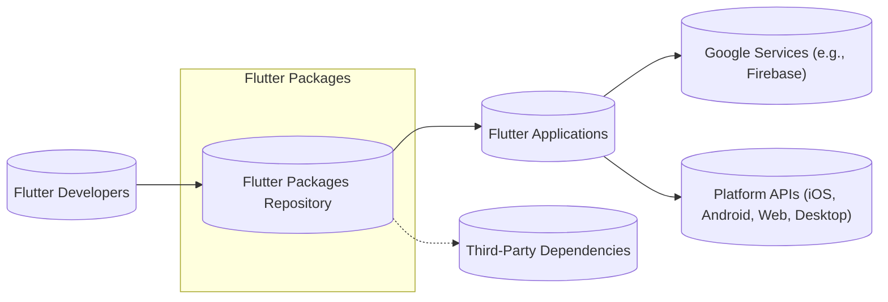
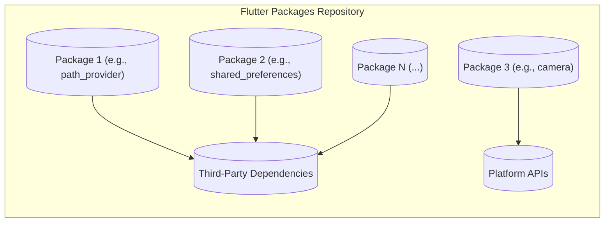
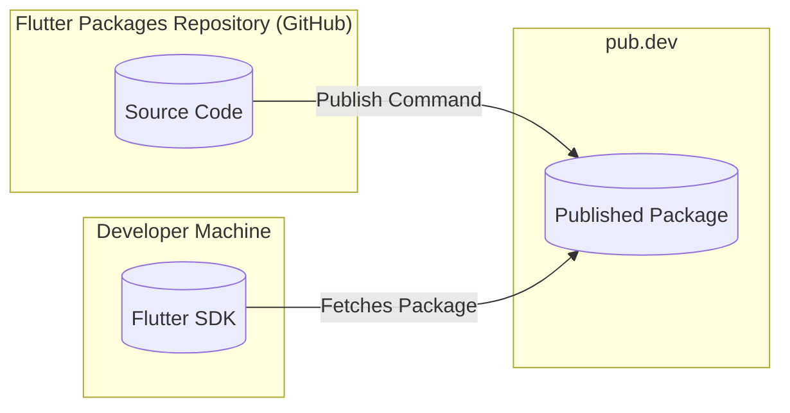
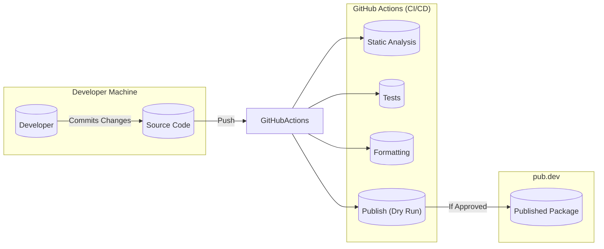

Okay, let's create a design document for the Flutter packages repository.

# BUSINESS POSTURE

Business Priorities and Goals:

*   Provide a robust and reliable set of first-party packages for Flutter developers.
*   Maintain high-quality code and documentation for these packages.
*   Ensure the packages are performant and meet the needs of a wide range of Flutter applications.
*   Foster a healthy ecosystem around Flutter development by providing essential building blocks.
*   Facilitate contributions from the community while maintaining quality control.
*   Support multiple platforms (iOS, Android, Web, Desktop) where applicable.
*   Minimize breaking changes and maintain backward compatibility where possible.

Most Important Business Risks:

*   Security vulnerabilities in packages could compromise applications built with them.
*   Poorly maintained packages could lead to developer frustration and hinder Flutter adoption.
*   Lack of essential packages could limit the capabilities of Flutter.
*   Inconsistent quality across packages could damage the Flutter brand.
*   Supply chain attacks targeting the package repository or build process.
*   Legal issues arising from licensing or intellectual property violations.

# SECURITY POSTURE

Existing Security Controls:

*   security control: Code Review: All changes undergo code review by Flutter team members. (Described in CONTRIBUTING.md and various pull requests).
*   security control: Static Analysis: The project uses Dart's static analysis tools (analyzer) to identify potential issues. (Implied by the use of Dart and described in analysis options).
*   security control: Automated Testing: Extensive use of automated tests (unit, integration, widget tests) to ensure code quality and prevent regressions. (Visible throughout the repository in `test/` directories).
*   security control: Dependency Management: Dependencies are carefully managed using `pubspec.yaml` and `pubspec.lock` files. (Visible in each package).
*   security control: Contributor Guidelines: Clear guidelines for contributors, including security considerations. (Described in CONTRIBUTING.md).
*   security control: Issue Tracking: Public issue tracker for reporting and addressing bugs and security vulnerabilities. (GitHub Issues).
*   security control: Two-Factor Authentication (2FA): Enforced for maintainers with write access to the repository (GitHub organization settings, not directly visible in the repo).
*   security control: Signing Commits: Recommended, but not strictly enforced, for contributors to sign their commits using GPG. (Described in CONTRIBUTING.md).

Accepted Risks:

*   accepted risk: Reliance on Third-Party Packages: The packages depend on other third-party packages, introducing a potential supply chain risk. This is mitigated by careful selection and version pinning, but the risk remains.
*   accepted risk: Limited Formal Security Audits: While code reviews and testing are thorough, formal, independent security audits are not regularly conducted on all packages.
*   accepted risk: Community Contributions: Accepting contributions from the community introduces a risk of malicious or poorly written code, although this is mitigated by code review.

Recommended Security Controls:

*   security control: Regular Security Audits: Conduct regular, independent security audits of the most critical packages.
*   security control: Supply Chain Security Tools: Integrate tools like SLSA (Supply-chain Levels for Software Artifacts) or Dependabot to improve supply chain security.
*   security control: Fuzz Testing: Implement fuzz testing for packages that handle user input or external data.
*   security control: Security Training: Provide regular security training for maintainers and contributors.
*   security control: Static Application Security Testing (SAST): Integrate SAST tools into the CI/CD pipeline.
*   security control: Software Bill of Materials (SBOM): Generate and maintain SBOMs for each package.

Security Requirements:

*   Authentication:
    *   Not directly applicable to most packages, as they are libraries used within applications. However, any package dealing with authentication mechanisms (e.g., a Firebase Auth plugin) must follow best practices for secure credential handling and storage.
*   Authorization:
    *   Packages that interact with APIs or services requiring authorization must securely manage API keys, tokens, or other credentials.
*   Input Validation:
    *   All packages that accept user input or data from external sources must perform thorough input validation to prevent injection attacks, cross-site scripting (XSS), and other vulnerabilities.
*   Cryptography:
    *   Packages that use cryptography must use strong, well-vetted cryptographic libraries and algorithms. Key management must be handled securely. Avoid rolling custom cryptography.

# DESIGN

## C4 CONTEXT

Element Descriptions:

*   Element:
    *   Name: Flutter Developers
    *   Type: User
    *   Description: Developers who use Flutter and its packages to build applications.
    *   Responsibilities: Utilize Flutter packages in their applications, report issues, and contribute to the packages repository.
    *   Security controls: Follow secure coding practices when using the packages.

*   Element:
    *   Name: Flutter Packages Repository
    *   Type: System
    *   Description: The central repository containing the source code for various Flutter packages.
    *   Responsibilities: Provide a collection of well-documented, tested, and maintained packages for Flutter developers.
    *   Security controls: Code review, static analysis, automated testing, dependency management, contributor guidelines, issue tracking, 2FA for maintainers.

*   Element:
    *   Name: Flutter Applications
    *   Type: System
    *   Description: Applications built using Flutter and potentially utilizing the Flutter packages.
    *   Responsibilities: Consume the functionality provided by the Flutter packages.
    *   Security controls: Implement application-level security measures.

*   Element:
    *   Name: Third-Party Dependencies
    *   Type: System
    *   Description: External libraries and packages that Flutter packages depend on.
    *   Responsibilities: Provide specific functionalities required by the Flutter packages.
    *   Security controls: Managed through `pubspec.yaml` and `pubspec.lock`. Version pinning and careful selection are used to mitigate risks.

*   Element:
    *   Name: Google Services (e.g., Firebase)
    *   Type: System
    *   Description: Services provided by Google, such as Firebase, that some Flutter packages may integrate with.
    *   Responsibilities: Provide backend services for Flutter applications.
    *   Security controls: Google's security measures for their respective services.

*   Element:
    *   Name: Platform APIs (iOS, Android, Web, Desktop)
    *   Type: System
    *   Description: Native APIs of the platforms that Flutter supports.
    *   Responsibilities: Provide access to platform-specific features and functionalities.
    *   Security controls: Security measures implemented by the respective platforms.

## C4 CONTAINER

Element Descriptions:

*   Element:
    *   Name: Package 1 (e.g., path_provider)
    *   Type: Container
    *   Description: An individual Flutter package, such as `path_provider`.
    *   Responsibilities: Provide specific functionality (e.g., accessing file system paths).
    *   Security controls: Code review, static analysis, automated testing, input validation (if applicable).

*   Element:
    *   Name: Package 2 (e.g., shared_preferences)
    *   Type: Container
    *   Description: Another individual Flutter package, such as `shared_preferences`.
    *   Responsibilities: Provide specific functionality (e.g., storing key-value pairs).
    *   Security controls: Code review, static analysis, automated testing, secure storage of data (if applicable).

*   Element:
    *   Name: Package 3 (e.g., camera)
    *   Type: Container
    *   Description: Another individual Flutter package, such as `camera`.
    *   Responsibilities: Provide specific functionality (e.g., accessing the device camera).
    *   Security controls: Code review, static analysis, automated testing, permission handling, secure handling of camera data.

*   Element:
    *   Name: Package N (...)
    *   Type: Container
    *   Description: Represents other Flutter packages within the repository.
    *   Responsibilities: Provide various functionalities.
    *   Security controls: Code review, static analysis, automated testing, package-specific security measures.

*   Element:
    *   Name: Third-Party Dependencies
    *   Type: System
    *   Description: External libraries and packages that individual Flutter packages depend on.
    *   Responsibilities: Provide specific functionalities required by the Flutter packages.
    *   Security controls: Managed through `pubspec.yaml` and `pubspec.lock`. Version pinning and careful selection.

*   Element:
    *   Name: Platform APIs
    *   Type: System
    *   Description: Native APIs of supported platforms.
    *   Responsibilities: Provide access to platform features.
    *   Security controls: Platform-specific security.

## DEPLOYMENT

Possible Deployment Solutions:

1.  **Pub.dev:** The primary deployment method for Flutter packages is publishing to pub.dev, the official package repository for Dart and Flutter.
2.  **Direct Git Dependency:** Developers can also depend on a package directly from a Git repository, although this is less common for published packages.
3.  **Local Path Dependency:** For development and testing, packages can be used as local path dependencies.

Chosen Solution (Pub.dev):

Element Descriptions:

*   Element:
    *   Name: Source Code
    *   Type: Code
    *   Description: The source code of the Flutter packages hosted on GitHub.
    *   Responsibilities: Contains the implementation of the package functionality.
    *   Security controls: Code review, static analysis, automated testing.

*   Element:
    *   Name: Published Package
    *   Type: Artifact
    *   Description: The packaged version of the Flutter package hosted on pub.dev.
    *   Responsibilities: Provides the distributable form of the package.
    *   Security controls: pub.dev's security measures (e.g., package signing, malware scanning).

*   Element:
    *   Name: Flutter SDK
    *   Type: Tool
    *   Description: The Flutter SDK on a developer's machine.
    *   Responsibilities: Used to build and run Flutter applications, and to fetch packages from pub.dev.
    *   Security controls: Flutter SDK's built-in security features.

## BUILD

Build Process Description:

1.  **Development:** Developers work on the source code of the packages on their local machines.
2.  **Commit & Push:** Changes are committed and pushed to the GitHub repository.
3.  **GitHub Actions (CI/CD):**  GitHub Actions triggers a workflow on push events. This workflow typically includes:
    *   **Static Analysis:** Runs the Dart analyzer to identify potential code issues.
    *   **Tests:** Executes the package's test suite (unit, integration, widget tests).
    *   **Formatting:** Checks and enforces code formatting rules.
    *   **Publish (Dry Run):** Performs a dry run of the publishing process to catch any publishing-related errors.
4.  **Publishing:**  After a successful CI run and manual approval (typically through a pull request merge), a maintainer can manually trigger a workflow or use the `pub publish` command to publish the package to pub.dev.

Security Controls in Build Process:

*   security control: Static Analysis: Dart analyzer helps identify potential vulnerabilities and code quality issues.
*   security control: Automated Testing: Comprehensive test suite helps prevent regressions and ensure code correctness.
*   security control: Code Formatting: Consistent formatting improves code readability and maintainability.
*   security control: Publish Dry Run: Catches publishing errors before the actual release.
*   security control: Manual Approval: Requires manual approval from maintainers before publishing.

# RISK ASSESSMENT

Critical Business Processes:

*   Providing reliable and secure packages for Flutter development.
*   Maintaining the trust and confidence of the Flutter developer community.
*   Ensuring the long-term sustainability of the Flutter ecosystem.

Data to Protect:

*   **Source Code:** (Sensitivity: Medium) - The source code of the packages is publicly available, but unauthorized modifications could introduce vulnerabilities.
*   **Developer Credentials:** (Sensitivity: High) - Credentials used to publish packages to pub.dev must be protected.
*   **User Data (Indirectly):** (Sensitivity: Variable) - Some packages may handle user data indirectly (e.g., by interacting with APIs). The sensitivity depends on the specific package and the type of data handled.
*   **API Keys/Secrets (Potentially):** (Sensitivity: High) - Some packages might require API keys or secrets for interacting with external services. These must be handled securely and never stored directly in the repository.

# QUESTIONS & ASSUMPTIONS

Questions:

*   Are there any specific compliance requirements (e.g., GDPR, HIPAA) that apply to any of the packages?
*   What is the process for handling security vulnerabilities reported by external researchers?
*   What is the frequency of dependency updates and security patching?
*   Are there any plans to implement more advanced security measures, such as code signing for published packages?
*   What are the specific procedures for managing and rotating API keys or secrets used by any of the packages?

Assumptions:

*   BUSINESS POSTURE: The Flutter team prioritizes security and is willing to invest in necessary security measures.
*   SECURITY POSTURE: The existing security controls (code review, static analysis, testing) are effectively implemented and enforced.
*   DESIGN: The design of the packages follows best practices for security and maintainability. The provided diagrams are accurate representations of the system. The build and deployment processes are as described.
*   The Flutter team has access to and utilizes security expertise within Google.
*   The Flutter community actively participates in reporting and addressing security concerns.