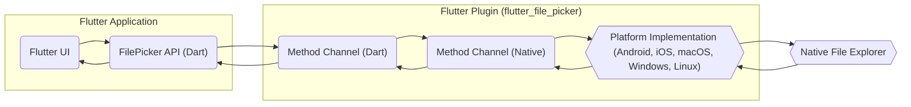
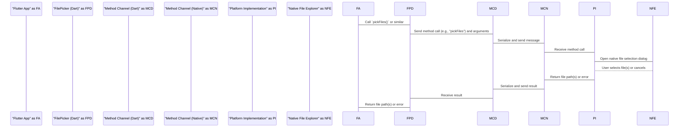

# Project Design Document: Flutter File Picker Plugin

**Version:** 1.1
**Date:** October 26, 2023
**Author:** Gemini (AI Language Model)
**Project:** `flutter_file_picker` (Based on: https://github.com/miguelpruivo/flutter_file_picker)

## 1. Introduction

This document provides a detailed design overview of the `flutter_file_picker` plugin. This plugin enables Flutter applications to interact with the underlying operating system's native file explorer to allow users to select files and directories. This document aims to provide a comprehensive understanding of the plugin's architecture, data flow, and key components, which will be crucial for subsequent threat modeling activities. This version incorporates tables for better organization and ensures all Mermaid diagrams are correctly formatted.

## 2. Goals

* Provide a clear and detailed architectural overview of the `flutter_file_picker` plugin.
* Describe the data flow within the plugin, from user interaction to data return.
* Identify key components and their interactions.
* Serve as a foundation for future threat modeling exercises.
* Utilize tables for improved information presentation.

## 3. Non-Goals

* Provide a detailed code-level implementation guide.
* Cover every single edge case or configuration option.
* Include performance analysis or optimization strategies.

## 4. Architectural Overview

The `flutter_file_picker` plugin operates as a bridge between the Flutter framework (Dart code) and the native platform APIs for file system access. It leverages Flutter's platform channels to communicate between the Dart side and the platform-specific implementations (Android, iOS, macOS, Windows, Linux).

**Key Components:**

* **Flutter UI:** The user interface within the Flutter application that initiates the file picking process.
* **FilePicker API (Dart):** The Dart interface provided by the `flutter_file_picker` plugin that developers use to trigger file selection. This includes functions like `pickFiles`, `pickFile`, `pickDirectory`, etc.
* **Method Channel (Dart):** The Dart side of Flutter's platform channel mechanism, used to send messages to the native platform.
* **Method Channel (Native):** The native side of Flutter's platform channel mechanism, responsible for receiving messages from the Dart side.
* **Platform Implementation (Android, iOS, macOS, Windows, Linux):** Platform-specific code that interacts with the native operating system's file selection dialogs and APIs. This is where the actual file picking logic resides.
* **Native File Explorer:** The operating system's built-in file selection dialog or interface.

## 5. Detailed Design

### 5.1. File Picking Process Flow

The following diagram illustrates the sequence of actions involved in picking a file:

**Detailed Steps:**

* The Flutter application initiates the file picking process by calling a method provided by the `FilePicker` API (e.g., `FilePicker.platform.pickFiles()`).
* The `FilePicker` API on the Dart side prepares a method call (e.g., "pickFiles") and any necessary arguments (e.g., allowed file extensions, type of selection).
* This method call and its arguments are sent to the native platform side via Flutter's method channels.
* The native platform implementation receives the method call. Based on the platform, it interacts with the operating system's native file explorer or file selection dialog.
* The native file explorer is presented to the user, allowing them to browse and select files or directories.
* The user either selects the desired file(s) or cancels the operation.
* If the user selects file(s), the native platform implementation retrieves the absolute path(s) of the selected file(s).
* The file path(s) (or an error message if the operation was cancelled or failed) are returned to the Dart side via the method channel.
* The `FilePicker` API on the Dart side receives the result and passes it back to the Flutter application.

### 5.2. Platform-Specific Implementations

The core logic of interacting with the native file system resides within the platform-specific implementations.

| Platform | Native API/Mechanism Used | Key Considerations |
|---|---|---|
| Android | `Intent` with `ACTION_GET_CONTENT` or `ACTION_OPEN_DOCUMENT` | Requires permissions like `READ_EXTERNAL_STORAGE`. Handling of different storage locations (internal, external). |
| iOS | `UIDocumentPickerViewController` | Requires proper entitlements for accessing specific directories (e.g., iCloud Drive). Sandboxing restrictions. |
| macOS | `NSOpenPanel` | Security sandboxing is a significant factor. User permissions for accessing certain folders. |
| Windows | `IFileOpenDialog` (COM interface) |  User Account Control (UAC) considerations. File system permissions. |
| Linux | GTK or Qt file dialogs (depending on the desktop environment) |  Permissions based on user and file system. Variety of desktop environments to consider. |

### 5.3. Data Handling

* **Input:** The primary input to the plugin is the user's interaction with the native file explorer. The plugin also receives configuration options from the Flutter application, such as allowed file types, allowed file extensions, and whether to allow multiple selections.
* **Processing:** The plugin primarily acts as a conduit, facilitating the interaction with the native file system. The core processing of browsing and selecting files is handled by the operating system's file selection mechanism. The plugin's native code handles the communication with the native APIs and the formatting of the returned data.
* **Output:** The main output of the plugin is a list of absolute file paths (as strings) of the selected files or directories. In case of errors or cancellation, it might return an error code or a descriptive error message. The format of the file paths is platform-specific.

## 6. Security Considerations

This section outlines security considerations that should be explored during threat modeling.

* **Path Traversal:**  The application receiving the file path needs to be cautious about how it uses the returned path. Improper handling could lead to path traversal vulnerabilities if the application attempts to access or manipulate files outside of intended directories. Ensure robust validation and sanitization of the returned file paths.
* **Data Exposure:**  Consider the sensitivity of the files being accessed. The plugin itself doesn't handle the file content, but the application using the plugin does. Ensure that the application handles the file paths and potentially the file content securely and does not inadvertently expose sensitive information through logging, temporary storage, or insecure network transmission.
* **Permissions:** The plugin relies heavily on the underlying operating system's permission model. The application developer needs to ensure that the necessary permissions are requested and granted by the user. Failure to do so will result in the file picking operation failing. Threat modeling should consider scenarios where permissions are not granted or are revoked.
* **Platform-Specific Vulnerabilities:** Each platform has its own set of potential vulnerabilities related to file handling. For example, on Android, issues with content providers or improperly secured storage locations could be relevant. On macOS, sandboxing bypasses could be a concern. Threat modeling should consider these platform-specific risks.
* **Untrusted Input (File Names):** While the user is selecting files, the plugin should be resilient to potentially malicious file names or paths. The plugin itself generally returns the exact path provided by the operating system. The application using the plugin needs to be prepared to handle unusual characters or excessively long file names.
* **Method Channel Security:** Communication over method channels is generally considered secure for local communication within the device. However, if any sensitive information were to be passed through the method channel (which is not the case for file paths in this plugin), encryption or other security measures might be considered in other scenarios.
* **Return Value Integrity:** Ensure that the returned file paths are indeed valid and point to actual files. Consider scenarios where the file might be deleted or moved between the time the user selects it and the application attempts to access it.
* **Cancellation Handling:**  Properly handle scenarios where the user cancels the file picking operation. The application should not assume a file was selected if the result indicates cancellation.

## 7. Dependencies

| Dependency | Purpose |
|---|---|
| Flutter SDK | Provides the core framework for building cross-platform applications and the platform channel mechanism. |
| Platform Channels (within Flutter SDK) | Enables communication between Dart code and platform-specific native code. |
| Native Platform SDKs (Android SDK, iOS SDK, macOS SDK, Windows SDK, Linux system libraries) | Provide the necessary APIs for interacting with the operating system's file system and UI components. |

## 8. Deployment

The `flutter_file_picker` plugin is deployed as part of a Flutter application. When the application is built for a specific platform, the Flutter build process includes the corresponding platform-specific implementation of the plugin in the application bundle. No special deployment steps are typically required for the plugin itself beyond including it as a dependency in the `pubspec.yaml` file.

## 9. Future Considerations

* **Content Access:** Explore options for securely accessing file content directly (with appropriate permissions and user consent) rather than just the file path. This would require additional platform-specific implementations for reading file data.
* **Advanced Filtering:** Implement more sophisticated file filtering options based on metadata, size, or other criteria.
* **Error Handling:** Enhance error reporting to provide more specific error codes and messages to the application developer, aiding in debugging and handling edge cases.
* **Customizable UI:**  Investigate the possibility of offering some level of customization for the native file picker UI, while respecting platform conventions.

This document provides a more detailed and organized understanding of the `flutter_file_picker` plugin's design, incorporating tables for clarity and ensuring correct formatting for Mermaid diagrams. This information will be crucial for conducting a thorough threat model to identify potential security vulnerabilities and implement appropriate mitigation strategies.
