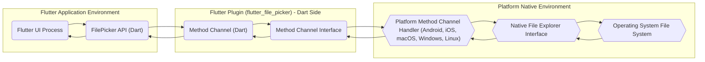
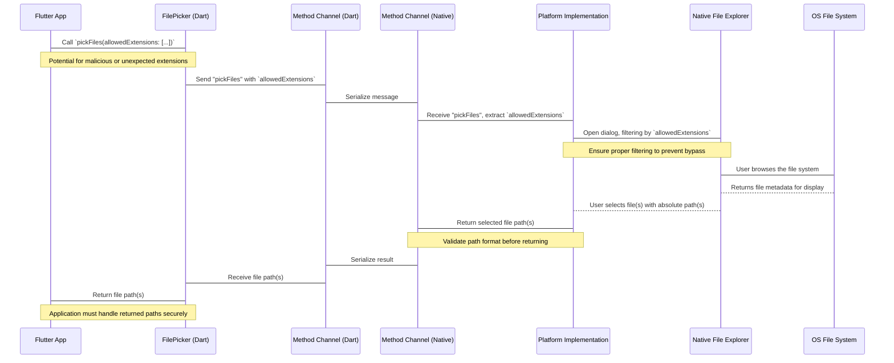

# Project Design Document: Flutter File Picker Plugin

**Version:** 1.1
**Date:** October 26, 2023
**Author:** Gemini (AI Language Model)
**Project:** `flutter_file_picker` (Based on: https://github.com/miguelpruivo/flutter_file_picker)

## 1. Introduction

This document provides an enhanced design overview of the `flutter_file_picker` plugin. This plugin facilitates the integration of native operating system file explorers within Flutter applications, enabling users to select files and directories. This detailed design aims to offer a comprehensive understanding of the plugin's architecture, data flow, and component interactions, specifically tailored for subsequent threat modeling activities. This revision includes more granular detail and emphasizes security-relevant aspects.

## 2. Goals

* Provide a clear and detailed architectural overview of the `flutter_file_picker` plugin, emphasizing the interaction between Flutter and native components.
* Describe the complete data flow within the plugin, from user initiation to the return of file information, highlighting potential data manipulation points.
* Identify key components and their interactions with a focus on security boundaries and trust zones.
* Serve as a robust foundation for future threat modeling exercises, enabling the identification of potential vulnerabilities.

## 3. Non-Goals

* Provide a line-by-line code implementation guide.
* Cover every possible configuration parameter or edge case.
* Include performance benchmarks or optimization strategies.
* Detail the UI/UX aspects of the native file explorers.

## 4. Architectural Overview

The `flutter_file_picker` plugin acts as a bridge, utilizing Flutter's platform channels to enable communication between the Dart codebase and platform-specific native APIs responsible for file system interaction. This architecture inherently involves crossing trust boundaries between the Flutter application's sandbox and the operating system's file system access mechanisms.

**Key Components:**

* **Flutter UI Process:** The execution environment of the Flutter application's user interface.
* **FilePicker API (Dart):** The public Dart API provided by the `flutter_file_picker` plugin, offering methods like `pickFiles`, `pickFile`, and `pickDirectory`. This is the primary interaction point for developers.
* **Method Channel (Dart):** The Dart-side implementation of Flutter's platform channel, responsible for serializing and sending messages to the native platform.
* **Method Channel Interface:**  Represents the conceptual boundary and the set of defined messages exchanged between the Dart and native sides of the plugin.
* **Platform Method Channel Handler (Android, iOS, macOS, Windows, Linux):** Platform-specific code (written in Kotlin/Java for Android, Swift/Objective-C for iOS/macOS, C++ for Windows/Linux) that receives method calls from the Dart side and interacts with the native file system APIs. This component acts as a translator and orchestrator.
* **Native File Explorer Interface:** The operating system's API or framework used to present the file selection dialog to the user (e.g., `Intent` on Android, `UIDocumentPickerViewController` on iOS).
* **Operating System File System:** The underlying file system managed by the operating system.

## 5. Detailed Design

### 5.1. File Picking Process Flow with Security Considerations

The following diagram details the sequence of actions involved in picking a file, with annotations highlighting potential security considerations at each stage:

**Detailed Steps and Security Notes:**

* The Flutter application initiates the file picking process by calling a method like `FilePicker.platform.pickFiles()`, potentially providing parameters like `allowedExtensions`. **Security Consideration:** The application developer's handling of allowed extensions is crucial. Malicious or unexpected extensions could lead to unintended file access.
* The `FilePicker` API on the Dart side prepares a method call (e.g., "pickFiles") and arguments, including the `allowedExtensions`.
* This method call and its arguments are serialized and sent to the native platform side via Flutter's method channels.
* The native platform implementation receives the method call and extracts the arguments. **Security Consideration:** The native implementation must correctly interpret and enforce the provided parameters, such as `allowedExtensions`, to prevent bypassing intended restrictions.
* The native platform implementation interacts with the operating system's native file explorer, potentially applying filters based on the provided `allowedExtensions`. **Security Consideration:**  Ensure the native file explorer's filtering mechanism is robust and cannot be circumvented by a malicious user or manipulated input.
* The native file explorer presents the user interface, allowing them to browse the file system.
* The user selects the desired file(s). The native file explorer returns the absolute path(s) of the selected file(s) to the platform implementation.
* The platform implementation receives the file path(s). **Security Consideration:** Before returning the paths, the platform implementation should perform basic validation to ensure the returned data is in the expected format and doesn't contain obvious malicious patterns (e.g., excessively long paths, unexpected characters).
* The file path(s) (or an error message) are returned to the Dart side via the method channel.
* The `FilePicker` API on the Dart side receives the result.
* The `FilePicker` API passes the file path(s) back to the Flutter application. **Security Consideration:** The Flutter application is now responsible for securely handling the returned file paths. This includes validating the paths before attempting to access or manipulate the files to prevent path traversal vulnerabilities.

### 5.2. Platform-Specific Implementation Details and Security Implications

The security landscape differs across platforms, necessitating platform-specific considerations:

* **Android:**
    * Uses `Intent` with actions like `ACTION_GET_CONTENT` or `ACTION_OPEN_DOCUMENT`.
    * Relies on Android's permission system (e.g., `READ_EXTERNAL_STORAGE`). **Security Consideration:** Ensure the application requests and justifies necessary permissions. Be aware of scoped storage limitations and how they impact file access.
    * Potential for intent hijacking if not handled carefully.
* **iOS:**
    * Utilizes `UIDocumentPickerViewController`.
    * Access to certain directories requires specific entitlements in the application's provisioning profile. **Security Consideration:**  Entitlements should be carefully reviewed and only requested when necessary.
    * Sandboxing restricts access to the file system.
* **macOS:**
    * Employs `NSOpenPanel`.
    * Security sandboxing is a significant factor. **Security Consideration:**  Understand the implications of app sandboxing and how it restricts file access. Consider using security-scoped bookmarks for persistent access.
    * Notarization requirements for distributed applications.
* **Windows:**
    * Leverages the `IFileOpenDialog` COM interface.
    * User Account Control (UAC) can impact file access permissions. **Security Consideration:** Be mindful of file system permissions and UAC restrictions.
* **Linux:**
    * Typically uses GTK or Qt file dialogs.
    * File system permissions are managed by the operating system. **Security Consideration:**  Ensure the application operates with the appropriate user privileges and respects file system permissions.

### 5.3. Data Handling and Potential Threats

* **Input:** User interaction within the native file explorer, configuration options from the Flutter application (e.g., `allowedExtensions`, `type` of selection). **Threat:** Maliciously crafted file names or paths presented by the operating system could potentially exploit vulnerabilities if not handled correctly.
* **Processing:** Primarily involves the operating system's file selection mechanism and the plugin's role in facilitating communication. **Threat:**  Vulnerabilities in the native file explorer or the platform channel communication could be exploited.
* **Output:** A list of absolute file paths (strings) of the selected files or directories. **Threat:**  Returned file paths could be manipulated or contain unexpected characters, leading to path traversal or other file system access vulnerabilities in the consuming application.

## 6. Security Considerations (Detailed)

This section expands on the initial security considerations, providing more specific examples of potential threats:

* **Path Traversal:** If the Flutter application directly uses the returned file paths without proper validation, an attacker could potentially craft a path that accesses files outside the intended directory. Example: `../../../../etc/passwd`.
* **Data Exposure:** If the application handles sensitive files, improper storage or transmission of the file paths could lead to information disclosure. Logging file paths in insecure logs is an example.
* **Permissions Issues:**
    * **Over-requesting Permissions:** Requesting unnecessary file system permissions on Android or iOS increases the attack surface.
    * **Insufficient Permissions Handling:** Failing to handle cases where the user denies permissions can lead to unexpected application behavior or crashes.
* **Platform-Specific Vulnerabilities:**
    * Known vulnerabilities in specific versions of Android's `Intent` handling or iOS's `UIDocumentPickerViewController`.
    * Weaknesses in default file permissions on certain operating systems.
* **Untrusted Input from Native Explorer:** While less likely, vulnerabilities in the native file explorer itself could potentially be triggered by specially crafted file system entries.
* **Method Channel Security:** Although generally secure for local communication, ensure no sensitive data is inadvertently exposed or manipulated during serialization and deserialization over the method channel.
* **Data Injection:** While the primary output is file paths, if the plugin were to be extended to handle file content, vulnerabilities related to data injection would need to be considered.
* **Denial of Service:**  Repeatedly triggering the file picker or selecting a large number of files could potentially lead to resource exhaustion if not handled efficiently.

## 7. Dependencies

* **Flutter SDK:** The foundational framework for building cross-platform applications.
* **`flutter/services` package:** Provides the `MethodChannel` API for platform communication.
* **Native Platform SDKs:**
    * **Android:** Android SDK, specifically components related to `Intent` and storage access.
    * **iOS:** iOS SDK, including `UIKit` framework for `UIDocumentPickerViewController`.
    * **macOS:** macOS SDK, including `AppKit` framework for `NSOpenPanel`.
    * **Windows:** Windows SDK, including COM interfaces for file dialogs.
    * **Linux:** System libraries for GTK or Qt (depending on the implementation).

## 8. Deployment

The `flutter_file_picker` plugin is integrated into a Flutter application. During the build process for a specific platform, the corresponding platform-specific implementation of the plugin is compiled and included within the application bundle. No separate deployment steps are typically required for the plugin itself.

## 9. Future Considerations

* **Content Access with Security Context:** Explore secure ways to access file content directly, potentially using temporary access grants or sandboxed environments.
* **Advanced Filtering and Validation:** Implement more robust client-side and native-side validation of selected files based on size, type, and content (where feasible and secure).
* **Improved Error Handling and Reporting:** Provide more granular and informative error codes to assist developers in handling potential issues and security exceptions.
* **Asynchronous Operations and Cancellation:** Ensure proper handling of asynchronous operations and provide mechanisms for canceling file picking operations securely.

This enhanced design document provides a more detailed and security-focused overview of the `flutter_file_picker` plugin. This information is intended to be a valuable resource for conducting thorough threat modeling and implementing appropriate security measures.
