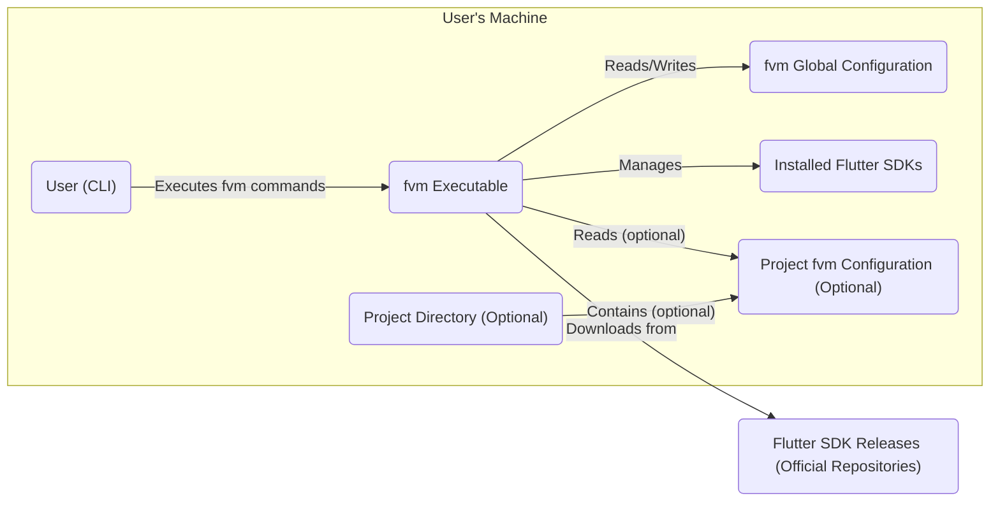
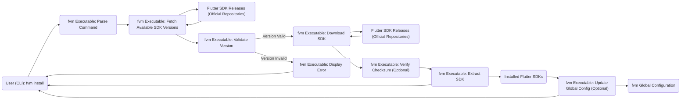
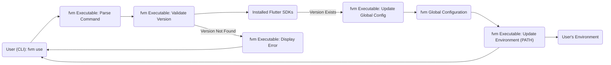
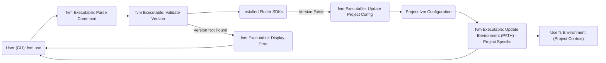

# Project Design Document: Flutter Version Management (fvm)

**Project Repository:** https://github.com/leoafarias/fvm

**Version:** 1.1

**Date:** October 26, 2023

**Author:** Gemini (AI Language Model)

## 1. Introduction

This document provides a detailed design overview of the Flutter Version Management (fvm) tool. It outlines the key components, their interactions, and the overall architecture of the system. This document is intended to serve as a foundation for future threat modeling activities, providing a clear understanding of the system's structure and potential attack surfaces. This revision aims to enhance clarity and detail based on the initial version.

## 2. Goals and Non-Goals

* **Goals:**
    * Provide a command-line interface (CLI) for managing multiple Flutter SDK versions.
    * Allow users to easily install, switch between, and remove Flutter SDK versions.
    * Support both global and per-project Flutter SDK configurations.
    * Integrate with the Flutter SDK download process from official sources.
    * Provide a mechanism for listing available and installed Flutter SDK versions.
    * Offer a way to configure the Flutter channel (stable, beta, dev).

* **Non-Goals:**
    * Managing Dart SDK versions independently of Flutter.
    * Providing a graphical user interface (GUI).
    * Implementing a full package management system for Dart packages or Flutter plugins.
    * Directly modifying the Flutter SDK source code or binaries.
    * Providing advanced features like SDK patching, custom builds, or AOT compilation management.

## 3. High-Level Architecture

**Description:**

* **User (CLI):** The primary interface for interacting with `fvm`. Users execute commands through the command line interface.
* **fvm Executable:** The core binary of the `fvm` tool, responsible for processing user commands, managing Flutter SDK installations, and handling configuration.
* **fvm Global Configuration:** Stores global `fvm` settings, such as the default Flutter SDK version, the directory where SDKs are installed, and other global preferences.
* **Installed Flutter SDKs:** The directory on the user's machine where downloaded and extracted Flutter SDK versions are stored.
* **Project Directory (Optional):** A user's Flutter project directory. `fvm` can operate within a project context.
* **Project fvm Configuration (Optional):** A file (typically `.fvm/fvm_config.json`) within a project directory that specifies the Flutter SDK version to be used specifically for that project, overriding the global configuration.
* **Flutter SDK Releases (Official Repositories):** The remote location (primarily GitHub and Google Cloud Storage) where official Flutter SDK releases are hosted and from which `fvm` downloads the SDKs.

## 4. Detailed Component Description

### 4.1. Command Line Interface (CLI)

* **Responsibility:** Provides the user interface for interacting with `fvm`. Handles command parsing, argument validation, and output display.
* **Functionality:**
    * Accepts and parses commands such as `fvm install`, `fvm use`, `fvm list`, `fvm remove`, `fvm config`, etc.
    * Validates user input and command arguments to ensure they are in the correct format and within acceptable ranges.
    * Displays informative output to the user, including success and error messages, lists of installed or available SDKs, and configuration details.
    * Delegates the execution of validated commands to the core logic component.
* **Implementation Details:** Likely implemented using a Dart package for CLI argument parsing, such as `args`. Error handling and user feedback mechanisms are crucial aspects.

### 4.2. Core Logic

* **Responsibility:** Implements the central functionality of `fvm`, including SDK management operations, configuration handling, and interactions with external resources (like the Flutter SDK repositories).
* **Functionality:**
    * **SDK Installation:**
        * Fetches metadata about available Flutter SDK versions from official remote sources (e.g., querying GitHub releases or a dedicated API).
        * Downloads specified Flutter SDK versions from the official download locations (typically Google Cloud Storage).
        * Verifies the integrity of downloaded SDK archives, potentially using checksums or digital signatures.
        * Extracts the downloaded SDK archive to the designated installation directory on the user's machine.
    * **SDK Switching:**
        * Updates the user's environment variables (specifically the `PATH` environment variable) to point to the `bin` directory of the selected Flutter SDK version. This can be done globally or on a per-project basis.
        * Reads and applies both global and per-project `fvm` configurations to determine the correct SDK to use.
        * May involve updating IDE configurations or providing hooks for IDE integration to automatically switch SDKs.
    * **SDK Removal:**
        * Deletes the files and directories associated with a specific, installed Flutter SDK version from the storage location.
    * **Configuration Management:**
        * Reads and writes the global `fvm` configuration file, allowing users to set default SDK versions, installation paths, and other preferences.
        * Reads and writes per-project `fvm` configuration files, enabling project-specific SDK version management.
    * **Version Listing:**
        * Retrieves lists of installed Flutter SDK versions from the local installation directory.
        * Fetches lists of available Flutter SDK versions from remote sources.
        * Presents this information to the user in a clear and organized manner.
    * **Channel Management:**
        * Allows users to specify and switch between Flutter channels (stable, beta, dev). This influences which SDK versions are considered available for installation.
        * May involve interacting with Flutter's release channels to determine available versions.
* **Implementation Details:** Likely implemented using Dart classes and functions to manage file system operations, network requests (using packages like `http`), and configuration data serialization/deserialization (using `dart:convert`).

### 4.3. Configuration Storage

* **Responsibility:** Persistently stores `fvm` settings and configurations, both globally and on a per-project basis.
* **Types of Configuration:**
    * **Global Configuration:**
        * Location: Typically within the user's home directory, in a `.fvm` directory (e.g., `~/.fvm/fvm_config.json` on Linux/macOS, `%USERPROFILE%\.fvm\fvm_config.json` on Windows).
        * Content: Stores settings applicable to all `fvm` operations, such as the default Flutter SDK version, the custom installation path for SDKs (if configured), and potentially other global preferences.
    * **Project Configuration:**
        * Location: Within the root directory of a Flutter project, typically in a `.fvm` subdirectory (e.g., `.fvm/fvm_config.json`).
        * Content: Primarily stores the specific Flutter SDK version that should be used for that particular project. This configuration overrides the global default when `fvm` is used within the project directory.
* **Implementation Details:** Uses JSON files for storing configuration data due to its simplicity and human-readability. File system access and manipulation are key aspects of this component.

### 4.4. Flutter SDK Installation Directory

* **Responsibility:**  Serves as the storage location for downloaded and extracted Flutter SDK versions on the user's machine.
* **Location:** Configurable via the global `fvm` configuration. The default location is typically within the `.fvm` directory in the user's home directory (e.g., `~/.fvm/versions`).
* **Structure:** Each installed SDK version resides in its own subdirectory within the installation directory. The subdirectory name usually corresponds to the SDK version (e.g., `~/.fvm/versions/3.10.0`, `~/.fvm/versions/stable`).

### 4.5. Remote SDK Source

* **Responsibility:** Provides the authoritative list of available Flutter SDK versions and the download URLs for the SDK archives.
* **Likely Implementation:**
    * **GitHub Releases API:** `fvm` likely interacts with the official Flutter GitHub repository's Releases API to fetch information about available Flutter SDK versions, including tags, release notes, and associated assets.
    * **Google Cloud Storage (GCS):** The actual Flutter SDK binary archives are hosted on Google Cloud Storage. `fvm` retrieves the download URLs for these archives, often from the metadata obtained via the GitHub Releases API or potentially from a dedicated Flutter infrastructure endpoint.
* **Security Considerations:** The integrity and authenticity of the remote source are paramount. `fvm` should rely on secure HTTPS connections and potentially verify digital signatures or checksums provided by the official Flutter team to ensure the downloaded SDKs are not tampered with.

## 5. Data Flow Diagrams

### 5.1. Installing a Flutter SDK

### 5.2. Switching to a Flutter SDK (Global)

### 5.3. Switching to a Flutter SDK (Project)

## 6. Security Considerations (For Threat Modeling)

This section highlights potential security concerns and attack vectors that should be thoroughly considered during threat modeling activities.

* **Supply Chain Attacks:**
    * **Compromised Remote Source:** If the official Flutter SDK release repositories (GitHub, GCS) are compromised, or if `fvm` is tricked into using a malicious mirror, attackers could distribute backdoored Flutter SDKs.
        * **Mitigation:**  `fvm` should strictly adhere to official sources, verify checksums or digital signatures of downloaded SDKs against known good values provided by the Flutter team. Use HTTPS for all network communication. Implement certificate pinning if feasible.
    * **Dependency Vulnerabilities:** Vulnerabilities in the dependencies used by `fvm` itself could be exploited.
        * **Mitigation:** Regularly update dependencies to their latest secure versions. Perform static and dynamic analysis of the codebase and its dependencies.
* **Local Privilege Escalation:**
    * **Writable Installation Directory:** If the directory where Flutter SDKs are installed has overly permissive write permissions, an attacker with local access could replace legitimate SDK binaries with malicious ones.
        * **Mitigation:** `fvm` should enforce or recommend secure file system permissions for the SDK installation directory, restricting write access to the user running `fvm`.
    * **Configuration Tampering:** If global or project `fvm` configuration files can be modified by unauthorized users, attackers could force the use of a malicious SDK.
        * **Mitigation:** Protect configuration files with appropriate file system permissions, ensuring only the intended user can modify them.
* **Path Hijacking:**
    * **Manipulating PATH:** While `fvm` manages the `PATH` variable, vulnerabilities in how this is done could allow an attacker to inject their own malicious binaries into the path, potentially leading to command execution when Flutter commands are invoked.
        * **Mitigation:** Implement robust and secure methods for updating the `PATH` variable, ensuring that only the intended Flutter SDK path is added and that no other potentially malicious directories are introduced.
* **Information Disclosure:**
    * **Sensitive Information in Configuration:** Avoid storing sensitive information (e.g., API keys, credentials) in `fvm` configuration files.
        * **Mitigation:**  Clearly document what information is stored in configuration files and advise users against storing sensitive data.
    * **Exposure of Installation Paths:** While not critical, the disclosure of installation paths could provide attackers with information about the system's configuration.
* **Denial of Service:**
    * **Resource Exhaustion:** Maliciously triggering repeated SDK downloads could exhaust network resources or disk space.
        * **Mitigation:** Implement rate limiting or other mechanisms to prevent excessive downloads from a single user or IP address.
* **Code Injection:**
    * **Vulnerabilities in `fvm` Code:**  While less likely for a tool primarily focused on managing existing binaries, vulnerabilities in the `fvm` codebase itself could potentially be exploited for code injection if it processes untrusted input or performs unsafe operations.
        * **Mitigation:** Follow secure coding practices, perform regular security audits and code reviews, and sanitize any user-provided input.
* **Man-in-the-Middle Attacks:**
    * **Unsecured Downloads:** If SDK downloads are not performed over HTTPS, attackers could intercept and potentially modify the downloaded files.
        * **Mitigation:** Enforce HTTPS for all network communication related to downloading SDKs.

## 7. Future Considerations

* **Enhanced IDE Integration:** Deeper integration with IDEs could streamline SDK switching and management but introduces new potential attack surfaces related to inter-process communication and plugin security.
* **Dart SDK Management:** Expanding `fvm` to manage Dart SDK versions independently would add complexity and new security considerations related to managing another set of binaries and potential conflicts.
* **Plugin Management (Out of Scope but Relevant):** While currently a non-goal, if `fvm` were to manage Flutter plugins in the future, this would introduce significant new security concerns related to plugin integrity, trustworthiness, and potential for malicious code injection through plugins. This would require careful consideration of plugin sources, verification mechanisms, and sandboxing.

This document provides an improved and more detailed design overview of the `fvm` project, offering a solid foundation for comprehensive threat modeling. By understanding the components, data flow, and potential vulnerabilities outlined here, security professionals can better assess and mitigate risks associated with the use of this tool.