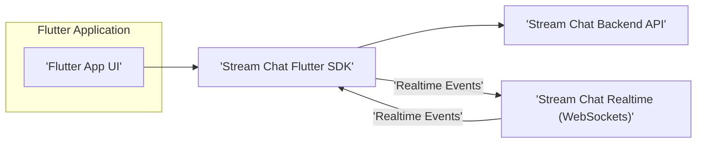
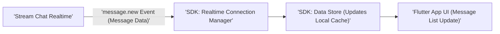

## Project Design Document: Stream Chat Flutter SDK

**1. Introduction**

This document provides a detailed design overview of the Stream Chat Flutter SDK, a client-side library enabling developers to integrate real-time chat functionality into their Flutter applications. This document aims to provide a comprehensive understanding of the SDK's architecture, components, data flow, and security considerations, serving as a foundation for subsequent threat modeling activities. This revision aims to enhance clarity and detail based on the initial version.

**2. Goals and Objectives**

*   Clearly define the architecture and key components of the Stream Chat Flutter SDK, providing more granular detail where appropriate.
*   Illustrate the data flow within the SDK and its interaction with the Stream Chat backend, including specific event types and data structures where relevant.
*   Identify potential security considerations and areas of concern for threat modeling, expanding on potential attack vectors and mitigation strategies.
*   Provide a well-structured and easily understandable document for security analysts and developers, ensuring all formatting is correct.

**3. Scope**

This document focuses on the design of the Stream Chat Flutter SDK itself. It covers the client-side logic, data handling, and interactions with the Stream Chat backend. It does not delve into the internal workings of the Stream Chat backend infrastructure or the specific implementation details of the Flutter framework itself, beyond its interaction with the SDK.

**4. High-Level Architecture**

The Stream Chat Flutter SDK acts as an intermediary between the Flutter application and the Stream Chat backend services. It provides a set of APIs and UI components to facilitate chat functionality.

*   **Flutter Application UI:** The user interface built by the developer using Flutter widgets, potentially including pre-built UI components provided by the SDK. This layer handles user interaction and presentation of chat data.
*   **Stream Chat Flutter SDK:** The core library responsible for managing chat state, handling API calls, managing the real-time connection, and providing data models and utility functions.
*   **Stream Chat Backend API:** The RESTful API provided by Stream for managing chat data, users, channels, and other resources. This includes endpoints for creating/modifying channels, sending messages, managing users, and more.
*   **Stream Chat Realtime (WebSockets):** The WebSocket service used for bidirectional, real-time event streaming, such as new messages, user presence updates, typing indicators, and channel updates.

**5. Component Details**

The Stream Chat Flutter SDK can be broken down into several key components, with more detail provided for each:

*   **Core Client:**
    *   Responsible for managing the lifecycle of the connection to the Stream Chat backend.
    *   Handles initial authentication and subsequent authorization for API requests.
    *   Provides a set of methods mirroring the Stream Chat Backend API, allowing the application to interact with the backend services (e.g., `sendMessage()`, `createChannel()`, `queryUsers()`).
    *   Manages the construction of HTTP requests (including headers and body) and the parsing of HTTP responses, handling potential errors and status codes.
    *   Includes logic for token refreshing to maintain authenticated sessions.
*   **Realtime Connection Manager:**
    *   Establishes and maintains a persistent WebSocket connection with the Stream Chat Realtime service.
    *   Implements robust reconnection logic with backoff strategies to handle network interruptions and disconnections gracefully.
    *   Subscribes to relevant event streams based on the application's current state (e.g., events for channels the user is a member of).
    *   Parses incoming real-time events (JSON payloads) and transforms them into SDK-specific data models, distributing these events to relevant parts of the SDK (e.g., the data store).
    *   Handles different types of real-time events, such as `message.new`, `member.added`, `typing.start`, etc.
*   **Data Store and Caching:**
    *   Manages a local, in-memory cache of chat data (messages, channels, users, members) to provide fast access and reduce reliance on network requests.
    *   Implements caching strategies (e.g., LRU, time-based expiry) to manage the size and freshness of the cached data.
    *   May utilize a persistent local storage mechanism (e.g., SQLite via a Flutter package like `sqflite`) for offline access and data persistence across app sessions.
    *   Implements mechanisms for synchronizing local data with the backend, handling potential conflicts and ensuring data consistency.
*   **Channel and Message Management:**
    *   Provides abstractions (data models and classes) for representing channels (direct messages, group chats, etc.) and messages.
    *   Handles message formatting (e.g., parsing markdown or rich text) and rendering for display in the UI.
    *   Manages message read states (e.g., marking messages as read) and reactions (e.g., likes, emojis).
    *   Provides functionalities for pagination and loading historical messages within a channel.
*   **User Management:**
    *   Provides access to the currently logged-in user's information and the information of other users in the chat system.
    *   Manages user presence status (online, offline, away) based on real-time events.
    *   Allows querying and searching for users.
*   **UI Components (Optional):**
    *   Offers a set of pre-built, customizable Flutter widgets for common chat UI elements, such as message lists, input fields, channel lists, and user avatars.
    *   These components are designed to integrate seamlessly with the core SDK functionalities and data models, simplifying UI development.
    *   Provides options for customization and theming to match the application's design.
*   **Image and File Handling:**
    *   Provides functionalities for uploading images and other files to the Stream Chat backend.
    *   Handles the process of selecting files from the device's storage or camera.
    *   May include image compression and resizing options before upload.
    *   Provides URLs or mechanisms for downloading and displaying media files received in messages.
    *   May implement local caching of downloaded media files.
*   **Push Notification Integration:**
    *   Handles the registration of the device with push notification services (e.g., Firebase Cloud Messaging for Android and iOS).
    *   Subscribes to push notification topics relevant to the user's channels and activities.
    *   Parses incoming push notification payloads and triggers appropriate actions within the application (e.g., displaying a notification, navigating to a specific channel).
    *   Manages the display of push notifications to the user.
*   **Authentication Handler:**
    *   Manages the authentication process, typically involving the exchange of user credentials for a Stream Chat user token.
    *   Provides methods for obtaining and refreshing authentication tokens.
    *   Securely stores authentication tokens, potentially using platform-specific secure storage mechanisms (e.g., Keychain on iOS, Keystore on Android).
    *   Handles scenarios where the authentication token is invalid or expired, triggering a re-authentication flow.
*   **Error Handling and Logging:**
    *   Implements robust error handling mechanisms to catch exceptions and network errors.
    *   Provides logging capabilities for debugging and monitoring purposes.
    *   May expose error events or callbacks to the application developer for custom error handling.

**6. Data Flow**

The following diagrams illustrate key data flows within the SDK, with more specific event and data details:

**6.1. Sending a Message:**

```mermaid
graph LR
    A["'Flutter App UI (User Input)'"] --> B["'SDK: Message Input Widget'"];
    B --> C["'SDK: Core Client (sendMessage API call)'"];
    C -- "'HTTPS Request (Message Content, Channel ID, User Token)'" --> D["'Stream Chat Backend API'"];
    D --> E["'Stream Chat Database'"];
    E -- "'Message Stored Event'" --> F["'Stream Chat Realtime'"];
    F -- "'message.new Event (Message Data)'" --> G["'SDK: Realtime Connection Manager'"];
    G --> H["'SDK: Data Store (Updates Local Cache)'"];
    H --> I["'Flutter App UI (Message List Update)'"];
```

*   User inputs a message in the Flutter app UI.
*   The SDK's message input widget captures the message content.
*   The core client initiates a `sendMessage` API call to the Stream Chat Backend API, including the message content, target channel ID, and the user's authentication token in the request headers.
*   The backend API receives the HTTPS request and stores the message in the Stream Chat database.
*   The backend emits a `message.new` event via the Realtime service, containing the details of the newly created message.
*   The SDK's Realtime Connection Manager receives the `message.new` event.
*   The SDK updates its local data store (cache and potentially persistent storage) with the new message data.
*   The Flutter app UI is notified of the data change and updates the message list to display the new message.

**6.2. Receiving a Message:**

*   The Stream Chat Realtime service broadcasts a `message.new` event, containing the details of a new message.
*   The SDK's Realtime Connection Manager receives the `message.new` event.
*   The SDK updates its local data store with the new message data.
*   The Flutter app UI is notified of the data change and updates the message list to display the new message.

**6.3. User Authentication:**

```mermaid
graph LR
    A["'Flutter App (Login Screen)'"] --> B["'SDK: Authentication Handler (authenticateUser)'"];
    B -- "'Credentials (Username/Password or OAuth Token)'" --> C["'Stream Chat Backend API (Authentication Endpoint)'"];
    C --> D["'Stream Chat Authentication Service'"];
    D -- "'Authentication Token'" --> E["'SDK: Authentication Handler (Receives Token)'"];
    E --> F["'SDK: Core Client (Sets Authorization Header)'"];
    F --> G["'Subsequent API Requests'"];
```

*   The Flutter app initiates the authentication process, typically from a login screen.
*   The SDK's Authentication Handler's `authenticateUser` method is called with user credentials (e.g., username/password or an OAuth token).
*   The SDK sends an authentication request to the Stream Chat Backend API's authentication endpoint, including the provided credentials.
*   The backend's authentication service verifies the credentials.
*   Upon successful authentication, the backend returns an authentication token (typically a JWT).
*   The SDK's Authentication Handler receives the token.
*   The SDK's Core Client stores the token securely and includes it in the `Authorization` header of subsequent API requests.

**7. Security Considerations**

This section outlines potential security considerations relevant to the Stream Chat Flutter SDK, with more detailed explanations and potential mitigations:

*   **Authentication and Authorization:**
    *   **Threat:** Compromise or leakage of user authentication tokens on the client-side could allow unauthorized access to the user's account and chat data.
    *   **Mitigation:** Utilize platform-specific secure storage mechanisms (Keychain/Keystore) to store tokens. Avoid storing tokens in shared preferences or other less secure locations. Implement token expiration and refresh mechanisms. Consider using short-lived tokens.
    *   **Threat:** Weak or predictable token generation by the backend could be exploited.
    *   **Mitigation:** Rely on Stream's secure token generation practices.
    *   **Threat:** Insufficient validation of user permissions and access control on the backend could allow users to perform actions they are not authorized for.
    *   **Mitigation:** Ensure the Stream Chat backend is configured with appropriate permissions and roles.
*   **Data Security (In Transit):**
    *   **Threat:** Man-in-the-middle (MITM) attacks could intercept communication between the SDK and the Stream Chat backend if HTTPS/TLS is not enforced.
    *   **Mitigation:** Ensure all communication with the Stream Chat backend (API and WebSockets) is conducted over HTTPS/TLS. The SDK should enforce this and potentially fail if a secure connection cannot be established. Implement certificate pinning for enhanced security.
*   **Data Security (At Rest):**
    *   **Threat:** Unauthorized access to locally stored chat data (messages, user information) if the device is compromised.
    *   **Mitigation:** Consider encrypting sensitive data stored locally using platform-specific encryption APIs. Implement appropriate data deletion policies.
    *   **Threat:** Exposure of sensitive data through insecure logging or debugging practices.
    *   **Mitigation:** Avoid logging sensitive information. Implement secure logging practices and disable verbose logging in production builds.
*   **Input Validation:**
    *   **Threat:** Cross-site scripting (XSS) attacks could be possible if user-generated content (messages) is not properly sanitized before rendering in the UI.
    *   **Mitigation:** Implement robust input validation and sanitization on both the client-side (within the SDK) and the server-side (Stream Chat backend). Use appropriate escaping techniques when rendering user-generated content in the UI.
    *   **Threat:** Malicious links or embedded content could be injected into messages.
    *   **Mitigation:** Implement link preview generation and potentially sandboxing of embedded content.
*   **Dependency Management:**
    *   **Threat:** Vulnerabilities in third-party libraries used by the SDK could be exploited.
    *   **Mitigation:** Regularly update dependencies to their latest versions, including security patches. Conduct security audits of dependencies. Utilize tools for dependency vulnerability scanning.
*   **Secure Storage of API Keys/Secrets:**
    *   **Threat:** Hardcoding API keys or secrets directly in the application code could lead to their exposure.
    *   **Mitigation:** Avoid hardcoding sensitive information. Utilize environment variables or secure configuration management techniques.
*   **Rate Limiting and Abuse Prevention:**
    *   **Threat:** Malicious actors could attempt to abuse the chat service by sending excessive messages or performing other actions.
    *   **Mitigation:** The SDK should respect rate limits imposed by the Stream Chat backend. Consider implementing client-side rate limiting as a defense-in-depth measure.
*   **Push Notification Security:**
    *   **Threat:** Unauthorized sending of push notifications if push notification tokens are compromised.
    *   **Mitigation:** Follow best practices for handling push notification tokens securely. Ensure the Stream Chat backend implements appropriate security measures for push notifications.
*   **Permissions:**
    *   **Threat:** Users may be concerned about the permissions requested by the application.
    *   **Mitigation:** Clearly explain the purpose of each permission requested by the SDK and the application. Only request necessary permissions.

**8. Deployment Considerations**

*   The Stream Chat Flutter SDK is integrated directly into the Flutter application and deployed as part of the application package.
*   Security considerations related to the deployment environment (e.g., mobile app stores' security checks, device security) are relevant and should be addressed by the application developer.
*   Developers need to follow best practices for securing their Flutter applications, including code obfuscation and protection against reverse engineering.

**9. Future Considerations**

*   Explore more advanced client-side encryption options for messages.
*   Implement more sophisticated client-side content filtering or moderation features.
*   Enhance error reporting and debugging capabilities for security-related issues.
*   Continuously monitor for and address new security vulnerabilities and threats.

This improved document provides a more detailed and comprehensive design overview of the Stream Chat Flutter SDK, with a stronger focus on security considerations relevant for threat modeling. The enhanced descriptions of components and data flows, along with the expanded security section, should provide a solid foundation for identifying and mitigating potential risks.
