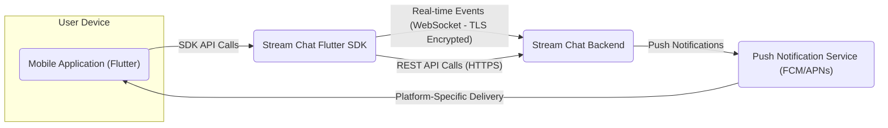

# Project Design Document: Stream Chat Flutter SDK Integration (Improved)

**1. Introduction**

This document provides an enhanced design overview of a system integrating the Stream Chat Flutter SDK (version available at [https://github.com/getstream/stream-chat-flutter](https://github.com/getstream/stream-chat-flutter)) into a hypothetical mobile application. This detailed design serves as a crucial foundation for subsequent threat modeling activities by clearly outlining the system's architecture, components, and data flow.

**1.1. Purpose**

The primary purpose of this document is to offer a comprehensive technical understanding of how the Stream Chat Flutter SDK is implemented within the mobile application, specifically tailored for security analysis. This will empower security professionals to effectively identify potential vulnerabilities, attack vectors, and security weaknesses during the threat modeling process.

**1.2. Scope**

This document focuses precisely on the integration of the Stream Chat Flutter SDK and its interactions with the mobile application and the Stream Chat backend service. The scope encompasses:

*   Detailed descriptions of the key components involved in the integration.
*   A thorough analysis of the data flow between these components, highlighting sensitive data.
*   An in-depth examination of the interactions with the Stream Chat backend, including communication protocols.
*   Client-side logic directly related to the SDK's functionality and security implications.

This document deliberately excludes:

*   The internal operational details and infrastructure of the Stream Chat backend service.
*   The specific features and functionalities of the hypothetical mobile application beyond its direct interaction with the chat SDK.
*   Granular UI/UX specifications and design elements.

**2. System Overview**

The system is composed of the following essential components:

*   **Mobile Application (Flutter):**  The application developed using the Flutter framework. This application incorporates the Stream Chat Flutter SDK to provide chat functionalities to the end-user. It manages user interactions and presents the chat interface.
*   **Stream Chat Flutter SDK:**  The software development kit provided by GetStream. This library acts as an intermediary, facilitating secure and efficient communication between the mobile application and the Stream Chat backend. It handles complex tasks like real-time event management, authentication, and data serialization.
*   **Stream Chat Backend:**  The core cloud-based service managed by GetStream. This service is responsible for storing and managing all chat-related data, including messages, users, and channels. It also handles real-time message delivery and user presence updates.
*   **Push Notification Service (e.g., Firebase Cloud Messaging (FCM) or Apple Push Notification service (APNs)):**  An external service crucial for delivering timely notifications to users. When the application is not in the foreground, this service informs users of new messages or events.
*   **User Device:**  The physical mobile device owned by the end-user, on which the mobile application is installed and executed.

**3. Architectural Design**

The following diagram illustrates the high-level architecture of the system, emphasizing the communication pathways:

**3.1. Component Descriptions:**

*   **Mobile Application (Flutter):**
    *   Presents the user interface for chat interactions, including message lists, input fields, and user profiles.
    *   Captures user input for sending messages, reactions, and other chat actions.
    *   Renders received messages and updates the UI in real-time.
    *   Manages the application's lifecycle and handles background tasks related to chat.
    *   May implement custom logic for features like message formatting, media previews, and user interface enhancements.
    *   Integrates with device functionalities like the camera and photo library for media sharing.
    *   Handles user authentication flows, potentially interacting with the SDK for token management.
    *   Receives and processes push notifications, displaying alerts to the user.
*   **Stream Chat Flutter SDK:**
    *   Provides a well-defined set of APIs and pre-built UI components (widgets) to simplify integration with the Stream Chat backend.
    *   Establishes and maintains a secure, persistent WebSocket connection with the Stream Chat backend for real-time bi-directional communication, typically using TLS encryption.
    *   Handles user authentication and authorization with the Stream Chat backend, typically using API keys and user JWT (JSON Web Tokens).
    *   Offers methods for sending various types of messages (text, media, commands).
    *   Manages channel subscriptions, updates, and synchronization of channel data.
    *   Facilitates user presence tracking and online status updates.
    *   Provides functionalities for advanced features like message reactions, threads, message editing, and read receipts.
    *   Handles local caching of chat data for offline access and improved performance.
    *   Abstracts away the complexities of the underlying network communication and data serialization.
*   **Stream Chat Backend:**
    *   Acts as the central repository for all chat-related data, including messages, user profiles, channel configurations, and moderation settings.
    *   Manages real-time message routing and delivery to connected clients via persistent WebSocket connections.
    *   Enforces authentication and authorization policies to control access to chat resources.
    *   Provides RESTful APIs for managing chat resources, such as creating channels, managing users, and retrieving historical data. These APIs are typically accessed over HTTPS.
    *   Integrates with push notification providers (FCM/APNs) to deliver notifications to offline users.
    *   May offer features like data encryption at rest, message history retention, and compliance tools.
*   **Push Notification Service (FCM/APNs):**
    *   Acts as a reliable third-party service for delivering push notifications from the Stream Chat backend to user devices.
    *   Requires proper configuration of API keys and certificates for secure communication.
    *   Handles platform-specific delivery mechanisms for iOS and Android devices.
    *   May provide features like message prioritization and delivery guarantees.
*   **User Device:**
    *   Provides the physical environment for the mobile application to run.
    *   Manages network connectivity, enabling communication with the Stream Chat backend.
    *   Stores application data, including potentially cached chat messages and user credentials (securely).
    *   Handles the display of push notifications to the user.

**3.2. Key Interactions:**

*   **Initialization and Configuration:** The mobile application initializes the Stream Chat Flutter SDK upon startup, providing necessary configuration details such as the Stream Chat API key and user credentials.
*   **Secure Connection Establishment:** The SDK establishes a secure WebSocket connection (typically over TLS) with the Stream Chat backend to enable real-time communication.
*   **User Authentication and Authorization:** The application authenticates the user with the Stream Chat backend. This usually involves obtaining a user-specific JWT from the application's backend or directly from Stream Chat using a secure authentication flow. This token is then used by the SDK for subsequent API calls and WebSocket authentication.
*   **Real-time Message Exchange:** Once connected, the SDK facilitates the exchange of messages between the mobile application and the Stream Chat backend over the established WebSocket connection.
*   **REST API Interactions:** The SDK utilizes REST API calls (over HTTPS) for various management tasks, such as fetching channel lists, retrieving message history, and updating user profiles.
*   **Push Notification Handling:** When a new message arrives for a user who is not actively using the application, the Stream Chat backend triggers a push notification via FCM/APNs to the user's device. The application handles the display of this notification.
*   **Presence Updates:** The SDK and backend work together to track and update user online status, broadcasting presence events to other connected users in relevant channels.

**4. Data Flow**

The following diagrams illustrate the flow of data for critical scenarios, highlighting potential security touchpoints.

**4.1. Sending a Message (Detailed):**

```mermaid
graph LR
    A["User Input (Message Content, Metadata)"] --> B("Mobile Application (Flutter)");
    B -- "SDK's sendMessage() with Message Object" --> C("Stream Chat Flutter SDK");
    C -- "Serialize Message (JSON)" --> D("WebSocket Connection (TLS Encrypted)");
    D -- "Send Message Payload" --> E("Stream Chat Backend");
    E -- "Store Message (Encrypted at Rest)" --> F("Database");
    E -- "Fan-out Message (WebSocket)" --> G("Recipient SDK Instances");
    G -- "Deserialize Message (JSON)" --> H("Recipient Mobile Application (Flutter)");
    H -- "Display Message" --> I["Recipient User Sees Message"];
```

*   The user composes a message, which may include text, media links, or other metadata.
*   The mobile application utilizes the SDK's `sendMessage()` method, passing a message object containing the content and relevant details.
*   The SDK serializes the message object into a standard format (typically JSON).
*   The serialized message is transmitted to the Stream Chat backend over the secure WebSocket connection (encrypted with TLS).
*   The Stream Chat backend receives the message, potentially performs validation and sanitization, and stores it in its database (ideally encrypted at rest).
*   The backend then fans out the message to all other connected members of the channel via their respective WebSocket connections.
*   Recipient SDK instances receive the message payload.
*   The SDK deserializes the message and delivers it to the recipient mobile application.
*   The recipient application renders and displays the message to the user.

**4.2. Receiving a Message via Push Notification (Detailed):**

```mermaid
graph LR
    A["Message Sent by User A"] --> B("Stream Chat Backend");
    B -- "Determine User B Offline" --> C("Push Notification Trigger");
    C -- "Construct Push Payload (Minimal Info)" --> D("Push Notification Service (FCM/APNs)");
    D -- "Send Push Notification" --> E["User B's Device"];
    E -- "OS Handles Notification Display" --> F["User B Sees Notification (Lock Screen/Notification Center)"];
    F -- "User Taps Notification" --> G["Mobile Application (Flutter) Opens"];
    G -- "SDK Connects/Resumes" --> H("Stream Chat Flutter SDK");
    H -- "Fetch Latest Messages (REST API - HTTPS)" --> I("Stream Chat Backend");
    I -- "Return New Messages" --> H;
    H -- "Display New Messages" --> J["User B Sees New Messages in App"];
```

*   User A sends a message, which is processed by the Stream Chat backend.
*   The backend determines that User B is not actively connected via WebSocket.
*   A push notification trigger is initiated.
*   The Stream Chat backend constructs a push notification payload, typically containing minimal information to avoid exposing sensitive data.
*   The push notification is sent via the configured push notification service (FCM/APNs) to User B's device.
*   The operating system on User B's device handles the display of the notification (on the lock screen or in the notification center).
*   If User B taps the notification, the mobile application is opened.
*   Upon opening, the SDK connects or resumes its connection to the Stream Chat backend.
*   The SDK may then fetch the latest messages using a REST API call over HTTPS to ensure the user sees the new content.
*   The Stream Chat backend returns the new messages.
*   The SDK updates the application's UI, and User B sees the new messages within the application.

**5. Security Considerations (Detailed for Threat Modeling)**

This section provides a more detailed breakdown of potential security considerations, categorized for clarity during threat modeling.

*   **Authentication and Authorization:**
    *   **Threat:** Unauthorized access to chat resources.
    *   **Considerations:**
        *   How securely are user tokens (JWTs) generated, signed, and managed throughout their lifecycle?
        *   Is the principle of least privilege enforced for user roles and channel access?
        *   Are there robust mechanisms to prevent token theft or replay attacks?
        *   How is multi-factor authentication (MFA) supported or enforced?
        *   Are there safeguards against brute-force attacks on login attempts?
    *   **Example:** A compromised user token could allow an attacker to impersonate the user and send/receive messages.
*   **Data in Transit:**
    *   **Threat:** Eavesdropping or modification of chat data during transmission.
    *   **Considerations:**
        *   Is all communication between the mobile application and the Stream Chat backend encrypted using TLS (for both WebSockets and REST APIs)?
        *   Are appropriate cipher suites used to ensure strong encryption?
        *   Is certificate pinning implemented to prevent man-in-the-middle attacks?
        *   Are push notifications encrypted, and what sensitive data might be exposed in their payloads?
    *   **Example:** An attacker intercepting network traffic could read unencrypted chat messages.
*   **Data at Rest:**
    *   **Threat:** Unauthorized access to stored chat data.
    *   **Considerations:**
        *   How is chat data encrypted at rest on the Stream Chat backend? What encryption algorithms are used? (While this is primarily a backend concern, understanding the guarantees provided is important).
        *   Is any sensitive chat data cached locally on the mobile device? If so, how is this data protected (e.g., using platform-specific secure storage mechanisms)?
        *   Are there data retention policies in place, and how is data securely deleted when necessary?
    *   **Example:** If local caching is not secure, an attacker with physical access to the device could access chat history.
*   **Input Validation and Output Encoding:**
    *   **Threat:** Cross-site scripting (XSS) or other injection attacks.
    *   **Considerations:**
        *   Is user input sanitized and validated on both the client-side and the backend to prevent malicious scripts or code from being injected into messages?
        *   Is output properly encoded before being displayed to prevent XSS vulnerabilities?
        *   How are media uploads handled and scanned for potential malware or malicious content?
    *   **Example:** An attacker could inject a malicious script into a message that, when viewed by another user, executes in their browser context.
*   **Rate Limiting and Abuse Prevention:**
    *   **Threat:** Denial-of-service (DoS) attacks or spamming.
    *   **Considerations:**
        *   Are there mechanisms in place to limit the rate of API requests and message sending to prevent abuse?
        *   Are there safeguards against automated bots or malicious actors flooding chat channels with spam?
        *   How are abusive users identified and handled (e.g., banning, reporting)?
    *   **Example:** An attacker could overwhelm the chat service with a large number of messages, making it unavailable to legitimate users.
*   **Push Notification Security:**
    *   **Threat:** Spoofed or malicious push notifications.
    *   **Considerations:**
        *   Is the push notification configuration secure, preventing unauthorized entities from sending notifications?
        *   Is sensitive information minimized in push notification payloads?
        *   Are there mechanisms to verify the authenticity of push notifications?
    *   **Example:** An attacker could send fake push notifications to phish users or spread misinformation.
*   **Dependency Management:**
    *   **Threat:** Vulnerabilities in third-party libraries.
    *   **Considerations:**
        *   Are the Stream Chat Flutter SDK and all other dependencies kept up-to-date with the latest security patches?
        *   Is there a process for regularly reviewing and updating dependencies to address known vulnerabilities?
        *   Are Software Bills of Materials (SBOMs) utilized to track dependencies?
    *   **Example:** A known vulnerability in an older version of the SDK could be exploited to compromise the application.
*   **Client-Side Security:**
    *   **Threat:** Reverse engineering or tampering with the application.
    *   **Considerations:**
        *   Is the mobile application code obfuscated to make reverse engineering more difficult?
        *   Are API keys and other sensitive information stored securely on the client-side, utilizing platform-provided secure storage mechanisms (e.g., Keychain on iOS, Keystore on Android)?
        *   Are there mechanisms to detect and prevent tampering with the application binary?
    *   **Example:** An attacker could reverse engineer the application to extract API keys or understand internal logic.

**6. Assumptions and Constraints**

*   The mobile application is developed using the Flutter framework and targets both Android and iOS platforms.
*   The Stream Chat Flutter SDK is the primary and intended method for interacting with the Stream Chat backend.
*   Push notifications are a required feature and are configured using either Firebase Cloud Messaging (FCM) for Android or Apple Push Notification service (APNs) for iOS.
*   The Stream Chat backend service is assumed to be a robust and generally secure platform, and its internal security mechanisms are outside the direct control of this integration.
*   This design focuses on the core chat functionality provided by the SDK and does not delve into potential custom extensions or integrations unless explicitly mentioned.

**7. Future Considerations**

*   Implementation of end-to-end encryption (E2EE) to provide enhanced privacy and security for message content.
*   Integration with third-party authentication providers for seamless user onboarding.
*   Advanced moderation features and content filtering mechanisms.
*   Support for richer media types and interactive message elements.
*   Performance optimization for handling a large number of concurrent users and channels.

This improved design document provides a more detailed and security-focused overview of the Stream Chat Flutter SDK integration. It serves as a valuable resource for conducting thorough threat modeling and identifying potential security risks.
