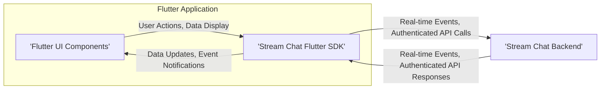
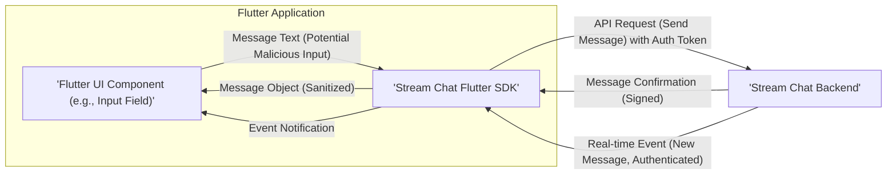
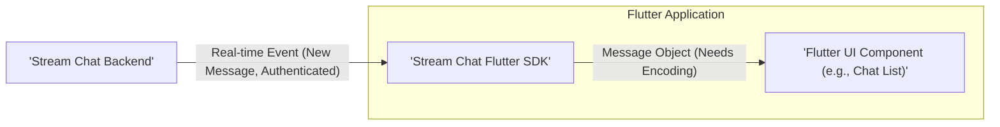
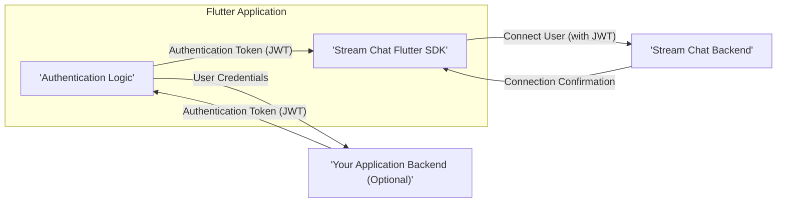

# Project Design Document: Stream Chat Flutter SDK Integration

**Version:** 1.1
**Date:** October 26, 2023
**Author:** Gemini (AI Language Model)

## 1. Introduction

This document provides an enhanced design overview of the Stream Chat Flutter SDK (`https://github.com/getstream/stream-chat-flutter`) and its integration within a hypothetical Flutter application. This document aims to clearly outline the SDK's architecture, components, data flow, and key security considerations with a stronger focus on aspects relevant for threat modeling. It will serve as a more robust foundation for subsequent security assessments and development discussions.

## 2. Goals

*   Provide a detailed and clear architectural overview of the Stream Chat Flutter SDK, emphasizing security-relevant aspects.
*   Identify key components and their interactions, highlighting potential attack surfaces.
*   Describe the data flow within the SDK and between the SDK and the Stream Chat backend with specific examples relevant to security.
*   Highlight potential security considerations with concrete examples of threats, making it directly usable for threat modeling exercises.
*   Serve as a comprehensive reference point for security assessments, penetration testing, and development discussions.

## 3. Non-Goals

*   Highly granular code-level implementation specifics of the SDK's internal workings.
*   Specific UI/UX design choices for applications utilizing the SDK beyond illustrating interaction points.
*   Detailed performance benchmarking, optimization strategies, or scalability considerations.
*   In-depth explanation of the Stream Chat backend infrastructure beyond its interaction with the SDK.

## 4. Architectural Overview

The Stream Chat Flutter SDK acts as a crucial intermediary, facilitating secure and efficient communication between a Flutter application and the Stream Chat backend service. It provides developers with a set of pre-built functionalities and abstractions to seamlessly integrate real-time chat features into their Flutter applications.

**Key Architectural Layers:**

*   **Flutter UI Components:** The visual elements within the Flutter application that leverage the SDK's capabilities to enable user interaction with chat functionalities. These are potential points for UI-related attacks (e.g., XSS if displaying unescaped data).
*   **Stream Chat Flutter SDK:** The core library encapsulating the API interactions, data models, real-time event handling, and business logic required to interface with the Stream Chat backend. This layer is critical for security as it handles authentication, data serialization, and network communication.
*   **Stream Chat Backend:** The secure, scalable cloud-based service managed by GetStream, responsible for managing chat channels, messages, user data, permissions, and the distribution of real-time events. Trust in the security of this backend is paramount.

## 5. Component Details

The Stream Chat Flutter SDK comprises several interconnected components, each with specific responsibilities and security implications:

*   **`StreamChatClient`:**
    *   The primary interface for interacting with the SDK.
    *   Responsible for initializing and managing the secure connection to the Stream Chat backend.
    *   Handles global configurations, including API key management and user authentication setup. *Security Note: Secure storage and handling of the API key are crucial here.*
*   **`User`:**
    *   Represents a chat user with attributes like ID, name, avatar URL, and custom data.
    *   Used for authentication, identifying message senders, and managing user presence. *Security Note: Proper handling of user data and preventing unauthorized access are key.*
*   **`Channel`:**
    *   Represents a chat conversation or group, characterized by its type (e.g., `messaging`, `livestream`), unique ID, members, and metadata.
    *   Provides methods for retrieving messages, managing channel membership, and updating channel settings. *Security Note: Access control and preventing unauthorized modifications to channels are important.*
*   **`Message`:**
    *   Represents a single chat message containing text, sender information, timestamps, attachments, and reactions.
    *   Supports various message types and potentially rich media content. *Security Note: Input validation to prevent malicious content and proper encoding for display are critical.*
*   **`Event`:**
    *   Represents real-time updates pushed from the Stream Chat backend, such as new messages, user presence changes, typing indicators, and channel updates.
    *   The SDK provides mechanisms to subscribe to and process these events. *Security Note: Ensuring the authenticity and integrity of events is crucial to prevent manipulation.*
*   **`API Client`:**
    *   Manages secure communication with the Stream Chat backend's REST API over HTTPS.
    *   Handles request construction, authentication header injection (typically with a JWT), and response parsing. *Security Note: Proper handling of authentication tokens and secure API endpoint interaction are vital.*
*   **`WebSockets Client`:**
    *   Establishes and maintains a persistent, secure WebSocket connection with the Stream Chat backend for efficient real-time event delivery.
    *   Handles connection negotiation, authentication, data serialization/deserialization, and reconnection logic. *Security Note: Ensuring the WebSocket connection is encrypted and authenticated is paramount.*
*   **`Local Storage/Cache` (Optional):**
    *   May implement optional local storage or caching mechanisms for performance optimization and offline access.
    *   Stores frequently accessed data like user profiles, channel lists, and recent messages. *Security Note: If implemented, data should be encrypted at rest, and access should be controlled.*
*   **`Image/File Handling`:**
    *   Provides functionalities for uploading and displaying images and files within chat messages, potentially involving interaction with device storage and network requests. *Security Note: Secure handling of file uploads and downloads, including validation and preventing access to unauthorized files, is important.*
*   **`Push Notifications Integration`:**
    *   Enables the application to receive push notifications for new messages or events when the app is in the background or closed.
    *   Requires integration with platform-specific push notification services (e.g., Firebase Cloud Messaging, APNs). *Security Note: Ensuring notifications don't expose sensitive information and preventing unauthorized sending of notifications are key.*

## 6. Data Flow

The following illustrates the typical data flow for common chat operations, highlighting security considerations at each step:

**6.1. Sending a Message:**

*   The user enters a message in the Flutter UI. *Threat: User might input malicious scripts or data.*
*   The UI component passes the message text to the Stream Chat Flutter SDK. *Mitigation: Input sanitization within the SDK is crucial.*
*   The SDK's API Client sends a secure, authenticated request to the Stream Chat backend to create a new message in the specified channel. *Threat: Man-in-the-middle attacks if not using HTTPS. Authentication token compromise.*
*   The backend validates the request and confirms the message creation, potentially signing the response.
*   The SDK updates its local state with the new message, potentially sanitizing the output before displaying it in the UI.
*   The backend also broadcasts a real-time event indicating a new message, ensuring the event is authenticated.
*   The SDK receives this authenticated event and updates the UI accordingly.

**6.2. Receiving a Message:**

*   The Stream Chat backend sends a real-time event (via secure WebSockets) to the SDK indicating a new message in a channel the user is a member of. *Threat: Injection of fake events if the WebSocket connection is compromised or unauthenticated.*
*   The SDK verifies the authenticity of the event.
*   The SDK processes the event and updates its internal message store.
*   The SDK provides the message object to the relevant UI components. *Threat: If the message content is not properly encoded before display, it could lead to XSS vulnerabilities.*
*   The UI component renders the message.

**6.3. User Authentication:**

*   The Flutter application authenticates the user (potentially against its own backend). *Threat: Vulnerabilities in the application's authentication mechanism.*
*   The application retrieves a secure authentication token (often a JWT) that is valid for the Stream Chat backend. *Threat: Token interception or theft during transmission.*
*   This token is securely passed to the `StreamChatClient`'s `connectUser` method.
*   The SDK uses this token to establish a secure and authenticated connection with the Stream Chat backend. *Threat: If the token is compromised, an attacker can impersonate the user.*

## 7. Security Considerations

This section details potential security considerations, providing concrete examples of threats relevant for threat modeling:

*   **Authentication and Authorization:**
    *   **Threat:** Weak or insecure authentication mechanisms could allow unauthorized users to access the chat service.
    *   **Threat:** Insufficient authorization checks could allow users to access channels or perform actions they are not permitted to (e.g., reading private messages, deleting channels).
    *   **Threat:** Long-lived or easily guessable authentication tokens could be compromised and used to impersonate users.
    *   **Mitigation:** Implement robust authentication using industry standards (e.g., OAuth 2.0), enforce granular authorization rules, and use short-lived, securely stored tokens.
*   **Data Transmission Security:**
    *   **Threat:** Man-in-the-middle attacks could intercept and potentially modify communication between the SDK and the backend if not using HTTPS and secure WebSockets.
    *   **Mitigation:** Ensure all communication utilizes TLS/SSL encryption. Enforce HTTPS for API calls and secure WebSockets (WSS) for real-time events.
*   **Input Validation and Output Encoding:**
    *   **Threat:** Cross-site scripting (XSS) attacks could be possible if user-provided input (e.g., message text, user names) is not properly validated and sanitized before being stored or displayed.
    *   **Threat:** SQL injection (less likely in this client-side context but possible if the SDK interacts with local databases based on user input) could occur if input is not sanitized.
    *   **Mitigation:** Implement strict input validation on the client-side and server-side. Encode output appropriately before rendering in the UI to prevent script execution.
*   **Local Data Storage Security:**
    *   **Threat:** Sensitive information stored locally (e.g., user tokens, message history) could be compromised if the device is lost or stolen, or if the application has vulnerabilities allowing access to its data.
    *   **Mitigation:** Encrypt sensitive data at rest using platform-specific secure storage mechanisms. Implement proper access controls for local data.
*   **Real-time Event Security:**
    *   **Threat:** Malicious actors could potentially inject fake or manipulated real-time events if the event stream is not properly authenticated and secured.
    *   **Mitigation:** Ensure that real-time events are signed or authenticated by the backend to verify their origin and integrity.
*   **Dependency Management:**
    *   **Threat:** Using SDK dependencies with known vulnerabilities could introduce security risks into the application.
    *   **Mitigation:** Regularly audit and update SDK dependencies to patch known vulnerabilities. Utilize dependency management tools to identify and manage vulnerabilities.
*   **Push Notification Security:**
    *   **Threat:** Push notifications could be intercepted or read if not transmitted securely.
    *   **Threat:** Sensitive information could be exposed in push notification content.
    *   **Threat:** Attackers could potentially send unauthorized push notifications to users.
    *   **Mitigation:** Avoid sending sensitive information in push notifications. Use secure push notification services (e.g., FCM, APNs) and properly configure them.
*   **API Key Security:**
    *   **Threat:** If the Stream Chat API key is exposed in the client-side code, it could be misused by attackers to access or manipulate the chat service.
    *   **Mitigation:** Avoid embedding API keys directly in the client-side code. Use secure methods for managing and providing API keys, such as backend proxies or environment variables.
*   **Rate Limiting and Abuse Prevention:**
    *   **Threat:** Lack of rate limiting could allow attackers to abuse the chat service by sending excessive messages, creating numerous accounts, or performing denial-of-service attacks.
    *   **Mitigation:** Implement rate limiting on the backend to restrict the number of requests from a single user or IP address within a given timeframe.
*   **Secure Defaults:**
    *   **Threat:** Insecure default configurations of the SDK could leave applications vulnerable.
    *   **Mitigation:** Ensure the SDK has secure default settings and encourage developers to follow security best practices.
*   **Error Handling and Logging:**
    *   **Threat:** Verbose error messages could reveal sensitive information to attackers.
    *   **Threat:** Insufficient logging could hinder incident response and security analysis.
    *   **Mitigation:** Implement secure error handling that avoids exposing sensitive details. Implement comprehensive and secure logging mechanisms.

## 8. Dependencies

The Stream Chat Flutter SDK relies on various dependencies, including:

*   **Flutter SDK:** The foundational framework for building cross-platform applications.
*   **Dart Programming Language:** The language used for Flutter development and the SDK itself.
*   **Stream Chat API Client Libraries (internal):** Libraries facilitating communication with the Stream Chat backend.
*   **`web_socket_channel`:** A library for establishing and managing WebSocket connections.
*   **`http`:** A library for making HTTP requests.
*   **Platform-specific libraries for local storage (if implemented):** Libraries for persistent data storage on different platforms.
*   **Platform-specific libraries for push notifications (if integrated):** Libraries like `firebase_messaging` for handling push notifications.

## 9. Deployment Considerations

*   The Stream Chat Flutter SDK is integrated directly into the Flutter application and deployed as part of the application package.
*   Secure configuration of the `StreamChatClient` with the correct API key and secure authentication logic is paramount during deployment.
*   Carefully consider the security implications of how API keys are managed and provisioned in the deployed application. Avoid hardcoding keys.
*   Ensure the application's network security policies allow secure communication with the Stream Chat backend endpoints.

## 10. Future Considerations

*   Further in-depth security audit of the SDK's codebase, focusing on potential vulnerabilities.
*   Detailed analysis of the SDK's internal authentication and authorization mechanisms.
*   Regular penetration testing of applications integrating the SDK to identify potential weaknesses.
*   Continuous monitoring of the SDK's dependencies for newly discovered vulnerabilities and timely updates.
*   Exploration of additional security features that could be incorporated into the SDK, such as end-to-end encryption.

This enhanced document provides a more detailed and security-focused design overview of the Stream Chat Flutter SDK, making it a more effective tool for threat modeling. By understanding the architecture, components, data flow, and potential security threats, development and security teams can proactively address vulnerabilities and build more secure chat applications.