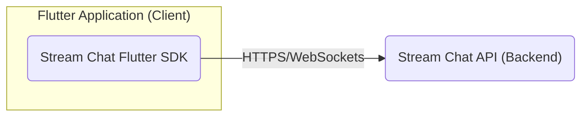
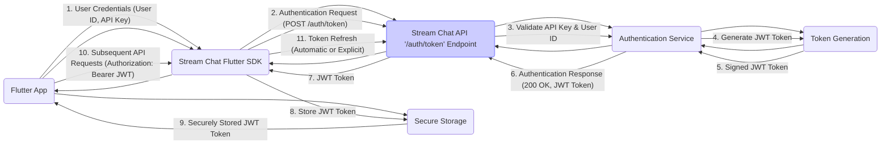
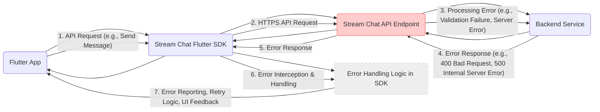

## Project Design Document: Stream Chat Flutter SDK (Improved)

### 1. Project Overview

**Project Name:** Stream Chat Flutter SDK

**Project Repository:** [https://github.com/getstream/stream-chat-flutter](https://github.com/getstream/stream-chat-flutter)

**Description:** The Stream Chat Flutter SDK is a comprehensive toolkit designed to enable developers to seamlessly integrate real-time chat functionalities into their Flutter applications. It provides a rich set of pre-built UI components, a well-structured client library, and leverages the robust Stream Chat API backend. This SDK abstracts away the complexities of building a chat system from scratch, handling message delivery, user and channel management, presence, reactions, threads, moderation, and more. Developers can focus on building unique application features while relying on the SDK for a high-quality, scalable chat experience.

**Purpose of this Document:** This document serves as a detailed design specification for the Stream Chat Flutter SDK, specifically tailored for threat modeling and security analysis. It meticulously outlines the SDK's architecture, component breakdown, data flow pathways, and crucial security considerations. This document will be used to identify potential vulnerabilities and inform the development of appropriate security mitigations.

### 2. Architecture Overview

The Stream Chat Flutter SDK operates within a client-server architecture, acting as a client-side interface to the Stream Chat API backend. The SDK facilitates communication and data exchange between the Flutter application and the backend services.

**Explanation:**

*   **Flutter Application (Client):** This represents the Flutter application integrating the Stream Chat Flutter SDK. It encompasses the SDK libraries, UI widgets, and application-specific chat logic.
*   **Stream Chat API (Backend):** This is the Stream-managed backend infrastructure providing core chat services. It handles data persistence, real-time messaging, user authentication, authorization, and various chat features. Communication between the SDK and API occurs over HTTPS for RESTful API calls and WebSockets for real-time event streaming.

The Flutter SDK's primary responsibilities include:

*   **API Abstraction:** Providing a Flutter-friendly API to interact with the Stream Chat API.
*   **Real-time Communication Management:** Establishing and maintaining WebSocket connections for real-time message and event delivery.
*   **UI Rendering:** Offering pre-built and customizable UI widgets for chat interfaces (message lists, channel lists, input fields, etc.).
*   **State Management:** Managing local state related to chat data (channels, messages, users) for efficient UI updates and offline capabilities.
*   **Data Caching and Persistence:** Implementing caching mechanisms to improve performance and potentially support offline scenarios.
*   **Feature Implementation:**  Implementing features like message reactions, threads, typing indicators, read receipts, moderation tools, and push notifications (via backend integration).

### 3. Component Breakdown

#### 3.1 Flutter SDK Components (Detailed)

The Stream Chat Flutter SDK is modularly designed, comprising these key components:

*   **`stream_chat_flutter_core`:** The foundational library providing core API interaction and data management:
    *   **`Client`:**  The central class responsible for:
        *   Initializing and managing the connection to the Stream Chat API using API keys and user tokens.
        *   Handling authentication and token refresh.
        *   Making REST API calls for channel operations, message sending, user updates, etc.
        *   Establishing and managing WebSocket connections for real-time events.
    *   **`Models`:** Defines data models representing chat entities:
        *   `User`: User profiles, online status, roles, and permissions.
        *   `Channel`: Channel metadata, type (livestream, messaging, etc.), members, and permissions.
        *   `Message`: Message content, sender, timestamps, attachments, reactions, replies, and read status.
        *   `Reaction`: Message reactions (emoji, custom reactions).
        *   `Attachment`: File attachments (images, videos, documents).
        *   `Event`: Real-time events (new messages, message updates, user presence changes, etc.).
    *   **`Controllers/Managers`:**  Handles business logic and state management:
        *   `ChannelListController`: Manages the list of channels a user is part of, handles pagination, filtering, and real-time updates.
        *   `ChatController`: Manages the state of a specific channel, including message loading, sending, receiving, reactions, threads, and read status.
        *   `UserController`: Manages the current user's profile and presence.
        *   `MessageController`:  Handles message-related operations within a channel.
    *   **`WebSockets Manager`:**  Specifically manages the WebSocket connection:
        *   Handles connection establishment, reconnection, and disconnection.
        *   Parses incoming WebSocket events and dispatches them to relevant controllers.
        *   Handles sending WebSocket messages (though primarily for connection management, not direct message sending which goes through REST API).
    *   **`Persistence/Cache Manager`:**  Implements local caching mechanisms:
        *   Caches channel lists, messages, user data to improve performance and reduce API calls.
        *   Potentially uses local storage (e.g., `shared_preferences`, SQLite) for persistence.
    *   **`Error Handling`:**  Manages API error responses and WebSocket errors, providing mechanisms for error reporting and retry logic.

*   **`stream_chat_flutter`:**  The UI library providing pre-built widgets and theming:
    *   **UI Widgets:** Reusable Flutter widgets for building chat UIs:
        *   `ChannelListView`: Displays a list of channels.
        *   `MessageListView`: Displays a list of messages in a channel.
        *   `MessageInput`:  Input field for composing and sending messages.
        *   `ChatMessage`: Widget to render a single message.
        *   `UserAvatar`: Widget to display user avatars.
        *   `TypingIndicator`: Displays typing indicators.
        *   `ReactionPicker`: UI for selecting message reactions.
        *   `ThreadView`: UI for displaying message threads.
    *   **Theming and Styling:**  Provides mechanisms for customizing the appearance of UI components:
        *   `StreamChatTheme`:  Defines a theme object to customize colors, fonts, and styles.
        *   Customizable widget properties for fine-grained styling.
    *   **Navigation and Routing Helpers:**  Provides utilities for navigating between chat views within a Flutter application.
    *   **Localization:** Supports localization for UI text elements.

#### 3.2 Stream Chat API Components (Backend - Conceptual)

Understanding the backend components is crucial for threat modeling, even though they are managed by Stream:

*   **Authentication and Authorization Service:**
    *   User authentication (API Key/Token based).
    *   API Key validation and management.
    *   Role-Based Access Control (RBAC) for permissions.
*   **Channel Service:**
    *   Channel creation, deletion, and updates.
    *   Channel membership management (joining, leaving, inviting).
    *   Channel metadata storage and retrieval.
    *   Channel type management (messaging, livestream, etc.).
*   **Message Service:**
    *   Message storage (database).
    *   Message delivery and routing.
    *   Message history retrieval and pagination.
    *   Message editing and deletion.
    *   Message indexing and search (potentially).
*   **User Service:**
    *   User profile management (creation, updates, retrieval).
    *   User presence tracking (online/offline status).
    *   User blocking and muting.
*   **Permissions and Roles Service:**
    *   Defines and enforces permissions for users and channels.
    *   Manages roles and assigns permissions to roles.
*   **Real-time Engine (WebSocket Server):**
    *   Manages WebSocket connections with clients.
    *   Broadcasts real-time events (messages, presence updates, etc.) to connected clients.
    *   Scalable infrastructure for handling concurrent connections.
*   **Push Notification Service:**
    *   Handles push notification delivery to users for new messages and events (via FCM, APNS, etc.).
    *   Integration with mobile push notification providers.
*   **Moderation Service:**
    *   Content moderation tools (profanity filtering, keyword blocking, user reporting).
    *   User moderation actions (banning, muting).
*   **Analytics and Reporting Service:**
    *   Collects chat usage data for analytics and reporting.
    *   Provides dashboards and APIs for accessing usage statistics.
*   **File Storage Service:**
    *   Handles storage and retrieval of file attachments.
    *   Potentially integrates with cloud storage providers (AWS S3, Google Cloud Storage, etc.).

### 4. Data Flow (Enhanced)

#### 4.1 User Authentication and Token Refresh Flow

**Explanation (Enhanced):**

1.  The Flutter application provides user credentials (typically User ID and API Key obtained from Stream Dashboard).
2.  The SDK sends an authentication request to the Stream Chat API's `/auth/token` endpoint using HTTPS POST.
3.  The Authentication Service validates the provided API Key and User ID.
4.  Upon successful validation, the Token Generation service generates a JSON Web Token (JWT).
5.  The JWT is signed cryptographically by the backend.
6.  The Authentication Service returns a successful authentication response (HTTP 200 OK) containing the JWT in the response body.
7.  The SDK receives the JWT.
8.  The SDK stores the JWT securely using platform-specific secure storage mechanisms (e.g., Keychain on iOS, Keystore on Android).
9.  The securely stored JWT is available for subsequent API requests.
10. For all subsequent API requests, the SDK includes the JWT in the `Authorization` header as a Bearer token.
11. **Token Refresh:** The SDK handles token refresh automatically or provides mechanisms for explicit token refresh when the token is about to expire or becomes invalid. This typically involves a similar flow to initial authentication, potentially using a refresh token (if implemented by the backend, details depend on Stream API implementation).

#### 4.2 Message Sending and Receiving Flow (Detailed Real-time)

```mermaid
graph LR
    A("Flutter App (Sender)") --> B("Stream Chat Flutter SDK")
    B --> C("Stream Chat API '/messages' Endpoint")
    C --> D("Message Service")
    D --> E("Real-time Engine")
    E --> F("Stream Chat API (WebSocket)")
    F --> G("Flutter App (Receiver)")
    H("Other Connected Clients")
    F --> H

    A -- "1. Send Message Request (e.g., text, attachments)" --> B
    B -- "2. API Request (POST /messages)" --> C
    C -- "3. Validate & Store Message" --> D
    D -- "4. Publish Message Event" --> E
    E -- "5. Broadcast Message Event (WebSocket)" --> F
    F -- "6. Real-time Message Event" --> G
    G -- "7. Update UI (Receiver App)" --> G
    F -- "8. Real-time Message Event" --> H
    H -- "9. Update UI (Other Clients)" --> H
    C -- "10. API Response (201 Created, Message ID)" --> B
    B -- "11. Confirmation & Local UI Update (Sender App)" --> A

    style C fill:#ccf,stroke:#99f,stroke-width:2px
    style F fill:#efe,stroke:#9e9,stroke-width:2px
```

**Explanation (Detailed Real-time):**

1.  The Flutter application (sender) initiates a request to send a message (text, attachments, etc.) through the SDK.
2.  The SDK sends an HTTPS POST request to the Stream Chat API's `/messages` endpoint, including message content and channel ID.
3.  The Message Service on the backend validates the request, stores the message in the database, and performs any necessary processing (e.g., mentions, links).
4.  The Message Service publishes a "new message" event to the Real-time Engine.
5.  The Real-time Engine broadcasts this message event over the WebSocket connection to all clients subscribed to the relevant channel.
6.  The Flutter application (receiver) and other connected clients receive the real-time message event via their WebSocket connections.
7.  The receiver application's SDK processes the event and updates the UI to display the new message in real-time.
8.  Other connected clients (web apps, other mobile apps) also receive the real-time event and update their UIs.
9.  The Stream Chat API sends an HTTP 201 Created response back to the sender SDK, confirming successful message creation and providing the message ID.
10. The sender SDK receives the confirmation and updates the local UI to reflect the sent message (often optimistically updating the UI before API confirmation for better perceived performance).

#### 4.3 Error Handling Flow (Example - API Error)

**Explanation (Error Handling):**

1.  The Flutter application initiates an API request through the SDK (e.g., to send a message).
2.  The SDK makes an HTTPS API request to the Stream Chat API.
3.  The backend service encounters an error during processing (e.g., input validation failure, server-side error, permission error).
4.  The backend service returns an HTTP error response (e.g., 400 Bad Request, 500 Internal Server Error) with an error code and potentially an error message.
5.  The SDK receives the error response.
6.  The SDK's error handling logic intercepts the error response.
7.  The SDK's error handling logic performs actions such as:
    *   Logging the error.
    *   Potentially retrying the request (with exponential backoff).
    *   Providing error feedback to the Flutter application (e.g., via callbacks, streams, or exceptions).
    *   Updating the UI to indicate the error to the user.

### 5. Security Considerations for Threat Modeling (Enhanced)

This section expands on security considerations, categorizing potential threats and suggesting mitigation strategies.

#### 5.1 Authentication and Authorization Threats

*   **Threat:** **API Key/Token Compromise:** If API keys or JWT tokens are compromised (e.g., leaked in client-side code, insecure storage, man-in-the-middle attack), attackers could impersonate users or gain unauthorized access to chat data.
    *   **Mitigation:**
        *   **Secure API Key Management:**  Emphasize secure storage of API keys and tokens (using platform-specific secure storage). Avoid embedding API keys directly in client-side code.
        *   **JWT Token Security:**  Utilize short-lived JWT tokens and implement robust token refresh mechanisms. Ensure JWTs are signed using strong cryptographic algorithms.
        *   **HTTPS Enforcement:**  Enforce HTTPS for all communication to prevent man-in-the-middle attacks and protect API keys/tokens in transit.
        *   **Principle of Least Privilege:**  Grant API keys and tokens only the necessary permissions.
*   **Threat:** **User Impersonation:**  Vulnerabilities in the authentication process could allow attackers to impersonate legitimate users.
    *   **Mitigation:**
        *   **Strong Authentication Protocol:**  Employ robust authentication protocols (e.g., OAuth 2.0 or similar if applicable, or Stream's token-based authentication).
        *   **Server-Side Validation:**  Perform thorough server-side validation of all authentication requests.
        *   **Rate Limiting Authentication Attempts:**  Implement rate limiting to prevent brute-force attacks on authentication endpoints.
*   **Threat:** **Authorization Bypass:**  Vulnerabilities in authorization checks could allow users to access channels or perform actions they are not authorized to.
    *   **Mitigation:**
        *   **Robust Authorization Logic:**  Implement fine-grained authorization controls on the backend, verifying user permissions for every action (channel access, message sending, moderation, etc.).
        *   **Server-Side Authorization Enforcement:**  Enforce authorization checks on the server-side, not relying solely on client-side checks.
        *   **Regular Security Audits:**  Conduct regular security audits of authorization logic and API endpoints.

#### 5.2 Data Security Threats

*   **Threat:** **Data Leakage in Transit:**  Unencrypted communication could expose sensitive chat data during transmission.
    *   **Mitigation:**
        *   **HTTPS Everywhere:**  Mandate HTTPS for all communication between the SDK and the Stream Chat API.
        *   **WebSocket Security (WSS):**  Use secure WebSockets (WSS) for real-time communication to encrypt data in transit.
*   **Threat:** **Data Leakage at Rest (Client-Side Caching):**  Insecure client-side caching could expose sensitive chat data if the device is compromised.
    *   **Mitigation:**
        *   **Secure Caching Mechanisms:**  If caching sensitive data, use secure storage mechanisms provided by the platform (e.g., encrypted databases, secure file storage).
        *   **Minimize Client-Side Data Storage:**  Minimize the amount of sensitive data cached on the client-side. Consider caching only non-sensitive data or using short cache expiration times.
        *   **Data Encryption at Rest (Backend):** (Backend responsibility) Ensure data is encrypted at rest on the Stream Chat API backend.
*   **Threat:** **Message Interception (Real-time):**  Although WebSockets are generally secure, vulnerabilities in the WebSocket implementation or configuration could potentially lead to message interception.
    *   **Mitigation:**
        *   **Secure WebSocket Implementation:**  Use well-vetted and secure WebSocket libraries and implementations.
        *   **Regular Security Updates:**  Keep WebSocket libraries and server-side components up-to-date with security patches.
        *   **End-to-End Encryption (Optional, Advanced):** For highly sensitive applications, consider implementing end-to-end encryption on top of the existing transport layer security.

#### 5.3 Input Validation and Output Encoding Threats

*   **Threat:** **Cross-Site Scripting (XSS) via Messages:**  Malicious users could inject malicious scripts into messages, leading to XSS vulnerabilities when other users view those messages.
    *   **Mitigation:**
        *   **Server-Side Input Validation:**  Implement robust server-side input validation to sanitize and filter user-provided message content, removing or encoding potentially harmful scripts.
        *   **Output Encoding:**  Properly encode message content when rendering it in the UI to prevent browser interpretation of malicious scripts. Use context-aware output encoding appropriate for the rendering context (HTML, JavaScript, etc.).
        *   **Content Security Policy (CSP):**  Implement CSP headers to further mitigate XSS risks by controlling the sources from which the browser is allowed to load resources.
*   **Threat:** **Injection Attacks (Less likely in typical chat API context, but consider):**  Although less common in typical chat APIs, consider potential injection vulnerabilities if the API uses database queries based on user input (e.g., NoSQL injection if using NoSQL databases).
    *   **Mitigation:**
        *   **Parameterized Queries/ORMs:**  Use parameterized queries or Object-Relational Mappers (ORMs) on the backend to prevent SQL or NoSQL injection vulnerabilities.
        *   **Input Sanitization (Server-Side):**  Sanitize user inputs before using them in database queries or other backend operations.

#### 5.4 API Security Threats

*   **Threat:** **API Abuse and Denial of Service (DoS):**  Attackers could abuse API endpoints by sending excessive requests, leading to DoS or resource exhaustion.
    *   **Mitigation:**
        *   **API Rate Limiting:**  Implement API rate limiting to restrict the number of requests from a single IP address or user within a given time frame.
        *   **Request Throttling:**  Implement request throttling to prevent sudden spikes in traffic from overwhelming the API.
        *   **Input Validation and Request Size Limits:**  Validate API request inputs and enforce request size limits to prevent oversized or malformed requests.
        *   **Web Application Firewall (WAF):**  Deploy a WAF to protect API endpoints from common web attacks and malicious traffic.
*   **Threat:** **API Endpoint Vulnerabilities:**  Vulnerabilities in API endpoints themselves (e.g., insecure parameters, unauthenticated endpoints) could be exploited by attackers.
    *   **Mitigation:**
        *   **Regular Security Testing and Penetration Testing:**  Conduct regular security testing and penetration testing of API endpoints to identify and remediate vulnerabilities.
        *   **Secure API Design Principles:**  Follow secure API design principles (e.g., principle of least privilege, input validation, output encoding, proper authentication and authorization).
        *   **API Versioning:**  Use API versioning to allow for security updates and bug fixes without breaking existing clients.

#### 5.5 Client-Side Security Threats

*   **Threat:** **Dependency Vulnerabilities:**  Vulnerabilities in third-party libraries and dependencies used by the SDK could be exploited.
    *   **Mitigation:**
        *   **Dependency Scanning and Management:**  Regularly scan SDK dependencies for known vulnerabilities using dependency scanning tools.
        *   **Keep Dependencies Up-to-Date:**  Keep SDK dependencies updated to the latest versions with security patches.
        *   **Vulnerability Monitoring:**  Monitor security advisories and vulnerability databases for newly discovered vulnerabilities in dependencies.
*   **Threat:** **Reverse Engineering and Code Tampering (Less critical for SDK, more for applications using it):**  While less of a direct threat to the SDK itself, attackers could reverse engineer applications using the SDK to understand its logic or potentially tamper with the application code.
    *   **Mitigation (Application Level):**
        *   **Code Obfuscation (Application Level):**  Consider code obfuscation for applications using the SDK to make reverse engineering more difficult (though not foolproof).
        *   **Integrity Checks (Application Level):**  Implement integrity checks in applications to detect tampering with the application code.

This enhanced design document provides a more comprehensive foundation for threat modeling the Stream Chat Flutter SDK. By considering these detailed components, data flows, and categorized security threats, a more thorough and effective threat model can be developed, leading to stronger security mitigations and a more secure chat experience for users.