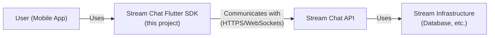
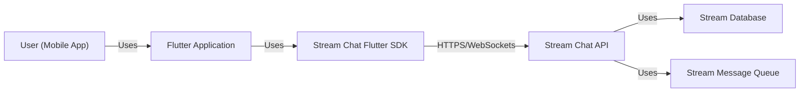
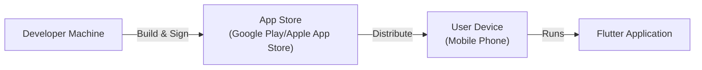
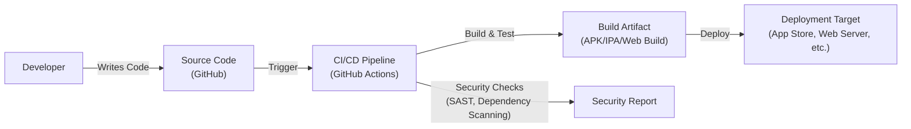

Okay, let's create a design document for the `stream-chat-flutter` project.

# BUSINESS POSTURE

Business Priorities and Goals:

*   Provide a feature-rich and reliable chat solution for Flutter applications.
*   Offer a readily available SDK to simplify integration with Stream's Chat API.
*   Enable developers to quickly build and deploy chat features in their apps.
*   Maintain a high level of performance and scalability to support a large user base.
*   Provide excellent documentation and support to facilitate developer adoption.
*   Attract and retain users by offering a competitive and comprehensive chat solution.

Most Important Business Risks:

*   Service disruption or unavailability of the Stream Chat API, leading to application failure.
*   Data breaches or unauthorized access to user chat data, causing reputational damage and potential legal issues.
*   Performance bottlenecks or scalability issues, impacting user experience and potentially leading to user churn.
*   Vulnerabilities in the SDK or its dependencies, exposing applications to security risks.
*   Inability to keep up with evolving user expectations and feature demands, leading to loss of competitiveness.
*   Lack of compliance with relevant data privacy regulations (e.g., GDPR, CCPA).

# SECURITY POSTURE

Existing Security Controls:

*   security control: Secure communication with the Stream Chat API via HTTPS. (Implicit in using the Stream API).
*   security control: Authentication using API keys and user tokens. (Described in Stream documentation and SDK usage).
*   security control: Authorization mechanisms provided by the Stream Chat API to control access to channels and messages. (Described in Stream documentation).
*   security control: Data encryption at rest and in transit (provided by Stream infrastructure, as described in their documentation).
*   security control: Regular security audits and penetration testing (presumably performed by Stream on their infrastructure).
*   security control: Dependency management to track and update third-party libraries. (Visible in the project's `pubspec.yaml` and `pubspec.lock` files).

Accepted Risks:

*   accepted risk: Reliance on the security of the Stream Chat API and infrastructure. The Flutter SDK acts as a client, and its security is heavily dependent on the backend service.
*   accepted risk: Potential vulnerabilities in third-party Flutter/Dart packages. While dependency management is in place, zero-day vulnerabilities are always a possibility.
*   accepted risk: Client-side attacks, such as reverse engineering or tampering with the application code. While obfuscation and other techniques can mitigate this, complete prevention is difficult on a mobile platform.

Recommended Security Controls:

*   security control: Implement certificate pinning to further secure HTTPS connections and prevent man-in-the-middle attacks.
*   security control: Integrate with a secrets management solution to securely store API keys and other sensitive configuration data, rather than hardcoding them in the application.
*   security control: Conduct regular static code analysis (SAST) and dynamic application security testing (DAST) on the SDK itself to identify potential vulnerabilities.
*   security control: Implement robust input validation and sanitization on all user-provided data within the SDK to prevent injection attacks.
*   security control: Provide guidance and best practices to developers on securely handling user data and implementing secure coding practices within their Flutter applications.

Security Requirements:

*   Authentication:
    *   The SDK must securely handle user authentication using Stream's authentication mechanisms (API keys, user tokens).
    *   Support for secure storage of authentication tokens on the device.
    *   Implement secure session management, including token refresh and expiration.

*   Authorization:
    *   The SDK must correctly enforce authorization rules defined by the Stream Chat API.
    *   Provide clear and easy-to-use APIs for developers to manage user permissions and roles.

*   Input Validation:
    *   All data received from the Stream Chat API and user input within the SDK must be validated and sanitized to prevent injection attacks.
    *   Implement appropriate data validation based on the expected data types and formats.

*   Cryptography:
    *   Utilize secure cryptographic libraries for any encryption/decryption operations performed within the SDK.
    *   Ensure that all communication with the Stream Chat API is performed over HTTPS.
    *   If storing sensitive data locally, use platform-provided secure storage mechanisms.

# DESIGN

## C4 CONTEXT

Element Descriptions:

*   Element:
    *   Name: User (Mobile App)
    *   Type: Person
    *   Description: A user interacting with a Flutter application that utilizes the Stream Chat Flutter SDK.
    *   Responsibilities: Initiates chat sessions, sends and receives messages, manages their profile, etc.
    *   Security controls: Relies on the security controls implemented in the application and the SDK.

*   Element:
    *   Name: Stream Chat Flutter SDK (this project)
    *   Type: Software System
    *   Description: The Flutter SDK providing an interface to interact with the Stream Chat API.
    *   Responsibilities: Provides APIs for connecting to Stream, managing channels, sending/receiving messages, handling user authentication, etc.
    *   Security controls: HTTPS communication, authentication/authorization using Stream API, input validation (recommended), dependency management.

*   Element:
    *   Name: Stream Chat API
    *   Type: Software System
    *   Description: The backend API provided by Stream for managing chat functionality.
    *   Responsibilities: Handles message storage, user management, channel management, real-time communication, etc.
    *   Security controls: HTTPS, authentication/authorization, data encryption at rest and in transit, access controls, etc. (managed by Stream).

*   Element:
    *   Name: Stream Infrastructure (Database, etc.)
    *   Type: Software System
    *   Description: The underlying infrastructure supporting the Stream Chat API.
    *   Responsibilities: Data storage, message queuing, user data management, etc.
    *   Security controls: Network security, data encryption, access controls, regular security audits, etc. (managed by Stream).

## C4 CONTAINER

Element Descriptions:

*   Element:
    *   Name: User (Mobile App)
    *   Type: Person
    *   Description: A user interacting with the Flutter application.
    *   Responsibilities: Interacts with the UI, triggers actions that use the chat functionality.
    *   Security controls: Relies on the security of the device and the application.

*   Element:
    *   Name: Flutter Application
    *   Type: Mobile App
    *   Description: The Flutter application built by the developer, integrating the Stream Chat Flutter SDK.
    *   Responsibilities: Provides the user interface, handles user input, integrates with the SDK.
    *   Security controls: Depends on developer implementation; should follow secure coding practices.

*   Element:
    *   Name: Stream Chat Flutter SDK
    *   Type: Library
    *   Description: The Flutter SDK providing an interface to the Stream Chat API.
    *   Responsibilities: Handles communication with the Stream API, manages data models, provides convenient APIs.
    *   Security controls: HTTPS communication, authentication/authorization using Stream API, input validation (recommended).

*   Element:
    *   Name: Stream Chat API
    *   Type: API
    *   Description: The backend API provided by Stream.
    *   Responsibilities: Handles chat logic, user management, message storage, real-time communication.
    *   Security controls: HTTPS, authentication/authorization, data encryption, access controls (managed by Stream).

*   Element:
    *   Name: Stream Database
    *   Type: Database
    *   Description: The database used by Stream to store chat data.
    *   Responsibilities: Persistently stores user data, messages, channel information, etc.
    *   Security controls: Data encryption at rest, access controls, regular backups (managed by Stream).

*   Element:
    *   Name: Stream Message Queue
    *   Type: Message Queue
    *   Description: A message queue used by Stream for real-time communication.
    *   Responsibilities: Handles the delivery of messages between users in real-time.
    *   Security controls: Secure communication protocols, access controls (managed by Stream).

## DEPLOYMENT

Possible Deployment Solutions:

1.  **Firebase Hosting + Cloud Functions:**  The Flutter application could be built for web and deployed to Firebase Hosting.  Cloud Functions could be used for any server-side logic required (though much of the chat functionality is handled by the Stream API).
2.  **AWS Amplify:** Similar to Firebase, AWS Amplify provides hosting and backend services suitable for Flutter web applications.
3.  **Traditional Web Server (Nginx/Apache):** The built Flutter web application can be deployed to a traditional web server.
4.  **Mobile App Stores (Google Play Store, Apple App Store):** For mobile deployments, the application is packaged and submitted to the respective app stores.

Chosen Solution (Mobile App Stores):

Element Descriptions:

*   Element:
    *   Name: Developer Machine
    *   Type: Workstation
    *   Description: The developer's computer used to build and sign the application.
    *   Responsibilities: Compiles the code, packages the application, signs it with a developer certificate.
    *   Security controls: Secure development environment, secure storage of signing keys.

*   Element:
    *   Name: App Store (Google Play/Apple App Store)
    *   Type: Platform
    *   Description: The platform for distributing the application to users.
    *   Responsibilities: Hosts the application, manages updates, handles user downloads.
    *   Security controls: Code signing verification, malware scanning, platform security measures.

*   Element:
    *   Name: User Device (Mobile Phone)
    *   Type: Mobile Device
    *   Description: The user's mobile phone where the application is installed.
    *   Responsibilities: Runs the application, interacts with the user.
    *   Security controls: Operating system security, application sandboxing, user permissions.

*   Element:
    *   Name: Flutter Application
    *   Type: Mobile App
    *   Description: The running instance of the Flutter application on the user's device.
    *   Responsibilities: Provides the user interface, interacts with the Stream Chat SDK.
    *   Security controls: Depends on developer implementation and the security of the SDK.

## BUILD

Build Process Description:

1.  **Code Development:** Developers write code and push changes to the GitHub repository.
2.  **Continuous Integration (CI):**  GitHub Actions (or a similar CI/CD system) is triggered by code pushes.
3.  **Build and Test:** The CI pipeline builds the Flutter application for the target platforms (Android, iOS, Web).  Automated tests (unit tests, integration tests) are executed.
4.  **Security Checks:**
    *   **SAST (Static Application Security Testing):**  A SAST tool (e.g., a Dart analyzer with security rules, or a dedicated SAST solution) analyzes the source code for potential vulnerabilities.
    *   **Dependency Scanning:**  The CI pipeline scans the project's dependencies (`pubspec.yaml`, `pubspec.lock`) for known vulnerabilities using a tool like `dependabot` or a dedicated dependency scanning service.
5.  **Security Report:** The results of the security checks are compiled into a report.  The build may be failed if critical vulnerabilities are found.
6.  **Build Artifact:** If the build and tests are successful, and the security checks pass, a build artifact (APK for Android, IPA for iOS, or a web build) is created.
7.  **Deployment:** The build artifact is deployed to the appropriate target environment (e.g., uploaded to the app stores, deployed to a web server).

Security Controls in Build Process:

*   security control: **Automated Build:**  The build process is automated using a CI/CD pipeline, ensuring consistency and reducing the risk of manual errors.
*   security control: **Version Control:**  All code changes are tracked in a version control system (GitHub), providing an audit trail and allowing for rollbacks.
*   security control: **SAST:** Static code analysis helps identify vulnerabilities early in the development lifecycle.
*   security control: **Dependency Scanning:**  Regularly scanning dependencies helps mitigate the risk of using libraries with known vulnerabilities.
*   security control: **Code Signing:**  Build artifacts are signed with a developer certificate, ensuring the integrity and authenticity of the application.
*   security control: **Least Privilege:** The CI/CD pipeline should be configured with the minimum necessary permissions to perform its tasks.

# RISK ASSESSMENT

Critical Business Processes to Protect:

*   **Real-time communication:** Ensuring users can send and receive messages reliably and without interruption.
*   **User data management:** Protecting user accounts, profiles, and chat history.
*   **Application availability:** Maintaining the availability of the Flutter application and the Stream Chat service.

Data to Protect and Sensitivity:

*   **Usernames and Identifiers:**  Potentially Personally Identifiable Information (PII). Sensitivity: Medium.
*   **Chat Messages:**  Can contain sensitive personal or business information. Sensitivity: High.
*   **User Profile Data:**  May include PII such as email addresses, phone numbers, etc. Sensitivity: Medium to High.
*   **Authentication Tokens:**  Used to access the Stream Chat API. Sensitivity: High.
*   **API Keys:**  Used to authenticate the application with the Stream Chat API. Sensitivity: High.
*   **Channel Metadata:** Information about chat channels (names, members, etc.). Sensitivity: Medium.

# QUESTIONS & ASSUMPTIONS

Questions:

*   What specific security certifications or compliance standards does Stream adhere to (e.g., SOC 2, ISO 27001)?
*   What is the process for reporting security vulnerabilities found in the Stream Chat Flutter SDK or the Stream Chat API?
*   What are the specific data retention policies for chat data stored by Stream?
*   Does Stream provide any options for end-to-end encryption of chat messages?
*   Are there any specific recommendations or best practices from Stream for securing Flutter applications that use their chat service?
*   What level of support does Stream provide for handling security incidents related to their service?

Assumptions:

*   BUSINESS POSTURE: The primary business goal is to provide a reliable and feature-rich chat solution, prioritizing user experience and growth.
*   SECURITY POSTURE: Stream handles the majority of the security responsibilities for the backend infrastructure and API. The Flutter SDK's security relies heavily on the security of the Stream API.
*   DESIGN: The Flutter SDK acts primarily as a client to the Stream Chat API, with minimal server-side logic implemented within the SDK itself. The deployment model will primarily be through mobile app stores (Google Play and Apple App Store). The build process will utilize GitHub Actions for CI/CD.