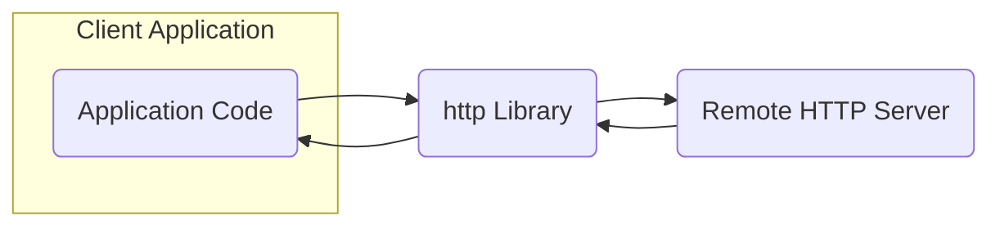
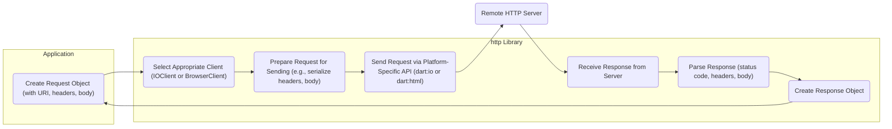

# Project Design Document: Dart HTTP Library

**Version:** 1.1
**Date:** October 26, 2023
**Author:** AI Software Architect

## 1. Introduction

This document provides a detailed design overview of the Dart HTTP library, located at [https://github.com/dart-lang/http](https://github.com/dart-lang/http). This document aims to provide a comprehensive understanding of the library's architecture, components, and data flow, which will serve as the foundation for subsequent threat modeling activities.

## 2. Goals

*   Clearly articulate the architecture and key components of the Dart HTTP library.
*   Describe the data flow within the library for various HTTP operations.
*   Identify potential areas of interest for security analysis and threat modeling.
*   Provide a structured document that can be easily understood by security professionals and developers.

## 3. Overview

The Dart HTTP library provides a high-level API for making HTTP requests in Dart applications. It supports various HTTP methods (`GET`, `POST`, `PUT`, `DELETE`, etc.), handles request and response headers, bodies, and provides different client implementations for various platforms (e.g., `dart:io` for native applications and `dart:html` for web browsers).

The core functionality revolves around the `Client` interface, which defines the contract for sending HTTP requests. Concrete implementations of this interface handle the platform-specific details of network communication.

**Key Entities:**

*   Application Code: The Dart code that utilizes the `http` library to make HTTP requests.
*   http Library: The `dart-lang/http` library itself, providing the API and implementation.
*   Remote HTTP Server: The external server that the application is communicating with.

## 4. Detailed Design

The `http` library can be broken down into several key components:

*   **Client Interface (`Client`):**
    *   Defines the abstract methods for sending HTTP requests (`send`).
    *   Provides methods for common HTTP operations (e.g., `get`, `post`, `put`, `delete`).
    *   Manages resources and connections.

*   **Base Client (`BaseClient`):**
    *   Provides a skeletal implementation of the `Client` interface.
    *   Handles common tasks like setting up requests and processing responses.
    *   Abstracts away some of the lower-level details.

*   **IO Client (`IOClient`):**
    *   Implementation of `Client` for native Dart applications using `dart:io`.
    *   Utilizes `dart:io`'s `HttpClient` for network communication.
    *   Handles socket connections, TLS/SSL negotiation, and low-level HTTP protocol details.

*   **Browser Client (`BrowserClient`):**
    *   Implementation of `Client` for web browser environments using `dart:html`.
    *   Utilizes the browser's `XMLHttpRequest` or `Fetch API` for making HTTP requests.
    *   Operates within the browser's security sandbox and follows its CORS policies.

*   **Request Object (`Request`):**
    *   Represents an outgoing HTTP request.
    *   Contains information such as:
        *   HTTP method (`GET`, `POST`, etc.)
        *   URI (Uniform Resource Identifier)
        *   Headers
        *   Body (as a stream of bytes)
        *   Content type

*   **Response Object (`Response`):**
    *   Represents an incoming HTTP response.
    *   Contains information such as:
        *   Status code (e.g., `200 OK`, `404 Not Found`)
        *   Headers
        *   Body (as a stream of bytes)
        *   Reason phrase

*   **Multipart Request (`MultipartRequest`):**
    *   Specialized request object for sending data with multiple parts, often used for file uploads.
    *   Handles the creation of the `multipart/form-data` request body.

*   **Streamed Request (`StreamedRequest`):**
    *   Allows sending requests with bodies that are streams of data.
    *   Useful for large uploads or when the body content is generated dynamically.

*   **Headers (`Headers` class):**
    *   Represents HTTP headers as a key-value map.
    *   Provides methods for accessing and manipulating header values.

*   **URL Utilities (`Uri` class from `dart:core`):**
    *   Used for parsing and manipulating URLs.
    *   Crucial for ensuring the validity and security of target endpoints.

## 5. Data Flow

The typical data flow for making an HTTP request using the `http` library involves the following steps:

**Detailed Data Flow Steps:**

*   **Request Creation:** The application code creates a `Request` object, specifying the target URI, HTTP method, headers, and body.
    *   Data involved: URI string, header key-value pairs, request body content (string or stream).
*   **Client Selection:** The `http` library determines the appropriate `Client` implementation to use based on the execution environment (native or browser).
    *   Decision based on platform detection.
*   **Request Preparation:** The selected `Client` prepares the request for sending. This may involve:
    *   Serializing headers into the correct format.
    *   Encoding the request body according to the `Content-Type` header.
    *   For `MultipartRequest`, constructing the multipart body.
    *   Data involved: Header data, body data.
*   **Request Transmission:** The `Client` uses the platform-specific API to send the request to the remote server.
    *   **IOClient:** Utilizes `dart:io`'s `HttpClient`, which handles socket creation, connection management, and TLS/SSL negotiation.
        *   Data transmitted: Raw HTTP request data over TCP/IP.
    *   **BrowserClient:** Utilizes `dart:html`'s `XMLHttpRequest` or `Fetch API`, which relies on the browser's networking stack.
        *   Data transmitted: HTTP request data through the browser's networking mechanisms.
*   **Response Reception:** The `Client` receives the response from the remote server.
    *   **IOClient:** Receives raw HTTP response data over the socket.
    *   **BrowserClient:** Receives the response through the browser's API.
*   **Response Parsing:** The `Client` parses the raw response data to extract the status code, headers, and body.
    *   Data involved: Raw HTTP response data.
*   **Response Object Creation:** A `Response` object is created, encapsulating the parsed response information.
    *   Data involved: Status code, header key-value pairs, response body content (stream).
*   **Response Delivery:** The `Response` object is returned to the application code.

## 6. Security Considerations (Initial Thoughts for Threat Modeling)

Based on the design, potential areas of interest for threat modeling include:

*   **URI Handling:**
    *   Vulnerabilities related to parsing and validating URIs (e.g., injection attacks).
    *   Handling of special characters and encoding in URIs.
*   **Header Manipulation:**
    *   Potential for header injection attacks if header values are not properly sanitized.
    *   Security implications of setting specific headers (e.g., `Authorization`, `Cookie`).
*   **Body Handling:**
    *   Vulnerabilities related to the size and content of request and response bodies.
    *   Deserialization vulnerabilities if the body is parsed into objects.
*   **TLS/SSL Implementation (IOClient):**
    *   Security of the underlying `dart:io`'s `HttpClient` implementation for TLS/SSL.
    *   Configuration options for certificate verification and pinning.
*   **CORS Policy Enforcement (BrowserClient):**
    *   Reliance on the browser's CORS implementation for security.
    *   Potential for bypass or misconfiguration of CORS.
*   **Cookie Management:**
    *   Secure handling of cookies, including `HttpOnly` and `Secure` flags.
    *   Potential for cookie theft or manipulation.
*   **Error Handling:**
    *   Information leakage through error messages.
    *   Robustness of error handling to prevent unexpected behavior.
*   **Platform-Specific Vulnerabilities:**
    *   Security issues specific to the underlying platform's networking stack (e.g., vulnerabilities in `dart:io` or browser APIs).
*   **Multipart Request Handling:**
    *   Potential vulnerabilities related to file uploads (e.g., path traversal, arbitrary file write).
    *   Handling of different content types within multipart requests.
*   **Dependency Security:**
    *   Security vulnerabilities in any underlying libraries or dependencies used by `dart:io` or the browser.

## 7. Dependencies

The `http` library depends on the following core Dart libraries:

*   `dart:core`: For fundamental data types and utilities.
*   `dart:async`: For asynchronous programming.
*   `dart:convert`: For encoding and decoding data (e.g., JSON, UTF-8).
*   `dart:io` (for `IOClient`): Provides platform-specific I/O functionality, including networking.
*   `dart:html` (for `BrowserClient`): Provides access to browser APIs.

## 8. Deployment

The `http` library is typically deployed as a package that is included in Dart applications. The specific deployment context depends on the type of application:

*   Command-line applications: The `IOClient` is used, relying on the operating system's networking capabilities.
*   Web applications: The `BrowserClient` is used, operating within the browser's security sandbox.
*   Mobile applications (using Flutter): Both `IOClient` (for native code) and `BrowserClient` (for web views) might be used depending on the specific use case.

## 9. Future Considerations

Potential future enhancements or changes that could impact the design and security include:

*   Support for HTTP/2 or HTTP/3: This would involve changes to the underlying client implementations.
*   Improved Proxy Support: More robust and configurable proxy settings.
*   Advanced Authentication Mechanisms: Built-in support for more complex authentication schemes.
*   More Granular Error Handling: Providing more specific error information to the application.

This document provides a comprehensive overview of the Dart HTTP library's design. This information will be crucial for conducting a thorough threat model to identify and mitigate potential security vulnerabilities.
