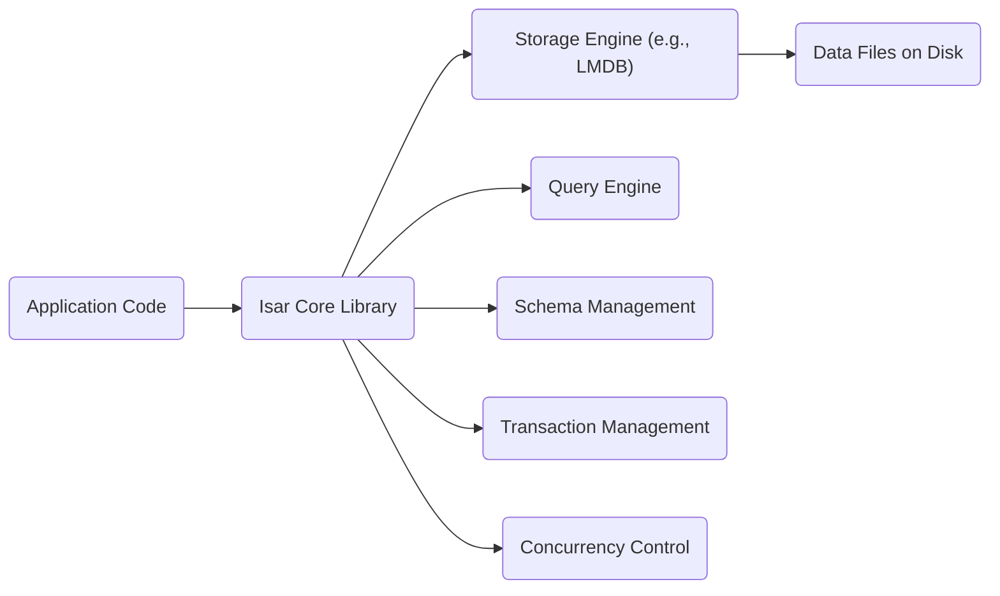
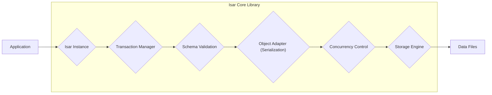
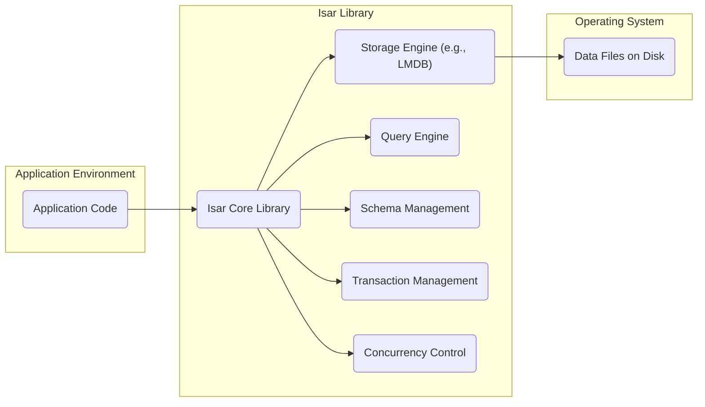
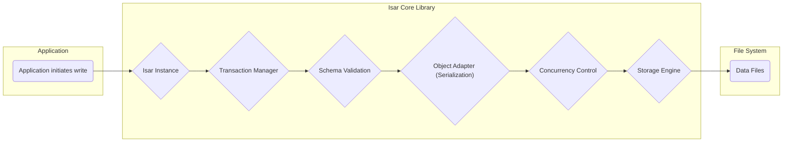
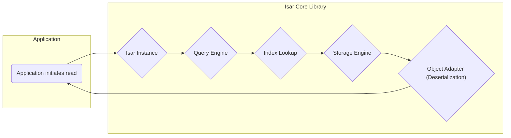

# Project Design Document: Isar Database

**Version:** 1.1
**Date:** October 26, 2023
**Author:** AI Software Architect

## 1. Introduction

This document provides an enhanced design overview of the Isar database project (as represented by the GitHub repository: https://github.com/isar/isar). This document aims to capture the key architectural components, data flow, and technologies involved in Isar with greater detail and clarity. It will serve as a robust foundation for subsequent threat modeling activities.

Isar is a fast, lightweight, and cross-platform NoSQL database specifically designed for Flutter and Dart applications. Its core focus is on providing a seamless developer experience and high performance for local data persistence, offering features like strong typing, reactive queries, and efficient storage management.

## 2. Goals and Objectives

The primary goals and objectives of the Isar project are:

*   **Performance:** Deliver a highly performant and efficient local database solution optimized for Flutter and Dart applications, minimizing latency for read and write operations.
*   **Developer Experience:** Offer a developer-friendly and intuitive API with strong typing, code generation capabilities, and clear documentation to simplify database interactions.
*   **Cross-Platform Compatibility:** Ensure seamless operation and consistent behavior across various platforms, including iOS, Android, and Desktop operating systems.
*   **Reactive Data Management:** Enable reactive data streams and change notifications to facilitate the development of dynamic and responsive user interfaces.
*   **Lightweight Footprint:** Minimize the resource overhead and complexity associated with traditional database solutions, making it suitable for mobile and embedded environments.
*   **Data Integrity and Reliability:** Provide mechanisms to ensure the integrity and reliability of stored data, including transaction support and potential data recovery features.

## 3. High-Level Architecture

Isar operates as an embedded database directly within the application's process. It does not function as a separate server. The core components interact directly within the application's runtime environment, leveraging platform-specific capabilities where necessary.



*   **Application Code:** The Flutter or Dart application that integrates and utilizes the Isar library to perform database operations.
*   **Isar Core Library:** The central library providing the public API for interacting with the database, including defining schemas, executing queries, and managing transactions.
*   **Storage Engine (e.g., LMDB):** The underlying persistent storage mechanism responsible for efficiently storing and retrieving data on disk. This is likely a high-performance key-value store.
*   **Query Engine:**  The component responsible for parsing, optimizing, and executing queries defined by the application, retrieving the requested data based on specified criteria.
*   **Schema Management:** Handles the definition, validation, and management of data structures (collections, fields, indexes, relationships) within the database. This often involves code generation based on schema annotations.
*   **Transaction Management:** Ensures the atomicity, consistency, isolation, and durability (ACID) properties of database operations, guaranteeing reliable data modifications.
*   **Concurrency Control:** Manages concurrent access to the database from different parts of the application or isolates, preventing data corruption and ensuring data consistency.
*   **Data Files on Disk:** The physical files on the device's storage where the database data is persistently stored by the storage engine.

## 4. Detailed Design

### 4.1. Core Components (Elaborated)

*   **Isar Instance:** Represents a single, open connection to a specific database. Applications can manage multiple independent Isar instances. Each instance provides access to collections and facilitates database operations.
*   **Collection:**  A fundamental organizational unit within Isar, analogous to tables in relational databases. Each collection holds objects of a specific Dart class, defined by a schema.
*   **Schema Definition:**  The process of defining the structure of data within a collection. This typically involves using Dart annotations on model classes to specify field names, data types, indexes, and relationships. Code generation tools then process these definitions.
*   **Query Builder:** A fluent and type-safe API provided by Isar for constructing database queries. It allows developers to specify filtering conditions, sorting criteria, and pagination options in a readable manner.
*   **Index:**  Specialized data structures built on specific fields within a collection to significantly accelerate data retrieval for queries that filter or sort by those fields. Isar supports various index types.
*   **Object Adapter:**  Responsible for the efficient serialization and deserialization of Dart objects to and from the byte-level representation used by the underlying storage engine. This component handles the mapping between Dart data types and the storage format.
*   **Isolate Support:**  Mechanisms and safeguards within Isar to allow safe and concurrent access to the database from different isolates in Dart. This is crucial for maintaining responsiveness in applications performing database operations on background threads.
*   **Encryption (Optional):**  Features that allow developers to encrypt the database files at rest, protecting sensitive data stored on the device. This typically involves using platform-specific encryption capabilities.

### 4.2. Data Flow - Write Operation (Detailed)



1. **Application:** The application code initiates a write operation, such as adding a new object (`put()`) or inserting multiple objects.
2. **Isar Instance:** The write request is received by the appropriate Isar instance associated with the target database.
3. **Transaction Manager:** The transaction manager begins a new transaction (or uses an existing one) to ensure atomicity. All operations within the transaction will either succeed or fail together.
4. **Schema Validation:** The data being written is validated against the defined schema for the target collection. This includes checking data types and constraints.
5. **Object Adapter (Serialization):** The Dart object is serialized into a byte array or a similar format suitable for storage by the underlying storage engine.
6. **Concurrency Control:** The concurrency control mechanism ensures that the write operation does not conflict with other concurrent operations, potentially using locking or other techniques.
7. **Storage Engine:** The serialized data is passed to the storage engine, which handles the physical writing of the data to the data files on disk.
8. **Data Files:** The storage engine persists the data to the physical data files. The transaction manager ensures that these changes are durable.

### 4.3. Data Flow - Read Operation (Detailed)

```mermaid
graph LR
    A["Application"] --> B{"Isar Instance"};
    subgraph "Isar Core Library"
        B --> C{"Query Engine"};
        C --> D{"Index Lookup"};
        D --> E{"Storage Engine"};
        E --> F{"Object Adapter (Deserialization)"};
    end
    A <-- F
```

1. **Application:** The application initiates a read operation by executing a query using the Query Builder or a related method (e.g., `where().findFirst()`, `collection.get()`).
2. **Isar Instance:** The query request is received by the Isar instance.
3. **Query Engine:** The query engine parses the query, optimizes the execution plan, and determines the most efficient way to retrieve the requested data.
4. **Index Lookup:** If the query involves filtering or sorting on indexed fields, the query engine utilizes the appropriate index to quickly locate the relevant data records within the storage engine.
5. **Storage Engine:** The storage engine retrieves the raw data (in its serialized format) from the data files based on the information provided by the query engine (potentially using index information).
6. **Object Adapter (Deserialization):** The raw data retrieved from the storage engine is deserialized back into Dart objects, reconstructing the original data structures.
7. **Application:** The deserialized Dart objects are returned to the application code.

## 5. Key Technologies

*   **Dart:** The primary programming language for the Isar library's API and the applications that consume it.
*   **Flutter:** The declarative UI framework for building cross-platform applications, for which Isar is a popular local database solution.
*   **C/C++:** Likely used for the underlying storage engine implementation and performance-critical sections of the Isar core library to achieve cross-platform compatibility and efficiency.
*   **LMDB (Likely):** A high-performance, embedded, transactional key-value store that is a strong candidate for the underlying storage engine due to its speed, reliability, and suitability for embedded environments.
*   **Code Generation (build_runner):**  A crucial part of Isar's development workflow, used to generate boilerplate code for schema definitions, object adapters, and potentially other components, enhancing developer productivity and type safety.
*   **Isolates:** Dart's concurrency model, which Isar must handle correctly to allow safe and efficient database access from multiple concurrent execution contexts.

## 6. Deployment Model

Isar follows an embedded database deployment model:

*   **Direct Integration:** The Isar library is directly integrated into the application's codebase as a dependency.
*   **In-Process Execution:** Isar runs within the same process as the application, eliminating the overhead of inter-process communication.
*   **Local Data Storage:** Data is stored locally on the device's file system where the application is installed.
*   **Platform-Specific Bindings:** While the core API is consistent, the underlying storage engine might utilize platform-specific implementations or bindings to interact with the operating system and hardware efficiently.
*   **No Separate Server:** There is no separate database server to deploy or manage. The database lifecycle is tied to the application's lifecycle.

## 7. Security Considerations (Enhanced)

This section outlines more specific security considerations relevant to Isar, which will be further analyzed during threat modeling.

*   **Data at Rest Encryption:**
    *   **Threat:** Unauthorized access to sensitive data stored on the device if the device is lost or compromised.
    *   **Considerations:** Isar provides optional encryption. The strength of the encryption depends on the underlying platform's capabilities. Key management is a critical aspect.
*   **Access Control:**
    *   **Threat:** Unauthorized applications or processes accessing the Isar database files.
    *   **Considerations:** Access control is primarily managed by the operating system's file system permissions. Developers need to be aware of default permissions and potential vulnerabilities if permissions are misconfigured.
*   **Data Integrity:**
    *   **Threat:** Data corruption due to software bugs, hardware failures, or malicious activity.
    *   **Considerations:** Isar's transactional nature helps ensure data consistency. Checksums or other integrity checks at the storage engine level could be considered.
*   **Input Validation and Sanitization:**
    *   **Threat:** Malicious or unexpected data being written to the database, potentially leading to application errors or security vulnerabilities if the data is later used in a vulnerable way.
    *   **Considerations:** While Isar provides strong typing, application-level validation is crucial to enforce business rules and prevent unexpected data.
*   **Code Injection (Less Likely but Possible):**
    *   **Threat:** Although less likely in a strongly-typed environment like Dart, vulnerabilities could arise if dynamic query construction is not handled carefully.
    *   **Considerations:**  Avoid constructing queries from untrusted user input. Utilize Isar's parameterized query features.
*   **Secure Defaults:**
    *   **Threat:** Insecure default configurations that could expose vulnerabilities.
    *   **Considerations:** Ensure that default settings for encryption (if optional) and other security-related features are secure.
*   **Dependency Management:**
    *   **Threat:** Vulnerabilities in Isar's dependencies (e.g., the underlying storage engine).
    *   **Considerations:** Regularly update Isar and its dependencies to patch known security vulnerabilities. Use dependency scanning tools.
*   **Side-Channel Attacks:**
    *   **Threat:** Information leakage through observable side effects of database operations, such as timing differences.
    *   **Considerations:** While generally less of a concern for embedded databases, consider potential risks if highly sensitive data is involved.
*   **Backup and Recovery:**
    *   **Threat:** Data loss due to device failure or accidental deletion.
    *   **Considerations:**  While not a direct security threat, the lack of proper backup and recovery mechanisms can have significant consequences. Developers should implement appropriate backup strategies.

## 8. Diagrams

### 8.1. High-Level Architecture Diagram (Revisited)



### 8.2. Data Flow Diagram - Write Operation (Revisited)



### 8.3. Data Flow Diagram - Read Operation (Revisited)



## 9. Future Considerations

*   **Replication and Synchronization:**  Exploring mechanisms for replicating and synchronizing Isar databases across multiple devices or instances, potentially involving conflict resolution strategies.
*   **Cloud Integration:**  Developing integrations with cloud services for features like database backup, data sharing, or remote data access.
*   **Advanced Querying Features:**  Expanding the query language and capabilities with more complex operators, full-text search, and geospatial querying.
*   **Improved Observability and Monitoring:**  Adding features for monitoring database performance and health, potentially through logging or metrics.

This enhanced design document provides a more detailed and comprehensive understanding of the Isar database project's architecture and functionality. It serves as a valuable resource for conducting a thorough threat model and identifying potential security risks.