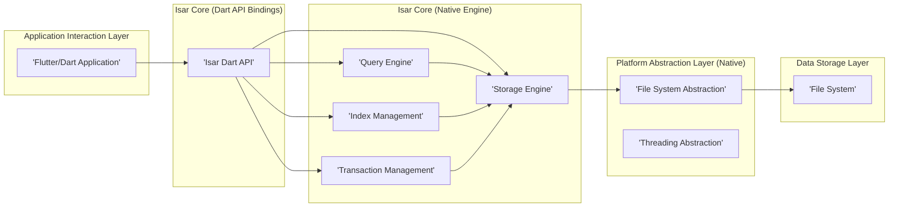
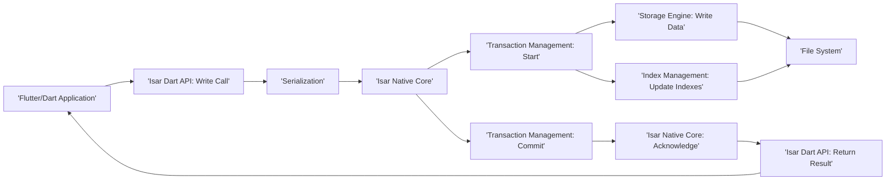
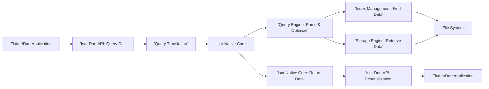

# Project Design Document: Isar Database

**Version:** 1.1
**Date:** October 26, 2023
**Author:** AI Software Architect

## 1. Introduction

This document provides an enhanced design overview of the Isar database project. Isar is a high-performance, lightweight, and cross-platform NoSQL embedded database specifically designed for Flutter and Dart applications. This document aims to deliver a clear and comprehensive understanding of Isar's architecture, its constituent components, and the flow of data within the system. This detailed design will serve as a critical foundation for subsequent threat modeling exercises.

## 2. Goals and Objectives

The core goals driving the Isar project are:

*   **Exceptional Performance:** To deliver rapid read and write operations suitable for demanding embedded database tasks.
*   **Developer Ergonomics:** To offer an intuitive and developer-friendly API that seamlessly integrates with Flutter and Dart development workflows.
*   **Broad Platform Support:** To ensure compatibility across a wide range of platforms, including mobile (iOS, Android), desktop (Windows, macOS, Linux), and web environments.
*   **Minimal Resource Footprint:** To minimize the consumption of system resources, including memory and storage space.
*   **Powerful Querying Capabilities:** To provide developers with efficient mechanisms for retrieving data through a variety of query options.
*   **Robust Schema Management:** To offer a structured approach for defining and evolving data models within the database.
*   **Reliable Data Persistence:** To guarantee the dependable and durable storage of application data.

## 3. High-Level Architecture

Isar's architecture is structured into distinct layers, each responsible for specific functionalities:

*   **Application Interaction Layer:** This is where the Flutter or Dart application directly interacts with the Isar database through its provided API.
*   **Isar Core (Dart API Bindings):** This layer exposes the developer-facing Dart API. It handles the crucial tasks of serializing and deserializing data and managing communication with the lower-level native core.
*   **Isar Core (Native Engine):** This layer houses the core database engine, primarily implemented in C++. It is responsible for core database operations, including data storage management, index handling, query execution, and transaction control.
*   **Platform Abstraction Layer (Native):** This layer provides an abstraction over platform-specific functionalities, such as file system interactions and thread management, ensuring cross-platform compatibility.
*   **Data Storage Layer:** This layer directly interfaces with the underlying file system to persist database data.

## 4. Component Details

This section provides a more granular description of the key components within the Isar architecture:

*   **Isar Dart API:**
    *   Offers a strongly-typed and asynchronous API for database interactions within Dart and Flutter applications.
    *   Manages the serialization of Dart objects into a binary format suitable for storage and deserialization back into Dart objects upon retrieval.
    *   Provides methods for fundamental database operations: opening and closing databases, creating and managing collections (similar to tables), and performing CRUD (Create, Read, Update, Delete) operations on data.
    *   Supports advanced features like lazy loading of related data, the embedding of complex objects within documents, and the establishment of relationships between data through links.

*   **Query Engine (Native):**
    *   Responsible for the interpretation and execution of database queries.
    *   Optimizes query execution paths by leveraging available indexes to speed up data retrieval.
    *   Supports a rich set of query operators, including equality checks, comparisons (greater than, less than), logical operators (AND, OR, NOT), and pattern matching for strings.
    *   Handles the filtering, sorting, and limiting of query results to return the precise data requested.

*   **Storage Engine (Native):**
    *   Manages the low-level mechanics of data storage and retrieval from persistent storage.
    *   Organizes and manages the underlying data files on disk.
    *   Implements the logic for writing new data blocks to storage and reading existing data blocks.
    *   Likely employs a data structure optimized for rapid read and write operations, potentially a variant of a B-tree or a similar efficient data structure.

*   **Index Management (Native):**
    *   The component responsible for creating, maintaining, and utilizing indexes to accelerate data retrieval operations during queries.
    *   Supports various index types tailored to different data types and common query patterns, allowing for efficient lookups.
    *   Automatically updates indexes whenever data is modified (inserted, updated, or deleted) to maintain their accuracy.

*   **Transaction Management (Native):**
    *   Ensures the Atomicity, Consistency, Isolation, and Durability (ACID) properties of database transactions, guaranteeing data integrity.
    *   Manages concurrent access to the database by multiple operations, preventing data corruption and ensuring data consistency.
    *   Provides mechanisms for committing a series of changes to the database as a single unit or rolling back changes in case of errors.

*   **File System Abstraction (Native):**
    *   Provides a platform-agnostic interface for interacting with the underlying file system, abstracting away operating system-specific details.
    *   Handles fundamental file system operations such as opening, closing, reading, and writing files.
    *   Ensures that Isar can operate consistently across different operating systems by handling variations in file paths and access methods.

*   **Threading Abstraction (Native):**
    *   Manages the creation and coordination of threads within the native core of Isar, enabling concurrent operations.
    *   Provides synchronization primitives to manage access to shared resources and prevent race conditions.

## 5. Data Flow

The following sections detail the typical flow of data during common database operations:

### 5.1. Data Write Operation (Insert/Update)

1. The application initiates a write operation (e.g., `put()`, `insert()`) on an Isar collection through the Dart API.
2. The Isar Dart API serializes the provided Dart object into a compact binary representation.
3. The serialized data is transmitted to the native Isar core for processing.
4. The Transaction Management component within the native core initiates a new transaction to ensure atomicity.
5. The Storage Engine receives the serialized data and writes it to the appropriate data file on disk.
6. The Index Management component updates all relevant indexes to reflect the newly inserted or modified data.
7. The Transaction Management component commits the transaction, making the data changes persistent and durable.
8. The native core sends an acknowledgment of the successful write operation back to the Isar Dart API.
9. The Isar Dart API returns a success indication to the originating application.

### 5.2. Data Read Operation (Query)

1. The application initiates a data retrieval operation by calling a query method (e.g., `where()..findFirst()`) on an Isar collection via the Dart API.
2. The Isar Dart API translates the high-level query into a lower-level representation that the native core can understand.
3. The translated query is passed to the native Isar core for execution.
4. The Query Engine parses the query and optimizes its execution plan to ensure efficient data retrieval.
5. The Query Engine interacts with the Index Management component to identify the most efficient way to locate the requested data based on the query criteria.
6. The Storage Engine retrieves the necessary data blocks from the data files on disk.
7. The retrieved data is passed back to the Isar Dart API.
8. The Isar Dart API deserializes the binary data back into usable Dart objects.
9. The Isar Dart API returns the query results to the requesting application.

## 6. Key Technologies

*   **Primary Programming Languages:** Dart, C++
*   **On-Disk Storage Format:** Likely a custom, highly optimized binary format designed for efficient storage and retrieval.
*   **Indexing Mechanisms:** Potentially utilizes B-tree or similar balanced tree data structures for efficient indexing.
*   **Concurrency Control Strategy:** Likely employs locking mechanisms or Multi-Version Concurrency Control (MVCC) to manage concurrent access.
*   **Platform Integration Technology:** Leverages platform channels or Foreign Function Interface (FFI) for seamless communication between the Dart and native code components.

## 7. Security Considerations (Initial Assessment)

This section provides an initial assessment of security considerations, which will be further investigated during a dedicated threat modeling process.

*   **Data Encryption at Rest:** The necessity of encrypting the database files when stored on disk to protect sensitive information from unauthorized access should be evaluated.
*   **Access Control Mechanisms:** While primarily an embedded database, scenarios where access control might be relevant (e.g., shared embedded systems) should be considered.
*   **Input Data Validation:** Implementing robust validation of data being written to the database is crucial to prevent data corruption and potential injection attacks.
*   **Secure Default Configurations:** Ensuring secure default settings for database configurations is important to minimize potential vulnerabilities out-of-the-box.
*   **Code Security Practices:** Adhering to secure coding practices in both the Dart and native codebases is essential to prevent software vulnerabilities.
*   **Dependency Management Security:**  Careful and secure management of external dependencies is vital to avoid introducing vulnerabilities from third-party libraries.
*   **Underlying Platform Security:** The security features and potential vulnerabilities of the underlying operating system and hardware platform must be considered.
*   **Data Integrity Measures:** Implementing mechanisms to guarantee data integrity and prevent unauthorized modification of data is crucial.

## 8. Deployment Model

Isar is fundamentally designed as an embedded database solution. This implies:

*   The Isar database library is directly linked and integrated into the application's executable.
*   The database files are typically located within the application's designated data directory on the user's device or system.
*   There is no separate, independent database server process required for Isar to function.

## 9. Future Considerations

*   **Data Replication and Synchronization:** Exploring the feasibility of implementing features for data replication across multiple devices and synchronization of changes.
*   **Cloud Integration Capabilities:** Investigating options for integrating Isar with cloud-based services for functionalities like data backup and cross-device data sharing.
*   **Advanced Querying Functionality:**  Potentially expanding the query language to support more complex query types and operators for greater flexibility.
*   **Enhanced Tooling and Diagnostics:** Developing improved tools for database management tasks, data inspection, and debugging of Isar-related issues.

This revised document provides a more detailed and structured design overview of the Isar database project. This enhanced information will be invaluable for conducting a comprehensive threat model to proactively identify potential security vulnerabilities and develop effective mitigation strategies.
