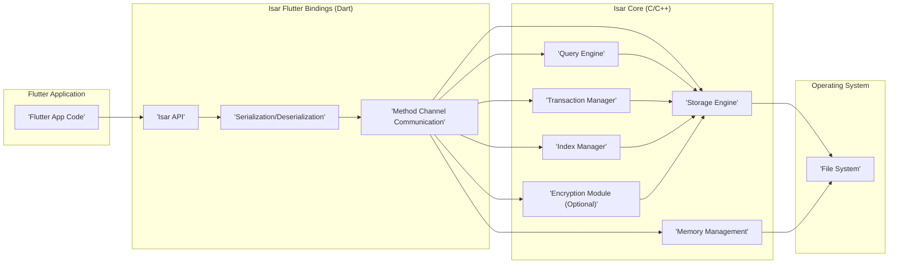

# Project Design Document: Isar Database

**Version:** 1.1
**Date:** October 26, 2023
**Author:** AI Software Architect

## 1. Introduction

This document provides an enhanced and more detailed design overview of the Isar database project, an ultra-fast, easy-to-use, and fully typed NoSQL database for Flutter. This document is specifically tailored to serve as a robust foundation for subsequent threat modeling activities. It meticulously outlines the system's architecture, key components, data flow with finer granularity, and security considerations, aiming to facilitate a comprehensive security analysis.

## 2. Goals and Objectives

*   Provide a comprehensive and granular architectural overview of the Isar database, emphasizing security-relevant aspects.
*   Identify key components and their interactions, detailing potential security vulnerabilities associated with each.
*   Describe the data flow within the system with a focus on data transformations and potential interception points.
*   Highlight specific security considerations and potential threats for thorough threat modeling.
*   Serve as a detailed and up-to-date reference point for future development, security audits, and incident response planning.

## 3. System Overview

Isar is an embedded NoSQL database meticulously designed for Flutter applications, prioritizing performance and developer experience for local data persistence. Key features with security implications include:

*   **Performance:** Optimized for speed and low resource consumption, potentially impacting the feasibility of certain security measures.
*   **Ease of Use:** Simple and intuitive API for Flutter developers, which can sometimes lead to overlooking security best practices.
*   **Fully Typed:** Leverages Dart's type system for data integrity, reducing the risk of certain data corruption vulnerabilities.
*   **ACID Transactions:** Supports atomic, consistent, isolated, and durable transactions, crucial for maintaining data integrity and preventing data loss.
*   **Multi-Isolate Support:** Enables concurrent access from different isolates in Flutter, introducing potential concurrency-related vulnerabilities if not managed carefully.
*   **Encryption:** Offers optional encryption for data at rest, a critical feature for protecting sensitive data. The implementation details are crucial for its effectiveness.
*   **Indexing:** Supports various indexing strategies for efficient querying, but poorly designed indexes could potentially expose data access patterns.
*   **Querying:** Provides a powerful query language for data retrieval, which, if not handled carefully, could be susceptible to injection attacks.

## 4. System Architecture

The Isar database architecture is structured into distinct layers, each with specific responsibilities and security considerations:

*   **Flutter Application Layer:** The application code written in Dart that interacts with the Isar database through the well-defined API. Security here relies on secure coding practices and proper authorization within the application.
*   **Isar Flutter Bindings (Dart):**  Dart code acting as the bridge between the Flutter application and the underlying Isar Core library. This layer handles crucial tasks like serialization, deserialization, and communication via Flutter's method channels. Vulnerabilities here could compromise the integrity of data passed to the core.
*   **Isar Core (C/C++):** The core database engine implemented in C/C++, responsible for the heavy lifting of data storage, indexing, querying, transaction management, and optional encryption. Security vulnerabilities in this layer can have significant impact.
*   **Operating System Layer:** The underlying operating system (e.g., iOS, Android, macOS, Windows, Linux) providing essential services like file system access and memory management. The security posture of the OS directly impacts Isar's security.

## 5. Key Components

*   **Isar API (Dart):** The public interface for Flutter developers. Security considerations include preventing misuse of the API that could lead to data corruption or unauthorized access.
*   **Serialization/Deserialization (Dart):** Converts Dart objects to and from a binary format. Vulnerabilities here could allow for manipulation of data during transit to the Isar Core. Secure and robust serialization techniques are essential.
*   **Method Channel Communication (Dart):**  The communication bridge between Dart and native C/C++. Security here involves ensuring the integrity and confidentiality of data passed through the channels. Potential vulnerabilities include eavesdropping or tampering.
*   **Query Engine (C/C++):** Parses and executes queries. A primary security concern is preventing query injection attacks. Input sanitization and parameterized queries are crucial.
*   **Storage Engine (C/C++):** Manages the physical storage of data. Security considerations include ensuring data integrity, preventing unauthorized access to the storage files, and secure deletion of data.
*   **Transaction Manager (C/C++):** Ensures ACID properties. Security implications involve preventing race conditions and ensuring data consistency even under concurrent access.
*   **Index Manager (C/C++):** Creates and manages indexes. While improving performance, poorly designed indexes could reveal data access patterns or consume excessive resources, leading to denial-of-service.
*   **Encryption Module (C/C++):** (Optional) Provides data at rest encryption. The security of this module depends heavily on the chosen encryption algorithm, key management, and implementation details. Vulnerabilities here could lead to complete data compromise.
*   **Memory Management (C/C++):** Responsible for allocating and deallocating memory. Improper memory management can lead to vulnerabilities like buffer overflows or use-after-free, potentially exposing sensitive data.
*   **File System (Operating System):** The underlying storage mechanism. Security depends on the OS's file permissions and security features. Isar should leverage these features appropriately.

## 6. Data Flow

A more detailed breakdown of data flow, highlighting potential security touchpoints:

### 6.1. Write Operation

1. The Flutter application initiates a write operation via the `Isar API`. **Security Checkpoint:** Application-level authorization and input validation should occur here.
2. The `Isar Flutter Bindings` serialize the Dart object. **Security Checkpoint:** Ensure secure serialization to prevent data manipulation.
3. The serialized data and operation details are transmitted to the `Isar Core` via method channels. **Security Checkpoint:**  While method channels are generally secure, ensure no sensitive data is inadvertently exposed during transmission.
4. The `Transaction Manager` in the `Isar Core` initiates a transaction, potentially acquiring locks. **Security Checkpoint:** Ensure proper locking mechanisms to prevent race conditions and maintain data integrity.
5. The `Storage Engine` prepares to write the serialized data. **Security Checkpoint:** Verify write permissions and available storage space.
6. If encryption is enabled, the `Encryption Module` encrypts the data using the configured encryption key. **Security Checkpoint:** The strength of the encryption algorithm and the security of the key are paramount.
7. The `Storage Engine` writes the (potentially encrypted) data to the appropriate data files on the `File System`. **Security Checkpoint:** Rely on the OS's file system permissions to restrict unauthorized access.
8. The `Index Manager` updates relevant indexes. **Security Checkpoint:** Ensure index updates are performed securely and do not introduce vulnerabilities.
9. The `Transaction Manager` commits the transaction, making the changes durable. **Security Checkpoint:** Ensure transaction logs are handled securely.
10. A confirmation is sent back through the method channel to the Flutter application.

### 6.2. Read Operation

1. The Flutter application requests data via a read or query method on the `Isar API`. **Security Checkpoint:** Application-level authorization should be enforced.
2. The `Isar Flutter Bindings` translate the request into a query command. **Security Checkpoint:** Ensure the translation process does not introduce vulnerabilities.
3. The query command is sent to the `Isar Core` via method channels.
4. The `Query Engine` parses and optimizes the query. **Security Checkpoint:**  Crucially, sanitize inputs to prevent query injection attacks. Use parameterized queries.
5. The `Index Manager` is used to efficiently locate the data.
6. The `Storage Engine` retrieves the (potentially encrypted) data from the `File System`. **Security Checkpoint:** File system permissions are critical here.
7. If encryption is enabled, the `Encryption Module` decrypts the data using the stored encryption key. **Security Checkpoint:** Secure key management is essential.
8. The retrieved data is sent back to the `Isar Flutter Bindings`.
9. The `Isar Flutter Bindings` deserialize the binary data back into Dart objects. **Security Checkpoint:** Ensure secure deserialization to prevent data manipulation.
10. The Dart objects are returned to the Flutter application.

## 7. Security Considerations (Detailed)

This section expands on the initial security considerations, providing more specific examples of potential threats and mitigation strategies.

*   **Data at Rest Encryption:**
    *   **Threats:** Unauthorized access to the device's file system could expose sensitive data if not encrypted. Weak encryption algorithms or poorly managed keys could be compromised.
    *   **Mitigation:** Utilize strong, industry-standard encryption algorithms (e.g., AES-256). Implement secure key generation, storage, and management practices. Consider using platform-specific key storage mechanisms (e.g., Keychain on iOS, Keystore on Android).
*   **Access Control:**
    *   **Threats:** Malicious or compromised parts of the application could access or modify data they are not authorized to.
    *   **Mitigation:** Implement application-level authorization checks before accessing the Isar API. Follow the principle of least privilege.
*   **Input Validation:**
    *   **Threats:**  Maliciously crafted input data could lead to data corruption, unexpected behavior, or even code execution (e.g., through query injection).
    *   **Mitigation:**  Thoroughly validate all data written to the database, both on the Flutter side and within the Isar Core if possible. Use parameterized queries to prevent SQL injection-like attacks.
*   **Memory Management:**
    *   **Threats:** Buffer overflows, use-after-free vulnerabilities in the Isar Core (C/C++) could lead to crashes or allow attackers to execute arbitrary code.
    *   **Mitigation:** Employ secure coding practices in the C/C++ codebase. Utilize memory-safe programming techniques and tools. Conduct thorough code reviews and static analysis.
*   **Third-Party Dependencies:**
    *   **Threats:** Vulnerabilities in third-party libraries used by Isar Core could be exploited.
    *   **Mitigation:** Maintain an inventory of all third-party dependencies. Regularly update dependencies to their latest secure versions. Conduct security assessments of critical dependencies.
*   **Platform Security:**
    *   **Threats:**  The security of the underlying operating system can impact Isar's security. For example, a compromised OS could allow unauthorized access to Isar's data files.
    *   **Mitigation:**  Encourage users to keep their operating systems updated with the latest security patches. Leverage platform-specific security features like sandboxing.
*   **Code Injection:**
    *   **Threats:**  If dynamic queries are constructed based on user input without proper sanitization, it could lead to code injection vulnerabilities.
    *   **Mitigation:**  Avoid constructing dynamic queries from user input directly. Use parameterized queries or prepared statements. Implement strict input validation.
*   **Side-Channel Attacks:**
    *   **Threats:** Although less common for embedded databases, attackers might try to infer information by observing access patterns or timing differences.
    *   **Mitigation:**  Consider constant-time algorithms for security-sensitive operations if necessary. Be mindful of potential information leakage through observable behavior.
*   **Secure Key Storage:**
    *   **Threats:** If encryption keys are stored insecurely, the encryption becomes ineffective.
    *   **Mitigation:** Utilize platform-specific secure storage mechanisms (Keychain, Keystore). Avoid storing keys directly in the application code or in easily accessible files.

## 8. Deployment Environment

The deployment environment significantly influences the threat landscape:

*   **Mobile (iOS/Android):**  Physical device security, OS security, and app sandboxing are key considerations. Data backups and potential data leakage through cloud backups need to be addressed.
*   **Web (IndexedDB):** Browser security, cross-site scripting (XSS) vulnerabilities, and the limitations of browser storage need careful consideration.
*   **Desktop (macOS/Windows/Linux):** File system permissions, user account security, and the potential for malware on the system are important factors.

## 9. Dependencies

*   **Flutter SDK:**  Security vulnerabilities in the Flutter SDK could potentially impact applications using Isar.
*   **Dart SDK:** Similar to Flutter, security updates to the Dart SDK are important.
*   **C/C++ Standard Library:**  Ensure the C/C++ standard library implementation used is secure and up-to-date.
*   **Third-party C/C++ libraries:** (Specific libraries need to be identified and their security posture assessed). Examples might include libraries for encryption (e.g., OpenSSL, libsodium), data compression, or other utilities.

## 10. Future Considerations

*   **Synchronization:** Introducing synchronization features would necessitate robust authentication, authorization, and secure communication protocols (e.g., TLS/SSL). Data integrity during synchronization would also be a key concern.
*   **Remote Access:** Enabling remote access would introduce significant security challenges, requiring strong authentication, authorization, encryption of data in transit, and protection against remote exploits.

This enhanced design document provides a more detailed and security-focused overview of the Isar database. It serves as a crucial input for a comprehensive threat modeling exercise, enabling the identification and mitigation of potential security vulnerabilities.