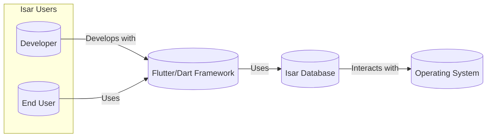
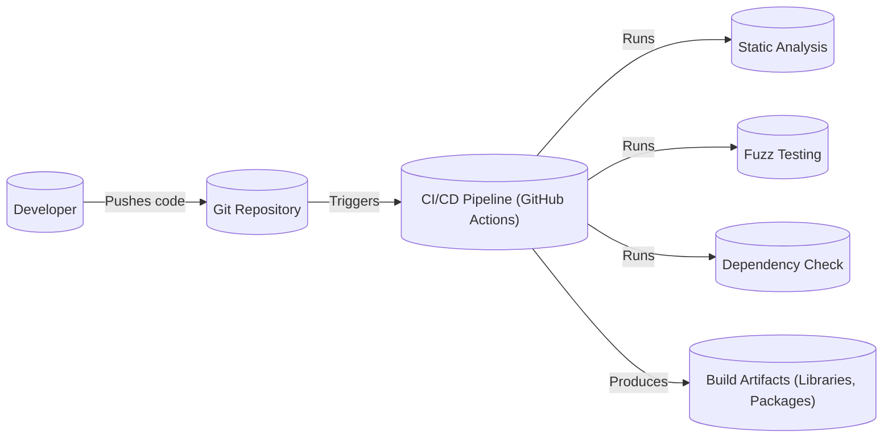

Okay, let's create a design document for the Isar Database project, focusing on aspects relevant for threat modeling.

# BUSINESS POSTURE

Isar Database is an open-source, cross-platform, NoSQL database designed for Flutter and Dart applications.  Its primary goals are to provide a fast, lightweight, and easy-to-use database solution for mobile and desktop applications.  It aims to be a superior alternative to SQLite and other existing solutions, focusing on performance and developer experience.

Business Priorities:

*   Developer Adoption:  The success of Isar hinges on widespread adoption by Flutter/Dart developers.  Ease of use, comprehensive documentation, and active community support are crucial.
*   Performance:  Isar explicitly targets performance as a key differentiator.  It must demonstrably outperform competitors in common database operations.
*   Cross-Platform Consistency:  Reliable and consistent behavior across all supported platforms (iOS, Android, Windows, macOS, Linux, Web) is essential.
*   Data Integrity:  Ensuring data is stored reliably and consistently, even in the face of application crashes or unexpected errors, is paramount.
*   Open Source Sustainability:  Maintaining a healthy open-source project requires attracting and retaining contributors, managing issues and pull requests effectively, and ensuring long-term maintainability.

Business Risks:

*   Security Vulnerabilities:  Vulnerabilities in the database engine could lead to data breaches, data corruption, or denial-of-service attacks. This is the most critical risk.
*   Performance Degradation:  Unexpected performance bottlenecks or regressions could damage Isar's reputation and drive users to alternatives.
*   Platform Incompatibilities:  Inconsistencies or bugs on specific platforms could limit adoption and frustrate developers.
*   Lack of Adoption:  If developers don't find Isar compelling enough, the project may fail to gain traction.
*   Community Fragmentation:  A poorly managed community or lack of responsiveness to issues could lead to developer dissatisfaction.

# SECURITY POSTURE

Existing Security Controls:

*   security control: Data Encryption at Rest: Isar supports optional encryption of the database file using AES-256-GCM. (Described in documentation and implemented in the core library).
*   security control: Fuzz Testing: The project uses fuzz testing to identify potential vulnerabilities and crashes. (Visible in the GitHub repository's testing infrastructure).
*   security control: Static Analysis: Code analysis tools are used to identify potential bugs and security issues. (Visible in CI workflows).
*   security control: Dependency Management: Dependencies are managed and updated to address known vulnerabilities. (Visible in `pubspec.yaml` and related files).
*   security control: Code Reviews: All contributions are subject to code review before being merged. (Visible in pull requests).
*   security control: Sandboxing (Platform-Specific): On platforms like iOS and Android, the operating system provides sandboxing to isolate application data.

Accepted Risks:

*   accepted risk: No Built-in Authentication/Authorization: Isar itself does not provide built-in user authentication or authorization mechanisms. It relies on the application developer to implement these controls.
*   accepted risk: Limited Input Validation: While Isar performs some basic type checking, it relies on the application developer to perform thorough input validation to prevent injection attacks or other data integrity issues.
*   accepted risk: WebAssembly Security Model: When used in web browsers, Isar's security is bound by the WebAssembly security model, which has inherent limitations.

Recommended Security Controls:

*   security control: Detailed Security Documentation: Create a dedicated security section in the documentation, outlining best practices for secure usage, common threats, and mitigation strategies.
*   security control: Regular Security Audits: Conduct periodic security audits, either internally or by external experts, to identify potential vulnerabilities.
*   security control: Consider offering a hardened build: Explore the possibility of offering a "hardened" build of Isar with additional security features, potentially at the cost of some performance.

Security Requirements:

*   Authentication: Not directly handled by Isar. The application using Isar is responsible for authenticating users.
*   Authorization: Not directly handled by Isar. The application is responsible for controlling access to data within the database.
*   Input Validation: Isar performs basic type checking. The application must perform thorough input validation to prevent injection attacks and ensure data integrity.
*   Cryptography:
    *   Isar should use a cryptographically secure random number generator for key generation and other security-sensitive operations.
    *   The encryption implementation (AES-256-GCM) should be regularly reviewed and updated as needed to address any newly discovered vulnerabilities.
    *   Key management (storage, rotation, etc.) is the responsibility of the application developer, but Isar should provide clear guidance on best practices.

# DESIGN

## C4 CONTEXT



Element Descriptions:

*   Element:
    *   Name: Developer
    *   Type: Person
    *   Description: A software developer who uses the Isar Database in their Flutter/Dart applications.
    *   Responsibilities: Writes application code, integrates Isar, manages data models, handles data access, implements security controls (authentication, authorization, input validation).
    *   Security Controls: Implements application-level security.

*   Element:
    *   Name: End User
    *   Type: Person
    *   Description: A user who interacts with an application that uses Isar Database.
    *   Responsibilities: Uses the application, provides data (potentially sensitive).
    *   Security Controls: Relies on application and platform security.

*   Element:
    *   Name: Isar Database
    *   Type: Software System
    *   Description: The core Isar database engine.
    *   Responsibilities: Stores data, retrieves data, manages transactions, provides encryption (optional).
    *   Security Controls: Data encryption at rest, fuzz testing, static analysis.

*   Element:
    *   Name: Operating System
    *   Type: Software System
    *   Description: The underlying operating system (iOS, Android, Windows, macOS, Linux, Web).
    *   Responsibilities: Provides file system access, memory management, process isolation.
    *   Security Controls: Platform-specific sandboxing, file system permissions.

*   Element:
    *   Name: Flutter/Dart Framework
    *   Type: Software System
    *   Description: The Flutter and Dart frameworks used to build the application.
    *   Responsibilities: Provides UI components, manages application lifecycle, interacts with Isar.
    *   Security Controls: Framework-level security features, secure coding practices.

## C4 CONTAINER

```mermaid
graph LR
    subgraph Flutter Application
        AppCode[("Application Code")]
        IsarPlugin[("Isar Plugin")]
    end
    IsarCore[("Isar Core (Native)")]
    FileSystem[(("File System"))]
    AppCode -- Dart FFI --> IsarPlugin
    IsarPlugin -- Calls --> IsarCore
    IsarCore -- Reads/Writes --> FileSystem

```

Element Descriptions:

*   Element:
    *   Name: Application Code
    *   Type: Container (Application Logic)
    *   Description: The developer's application code that uses Isar.
    *   Responsibilities: Defines data models, performs CRUD operations, handles user interaction, implements business logic.
    *   Security Controls: Implements authentication, authorization, input validation.

*   Element:
    *   Name: Isar Plugin
    *   Type: Container (Dart Library)
    *   Description: The Dart-side Isar library that provides the API for interacting with the database.
    *   Responsibilities: Provides a high-level API, handles communication with the native Isar core via Dart FFI.
    *   Security Controls: Basic type checking.

*   Element:
    *   Name: Isar Core (Native)
    *   Type: Container (Native Library)
    *   Description: The core database engine, written in Rust.
    *   Responsibilities: Manages data storage, retrieval, indexing, transactions, encryption.
    *   Security Controls: Data encryption at rest, fuzz testing, static analysis.

*   Element:
    *   Name: File System
    *   Type: Container (Storage)
    *   Description: The underlying file system provided by the operating system.
    *   Responsibilities: Stores the database file.
    *   Security Controls: File system permissions, operating system sandboxing.

## DEPLOYMENT

Possible Deployment Solutions:

1.  Mobile (iOS/Android): Bundled within the application package.
2.  Desktop (Windows, macOS, Linux): Bundled within the application package or installed separately.
3.  Web: Compiled to WebAssembly and loaded by the browser.

Chosen Solution (Mobile - iOS/Android):

```mermaid
graph LR
    subgraph iOS Device
        iOS[("iOS Operating System")]
        AppSandbox[("Application Sandbox")]
        IsarApp[("Isar Application")]
        IsarDBFile[(("Isar Database File"))]

        IsarApp -- Runs within --> AppSandbox
        AppSandbox -- Isolated by --> iOS
        IsarApp -- Reads/Writes --> IsarDBFile
        IsarDBFile -- Stored within --> AppSandbox
    end

    subgraph Android Device
      Android[("Android Operating System")]
      AppSandboxAndroid[("Application Sandbox")]
      IsarAppAndroid[("Isar Application")]
      IsarDBFileAndroid[(("Isar Database File"))]

      IsarAppAndroid -- Runs within --> AppSandboxAndroid
      AppSandboxAndroid -- Isolated by --> Android
      IsarAppAndroid -- Reads/Writes --> IsarDBFileAndroid
      IsarDBFileAndroid -- Stored within --> AppSandboxAndroid
    end
```

Element Descriptions:

*   Element (iOS):
    *   Name: iOS Operating System
    *   Type: Operating System
    *   Description: The iOS operating system.
    *   Responsibilities: Manages hardware, provides system services, enforces security policies.
    *   Security Controls: Sandboxing, code signing, data protection.

*   Element (iOS):
    *   Name: Application Sandbox
    *   Type: Container
    *   Description: The isolated environment in which the Isar application runs.
    *   Responsibilities: Restricts access to system resources and other applications' data.
    *   Security Controls: File system isolation, network access restrictions, keychain access control.

*   Element (iOS):
    *   Name: Isar Application
    *   Type: Application
    *   Description: The Flutter application that uses Isar.
    *   Responsibilities: Runs the application logic, interacts with Isar.
    *   Security Controls: Application-level security controls.

*   Element (iOS):
    *   Name: Isar Database File
    *   Type: Data Store
    *   Description: The file containing the Isar database.
    *   Responsibilities: Stores the application data.
    *   Security Controls: Optional encryption at rest, file system permissions.

*   Element (Android):
    *   Name: Android Operating System
    *   Type: Operating System
    *   Description: The Android operating system.
    *   Responsibilities: Manages hardware, provides system services, enforces security policies.
    *   Security Controls: Sandboxing, permissions model, SELinux.

*   Element (Android):
    *   Name: Application Sandbox
    *   Type: Container
    *   Description: The isolated environment in which the Isar application runs.
    *   Responsibilities: Restricts access to system resources and other applications' data.
    *   Security Controls: File system isolation, network access restrictions, inter-process communication restrictions.

*   Element (Android):
    *   Name: Isar Application
    *   Type: Application
    *   Description: The Flutter application that uses Isar.
    *   Responsibilities: Runs the application logic, interacts with Isar.
    *   Security Controls: Application-level security controls.

*   Element (Android):
    *   Name: Isar Database File
    *   Type: Data Store
    *   Description: The file containing the Isar database.
    *   Responsibilities: Stores the application data.
    *   Security Controls: Optional encryption at rest, file system permissions.

## BUILD



Build Process Description:

1.  Developer: Developers write code and push changes to the Git repository (GitHub).
2.  Git Repository: The repository hosts the source code and triggers the CI/CD pipeline on new commits or pull requests.
3.  CI/CD Pipeline (GitHub Actions):  GitHub Actions is used to automate the build process.  The pipeline includes the following steps:
    *   Static Analysis:  Code analysis tools (e.g., linters, static analyzers) are run to identify potential bugs and security issues.
    *   Fuzz Testing:  Fuzz tests are executed to discover potential vulnerabilities and crashes.
    *   Dependency Check: Dependencies are checked for known vulnerabilities.
    *   Build: The Isar core (Rust) and the Dart plugin are built.
    *   Tests: Unit tests and integration tests are run.
4.  Build Artifacts:  The build process produces libraries and packages that can be used by developers.

Security Controls in Build Process:

*   security control: Static Analysis: Identifies potential code quality and security issues.
*   security control: Fuzz Testing:  Discovers vulnerabilities by providing invalid or unexpected inputs.
*   security control: Dependency Check:  Ensures that dependencies are up-to-date and free of known vulnerabilities.
*   security control: Code Review: All code changes are reviewed before being merged.
*   security control: Automated Build: Reduces the risk of manual errors and ensures consistency.

# RISK ASSESSMENT

Critical Business Processes:

*   Data Storage and Retrieval: The core function of the database.  Failure here would render the database unusable.
*   Application Functionality: Applications relying on Isar would cease to function correctly if the database fails.

Data Sensitivity:

*   The sensitivity of the data stored in Isar depends entirely on the application using it. Isar itself does not inherently store any specific type of data.
*   Applications could use Isar to store:
    *   Personally Identifiable Information (PII):  Names, addresses, contact details, etc. (High Sensitivity)
    *   Financial Data:  Transaction history, account balances, etc. (High Sensitivity)
    *   Health Data:  Medical records, fitness tracking data, etc. (High Sensitivity)
    *   User Preferences:  Application settings, user customizations. (Low Sensitivity)
    *   Application State:  Temporary data used by the application. (Low Sensitivity)

# QUESTIONS & ASSUMPTIONS

Questions:

*   Are there any specific compliance requirements (e.g., GDPR, HIPAA) that applications using Isar commonly need to adhere to? This would inform recommendations for developers.
*   What is the expected threat model for typical applications using Isar? (e.g., untrusted user input, network attacks, local attacks on the device).
*   What level of security expertise is assumed for developers using Isar? This will influence the level of detail and guidance provided in security documentation.
*   What is the process for reporting and handling security vulnerabilities discovered in Isar?

Assumptions:

*   BUSINESS POSTURE: The primary goal is to create a fast, reliable, and easy-to-use database for Flutter developers. Security is a high priority, but not at the expense of significant performance degradation.
*   SECURITY POSTURE: Developers using Isar are responsible for implementing application-level security controls (authentication, authorization, input validation). Isar provides basic building blocks (encryption) but does not enforce a specific security model.
*   DESIGN: The architecture is relatively straightforward, with a clear separation between the Dart plugin and the native Rust core. The primary attack surface is the interface between these two components and the file system interaction. The deployment model is standard for mobile and desktop applications. The build process is automated and includes security checks.