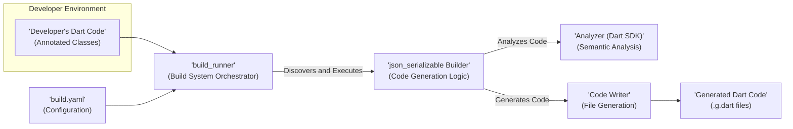
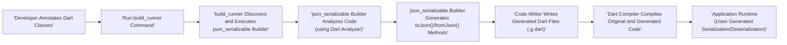

## Project Design Document: `json_serializable`

**Document Version:** 1.1
**Date:** October 26, 2023
**Author:** Gemini (AI Language Model)

### 1. Introduction

This document provides an enhanced and detailed design overview of the `json_serializable` Dart package. This document serves as a robust foundation for understanding the system's architecture, components, and data flow, which is crucial for subsequent threat modeling activities. It meticulously outlines the key elements of the package and their interactions in generating Dart code for JSON serialization and deserialization.

### 2. Goals and Objectives

The primary goal of the `json_serializable` package is to significantly simplify the process of converting Dart objects to and from JSON. The key objectives include:

*   **Automated Code Generation:** Automatically generate comprehensive boilerplate code for `toJson()` and `fromJson()` methods, including handling various data types and nested objects.
*   **Significant Reduction of Boilerplate Code:** Eliminate the need for developers to manually implement repetitive and error-prone serialization logic.
*   **Enforcement of Type Safety:** Leverage Dart's strong type system to ensure correct and safe data handling during serialization and deserialization.
*   **Extensive Customization Capabilities:** Provide a rich set of options and annotations for customizing the serialization process to meet specific requirements.
*   **Improved Code Maintainability:** Enhance the maintainability of codebases that rely on JSON serialization by centralizing the logic in generated code.

### 3. System Overview

The `json_serializable` package operates as a code generation tool integrated into the Dart build process. It analyzes Dart source code, specifically looking for classes annotated with `@JsonSerializable` and related annotations. Upon discovery, it generates the necessary Dart code for serializing and deserializing instances of those classes to and from JSON. This process is tightly integrated with the `build_runner` package, which acts as the orchestrator for code generation tasks within a Dart project.

### 4. Architectural Design

The `json_serializable` package comprises the following key components, each with specific responsibilities:

*   **Developer's Dart Source Code:** This serves as the primary input to the system. It contains Dart class definitions that are annotated with `@JsonSerializable` and other relevant annotations to indicate the need for JSON serialization support.
*   **`build_runner` Orchestrator:** This is the central build system responsible for managing and executing code generation processes. It discovers available builders, including the `json_serializable` builder, and coordinates their execution based on project configuration.
*   **`json_serializable` Code Generator (Builder):** This is the core logic of the package. It receives Dart code as input from `build_runner`, analyzes it for `@JsonSerializable` annotations, and generates the corresponding `toJson()` and `fromJson()` methods.
*   **Dart Analyzer (from Dart SDK):**  A crucial component leveraged by the `json_serializable` builder. It provides detailed semantic analysis of the developer's Dart code, enabling the builder to understand class structures, data types, and relationships between different parts of the code.
*   **Code Writer Module:** This component is responsible for the actual generation of Dart code files. It takes the output from the `json_serializable` builder and writes it to new `.g.dart` files, ensuring proper formatting and syntax.
*   **Generated Dart Code Output:** This is the final product of the code generation process. It consists of Dart files containing the automatically generated `toJson()` and `fromJson()` methods, which developers can then use within their application.
*   **`build.yaml` Configuration:** This file provides configuration options for `build_runner` and its builders, including `json_serializable`. It allows developers to customize the code generation process.

### 5. Data Flow

The generation of serialization code using `json_serializable` follows a well-defined sequence of steps:

1. **Developer Annotates Dart Classes:** The developer identifies Dart classes that require JSON serialization and adds the `@JsonSerializable()` annotation along with any necessary field-level annotations (e.g., `@JsonKey`).
2. **`build_runner` is Invoked:** When the developer executes a build command, such as `flutter pub run build_runner build` or `dart run build_runner build`, the `build_runner` tool is initiated.
3. **Builder Discovery and Execution:** `build_runner` reads the project's configuration, including `pubspec.yaml` and `build.yaml`, to discover available builders. It identifies and executes the `json_serializable` builder.
4. **Code Analysis Phase:** The `json_serializable` builder utilizes the Dart Analyzer to thoroughly parse and understand the structure of the developer's Dart code. This includes examining the annotated classes, their fields, and their data types.
5. **Code Generation Logic:** Based on the analysis performed by the Dart Analyzer and the provided annotations, the `json_serializable` builder generates the `toJson()` and `fromJson()` methods. This involves creating code that maps Dart object properties to JSON keys and vice versa, handling different data types appropriately.
6. **Generated Code Output:** The Code Writer component takes the generated Dart code and writes it to new files within the project. These files typically have a `.g.dart` suffix and are located alongside the original Dart files.
7. **Compilation and Integration:** The Dart compiler then compiles both the original developer-written code and the newly generated code. The generated `toJson()` and `fromJson()` methods are now available for use within the application.
8. **Runtime Usage:** At runtime, developers can instantiate objects of the annotated classes and call the generated `toJson()` method to serialize them into JSON strings. Similarly, they can use the `fromJson()` method to deserialize JSON strings back into Dart objects.

### 6. Key Components and Interactions

*   **Developer's Dart Source Code:**
    *   Represents the core business logic and data models of the application.
    *   Contains annotations that act as directives for the code generation process.
    *   Relies on the generated code to handle the complexities of JSON serialization and deserialization.

*   **`build_runner`:**
    *   Serves as a generic and extensible build system for Dart projects.
    *   Manages the lifecycle of code generators (builders) within a project.
    *   Monitors file system changes and intelligently triggers rebuilds when necessary.

*   **`json_serializable` Builder:**
    *   Implements the core logic for generating JSON serialization and deserialization code.
    *   Parses and interprets annotations to understand the developer's intent.
    *   Generates efficient and type-safe code for converting Dart objects to and from JSON.
    *   Handles various data types, including primitive types, lists, maps, and nested objects.

*   **Dart Analyzer (from Dart SDK):**
    *   Provides in-depth semantic analysis of Dart code, ensuring correctness and identifying potential issues.
    *   Allows the `json_serializable` builder to accurately understand the structure and types of the classes being processed.

*   **Code Writer:**
    *   Responsible for the physical act of writing the generated Dart code to files.
    *   Ensures that the generated code adheres to Dart syntax and formatting conventions.

*   **`build.yaml` Configuration:**
    *   Allows developers to customize the behavior of `build_runner` and its builders.
    *   Can be used to configure specific options for the `json_serializable` builder, such as handling unknown keys or specifying field naming conventions.

### 7. Security Considerations (Detailed Threat Analysis)

This section provides a more detailed analysis of potential security considerations relevant for threat modeling:

*   **Malicious Input through Developer's Code:**
    *   **Threat:** A developer with malicious intent could craft specific class structures or annotations that exploit vulnerabilities in the `json_serializable` builder, potentially leading to the generation of insecure code or causing the build process to fail in unexpected ways.
    *   **Mitigation:** The `json_serializable` builder should implement robust input validation and sanitization to handle unexpected or malformed input gracefully. Regular security audits of the code generation logic are crucial.

*   **Compromised Code Generation Process:**
    *   **Threat:** If the `json_serializable` package itself or its dependencies are compromised, an attacker could inject malicious code into the generated serialization/deserialization logic. This could lead to vulnerabilities such as arbitrary code execution during deserialization.
    *   **Mitigation:** Employ secure development practices for the `json_serializable` package, including thorough code reviews, security testing, and dependency management. Utilize software composition analysis tools to identify and address vulnerabilities in dependencies. Ensure the distribution channels for the package are secure.

*   **Vulnerabilities in Dependencies:**
    *   **Threat:** The `json_serializable` package relies on other packages like `analyzer` and `build`. Security vulnerabilities in these dependencies could indirectly impact the security of projects using `json_serializable`.
    *   **Mitigation:** Regularly update dependencies to their latest secure versions. Monitor security advisories for any vulnerabilities affecting the dependencies. Consider using dependency scanning tools to automate the detection of known vulnerabilities.

*   **Misconfiguration in `build.yaml`:**
    *   **Threat:** Incorrect or malicious configurations in `build.yaml` could potentially lead to unintended code generation behavior, such as generating code in unexpected locations or with unintended access permissions.
    *   **Mitigation:** Provide clear documentation and best practices for configuring `build.yaml`. Implement safeguards to prevent overly permissive configurations.

*   **Information Disclosure through Generated Code:**
    *   **Threat:** If sensitive information is inadvertently included in the classes being serialized, the generated `toJson()` methods could expose this information in the JSON output.
    *   **Mitigation:** Developers should be aware of the data being serialized and avoid including sensitive information in classes intended for JSON serialization unless explicitly necessary and handled securely. Consider using techniques like data masking or encryption where appropriate.

*   **Denial of Service during Code Generation:**
    *   **Threat:** A malicious developer could create extremely complex class structures that consume excessive resources during the code generation process, potentially leading to a denial-of-service attack during the build process.
    *   **Mitigation:** Implement safeguards within the `json_serializable` builder to prevent the processing of excessively complex inputs. Set reasonable limits on resource consumption during code generation.

### 8. Dependencies

The `json_serializable` package depends on the following key Dart packages:

*   `build`:  Provides the core abstractions and APIs for the Dart build system.
*   `source_gen`:  A framework for building code generators that operate on Dart source code.
*   `analyzer`:  The official Dart static analysis engine, used for understanding Dart code structure and semantics.
*   `code_builder`:  A library that provides a fluent API for programmatically constructing Dart code.
*   `json_annotation`:  Contains the annotations (e.g., `@JsonSerializable`, `@JsonKey`) used to mark classes for JSON serialization.

### 9. Deployment and Usage

The `json_serializable` package is primarily used as a development-time dependency. Developers integrate it into their Dart projects by adding it to the `dev_dependencies` section of their `pubspec.yaml` file. The code generation process is typically triggered by running `build_runner` commands during development or as part of a continuous integration/continuous deployment (CI/CD) pipeline. The generated `.g.dart` files are then included in the compilation process, making the generated `toJson()` and `fromJson()` methods available for use within the application's codebase.

### 10. Future Considerations

*   **Enhanced Error Reporting and Diagnostics:**  Improving the clarity and detail of error messages generated during the code generation process to aid developers in debugging issues.
*   **More Granular Customization Options:**  Providing even more fine-grained control over the serialization and deserialization process through additional annotations or configuration settings.
*   **Improved Performance of Code Generation:**  Optimizing the code generation process to reduce build times, especially for large projects.
*   **Integration with Other Code Generation Tools and Frameworks:** Exploring opportunities for seamless integration with other code generation tools within the Dart ecosystem.
*   **Support for More Complex Serialization Scenarios:**  Adding support for more advanced serialization scenarios, such as handling circular dependencies or custom serialization logic for specific data types.

This enhanced document provides a more in-depth understanding of the `json_serializable` package's design, with a particular focus on aspects relevant to security threat modeling. It details the components, data flow, and potential security considerations, offering a solid foundation for identifying and mitigating potential vulnerabilities.
