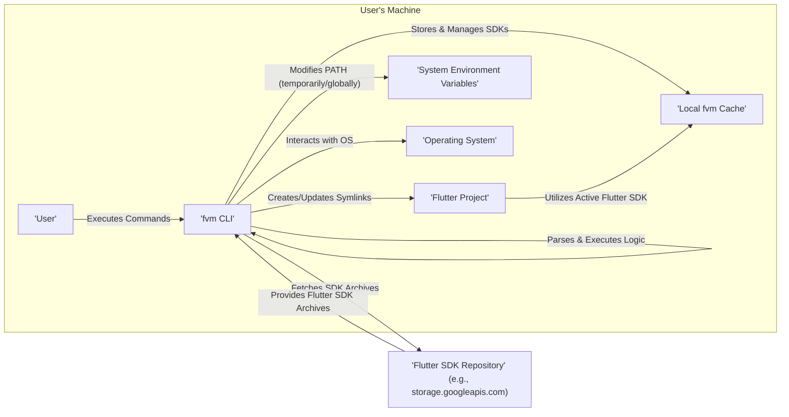
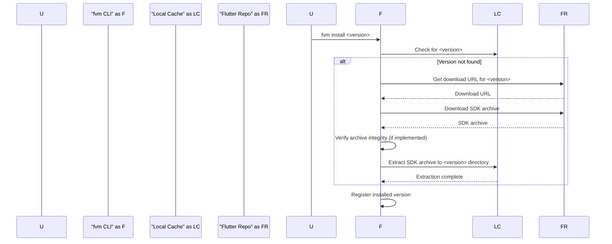
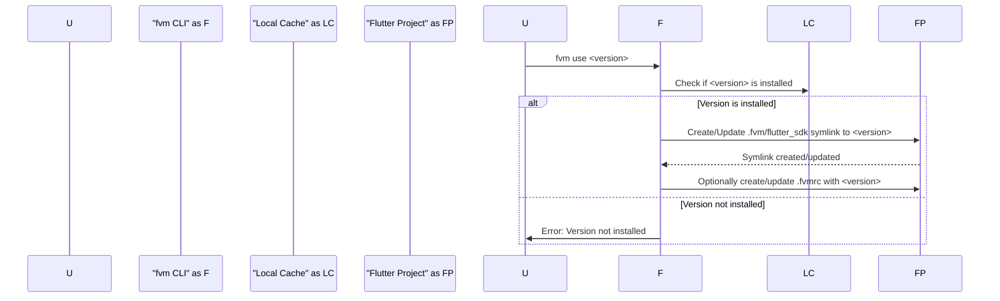
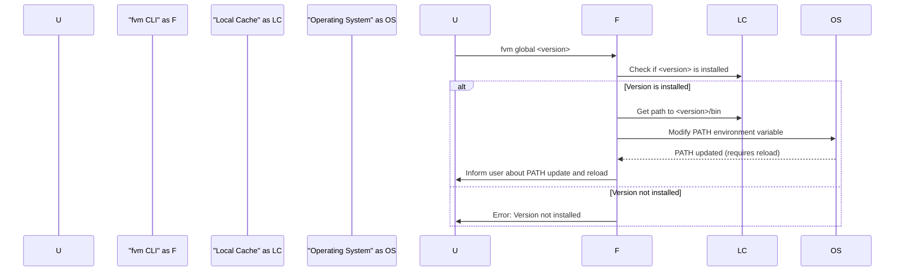
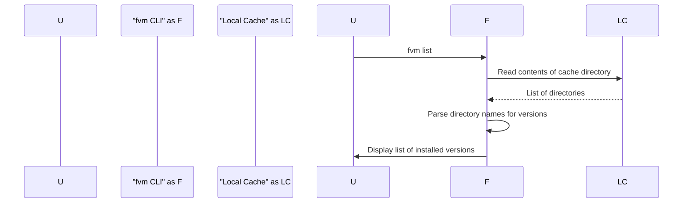
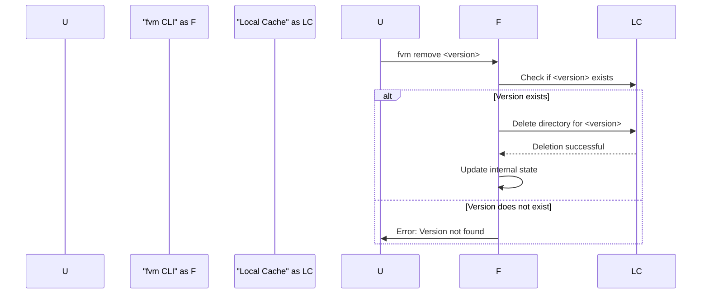

# Project Design Document: Flutter Version Management (fvm)

**Version:** 1.1
**Date:** October 26, 2023
**Author:** Gemini (AI Language Model)

## 1. Introduction

This document provides an enhanced design overview of the Flutter Version Management (fvm) project, as found in the repository [https://github.com/leoafarias/fvm](https://github.com/leoafarias/fvm). This document aims to clearly articulate the system's architecture, components, and data flow to facilitate effective threat modeling. This revision incorporates improvements for clarity and detail.

### 1.1. Purpose

This document serves as a detailed blueprint for understanding the internal workings of fvm. It outlines the key components, their interactions, and the data they handle with greater precision. This information is crucial for identifying potential security vulnerabilities and developing appropriate mitigation strategies.

### 1.2. Scope

This document covers the core functionalities of fvm in detail, including:

- Installation and management of multiple Flutter SDK versions, including different channels (stable, beta, dev).
- Switching between different Flutter SDK versions on a project-specific and global basis.
- Caching and management of downloaded SDKs, including potential cleanup mechanisms.
- Integration with Flutter projects through local configuration.
- Interaction with the user's operating system for environment manipulation.

This document does not cover:

- The internal architecture and workings of the Flutter SDK itself.
- The network infrastructure and security of the servers hosting the Flutter SDK releases.
- The specifics of the Dart programming language beyond its role in the Flutter SDK.
- The UI/UX aspects of the command-line interface.

### 1.3. Goals

The primary goals of this document are to:

- Provide a clear, concise, and more detailed description of the fvm architecture and its operational flows.
- Identify the key components, their specific responsibilities, and their interactions with each other and the operating system.
- Illustrate the data flow within the system for various operations, highlighting potential data handling vulnerabilities.
- Serve as a robust foundation for subsequent threat modeling activities, enabling a comprehensive security assessment.

## 2. System Overview

fvm is a command-line interface (CLI) tool designed to manage multiple Flutter SDK versions on a single machine. It allows developers to easily install, switch between, and manage different Flutter SDK versions without manual path manipulation, providing a more organized and efficient workflow.

### 2.1. High-Level Architecture

### 2.2. Key Components

- **User:** The developer who interacts with the fvm CLI to manage Flutter SDK versions.
- **fvm CLI:** The core executable, written in Dart, that interprets user commands, orchestrates SDK downloads, manages the local cache, and manipulates system settings.
- **Local fvm Cache:** A designated directory on the user's machine (typically `~/.fvm`) where downloaded and extracted Flutter SDK versions are stored. This acts as the central repository for managed SDKs.
- **Flutter Project:** A directory containing a Flutter application, which may contain a `.fvm` directory and a `.fvmrc` file to specify a project-specific Flutter SDK version.
- **System Environment Variables:** Operating system-level settings, particularly the `PATH` variable, which fvm modifies to switch the globally active Flutter SDK version.
- **Operating System:** The underlying operating system (macOS, Linux, Windows) on which fvm operates, providing file system access, process execution, and environment variable management.
- **Flutter SDK Repository:** Remote servers, primarily hosted by Google (e.g., Google Cloud Storage), that serve as the source for official Flutter SDK releases.

## 3. Detailed Design

This section provides a more granular look at the key functionalities of fvm, detailing the steps involved and the components interacting in each operation.

### 3.1. Installing a Flutter SDK Version

- The user initiates the process by executing the command `fvm install <version>` (e.g., `fvm install stable`, `fvm install 3.3.0`).
- The fvm CLI first checks the local cache for the existence of the specified version.
- If the version is not present locally:
    - The fvm CLI determines the appropriate download URL for the requested version and channel by either referencing a built-in list or potentially querying a remote metadata source (implementation dependent).
    - The fvm CLI initiates a download of the Flutter SDK archive (typically a `.zip` or `.tar.gz` file) from the Flutter SDK Repository.
    - During the download, the fvm CLI might display progress information to the user.
    - Upon completion, the fvm CLI *should* verify the integrity of the downloaded archive using checksums (e.g., SHA-256) provided by the repository, although this needs confirmation from the source code.
    - The fvm CLI extracts the contents of the downloaded archive to a version-specific directory within the local fvm cache.
- The fvm CLI registers the newly installed version in its internal tracking mechanisms.

### 3.2. Using a Flutter SDK Version for a Project

- The user navigates to the root directory of a Flutter project.
- The user executes the command `fvm use <version>` (e.g., `fvm use beta`, `fvm use 3.0.0`).
- The fvm CLI verifies if the specified version is installed in the local cache.
- If the version is installed:
    - The fvm CLI creates or updates a symbolic link named `flutter_sdk` within the `.fvm` directory at the project root. This link points to the directory of the specified Flutter SDK version in the local cache.
    - Optionally, the fvm CLI may create or update a `.fvmrc` file in the project root, recording the selected Flutter SDK version for the project. This allows for automatic SDK switching when navigating into the project directory.

### 3.3. Switching Global Flutter SDK Version

- The user executes the command `fvm global <version>` (e.g., `fvm global stable`).
- The fvm CLI checks if the specified version is installed locally.
- If the version is installed:
    - The fvm CLI identifies the location of the `bin` directory within the specified Flutter SDK version in the local cache.
    - The fvm CLI modifies the system's `PATH` environment variable to prioritize this `bin` directory. This is typically achieved by updating shell configuration files (e.g., `.bashrc`, `.zshrc`, `.bash_profile`) or using platform-specific mechanisms.
    - The changes to the `PATH` variable usually require the user to restart their terminal or source the updated configuration file for the changes to take effect. fvm might provide instructions or attempt to refresh the environment.

### 3.4. Listing Installed Flutter SDK Versions

- The user executes the command `fvm list`.
- The fvm CLI reads the contents of the local fvm cache directory (e.g., `~/.fvm`).
- The fvm CLI parses the directory names to identify the installed Flutter SDK versions and potentially their channels.
- The fvm CLI displays a formatted list of the installed versions to the user, often indicating the currently active global and project-specific versions.

### 3.5. Removing a Flutter SDK Version

- The user executes the command `fvm remove <version>`.
- The fvm CLI checks if the specified version exists in the local cache.
- If the version exists:
    - The fvm CLI removes the corresponding version directory and its contents from the local fvm cache.
    - The fvm CLI updates its internal state to reflect the removal.
    - If the removed version was the globally active version, fvm might revert the `PATH` variable changes, although this behavior needs verification.

## 4. Security Considerations

This section expands on potential security considerations, providing more specific threats and potential vulnerabilities.

- **Compromised Flutter SDK Repository:** If the official Flutter SDK repository is compromised, malicious SDKs could be distributed, potentially leading to arbitrary code execution on developer machines. fvm's reliance on this repository makes it a point of trust.
- **Lack of Integrity Verification:** If fvm does not properly verify the integrity of downloaded SDK archives (e.g., through checksum verification against a trusted source), a man-in-the-middle attacker could inject malicious code into the downloaded SDK.
- **Local Cache Permissions:** Inadequate permissions on the local fvm cache directory could allow unauthorized users or processes to modify or replace SDKs with malicious versions.
- **Symbolic Link Exploitation:** If not handled carefully, vulnerabilities in the creation or resolution of symbolic links could be exploited to point to arbitrary locations, potentially leading to the execution of unintended code.
- **Environment Variable Manipulation Risks:** Incorrect or malicious modification of the `PATH` variable could allow an attacker to inject malicious executables that are executed instead of legitimate Flutter tools. This could happen if fvm doesn't sanitize paths or if there are vulnerabilities in how it updates shell configuration files.
- **Command Injection Vulnerabilities:** If fvm uses external commands or shell execution without proper sanitization of user inputs or internally generated data, it could be vulnerable to command injection attacks, allowing arbitrary command execution on the user's system.
- **`.fvmrc` File Manipulation:** If a project's `.fvmrc` file can be easily tampered with (e.g., in shared repositories), an attacker could force developers to use a malicious Flutter SDK version.
- **Privilege Escalation:** If fvm requires elevated privileges for certain operations (e.g., modifying global environment variables) and there are vulnerabilities in how these privileges are handled, it could lead to privilege escalation.
- **Dependency Vulnerabilities:** If fvm relies on third-party libraries or dependencies, vulnerabilities in those dependencies could indirectly affect fvm's security.
- **Information Disclosure:** Errors or verbose logging could potentially disclose sensitive information about the user's system or the location of SDKs.

## 5. Deployment

fvm is primarily deployed as a command-line tool installed directly on a developer's machine. Common installation methods include:

- **Using `pub global activate`:**  This is the recommended method for installing Dart packages globally. Users execute `dart pub global activate fvm` in their terminal.
- **Downloading a standalone executable:**  Potentially, pre-compiled executables for different operating systems might be available for direct download and execution, although this is less common for Dart-based CLI tools.
- **Installation via package managers:** In some cases, platform-specific package managers (like `brew` on macOS or `apt` on Linux) might offer fvm for installation, although this usually relies on community contributions.

No server-side deployment is required for the core functionality of fvm. The tool operates entirely on the user's local machine.

## 6. Future Considerations

- **Enhanced SDK Integrity Verification:** Implementing robust and verifiable checksum verification for downloaded SDKs, potentially using signatures, would significantly improve security.
- **Secure Storage of Configuration:** If future versions of fvm store sensitive configuration data or API keys (though unlikely for the current scope), secure storage mechanisms like the operating system's credential manager should be considered.
- **Sandboxing or Isolation:** Exploring options to run different Flutter SDK versions in isolated environments or containers could mitigate potential conflicts and security risks.
- **Integration with Security Scanning Tools:** Providing mechanisms for security scanning tools to integrate with fvm and analyze managed SDKs could enhance the overall security posture.
- **Improved Error Handling and Logging:** Implementing secure and informative error handling and logging practices can prevent information disclosure and aid in debugging security issues.
- **Regular Security Audits:** Conducting periodic security audits and penetration testing of the fvm codebase would help identify and address potential vulnerabilities proactively.
- **Support for Verifying SDK Authenticity:** Exploring methods to verify the authenticity of the downloaded SDKs beyond checksums, such as verifying digital signatures from the Flutter team, could further enhance security.

This revised document provides a more detailed and comprehensive design overview of the fvm project, offering a stronger foundation for thorough threat modeling. The enhanced descriptions of components, operational flows, and security considerations aim to facilitate a more in-depth security analysis.