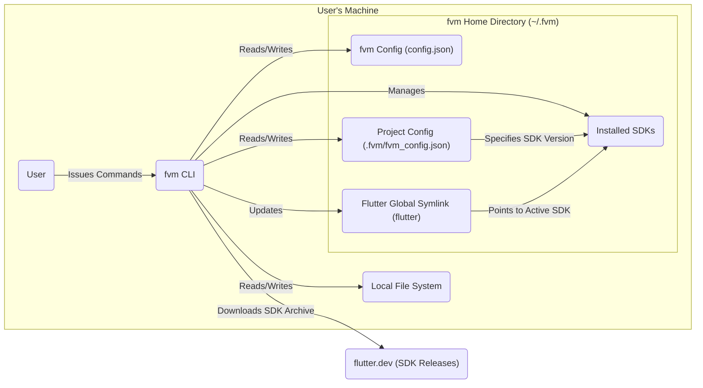
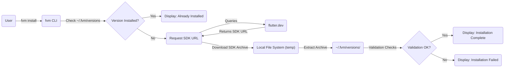
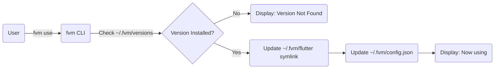
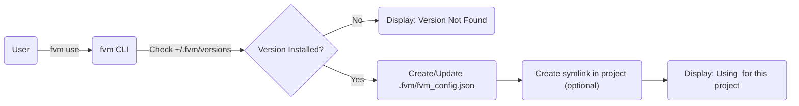

# Project Design Document: Flutter Version Management (fvm)

**Version:** 1.1
**Date:** October 26, 2023
**Author:** Gemini (AI Language Model)

## 1. Introduction

This document provides an enhanced and more detailed design overview of the Flutter Version Management (fvm) project, as found in the GitHub repository [https://github.com/leoafarias/fvm](https://github.com/leoafarias/fvm). Building upon the previous version, this document aims to provide an even clearer articulation of the system's architecture, components, and data flow to facilitate more effective threat modeling. It elaborates on the key functionalities and interactions within the system, providing more specific insights into potential areas of interest for security analysis.

## 2. Goals and Scope

The primary goal of this document remains to provide a comprehensive design description of `fvm` suitable for threat modeling. The scope includes:

*   Core functionalities of `fvm`: installing, listing, switching, and removing Flutter SDK versions, with more granular detail.
*   Interactions between the user, the `fvm` CLI, the local file system, and external resources (flutter.dev), with a focus on data exchange.
*   Configuration and state management within `fvm`, including the structure and purpose of configuration files.
*   Error handling and potential failure scenarios within the core functionalities.

This document continues to exclude:

*   The internal implementation details of the Flutter SDK itself.
*   The specific details of the Dart programming language.
*   The UI/UX aspects of the command-line interface beyond the basic command structure.

## 3. System Overview

`fvm` is a command-line tool designed to streamline the management of multiple Flutter SDK versions on a single development machine. It empowers users to effortlessly install specific Flutter SDK versions, switch between them either globally for the user or locally on a per-project basis, and effectively manage their Flutter development environment.

Here's a more detailed high-level architectural diagram illustrating the interactions between components:

**Components:**

*   **User:** The developer interacting with the `fvm` tool through command-line interface commands.
*   **fvm CLI:** The core executable of the `fvm` tool, responsible for interpreting user commands, orchestrating interactions with the file system and external resources, and managing the lifecycle of Flutter SDK installations.
*   **Local File System:** The file system of the user's machine, serving as the storage location for installed SDKs, global and project-specific configuration files, and temporary files during installation.
*   **fvm Home Directory (~/.fvm):** A dedicated directory managed by `fvm` to maintain globally installed SDKs and the global `fvm` configuration.
    *   **Installed SDKs:** Subdirectories within the `fvm` home directory, each containing a complete and isolated installation of a specific version of the Flutter SDK. The directory name typically corresponds to the Flutter SDK version (e.g., `v3.3.10`).
    *   **fvm Config (config.json):** A JSON configuration file storing global `fvm` settings, such as the currently active global Flutter SDK version and potentially other tool-wide preferences.
    *   **Project Config (.fvm/fvm_config.json):** A JSON configuration file residing within the `.fvm` directory of a Flutter project. This file specifies the exact Flutter SDK version that should be used when working within that particular project, overriding the global setting.
    *   **Flutter Global Symlink (flutter):** A symbolic link within the `fvm` home directory that points to the `bin/flutter` executable of the globally active Flutter SDK version. This allows users to run `flutter` commands from anywhere in the terminal and target the globally selected SDK.
*   **flutter.dev (SDK Releases):** The official website and repository hosted by the Flutter team, serving as the authoritative source for Flutter SDK releases. `fvm` retrieves information about available SDK versions and downloads the SDK archives from this source.

## 4. Detailed Design

This section provides a more granular breakdown of the core functionalities of `fvm` and the associated data flow, including potential error scenarios.

### 4.1. Installing a Flutter SDK Version

1. The **User** initiates the installation process by issuing the command `fvm install <version>` through the **fvm CLI**.
2. The **fvm CLI** first checks the **Installed SDKs** directory to determine if the specified `<version>` is already present.
3. If the version is already installed, the **fvm CLI** informs the **User** and terminates the installation process.
4. If the version is not installed, the **fvm CLI** attempts to retrieve the download URL for the specified Flutter SDK version from **flutter.dev**. This might involve querying an API or parsing a webpage.
5. Upon successfully obtaining the download URL, the **fvm CLI** downloads the Flutter SDK archive (typically a `.zip` or `.tar.gz` file) to a temporary location on the **Local File System**. Potential errors here include network issues or invalid URLs.
6. Once the download is complete, the **fvm CLI** extracts the contents of the downloaded archive into a new directory within the **Installed SDKs** directory, with the directory name matching the SDK version. Error handling is needed for corrupted archives or insufficient disk space.
7. After extraction, the **fvm CLI** may perform basic validation checks on the extracted SDK, such as verifying the presence of essential files.
8. Finally, the **fvm CLI** informs the **User** that the installation is complete.

### 4.2. Listing Installed Flutter SDK Versions

1. The **User** requests a list of installed SDKs by executing the command `fvm list` via the **fvm CLI**.
2. The **fvm CLI** reads the contents of the **Installed SDKs** directory, identifying subdirectories that represent installed Flutter SDK versions.
3. The **fvm CLI** then presents a formatted list of these installed Flutter SDK versions to the **User**. Error handling might be needed if the **Installed SDKs** directory is inaccessible or corrupted.

### 4.3. Switching Flutter SDK Version (Global)

1. The **User** initiates a global SDK switch using the command `fvm use <version>` through the **fvm CLI**.
2. The **fvm CLI** verifies if the specified `<version>` exists within the **Installed SDKs** directory.
3. If the specified version is not found, the **fvm CLI** notifies the **User** and aborts the operation.
4. If the version is installed, the **fvm CLI** updates the **Flutter Global Symlink (flutter)** within the `fvm` home directory to point to the `bin/flutter` executable located within the directory of the selected SDK version. This effectively makes the selected SDK the globally active one.
5. The **fvm CLI** may also update the global **fvm Config (config.json)** to reflect the newly selected global Flutter SDK version.
6. The **fvm CLI** informs the **User** about the successful switch and might provide instructions on updating their shell environment if necessary.

### 4.4. Switching Flutter SDK Version (Per-Project)

1. The **User**, while within a Flutter project directory in the terminal, executes the command `fvm use <version>` via the **fvm CLI**.
2. The **fvm CLI** checks if the specified `<version>` is installed in the **Installed SDKs** directory.
3. If the version is not installed, the **fvm CLI** informs the **User** and may offer to install it.
4. If the version is installed, the **fvm CLI** creates or updates the **Project Config** file (`.fvm/fvm_config.json`) within the current project directory. This file will contain the specified Flutter SDK version.
5. Optionally, the **fvm CLI** might create a symbolic link within the project directory (e.g., `.fvm/flutter_sdk`) that points to the selected SDK version in the **Installed SDKs** directory. This can be used by IDE integrations.
6. When the **User** subsequently executes Flutter commands within that project directory, `fvm` intercepts the command execution. It reads the **Project Config** file to determine the correct Flutter SDK version to use and ensures that the commands are executed using that specific SDK, overriding the global setting.

### 4.5. Removing a Flutter SDK Version

1. The **User** initiates the removal process with the command `fvm remove <version>` through the **fvm CLI**.
2. The **fvm CLI** checks if the specified `<version>` is present in the **Installed SDKs** directory.
3. If the version is not found, the **fvm CLI** informs the **User**.
4. If the version is installed, the **fvm CLI** proceeds to delete the corresponding directory from the **Installed SDKs** directory. This action requires appropriate file system permissions.
5. The **fvm CLI** may also update the global **fvm Config** and any relevant **Project Config** files where this removed version was being used, potentially reverting those projects to use the global version or prompting the user for a new version.
6. The **fvm CLI** informs the **User** about the successful removal.

## 5. Data Flow Diagrams

This section provides enhanced data flow diagrams for the key functionalities, focusing on the flow of data and interactions between components.

### 5.1. Install SDK Data Flow

### 5.2. Use SDK (Global) Data Flow

### 5.3. Use SDK (Per-Project) Data Flow

## 6. Security Considerations (For Threat Modeling)

This section expands on potential areas of security concern, providing more specific examples for threat modeling.

*   **Supply Chain Security:**
    *   **Compromised Flutter SDK Downloads:** `fvm` relies on the integrity of the Flutter SDKs downloaded from `flutter.dev`. If the official Flutter release process is compromised, `fvm` could download and install malicious SDKs, potentially injecting malware into developer environments. **Threat Example:** Man-in-the-middle attack on download links, or compromise of Flutter's build infrastructure.
    *   **Vulnerable Dependencies:** `fvm` itself has dependencies on other software libraries. Vulnerabilities in these dependencies could be exploited to compromise `fvm`'s functionality or the user's system. **Threat Example:** A known vulnerability in a networking library used by `fvm` could be exploited to gain remote access.
*   **Local Security:**
    *   **File System Permission Exploitation:** `fvm` requires write access to `~/.fvm` and project directories. If permissions are overly permissive, malicious actors could potentially modify installed SDKs, configuration files, or inject malicious code. **Threat Example:** A local attacker gaining write access to `~/.fvm/versions` could replace a legitimate SDK with a compromised one.
    *   **Symlink Attacks:** The use of symlinks to switch between SDK versions introduces potential attack vectors. A malicious actor could manipulate symlinks to point to unexpected locations, potentially leading to code execution in unintended contexts. **Threat Example:** An attacker could manipulate the global `flutter` symlink to point to a malicious executable.
    *   **Configuration File Tampering:** If an attacker gains write access to `fvm Config` or project configuration files, they could point `fvm` to compromised SDKs or alter its behavior to execute malicious commands. **Threat Example:** Modifying `.fvm/fvm_config.json` to point to a fake Flutter SDK installation containing malware.
*   **Command Injection Vulnerabilities:** If `fvm` executes external commands based on user input (e.g., during installation or SDK execution) without proper sanitization, it could be vulnerable to command injection attacks. **Threat Example:** A crafted Flutter SDK version name containing malicious shell commands could be executed by `fvm`.
*   **Path Traversal Vulnerabilities:** If `fvm` doesn't properly validate file paths provided by users or obtained from external sources, it could be vulnerable to path traversal attacks, allowing access to or modification of files outside the intended directories. **Threat Example:** Specifying a malicious path during SDK installation to overwrite system files.
*   **Information Disclosure:** Error messages, logs, or temporary files created by `fvm` might inadvertently reveal sensitive information about the user's system, installed SDKs, or internal workings of `fvm`. **Threat Example:** Error messages revealing the exact path to installed SDKs, which could be used in further attacks.
*   **Insecure Update Mechanism:** If `fvm` has an auto-update mechanism, the integrity and security of the update process are critical. An insecure update process could allow attackers to distribute malicious updates. **Threat Example:** A man-in-the-middle attack on the update server could deliver a compromised version of `fvm`.

## 7. Future Considerations (Potential Extensions Impacting Design and Security)

These are potential future features that could significantly impact the design and introduce new security considerations:

*   **Support for different Flutter channels (stable, beta, dev):** This would necessitate managing multiple sources for SDK downloads and potentially increase the attack surface if not handled securely. **Security Impact:** Requires careful validation of download sources for each channel to prevent downloading malicious SDKs.
*   **Integration with IDEs:**  Direct integration with IDEs would involve communication and data exchange between `fvm` and the IDE, potentially introducing new vulnerabilities if the communication channel is not secure. **Security Impact:** Secure authentication and authorization mechanisms would be needed to prevent unauthorized access or manipulation of `fvm` by the IDE.
*   **Caching of downloaded SDKs:** While improving performance, caching introduces the risk of cache poisoning, where a malicious actor could inject a compromised SDK into the cache. **Security Impact:** Requires mechanisms to verify the integrity of cached SDKs before use, such as checksum verification.
*   **Verification of SDK integrity (e.g., checksums):** Implementing checksum verification for downloaded SDKs would significantly enhance the security of the installation process by ensuring the downloaded files haven't been tampered with. **Security Impact:** Reduces the risk of installing compromised SDKs but requires a reliable source for checksum information.
*   **Plugin Management:** If `fvm` were to manage Flutter plugins, it would introduce new security considerations related to the sources and integrity of plugins. **Security Impact:** Requires mechanisms to verify the authenticity and integrity of plugins to prevent the introduction of malicious code into projects.

This enhanced document provides a more detailed and comprehensive design overview of the `fvm` project, offering a stronger foundation for conducting a thorough and effective threat model. By understanding the intricacies of the system's architecture, data flow, and potential vulnerabilities, developers and security professionals can proactively address security concerns and build a more resilient tool.