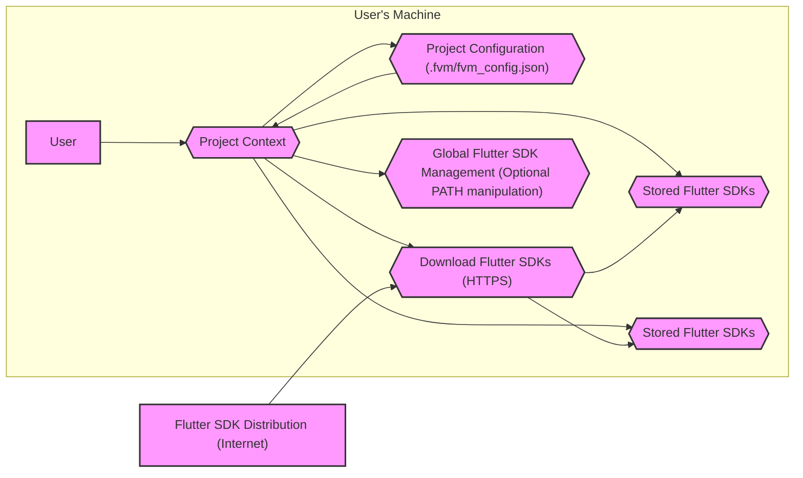
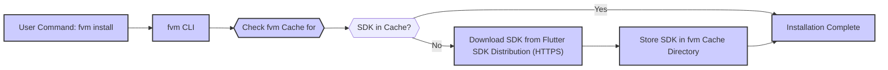
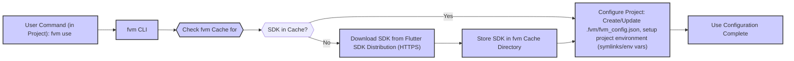

# Project Design Document: Flutter Version Management (fvm) for Threat Modeling

**Project:** Flutter Version Management (fvm)
**Project Repository:** [https://github.com/leoafarias/fvm](https://github.com/leoafarias/fvm)
**Document Version:** 1.1
**Date:** October 26, 2023
**Author:** AI Software Architect

## 1. Introduction

This document provides a detailed design overview of the Flutter Version Management (fvm) project, intended for use in subsequent threat modeling activities. It outlines the system's architecture, components, data flow, and technology stack to facilitate the identification of potential security vulnerabilities and risks.

### 1.1. Purpose of fvm

fvm (Flutter Version Management) is a command-line interface (CLI) tool designed to streamline the management of multiple Flutter SDK versions, **especially on a per-project basis**. It empowers developers to:

*   Install and cache multiple Flutter SDK versions locally, isolating them from each other.
*   **Isolate Flutter SDK versions per project**, ensuring each project uses a specific, defined SDK version.
*   Switch between Flutter SDK versions seamlessly within different project contexts.
*   Guarantee consistent Flutter SDK versions across development teams and projects, enhancing collaboration and reducing "works on my machine" issues.
*   Simplify Flutter SDK upgrades and downgrades.

fvm's primary goal is to boost developer productivity and project stability by abstracting away the complexities of manual Flutter SDK version management and ensuring project-specific SDK isolation.

### 1.2. Document Scope

This document focuses on the architectural and functional aspects of fvm relevant to security considerations. It covers:

*   High-level system architecture and component breakdown.
*   Detailed interactions between key components.
*   Data flow diagrams illustrating critical operations.
*   Technology stack and dependencies, highlighting potential vulnerability points.
*   Deployment and common usage scenarios to understand the attack surface.
*   Initial security considerations, providing a starting point for threat identification.

This document is not a code-level analysis but provides a comprehensive architectural blueprint for effective security analysis and threat modeling.

## 2. System Overview

fvm is a CLI application that acts as a wrapper around the Flutter SDK. It manages a local cache of Flutter SDK versions and, crucially, allows projects to specify and use a particular SDK version from this cache. This **per-project SDK isolation** is a core feature. When a Flutter command is executed within a project managed by fvm, fvm ensures the command uses the project's designated SDK version, regardless of any globally installed Flutter SDK.

**Key functionalities include:**

*   **SDK Installation:** Downloading and caching Flutter SDK versions from official Flutter channels (stable, beta, dev, master) or specific version tags from the official Flutter repository.
*   **SDK Version Switching (Per-Project):**  Dynamically and transparently switching the active Flutter SDK version for a given project. This is achieved by project-local configuration and environment manipulation.
*   **SDK Version Listing and Management:** Displaying locally installed SDK versions, removing cached versions, and managing the cache.
*   **Project Configuration and Version Pinning:**  Enabling projects to declare and "pin" a specific Flutter SDK version using a configuration file within the project (`.fvm/fvm_config.json`).
*   **Global Flutter SDK Management (Optional):**  While primarily focused on per-project management, fvm can optionally manage the globally accessible `flutter` command by manipulating the user's `PATH` environment variable.

## 3. Architecture

fvm's architecture is structured around managing Flutter SDKs within a local cache and providing project-specific access to these SDKs.

### 3.1. High-Level Architecture Diagram

**Components Description:**

*   **"User"**: The developer interacting with the fvm CLI through a terminal or command prompt.
*   **"fvm CLI"**: The core command-line interface of fvm, implemented in Dart. It handles command parsing, orchestrates cache operations, manages project configurations, and invokes Flutter SDK commands.
*   **"Project Directory"**: The root directory of a Flutter project. It may contain a `.fvm` subdirectory for project-specific fvm configurations, primarily the `fvm_config.json` file.
*   **"fvm Cache Directory"**: A dedicated directory on the user's machine (typically within the user's home directory, e.g., `~/.fvm`) where fvm stores downloaded and cached Flutter SDK versions. This cache isolates different SDK versions.
*   **"Global Flutter SDK (Optional)"**:  A globally installed Flutter SDK on the user's machine, independent of fvm. fvm can optionally manage the system `PATH` to point to a specific fvm-managed SDK, effectively controlling the global `flutter` command.
*   **"Flutter SDK (Version X)", "Flutter SDK (Version Y)"**: Represent distinct versions of the Flutter SDK, stored as separate directories within the "fvm Cache Directory". Each version is a complete and independent Flutter SDK installation.
*   **"Flutter SDK Distribution (Internet)"**: The official online source (e.g., Flutter's GitHub repository or storage buckets) from which fvm downloads Flutter SDK versions. Downloads should be over HTTPS.

### 3.2. Component Interactions

1.  **User Command Input:** The user interacts with fvm by typing commands into the CLI, such as `fvm install <version>`, `fvm use <version>`, `fvm list`, and others.
2.  **Command Parsing and Routing (fvm CLI):** The fvm CLI parses the user's command, validates syntax, and determines the appropriate action to execute.
3.  **Cache Management Operations (fvm CLI & fvm Cache Directory):**
    *   **SDK Installation:** For `fvm install <version>`, fvm checks the "fvm Cache Directory". If the SDK is not present, it downloads it from the "Flutter SDK Distribution (Internet)" via HTTPS and stores it in the cache.
    *   **SDK Retrieval:** For `fvm use <version>` or when executing `flutter` commands within a fvm-managed project, fvm retrieves the specified Flutter SDK from the "fvm Cache Directory".
4.  **Project Configuration Management (fvm CLI & Project Directory):** When `fvm use <version>` is executed within a project:
    *   fvm creates or updates the `.fvm/fvm_config.json` file within the "Project Directory". This file stores the project's pinned Flutter SDK version.
    *   fvm configures the project environment to utilize the specified SDK. This is typically achieved by creating symbolic links within the project to the cached SDK or by manipulating environment variables *within the context of commands executed through fvm*.
5.  **Flutter SDK Command Execution (fvm CLI & Flutter SDK):** When the user executes `flutter` commands (e.g., `flutter run`, `flutter build`) within a fvm-managed project, fvm intercepts these commands. It ensures that these commands are executed using the project's configured Flutter SDK version from the cache, effectively isolating the project from any global Flutter SDK or other project SDK versions.
6.  **Global Flutter SDK Management (Optional) (fvm CLI & User's Machine):**  fvm can optionally modify the user's system `PATH` environment variable to point to the currently "used" Flutter SDK from the cache. This allows fvm to control the globally accessible `flutter` command, but this is not the primary focus of fvm, which is per-project SDK management.

## 4. Data Flow

The core data flow in fvm centers around obtaining, caching, and utilizing Flutter SDK versions.

### 4.1. Installing a Flutter SDK Version

**Data Flow Description (Installation):**

1.  The user initiates SDK installation using the `fvm install <version>` command.
2.  The fvm CLI receives the command and queries the "fvm Cache Directory" to check for the requested Flutter SDK version.
3.  If the SDK version is already present in the cache (identified by version and potentially checksum), the installation process is considered complete, and the existing cached version is used.
4.  If the SDK version is not found in the cache, fvm proceeds to download it from the official "Flutter SDK Distribution (Internet)" over HTTPS.
5.  After successful download, fvm stores the complete Flutter SDK in a dedicated subdirectory within the "fvm Cache Directory", organized by version.
6.  The installation process concludes, and the user is notified that the SDK version is now installed and cached.

### 4.2. Using a Specific Flutter SDK Version in a Project

**Data Flow Description (Using a Version):**

1.  The user executes the `fvm use <version>` command from within a Flutter project directory.
2.  The fvm CLI receives the command and checks if the specified Flutter SDK version is available in the "fvm Cache Directory".
3.  If the SDK version is found in the cache, fvm proceeds to configure the current project to use this version.
4.  If the SDK version is not in the cache, fvm first downloads it from the "Flutter SDK Distribution (Internet)" and stores it in the cache (as per the installation flow).
5.  Once the SDK is cached (either already present or newly downloaded), fvm configures the project. This involves:
    *   Creating or updating the `.fvm/fvm_config.json` file in the "Project Directory" to record the project's SDK version.
    *   Setting up the project environment to use the cached SDK. This typically involves creating symbolic links within the project (e.g., a `flutter` symlink pointing to the cached SDK's `bin/flutter`) or manipulating environment variables specifically for commands executed through fvm in this project context.
6.  The project configuration is finalized, and subsequent `flutter` commands executed within this project (using `fvm flutter <command>`) will automatically utilize the specified SDK version from the cache.

## 5. Technology Stack

*   **Programming Language:** Dart - fvm is primarily developed using the Dart programming language.
*   **Flutter SDK:**  fvm manages Flutter SDK versions but also depends on the Flutter SDK itself for certain operations, particularly for executing Flutter commands.
*   **CLI Framework:**  Likely utilizes a Dart-based CLI framework such as `args` or `dcli` to handle command-line argument parsing, command routing, and user interaction.
*   **File System APIs:**  Extensive use of Dart's file system APIs (`dart:io`) for cache directory management, SDK storage and retrieval, project configuration file manipulation (`.fvm/fvm_config.json` read/write), and symbolic link creation (for project environment setup).
*   **HTTP Client (dart:io.HttpClient):** Used for downloading Flutter SDK archives from the "Flutter SDK Distribution (Internet)" over HTTPS.
*   **Archive Handling (dart:io.gzip, dart:io.tar):**  Likely uses Dart's archive handling capabilities to decompress and extract downloaded Flutter SDK archives (typically `.zip` or `.tar.gz`).
*   **JSON Parsing (dart:convert):**  Used for parsing and serializing JSON data in the `.fvm/fvm_config.json` configuration file.
*   **Operating System APIs (dart:io.Platform, dart:io.Process):**  Interaction with OS-level features such as environment variables (for optional global Flutter management and potentially project-specific environment setup) and process execution (to invoke Flutter SDK commands).

## 6. Deployment and Usage

fvm is distributed and deployed as a CLI tool intended for installation on developer workstations.

**Installation Methods:**

*   **`dart pub global activate fvm`**:  The recommended and primary installation method. This utilizes Dart's package manager `pub` to download and install fvm globally, making the `fvm` command accessible system-wide in the user's terminal. This method handles dependency resolution and ensures fvm is installed in the user's Dart pub cache.
*   **Manual Installation (from source):**  Developers can clone the fvm GitHub repository and build the CLI tool manually using the Dart SDK. This method is less common for end-users but might be used for development or advanced customization.

**Usage Scenarios:**

1.  **Individual Developer SDK Management:** Developers use fvm to manage multiple Flutter SDK versions on their local machines, allowing them to work on projects requiring different SDK versions concurrently and easily switch between them.
2.  **Team-Based Project SDK Consistency:** Development teams leverage fvm to enforce consistent Flutter SDK versions across all team members working on the same project. By pinning a specific SDK version in `.fvm/fvm_config.json`, teams ensure everyone uses the same SDK, preventing compatibility issues and promoting reproducible builds.
3.  **CI/CD Pipeline Integration:** fvm is valuable in CI/CD pipelines to guarantee that automated builds are performed using the correct and specified Flutter SDK version for each project. This enhances build reliability, consistency, and reduces integration issues.
4.  **Experimentation and SDK Version Testing:** Developers can use fvm to easily install and test different Flutter SDK versions, including beta, dev, or specific historical versions, for experimentation, bug reproduction, or compatibility testing.

**Typical Workflow:**

1.  **Install fvm:** `dart pub global activate fvm` (one-time setup)
2.  **Install required Flutter SDK versions:** `fvm install stable`, `fvm install beta`, `fvm install 3.7.0` (as needed)
3.  **Navigate to a Flutter project:** `cd my_flutter_project`
4.  **Specify the SDK version for the project:** `fvm use stable` (or `fvm use 3.7.0`, `fvm use beta`, etc.) - This creates or updates `.fvm/fvm_config.json`.
5.  **Execute Flutter commands within the project:** `fvm flutter run`, `fvm flutter build apk`, `fvm flutter test`.  **Crucially, use `fvm flutter <command>` to ensure fvm manages the SDK context.** Standard `flutter <command>` might use a global SDK if configured.
6.  **List installed SDK versions:** `fvm list`
7.  **Remove unused SDK versions:** `fvm remove <version>` (to manage disk space)

## 7. Security Considerations (For Threat Modeling)

This section outlines security considerations to be thoroughly investigated during threat modeling.

*   **File System Access and Manipulation:** fvm requires extensive file system permissions to:
    *   Create and manage the "fvm Cache Directory" (including downloading, extracting, and storing SDKs).
    *   Read and write project configuration files (`.fvm/fvm_config.json`) within project directories.
    *   Potentially create symbolic links within project directories to redirect `flutter` commands to the cached SDK.
    *   Optionally modify user-level environment variables (e.g., `PATH`) for global Flutter SDK management.
    **Potential Threats:**
        *   **Unauthorized File Access/Modification:** If vulnerabilities exist in fvm or its dependencies, an attacker could potentially gain unauthorized read/write access to the user's file system, potentially leading to data exfiltration, modification of project files, or even escalation of privileges if fvm is run with elevated permissions.
        *   **Cache Poisoning:**  If the cache directory is compromised, an attacker could replace legitimate Flutter SDKs with malicious ones. While fvm downloads from official sources, vulnerabilities in the download/verification process could be exploited.
        *   **Symlink Exploitation:** If symlink creation is mishandled, it could potentially be exploited to point to unintended locations, leading to unexpected code execution or file access.

*   **Code Execution Risks:** fvm executes Dart code and, more importantly, invokes the `flutter` command from the cached Flutter SDKs.
    **Potential Threats:**
        *   **Vulnerabilities in fvm CLI:**  Vulnerabilities in the Dart code of the fvm CLI itself could be exploited to execute arbitrary code on the user's machine.
        *   **Compromised Flutter SDK (Unlikely but consider):** Although highly improbable when downloading from official Flutter channels, if the Flutter SDK distribution source were compromised, fvm could download and execute a malicious Flutter SDK.  Integrity checks during download are crucial.
        *   **Command Injection (Less likely in fvm's core, but consider plugins/extensions if any):** If fvm were to incorporate features that dynamically construct and execute shell commands based on user input or external data (beyond just invoking `flutter`), command injection vulnerabilities could arise.

*   **Dependency Vulnerabilities:** fvm relies on Dart packages from `pub.dev` and potentially system-level utilities.
    **Potential Threats:**
        *   **Vulnerable Dart Packages:**  Dependencies on vulnerable Dart packages could introduce security flaws into fvm. Regular dependency audits and updates are essential.
        *   **System Utility Exploitation:** If fvm relies on external system utilities (e.g., `tar`, `gzip`, shell commands) and these are invoked insecurely, vulnerabilities in these utilities could be indirectly exploitable through fvm.

*   **Network Communication Security:** fvm downloads Flutter SDKs from the "Flutter SDK Distribution (Internet)".
    **Potential Threats:**
        *   **Man-in-the-Middle (MITM) Attacks:** If SDK downloads are not strictly over HTTPS, or if HTTPS certificate validation is not properly implemented, MITM attacks could potentially allow an attacker to intercept and replace the downloaded SDK with a malicious version. **It's critical to ensure HTTPS is enforced and certificate validation is robust.**
        *   **Compromised Download Source (Flutter SDK Distribution):** While unlikely, a compromise of the official Flutter SDK distribution infrastructure would be a severe threat, potentially leading to widespread distribution of malicious SDKs via fvm.  Integrity checks (checksums, signatures) by Flutter's distribution are important, and fvm should ideally leverage these if available.

*   **User Permissions and Privilege Escalation:** fvm operates with the permissions of the user running it.
    **Potential Threats:**
        *   **Privilege Escalation (if run with elevated privileges):** If a user with administrative or root privileges were to run fvm and vulnerabilities existed, these vulnerabilities could be exploited to escalate privileges further and compromise the entire system.  **fvm should ideally be designed to operate with minimal required privileges.**
        *   **Impact of User-Level Compromise:** If a user's account running fvm is compromised, an attacker could potentially leverage fvm's file system access and code execution capabilities to further compromise the user's projects or local environment.

*   **Configuration File Tampering (`.fvm/fvm_config.json`):** Project configuration files are stored in JSON format within the project directory.
    **Potential Threats:**
        *   **Malicious SDK Version Injection:** An attacker who gains write access to a project directory could modify the `.fvm/fvm_config.json` file to point the project to a malicious or outdated Flutter SDK version. This could lead to the project being built with a compromised SDK, potentially introducing vulnerabilities into the built application.

*   **fvm Update Mechanism Security:** How does fvm update itself?
    **Potential Threats:**
        *   **Insecure Update Channel:** If fvm's update mechanism (e.g., `dart pub global activate fvm --force`) relies on an insecure channel (non-HTTPS, no signature verification), an attacker could potentially inject a malicious update, replacing the legitimate fvm CLI with a compromised version.  **Updates should be performed over HTTPS and ideally involve signature verification of the update package.**

These security considerations provide a starting point for a comprehensive threat modeling exercise. Each point should be further analyzed to identify specific threats, attack vectors, and potential mitigations.

## 8. Conclusion

This improved design document offers a more detailed and security-focused overview of the fvm project. It elaborates on the system's architecture, data flow, and technology stack, providing a robust foundation for threat modeling. The expanded security considerations section highlights key areas of potential risk, prompting a deeper investigation into specific threats and vulnerabilities. This document is now well-suited to serve as the basis for a structured threat modeling process, such as STRIDE or PASTA, to systematically analyze and mitigate security risks associated with fvm, ultimately enhancing its security posture.