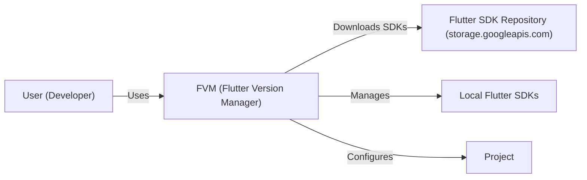
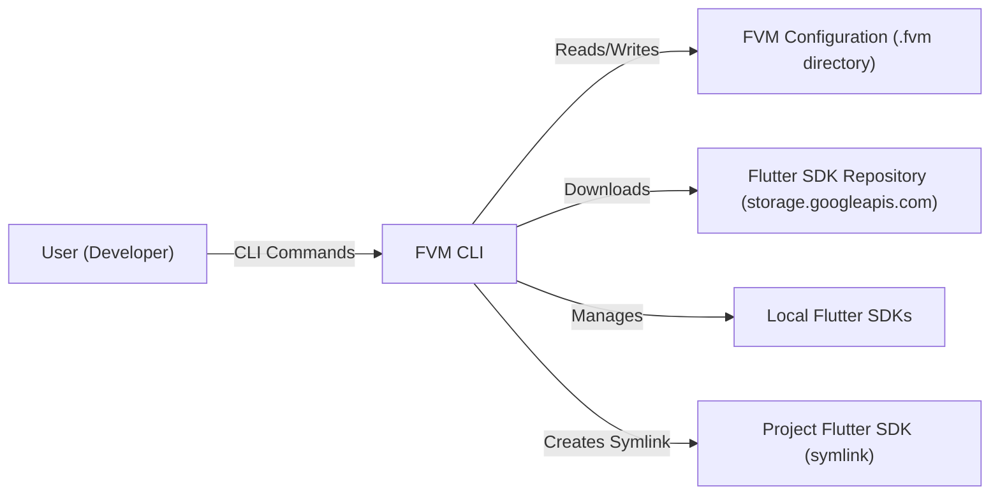
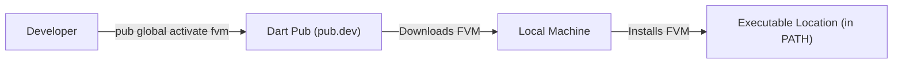
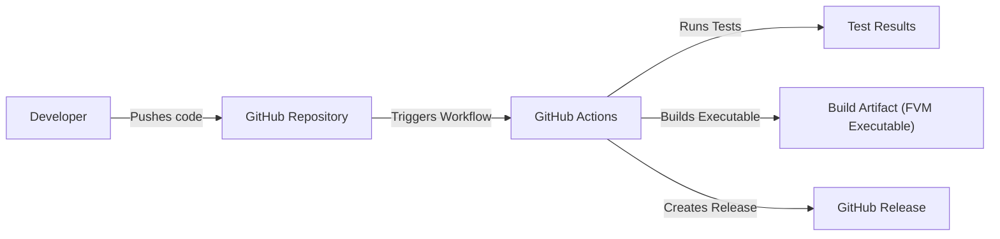

Okay, let's create a design document for the FVM (Flutter Version Management) project.

# BUSINESS POSTURE

FVM is a command-line tool to manage multiple Flutter SDK versions on a per-project basis.  It simplifies development workflows where different projects require different Flutter versions, avoiding global SDK conflicts.

Priorities and Goals:

*   Enable seamless switching between Flutter SDK versions.
*   Improve developer productivity by eliminating manual SDK management.
*   Ensure project reproducibility by pinning specific Flutter versions.
*   Provide a simple and intuitive command-line interface.
*   Support multiple operating systems (macOS, Linux, Windows).
*   Maintain a small, efficient codebase.

Business Risks:

*   Incompatibility with future Flutter releases:  Changes in Flutter's structure or behavior could break FVM's functionality.
*   Incorrect SDK version selection: Bugs in FVM could lead to the wrong Flutter SDK being used, causing build or runtime errors.
*   Security vulnerabilities:  If FVM downloads or executes compromised Flutter SDKs, it could expose user systems to malware.
*   Lack of adoption: If developers don't find FVM useful or reliable, it won't be widely used.
*   Maintenance overhead:  Keeping FVM up-to-date with Flutter releases and user requests could become burdensome.
*   Loss of Flutter SDK downloads: FVM relies on Flutter SDK downloads, if they are not available FVM will not work.

# SECURITY POSTURE

Existing Security Controls:

*   security control: Version Pinning: FVM allows users to pin a specific Flutter SDK version to a project, ensuring consistent builds.  This is described in the project's README and implemented through the `.fvm/flutter_sdk` symlink.
*   security control: Directory-based Configuration: FVM uses a local `.fvm` directory within each project to store configuration and the selected Flutter SDK, isolating it from other projects and the global Flutter installation. This is described in the project's README.
*   security control: Symlink-based SDK Switching: FVM uses symbolic links to switch between Flutter SDK versions, avoiding direct modification of the global Flutter installation. This is a core part of FVM's design.
*   security control: Basic Input Validation: FVM likely performs some basic input validation on user-provided commands and arguments, although this needs to be verified in the code.
*   security control: Uses official Flutter SDK downloads: FVM downloads Flutter SDK from official sources.

Accepted Risks:

*   accepted risk: Reliance on External Downloads: FVM relies on downloading Flutter SDKs from external sources (storage.googleapis.com).  The integrity of these downloads is crucial.
*   accepted risk: Local File System Access: FVM requires read/write access to the local file system to manage SDKs and configuration files.
*   accepted risk: No Code Signing:  FVM releases (as of this analysis) are not code-signed. This means users cannot verify the authenticity and integrity of the downloaded FVM executable.
*   accepted risk: Limited Error Handling:  The project's error handling might not cover all edge cases, potentially leading to unexpected behavior.
*   accepted risk: No formal security audits: Project didn't go thru formal security audits.

Recommended Security Controls:

*   security control: Implement SHA256 Checksum Verification: Verify the integrity of downloaded Flutter SDKs by comparing their SHA256 checksums against known good values.
*   security control: Code Signing: Digitally sign FVM releases to allow users to verify their authenticity and integrity.
*   security control: Enhanced Input Validation: Implement robust input validation to prevent command injection or other vulnerabilities.
*   security control: Sandboxing (if feasible): Explore sandboxing techniques to limit FVM's access to the file system and other resources.
*   security control: Regular Security Audits: Conduct periodic security audits and penetration testing to identify and address vulnerabilities.
*   security control: Dependency Management: Carefully manage and audit third-party dependencies to minimize the risk of supply chain attacks.
*   security control: Supply Chain Security: Implement SLSA framework to ensure security of build and supply chain.

Security Requirements:

*   Authentication: Not directly applicable, as FVM operates locally and doesn't interact with remote authentication services. However, if FVM were to support private Flutter SDK repositories, authentication would be required.
*   Authorization: Not directly applicable in the current context. FVM operates with the user's existing file system permissions.
*   Input Validation:
    *   Validate all user-provided input, including commands, arguments, and configuration file contents.
    *   Sanitize file paths to prevent directory traversal attacks.
    *   Reject unexpected or invalid input.
*   Cryptography:
    *   Use SHA256 checksums to verify the integrity of downloaded Flutter SDKs.
    *   If private repositories are supported, use secure communication protocols (HTTPS) and appropriate cryptographic algorithms for authentication and data transfer.

# DESIGN

## C4 CONTEXT

Element Descriptions:

*   Element:
    *   Name: User (Developer)
    *   Type: Person
    *   Description: A software developer using Flutter.
    *   Responsibilities: Uses FVM to manage Flutter SDK versions for their projects.
    *   Security controls: N/A (External to the system)

*   Element:
    *   Name: FVM (Flutter Version Manager)
    *   Type: Software System
    *   Description: The command-line tool for managing Flutter SDK versions.
    *   Responsibilities: Downloads, installs, and switches between Flutter SDK versions; manages project-specific SDK configurations.
    *   Security controls: Version Pinning, Directory-based Configuration, Symlink-based SDK Switching, Basic Input Validation, Uses official Flutter SDK downloads.

*   Element:
    *   Name: Flutter SDK Repository (storage.googleapis.com)
    *   Type: External System
    *   Description: The official repository for downloading Flutter SDKs.
    *   Responsibilities: Provides Flutter SDK releases for various platforms and versions.
    *   Security controls: N/A (External to the system, assumed to be managed by Google)

*   Element:
    *   Name: Local Flutter SDKs
    *   Type: File System
    *   Description: The locally stored Flutter SDKs managed by FVM.
    *   Responsibilities: Provide the Flutter SDK binaries and tools for building and running Flutter applications.
    *   Security controls: File system permissions (managed by the operating system).

*   Element:
    *   Name: Project
    *   Type: File System
    *   Description: Flutter project.
    *   Responsibilities: Contains Flutter application code.
    *   Security controls: File system permissions (managed by the operating system).

## C4 CONTAINER

Element Descriptions:

*   Element:
    *   Name: User (Developer)
    *   Type: Person
    *   Description: A software developer using Flutter.
    *   Responsibilities: Uses FVM to manage Flutter SDK versions for their projects.
    *   Security controls: N/A (External to the system)

*   Element:
    *   Name: FVM CLI
    *   Type: Container (Command-line application)
    *   Description: The main entry point for interacting with FVM.
    *   Responsibilities: Parses user commands, interacts with the file system, downloads SDKs, manages configuration.
    *   Security controls: Basic Input Validation.

*   Element:
    *   Name: FVM Configuration (.fvm directory)
    *   Type: Container (File System)
    *   Description: Stores project-specific FVM configuration, including the pinned Flutter SDK version.
    *   Responsibilities: Persists FVM configuration.
    *   Security controls: File system permissions (managed by the operating system).

*   Element:
    *   Name: Flutter SDK Repository (storage.googleapis.com)
    *   Type: External System
    *   Description: The official repository for downloading Flutter SDKs.
    *   Responsibilities: Provides Flutter SDK releases for various platforms and versions.
    *   Security controls: N/A (External to the system, assumed to be managed by Google)

*   Element:
    *   Name: Local Flutter SDKs
    *   Type: Container (File System)
    *   Description: The locally stored Flutter SDKs managed by FVM.
    *   Responsibilities: Provide the Flutter SDK binaries and tools for building and running Flutter applications.
    *   Security controls: File system permissions (managed by the operating system).

*   Element:
    *   Name: Project Flutter SDK (symlink)
    *   Type: Container (File System - Symbolic Link)
    *   Description: A symbolic link pointing to the selected Flutter SDK for a specific project.
    *   Responsibilities: Provides a consistent path to the Flutter SDK used by the project.
    *   Security controls: File system permissions (managed by the operating system).

## DEPLOYMENT

Possible Deployment Solutions:

1.  Manual Installation: Users download the FVM executable and place it in their system's PATH.
2.  Package Manager: FVM could be distributed through package managers like Homebrew (macOS), apt (Debian/Ubuntu), or Chocolatey (Windows).
3.  Dart Pub: FVM could be installed using Dart's package manager, `pub`.

Chosen Solution (Dart Pub):

Element Descriptions:

*   Element:
    *   Name: Developer
    *   Type: Person
    *   Description: A software developer installing FVM.
    *   Responsibilities: Runs the `pub global activate fvm` command.
    *   Security controls: N/A (External to the system)

*   Element:
    *   Name: Dart Pub (pub.dev)
    *   Type: External System
    *   Description: Dart's official package repository.
    *   Responsibilities: Hosts FVM package and its dependencies.
    *   Security controls: N/A (External to the system, assumed to be managed by Google)

*   Element:
    *   Name: Local Machine
    *   Type: Infrastructure Node (Developer's Computer)
    *   Description: The developer's computer where FVM is being installed.
    *   Responsibilities: Downloads and installs FVM.
    *   Security controls: Operating system security controls, user permissions.

*   Element:
    *   Name: Executable Location (in PATH)
    *   Type: Infrastructure Node (File System)
    *   Description: The directory where the FVM executable is installed and made accessible via the system's PATH.
    *   Responsibilities: Provides access to the FVM command-line tool.
    *   Security controls: File system permissions (managed by the operating system).

## BUILD

FVM uses GitHub Actions for its build and release process.

Build Process Description:

1.  Developer pushes code changes to the GitHub repository.
2.  GitHub Actions workflow is triggered.
3.  The workflow runs tests (unit tests, integration tests).
4.  If tests pass, the workflow builds the FVM executable for different platforms (macOS, Linux, Windows).
5.  The workflow creates a new GitHub Release, including the built executables as assets.

Security Controls in Build Process:

*   security control: Automated Build: GitHub Actions provides a consistent and automated build process.
*   security control: Testing: The workflow includes tests to ensure code quality and prevent regressions.
*   security control: Version Control: All code changes are tracked in the Git repository.
*   security control: Dependency Management: Dependencies are managed through `pubspec.yaml` and `pubspec.lock` files.

# RISK ASSESSMENT

Critical Business Processes:

*   Managing multiple Flutter SDK versions.
*   Switching between Flutter SDK versions seamlessly.
*   Ensuring project reproducibility.

Data:

*   Flutter SDKs (binaries and source code): Sensitivity - Medium (publicly available, but integrity is crucial).
*   FVM Configuration Files: Sensitivity - Low (contains paths to SDKs and project settings).
*   Project Source Code: Sensitivity - Depends on the project (FVM itself doesn't directly handle project source code, but it interacts with the project directory).

# QUESTIONS & ASSUMPTIONS

Questions:

*   What is the expected frequency of Flutter SDK releases? This impacts the maintenance effort for FVM.
*   Are there any plans to support private Flutter SDK repositories in the future? This would introduce authentication and authorization requirements.
*   What level of error logging and reporting is desired?
*   Are there plans to support other package managers?

Assumptions:

*   BUSINESS POSTURE: The primary users of FVM are individual developers and small teams.
*   BUSINESS POSTURE:  The project prioritizes simplicity and ease of use over advanced features.
*   SECURITY POSTURE:  Users trust the official Flutter SDK repository (storage.googleapis.com).
*   SECURITY POSTURE: Users are responsible for securing their own file systems.
*   DESIGN:  The Dart Pub installation method is the primary distribution mechanism.
*   DESIGN: GitHub Actions will continue to be used for CI/CD.
*   DESIGN: FVM will continue to be a command-line tool.