# Project Design Document: Flutter File Picker

**Version:** 1.1
**Date:** October 26, 2023
**Author:** AI Software Architect

## 1. Introduction

This document provides a detailed design overview of the `flutter_file_picker` project. This Flutter package enables developers to interact with the native file explorer on various platforms (Android, iOS, macOS, Windows, Linux, and web) to select files and directories. The primary purpose of this document is to serve as a foundation for threat modeling activities, identifying potential security vulnerabilities and risks associated with the package's design and implementation.

## 2. Goals

* Provide a clear and comprehensive understanding of the `flutter_file_picker` architecture, specifically for security analysis.
* Identify key components, their functionalities, and their interactions with a focus on potential security implications.
* Detail the data flow within the package, highlighting sensitive data handling and potential points of compromise.
* Outline potential areas of security concern and suggest starting points for future threat modeling exercises.

## 3. Architectural Overview

The `flutter_file_picker` package acts as an intermediary, facilitating communication between Flutter/Dart code and the native platform's file selection mechanisms. It utilizes Flutter's platform channels to bridge the gap between the Dart environment and platform-specific native code.

```mermaid
graph LR
    subgraph "Flutter Application Environment"
        A("Flutter Widget/\nApplication Logic")
    end
    B("flutter_file_picker Package\n(Dart API)")
    subgraph "Flutter Platform Channel"
        C("MethodChannel (Dart Side)")
        D("MethodChannel (Native Side)")
    end
    subgraph "Native Platform Interface"
        E("Android\nFile Picker API\n(Intents)")
        F("iOS\nUIDocumentPickerViewController")
        G("macOS\nNSOpenPanel")
        H("Windows\nIFileOpenDialog")
        I("Linux\nGTK/Qt File Dialog")
        J("Web Browser\n(<input type='file'>)")
    end
    K("Operating System/\nBrowser File System")

    A -- "Initiates File/Directory\nSelection Request" --> B
    B -- "Invokes Platform Channel\nMethod (e.g., 'pickFile')" --> C
    C -- "Serializes Method Call\n& Arguments" --> D
    D -- "Deserializes Method Call\n& Arguments" --> E
    D -- "Deserializes Method Call\n& Arguments" --> F
    D -- "Deserializes Method Call\n& Arguments" --> G
    D -- "Deserializes Method Call\n& Arguments" --> H
    D -- "Deserializes Method Call\n& Arguments" --> I
    D -- "Deserializes Method Call\n& Arguments" --> J
    E -- "Interacts with OS\nFile System APIs" --> K
    F -- "Interacts with OS\nFile System APIs" --> K
    G -- "Interacts with OS\nFile System APIs" --> K
    H -- "Interacts with OS\nFile System APIs" --> K
    I -- "Interacts with OS\nFile System APIs" --> K
    J -- "Interacts with Browser\nFile System APIs" --> K
    K -- "Returns Selected File(s)\nPath(s)/Data" --> E
    K -- "Returns Selected File(s)\nPath(s)/Data" --> F
    K -- "Returns Selected File(s)\nPath(s)/Data" --> G
    K -- "Returns Selected File(s)\nPath(s)/Data" --> H
    K -- "Returns Selected File(s)\nPath(s)/Data" --> I
    K -- "Returns Selected File(s)\nPath(s)/Data" --> J
    E -- "Serializes Result\n(File Path(s)/Error)" --> D
    F -- "Serializes Result\n(File Path(s)/Error)" --> D
    G -- "Serializes Result\n(File Path(s)/Error)" --> D
    H -- "Serializes Result\n(File Path(s)/Error)" --> D
    I -- "Serializes Result\n(File Path(s)/Error)" --> D
    J -- "Serializes Result\n(File Path(s)/Error)" --> D
    D -- "Sends Result" --> C
    C -- "Deserializes Result" --> B
    B -- "Returns File Path(s)\nto Flutter Application" --> A
```

## 4. Component Description

* **Flutter Application Environment (Flutter Widget/Application Logic):** This represents the portion of the Flutter application that initiates the file or directory selection process by interacting with the `flutter_file_picker` package. This component defines the user intent and handles the returned file information.
* **`flutter_file_picker` Package (Dart API):** This is the core Dart code of the package, providing the public API for Flutter developers. It acts as an abstraction layer over the platform-specific implementations.
    * **Public API:** Exposes methods like `pickFiles`, `pickFile`, `pickDirectory`, and configuration options for allowed file types, etc. Security considerations here include validation of these input parameters.
    * **Platform Channel Invocation Logic:** Responsible for determining the target platform and invoking the corresponding method on the platform channel with appropriate arguments. Potential vulnerabilities could arise from incorrect argument construction or insufficient sanitization.
    * **Result Handling Logic:** Processes the results received from the native platform (file paths, data, or errors) and formats them for use by the Flutter application. Error handling and potential information leakage in error messages are relevant here.
* **Flutter Platform Channel:** This is the communication bridge provided by Flutter for interaction between Dart and native code.
    * **MethodChannel (Dart Side):**  Handles the serialization of method calls and arguments from Dart to a format suitable for transmission to the native side. Security considerations involve the integrity and confidentiality of the data being transmitted.
    * **MethodChannel (Native Side):** Receives the serialized method calls and arguments, deserializes them, and invokes the appropriate native platform APIs. Vulnerabilities could arise from improper deserialization or handling of malicious payloads.
* **Native Platform Interface:** This encompasses the platform-specific implementations responsible for interacting with the operating system's file selection mechanisms.
    * **Android File Picker API (Intents):** Uses `Intent` actions like `ACTION_GET_CONTENT`, `ACTION_OPEN_DOCUMENT`, and `ACTION_OPEN_DOCUMENT_TREE`. Security considerations include ensuring proper intent filtering and handling of returned URIs, which might grant access beyond the intended scope. Permissions like `READ_EXTERNAL_STORAGE` are crucial here.
    * **iOS UIDocumentPickerViewController:** Provides a secure and sandboxed way to access user documents. Security considerations involve understanding the limitations of the sandbox and potential ways to bypass them.
    * **macOS NSOpenPanel:** The standard macOS dialog. Security considerations include ensuring proper handling of symbolic links and aliases.
    * **Windows IFileOpenDialog:** The standard Windows dialog. Security considerations involve understanding the security implications of different dialog options and potential for COM object vulnerabilities.
    * **Linux GTK/Qt File Dialog:** Utilizes GTK's `GtkFileChooserDialog` or Qt's `QFileDialog`. Security considerations depend on the specific implementation and potential vulnerabilities in the underlying libraries.
    * **Web Browser (`<input type='file'>`):** Relies on the browser's built-in security mechanisms and the Same-Origin Policy. Security considerations involve understanding the limitations of client-side validation and the potential for cross-site scripting (XSS) attacks if file contents are not handled carefully.
* **Operating System/Browser File System:** This is the underlying file system managed by the operating system or the browser. Security considerations here involve the inherent security of the file system itself, including permissions and access controls.

## 5. Data Flow

The process of selecting a file or directory using `flutter_file_picker` involves the following data flow:

1. **Initiation:** The Flutter application initiates a file or directory selection request by calling a method from the `flutter_file_picker` package's API. This includes specifying parameters like allowed file types and whether multiple selections are permitted.
2. **Platform Channel Invocation (Dart):** The `flutter_file_picker` package prepares the method name (e.g., 'pickFile') and arguments (e.g., allowed extensions) and invokes the corresponding method on the Dart side of the platform channel. This involves serializing the data.
3. **Platform Channel Transmission:** The Flutter framework transmits the serialized method call and arguments across the platform boundary to the native side of the platform channel.
4. **Native Method Handling:** The native platform code receives the serialized data, deserializes it, and interprets the method call. Based on the target platform, it invokes the appropriate native file picker API, configuring it based on the provided arguments.
5. **User Interaction and File System Access:** The operating system or browser presents the file selection dialog to the user. The user interacts with the file system to select the desired file(s) or directory. The native file picker API interacts directly with the OS/Browser file system to retrieve the selected item(s).
6. **Result Retrieval (Native):** Once the user confirms their selection, the native file picker API returns the path(s) of the selected item(s) (or file data in some cases on the web) to the native platform code. This might involve accessing file system metadata or even reading file contents (for web).
7. **Result Transmission (Native):** The native platform code serializes the result (file path(s), file data, or an error message) and sends it back to the Dart side through the platform channel.
8. **Platform Channel Transmission (Dart):** The Flutter framework transmits the serialized result back across the platform boundary to the Dart side of the platform channel.
9. **Result Handling (Dart):** The `flutter_file_picker` package receives the serialized result, deserializes it, and processes it. This might involve error checking or formatting the file paths.
10. **Return to Application:** The `flutter_file_picker` package returns the processed result (typically a list of file paths or file data) to the calling Flutter application.
11. **Application Processing:** The Flutter application receives the file path(s) or data and can then proceed to access and process the selected file(s). This is where potential vulnerabilities related to how the application handles the returned data can arise.

## 6. Security Considerations (For Threat Modeling)

This section highlights potential areas of security concern that should be explored during threat modeling:

* **Input Validation and Sanitization:**
    * **Dart Side:** How rigorously are the arguments passed to the `flutter_file_picker` API (e.g., allowed extensions, type of selection) validated? Could a malicious application provide crafted input to bypass intended restrictions or cause unexpected behavior in the native code?
    * **Native Side:** Is the data received from the Dart side through the platform channel properly validated and sanitized before being used to interact with native file picker APIs? Could malicious data cause crashes or unexpected behavior?
* **Path Traversal Vulnerabilities:**
    * Are the file paths returned by the native file picker properly validated and sanitized before being returned to the Flutter application? Could a malicious user select files outside the intended scope, leading to unauthorized access if the application blindly trusts the returned paths?
* **Data Handling and Temporary Files:**
    * **Native Side:** Do the native file picker implementations create temporary files during the selection process? If so, how are these files managed, secured, and cleaned up? Could sensitive data be left behind in temporary files?
    * **Memory Management:** How is file data handled in memory on both the Dart and native sides? Are there risks of memory leaks or exposure of sensitive data in memory?
* **Platform Channel Security:**
    * **Data Integrity and Confidentiality:** While platform channels offer some isolation, is the data transmitted between Dart and native code susceptible to interception or tampering by other malicious applications or native modules?
    * **Method Spoofing:** Could a malicious native module intercept or spoof method calls intended for the `flutter_file_picker` package?
* **Permissions and Access Control:**
    * **Android Permissions:** Does the package correctly declare and request necessary permissions (e.g., `READ_EXTERNAL_STORAGE`) on Android? Could the file picker be used to access files without proper permissions?
    * **iOS Sandbox:** How does the package interact with the iOS sandbox? Are there potential ways to escape the sandbox or access files outside the allowed containers?
    * **Web Browser Security:** How does the package leverage browser security features like the Same-Origin Policy? Are there potential for cross-site scripting (XSS) attacks if the application handles file contents without proper sanitization?
* **Error Handling and Information Disclosure:**
    * Are error conditions during the file picking process handled gracefully? Do error messages potentially leak sensitive information about the file system or internal state of the package?
* **Third-Party Dependencies (Native):**
    * Do the native implementations rely on any third-party libraries? If so, are there known vulnerabilities in those libraries that could be exploited?
* **Platform-Specific Vulnerabilities:**
    * Are there any known security vulnerabilities specific to the native file picker implementations on different platforms that could be indirectly exploited through this package? For example, vulnerabilities in how specific operating systems handle file dialogs.
* **Security of Returned File Data (Web):**
    * On the web, the file picker can return the actual file content. How does the package handle this data? Are there risks of exposing sensitive information if the data is not processed securely by the application?

## 7. Assumptions and Limitations

* This design document assumes that the underlying Flutter framework and platform channel mechanisms are inherently secure.
* The security considerations are intended to be a starting point for threat modeling. A comprehensive security analysis would require a deeper dive into the source code and platform-specific implementations.
* This document primarily focuses on the core file and directory picking functionality and does not cover potential extensions or integrations with other services.

## 8. Technology Stack

* **Programming Languages:** Dart, Java/Kotlin (Android), Objective-C/Swift (iOS/macOS), C/C++ (Windows/Linux), JavaScript (Web)
* **Framework:** Flutter
* **Platform Channels:** Flutter's method channels for communication between Dart and native code.
* **Native APIs:**
    * **Android:** `Intent`, `ACTION_GET_CONTENT`, `ACTION_OPEN_DOCUMENT`, `ACTION_OPEN_DOCUMENT_TREE`, `ContentResolver`
    * **iOS:** `UIDocumentPickerViewController`, `UTType`
    * **macOS:** `NSOpenPanel`
    * **Windows:** `IFileOpenDialog`, COM
    * **Linux:** GTK (`GtkFileChooserDialog`), Qt (`QFileDialog`)
    * **Web:** HTML `<input type='file'>` element, JavaScript File API