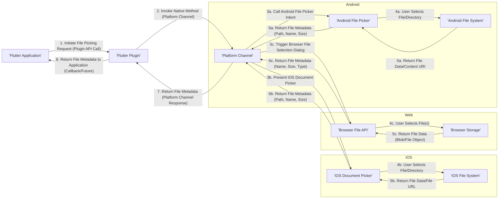

# Project Design Document: Flutter File Picker Plugin

**Version:** 1.1
**Date:** October 26, 2023
**Author:** Gemini (AI Language Model)

## 1. Project Overview

This document details the design of the `flutter_file_picker` plugin, a Flutter package enabling Flutter applications to interact with the native platform's file system for user-driven file and directory selection. This document provides a comprehensive view of the plugin's architecture, data flow, and crucial security considerations, specifically for threat modeling purposes. It is based on the publicly available codebase at [https://github.com/miguelpruivo/flutter_file_picker](https://github.com/miguelpruivo/flutter_file_picker).

## 2. Goals and Objectives

The primary objectives of the `flutter_file_picker` plugin are to:

*   Offer a cross-platform API for Flutter apps to leverage native file picking capabilities.
*   Facilitate the selection of single or multiple files by the user.
*   Enable users to select directories.
*   Provide mechanisms to filter selectable file types based on file extensions.
*   Return essential file metadata, including the file path, name, and size.
*   Maintain a straightforward and developer-friendly API for Flutter integration.

## 3. Target Audience

This document is intended for:

*   Software Architects involved in system design and integration.
*   Security Engineers responsible for threat assessment and mitigation strategies.
*   Developers integrating or extending the functionality of the `flutter_file_picker` plugin.
*   Individuals conducting threat modeling and security audits of applications utilizing this plugin.

## 4. System Architecture

The `flutter_file_picker` plugin adheres to the standard Flutter plugin architecture, acting as a bridge between Dart code and platform-specific native implementations.

```mermaid
graph LR
    subgraph "Flutter Application"
        A["'Flutter UI Code'"]
    end
    B["'Flutter Plugin (Dart)'"]
    C["'Platform Channel'"]
    subgraph "Android Platform"
        D["'Android File Picker (Java/Kotlin)'"]
        E["'Android File System'"]
    end
    subgraph "iOS Platform"
        F["'iOS Document Picker (Swift/Objective-C)'"]
        G["'iOS File System'"]
    end
    subgraph "Web Platform"
        H["'Browser File API (JavaScript)'"]
    end

    A -- "Plugin API Call (e.g., pickFiles)" --> B
    B -- "MethodChannel Invocation" --> C
    C -- "Platform Message (Method Call)" --> D
    C -- "Platform Message (Method Call)" --> F
    C -- "Platform Message (Method Call)" --> H
    D -- "User File Selection" --> E
    F -- "User File Selection" --> G
    H -- "User File Selection" --> "Browser Storage"
    E -- "File Data/URI" --> D
    G -- "File Data/URI" --> F
    "Browser Storage" -- "File Data" --> H
    D -- "Result (File Metadata)" --> C
    F -- "Result (File Metadata)" --> C
    H -- "Result (File Metadata)" --> C
    C -- "Platform Message (Method Result)" --> B
    B -- "Result (File Metadata)" --> A
```

**Components:**

*   **Flutter Application ('Flutter UI Code'):** The Dart code within a Flutter application that utilizes the `flutter_file_picker` plugin to initiate the file or directory selection process.
*   **Flutter Plugin (Dart) ('Flutter Plugin (Dart)'):** The Dart implementation of the `flutter_file_picker` plugin. This component exposes the API for Flutter developers and manages communication with the underlying native platform code.
*   **Platform Channel ('Platform Channel'):** The communication bridge provided by Flutter for interaction between Dart code and platform-specific native code (Android, iOS, Web, etc.). Typically, a `MethodChannel` is used to invoke methods on the native side.
*   **Android Platform:**
    *   **Android File Picker (Java/Kotlin) ('Android File Picker (Java/Kotlin)'):** The native Android component (e.g., using `Intent.ACTION_GET_CONTENT` or `Intent.ACTION_OPEN_DOCUMENT_TREE`) responsible for presenting the file selection user interface and interacting with the Android file system.
    *   **Android File System ('Android File System'):** The underlying file system of the Android device.
*   **iOS Platform:**
    *   **iOS Document Picker (Swift/Objective-C) ('iOS Document Picker (Swift/Objective-C)'):** The native iOS component (`UIDocumentPickerViewController`) responsible for displaying the file selection UI and interacting with the iOS file system.
    *   **iOS File System ('iOS File System'):** The underlying file system of the iOS device.
*   **Web Platform:**
    *   **Browser File API (JavaScript) ('Browser File API (JavaScript)'):** The browser's built-in APIs (e.g., utilizing the `<input type="file">` element) that allow users to select files from their local storage within the browser environment.

## 5. Data Flow

The typical sequence of actions when a user selects a file using the `flutter_file_picker` plugin is as follows:



**Detailed Steps:**

1. The Flutter application initiates the file picking process by calling a method on the `flutter_file_picker` plugin (e.g., `FilePicker.platform.pickFiles()`).
2. The plugin utilizes the `MethodChannel` to invoke the corresponding platform-specific method in the native code.
3. **Platform-Specific Handling:**
    *   **Android:** The Android plugin code launches an `Intent` to start the native file picker activity, allowing the user to browse and select files or directories.
    *   **iOS:** The iOS plugin code presents a `UIDocumentPickerViewController` to the user, providing access to the device's file system.
    *   **Web:** The web plugin code triggers the browser's built-in file selection dialog, enabling the user to choose files from their local machine.
4. The user interacts with the native file picker UI and selects the desired file(s) or directory.
5. The native platform retrieves the selected file's data or a URI/path representing the file's location.
6. The native platform code extracts relevant metadata about the selected file (e.g., file path, name, size) and sends this information back to the Flutter plugin via the `MethodChannel`.
7. The Flutter plugin receives the file metadata from the platform channel.
8. The plugin returns the collected file metadata to the originating Flutter application, typically through a `Future` or a callback function.

## 6. Security Considerations

This section outlines potential security considerations associated with the `flutter_file_picker` plugin, crucial for effective threat modeling.

*   **Input Validation and Path Traversal:**
    *   **Threat:**  If the plugin doesn't adequately validate the paths returned by the native file pickers, malicious actors might manipulate the selection process to access files or directories outside the intended scope.
    *   **Mitigation:** While the native platform pickers provide a level of security, the plugin should avoid directly using user-provided input to construct file paths without validation. Applications using the plugin should also exercise caution when handling the returned file paths.
*   **Data Exposure through Returned Paths:**
    *   **Threat:** The plugin returns the absolute path of the selected file. If this path is mishandled within the Flutter application (e.g., logged insecurely, exposed to external services), it could reveal sensitive information about the user's file system structure.
    *   **Mitigation:** Applications should be mindful of how and where they store and transmit file paths. Consider using relative paths or accessing file content only when strictly necessary.
*   **File Type Filtering Bypass:**
    *   **Threat:** The plugin allows filtering file types based on extensions. However, this client-side filtering can be bypassed by users renaming files or using tools to circumvent the filter.
    *   **Mitigation:** Relying solely on client-side filtering is insufficient for security. Applications should perform server-side validation of file types if the selected files are uploaded or processed.
*   **Permissions and Access Control:**
    *   **Threat:** The plugin relies on the underlying platform's permission model. If the application lacks the necessary permissions to access the selected file, or if the file itself has restrictive permissions, the operation might fail or expose unintended behavior.
    *   **Mitigation:** Ensure the Flutter application requests the necessary platform-specific permissions (e.g., storage access on Android). Educate users about the permissions being requested and why they are needed.
*   **Data Integrity of Returned Metadata:**
    *   **Threat:** While unlikely, there's a theoretical risk that the metadata returned by the native platform (file name, size, etc.) could be tampered with or be inaccurate due to platform-specific issues.
    *   **Mitigation:** For critical applications, consider verifying the integrity of the file content itself (e.g., using checksums) rather than solely relying on the metadata provided by the plugin.
*   **Web Platform Security Considerations:**
    *   **Threat:** On the web platform, the browser's security sandbox restricts file system access. However, vulnerabilities in the browser or the website hosting the Flutter application could potentially be exploited to gain unauthorized access.
    *   **Mitigation:** Adhere to web security best practices, including implementing a strong Content Security Policy (CSP), to mitigate potential cross-site scripting (XSS) and other web-based attacks.
*   **Plugin Dependencies and Supply Chain Security:**
    *   **Threat:** The plugin itself depends on the Flutter SDK and platform-specific APIs. Vulnerabilities in these dependencies could indirectly affect the security of the `flutter_file_picker` plugin.
    *   **Mitigation:** Regularly update the Flutter SDK and the `flutter_file_picker` plugin to benefit from security patches and updates.
*   **Handling of Temporary Files by Native Pickers:**
    *   **Threat:** Native file pickers might create temporary files during the selection process. If these temporary files contain sensitive data and are not properly managed or deleted, they could pose a security risk.
    *   **Mitigation:** Understand how the underlying platform handles temporary files. While the plugin itself might not directly control this, applications should be aware of potential temporary file creation and their implications.

## 7. Dependencies

The `flutter_file_picker` plugin relies on the following core components:

*   **Flutter SDK:** The fundamental framework for building cross-platform applications.
*   **Platform Channels:** Flutter's mechanism for enabling communication between Dart and native platform code.
*   **Android SDK:** Required for the Android platform implementation of the file picker functionality.
*   **iOS SDK:** Necessary for the iOS platform implementation of the document picker functionality.
*   **Web Browser APIs:** Utilized for the web platform implementation, leveraging the browser's built-in file handling capabilities.

## 8. Deployment

The `flutter_file_picker` plugin is distributed as a standard Flutter package on pub.dev, the official package repository for Dart and Flutter. Developers can integrate it into their Flutter projects by adding the plugin as a dependency in their `pubspec.yaml` file and executing the `flutter pub get` command.

## 9. Future Considerations

*   **Enhanced File Selection Options:** Explore adding support for more granular file filtering options, such as filtering by MIME type or other file attributes beyond just extensions.
*   **Integration with Cloud Storage Services:** Investigate the possibility of directly integrating with popular cloud storage providers, allowing users to select files from their cloud accounts.
*   **Improved Error Handling and Reporting:** Provide more detailed and informative error messages to the Flutter application in case of failures during the file picking process.
*   **Customizable UI Elements:** Consider offering options for developers to customize the appearance and behavior of the native file picker UI, while respecting platform conventions and limitations.
*   **Progress Indication for Long Operations:** Implement progress indicators for scenarios where file selection or processing might take a significant amount of time.

This document provides a detailed design overview of the `flutter_file_picker` plugin, with a strong emphasis on security considerations relevant for threat modeling activities. It serves as a valuable resource for understanding the plugin's architecture, data flow, and potential security implications.