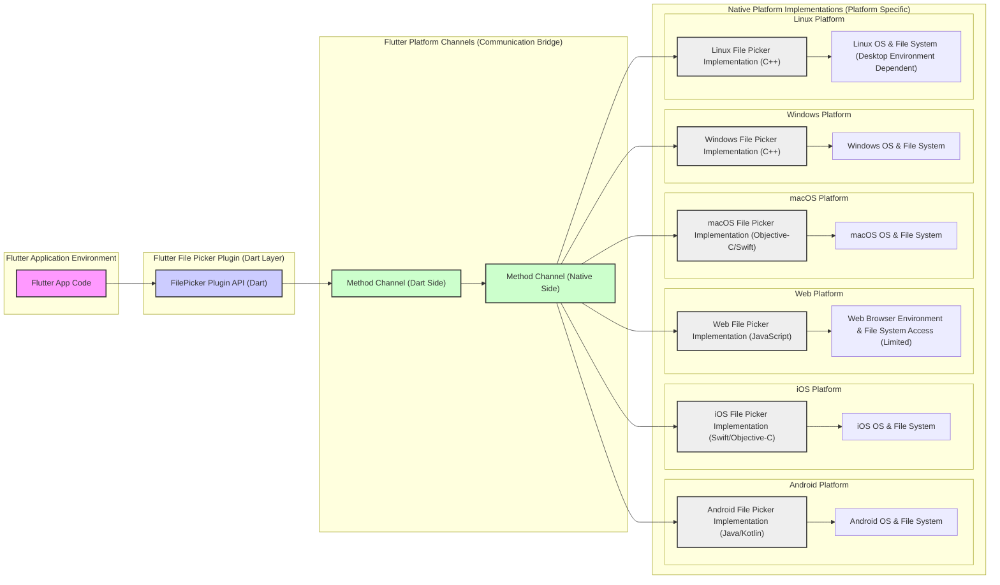
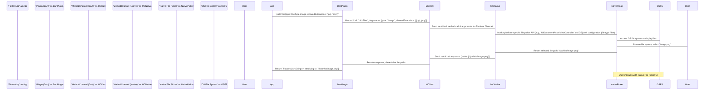

# Project Design Document: Flutter File Picker Plugin - Improved

**Project Name:** Flutter File Picker Plugin

**Project Repository:** [https://github.com/miguelpruivo/flutter_file_picker](https://github.com/miguelpruivo/flutter_file_picker)

**Version:** 1.1 (Design Document - Improved Version for Threat Modeling)

**Date:** 2023-10-27

**Author:** AI Software Architect

## 1. Introduction

This document provides an enhanced design overview of the Flutter File Picker plugin, building upon the initial design document. It aims to provide a more detailed and refined description of the plugin's architecture, data flow, and security considerations. This improved document is specifically tailored to facilitate a comprehensive threat modeling exercise, enabling a deeper understanding of potential security vulnerabilities and risks associated with the plugin.

## 2. Project Goals and Objectives

The core goals and objectives remain consistent with the initial design document, focusing on providing a robust and user-friendly file picking solution for Flutter applications:

*   **File Selection:** Enable users to select files from the device's file system (single or multiple files).
*   **Directory Selection:** Allow users to choose directories from the device's storage.
*   **File Type Filtering:** Support filtering selectable files based on file extensions or MIME types, enhancing user experience and security by limiting file choices.
*   **Cross-Platform Compatibility:** Ensure seamless operation across all supported Flutter platforms: Android, iOS, Web, macOS, Windows, and Linux.
*   **Asynchronous API:** Maintain a simple, asynchronous Dart API that aligns with Flutter's reactive programming paradigm, ensuring non-blocking UI interactions.
*   **Ease of Integration:** Provide a straightforward API that is easy for Flutter developers to integrate into their applications.

## 3. System Architecture

The Flutter File Picker plugin's architecture is based on the Flutter platform channel mechanism, facilitating communication between Dart code and platform-specific native code.

### 3.1. High-Level Architecture Diagram

### 3.2. Component Description (Enhanced)

*   **Flutter App Code:** The Dart codebase of the application utilizing the `flutter_file_picker` plugin. It initiates file/directory picking requests through the plugin's Dart API and handles the results (file paths). This is the entry point for using the plugin's functionality.
*   **FilePicker Plugin API (Dart):** This Dart component provides the public API for Flutter developers. It encapsulates the plugin's functionality and offers methods like `pickFiles()`, `pickDirectory()`, and configuration parameters (e.g., `type`, `allowedExtensions`, `allowMultiple`, `initialDirectory`). It abstracts away the platform-specific complexities and provides a consistent interface.
*   **Method Channel (Dart Side):**  Part of Flutter's platform channel infrastructure. It serializes method calls and arguments from the Dart API into messages that can be transmitted to the native platform side. It acts as the client-side endpoint of the communication bridge.
*   **Method Channel (Native Side):** The counterpart on the native platform. It receives serialized messages from the Dart side, deserializes them, and dispatches them to the appropriate native platform file picker implementation. It also handles responses from the native side and sends them back to the Dart side. This is the server-side endpoint of the communication bridge.
*   **Native Platform Implementations (Platform Specific):** These components are platform-dependent and leverage native APIs to provide the file picking functionality.
    *   **Android File Picker Implementation (Java/Kotlin):** Utilizes Android `Intents` such as `ACTION_GET_CONTENT` (for files) and `ACTION_OPEN_DOCUMENT_TREE` (for directories). It interacts with the Android OS file system through these Intents, presenting the native Android file picker UI.
    *   **iOS File Picker Implementation (Swift/Objective-C):** Employs `UIDocumentPickerViewController` to present the standard iOS file picker interface. It interacts with the iOS file system, respecting iOS's sandboxing and security policies.
    *   **Web File Picker Implementation (JavaScript):** Leverages the HTML `<input type="file">` element. This implementation is constrained by browser security models, offering limited file system access compared to native platforms. It relies on the browser's built-in file selection dialog.
    *   **macOS File Picker Implementation (Objective-C/Swift):** Uses `NSOpenPanel` (and potentially `NSSavePanel` if save functionality were added in the future) to display the native macOS file selection dialog. It interacts with the macOS file system, adhering to macOS security and permission models.
    *   **Windows File Picker Implementation (C++):** Employs the Common Item Dialog API (e.g., `IFileOpenDialog`, `IFileSaveDialog`). This provides access to the Windows file system and presents the standard Windows file selection dialog.
    *   **Linux File Picker Implementation (C++):**  Implementation is often dependent on the desktop environment. It typically utilizes GTK (using `GtkFileChooserDialog`) or Qt (using `QFileDialog`) to present native-looking file dialogs on Linux. The specific library used might vary based on plugin configuration or platform detection.
*   **Operating System & File System (Platform Specific):** The underlying operating system and its file system are the fundamental components. They manage file storage, permissions, and access control. The plugin interacts with these through the native platform APIs.

## 4. Data Flow (Detailed)

The data flow for picking a file is described in more detail below, emphasizing the steps and data transformations involved:

**Detailed Data Flow Steps (Expanded):**

1.  **Application Request:** The Flutter application initiates a file picking request by calling a method in the `FilePicker Plugin API (Dart)`, such as `pickFiles()`, providing configuration parameters like `FileType` and `allowedExtensions`.
2.  **Dart Plugin Processing:** The Dart plugin API receives the request and prepares a method call message. This message includes the method name (e.g., "pickFiles") and arguments (e.g., file type, allowed extensions, multiple selection flag).
3.  **Serialization and Platform Channel Transmission:** The Dart Method Channel serializes the method call and arguments into a platform-agnostic format (often binary serialization). This serialized message is then transmitted across the Flutter platform channel to the native platform side.
4.  **Native Method Channel Reception and Deserialization:** The Native Method Channel receives the serialized message. It deserializes the message, extracting the method name and arguments.
5.  **Native Platform Picker Invocation:** Based on the method name (e.g., "pickFiles"), the native platform code invokes the appropriate native file picker API. Configuration parameters from the Dart side (like `allowedExtensions`) are translated and applied to the native file picker API to filter file types presented to the user.
6.  **OS File System Interaction and User Interface:** The native file picker API interacts with the operating system's file system to retrieve and display files and directories to the user. The OS presents a native file selection dialog or UI to the user.
7.  **User Interaction and File Selection:** The user interacts with the native file picker UI, browsing the file system, and selecting the desired file(s) or directory. The user's interaction is handled entirely within the native OS environment.
8.  **File Path Retrieval and Native Response:** Once the user confirms their selection, the native OS file picker returns the absolute path(s) of the selected file(s) or directory to the native platform plugin code.
9.  **Serialization and Platform Channel Response:** The native platform plugin code packages the file path(s) into a response message. This response is serialized and sent back across the platform channel to the Dart side.
10. **Dart Method Channel Reception and Deserialization:** The Dart Method Channel receives the serialized response message and deserializes it, extracting the file path(s).
11. **Dart Plugin Response Handling:** The Dart plugin API receives the deserialized file path(s). It completes the `Future` returned by the initial `pickFiles()` call, providing the file path(s) as the result.
12. **Application Result Handling:** The Flutter application receives the file path(s) as the result of the `pickFiles()` call and can then proceed to use these paths for further operations (e.g., accessing file content, displaying file information).

## 5. Security Considerations (Enhanced for Threat Modeling)

This section provides a more detailed breakdown of security considerations, categorized for threat modeling purposes.

### 5.1. Threat Categories

*   **Confidentiality:** Protecting sensitive file paths and potentially file content (if future enhancements include content access) from unauthorized disclosure.
*   **Integrity:** Ensuring that the file paths returned by the plugin are accurate and haven't been tampered with. Also, maintaining the integrity of the plugin's code and dependencies.
*   **Availability:** Ensuring the file picker functionality is reliably available and resistant to denial-of-service attacks or failures.
*   **Authorization & Access Control:**  Properly managing permissions required to access the file system and ensuring the plugin operates within the expected security context of the application and the OS.

### 5.2. Potential Threats and Vulnerabilities

*   **Path Traversal (Application Side):** While the plugin itself primarily returns paths, a vulnerability could arise in the *consuming Flutter application* if it improperly handles or validates the returned file paths. For example, if the application uses the path directly in file system operations without sanitization, it could be susceptible to path traversal attacks if an attacker can influence the returned path (though unlikely in this plugin's context, it's a general consideration).
    *   **Mitigation:**  Flutter applications should always validate and sanitize file paths received from external sources, including plugins, before using them in file system operations. Use secure file handling practices provided by Dart and the OS.
*   **Unauthorized File Access (Plugin or Native Implementation Vulnerabilities):**  Bugs or vulnerabilities in the native platform implementations of the file picker could potentially lead to the plugin accessing files or directories beyond the user's intended selection or application's authorized scope.
    *   **Mitigation:**  Thorough code reviews and security testing of the native platform implementations are crucial. Regularly update plugin dependencies and Flutter framework to benefit from security patches. Adhere to platform-specific security best practices during development.
*   **Information Disclosure (File Paths):**  If the plugin or the consuming application logs or transmits file paths insecurely, it could lead to information disclosure. File paths themselves can reveal information about the user's file structure and potentially sensitive data.
    *   **Mitigation:**  Minimize logging of file paths. If logging is necessary, ensure it is done securely and only for debugging purposes. Avoid transmitting file paths over insecure channels.
*   **Permissions Bypass (Android):** On Android, improper handling of storage permissions (e.g., not requesting or checking runtime permissions correctly) could lead to runtime errors or unexpected behavior. In more severe cases, vulnerabilities in the native Android implementation (though less likely) could theoretically be exploited to bypass permission checks.
    *   **Mitigation:**  Implement robust permission handling in the Android native code, following Android best practices for runtime permissions. Regularly test permission handling logic.
*   **Web Platform Security Restrictions Bypass (Web):** The Web platform has strict security restrictions on file system access.  Vulnerabilities in the browser or the plugin's web implementation could potentially be exploited to bypass these restrictions, although this is highly unlikely due to browser security models.
    *   **Mitigation:**  Adhere strictly to web security best practices. Rely on standard HTML file input mechanisms. Keep browser and plugin dependencies up-to-date.
*   **Dependency Vulnerabilities:**  Native dependencies used in platform-specific implementations (especially on desktop platforms) could contain known vulnerabilities.
    *   **Mitigation:**  Maintain an inventory of native dependencies. Regularly scan dependencies for vulnerabilities using security scanning tools. Update dependencies to patched versions promptly.
*   **Method Channel Communication Security:** While Flutter's platform channels are generally considered secure for local communication, ensure no sensitive data is inadvertently exposed or mishandled during the serialization/deserialization process.
    *   **Mitigation:**  Avoid transmitting highly sensitive data across platform channels if possible. Review the data being passed across the channel for potential security implications.

### 5.3. Threat Actors

*   **Malicious Applications:** A malicious Flutter application could intentionally misuse the file picker plugin to gain unauthorized access to the user's file system (though limited by OS permissions).
*   **Compromised Plugin:** If the plugin itself were to be compromised (e.g., through supply chain attacks or malicious updates), it could introduce vulnerabilities into applications using it.
*   **Local Attackers (Device Access):** An attacker with physical access to the device could potentially exploit vulnerabilities to gain access to files selected through the plugin, depending on application security and device security.

## 6. Deployment Considerations

*   **Plugin Packaging and Distribution:** The Flutter File Picker plugin is packaged and distributed through pub.dev, the official Flutter package repository. Developers integrate it into their Flutter projects via `pubspec.yaml`.
*   **Platform-Specific Builds:** During the Flutter build process, platform-specific code for each target OS is compiled and included in the application bundle. This ensures the correct native implementation is used for each platform.
*   **Application Distribution:** Flutter applications incorporating the plugin are distributed through platform-specific channels:
    *   **Android:** Google Play Store, APK sideloading.
    *   **iOS:** Apple App Store, TestFlight, Enterprise distribution.
    *   **Web:** Web servers, CDNs.
    *   **Desktop (macOS, Windows, Linux):** Application installers (e.g., DMG, MSI, DEB/RPM), direct downloads.
*   **Build Process Security:** Ensure the Flutter build environment and toolchain are secure to prevent tampering with the plugin or application during the build process. Use trusted and verified build pipelines.

## 7. Technology Stack

*   **Programming Languages:**
    *   Dart (Plugin API, Flutter side logic)
    *   Kotlin/Java (Android Native Implementation)
    *   Swift/Objective-C (iOS & macOS Native Implementation)
    *   JavaScript (Web Native Implementation)
    *   C++ (Windows & Linux Native Implementation - potentially)
*   **Frameworks/Libraries:**
    *   Flutter Framework
    *   Android SDK
    *   iOS SDK (UIKit, DocumentPicker)
    *   Web APIs (HTML File Input, DOM)
    *   macOS AppKit
    *   Windows API (Common Item Dialog API)
    *   GTK/Qt (Linux - Desktop Environment Dependent File Dialog Libraries)
*   **Communication Mechanism:**
    *   Flutter Platform Channels (Method Channels - for asynchronous communication between Dart and native code)

## 8. Assumptions and Constraints

*   **OS File Picker Security:** Relies on the security and robustness of the underlying operating system's native file picker implementations. Assumes these are well-maintained and relatively secure components.
*   **Flutter Platform Channel Security:** Assumes the inherent security of Flutter's platform channel mechanism for local inter-process communication.
*   **User Trust and Consent:**  Assumes users understand and trust the applications they install and grant necessary permissions for file access when prompted by the OS.
*   **Platform API Availability and Correctness:** Assumes the availability and correct functioning of platform-specific file picker APIs on each supported OS.
*   **Plugin Scope Limitation:**  This design document and the plugin's current scope are limited to file/directory *picking*. File content manipulation, advanced file system operations, or background file access are explicitly out of scope and would introduce significantly different security considerations.

## 9. Future Enhancements (Security Implications)

*   **File Content Reading (Optional Future Feature):** If file content reading were to be added, it would drastically increase the security surface area.  Significant security measures would be required, including:
    *   Strict input validation and sanitization of file content.
    *   Careful handling of file streams and memory management to prevent buffer overflows or other memory-related vulnerabilities.
    *   Consideration of file format vulnerabilities and potential parsing issues.
    *   Enhanced permission management and user consent mechanisms.
*   **Customizable UI (Minor Security Impact):** Customization of the file picker UI itself would have a relatively minor security impact, primarily related to ensuring that customizations do not inadvertently introduce UI-related vulnerabilities (e.g., clickjacking, UI spoofing - less likely in native dialogs but worth considering).
*   **Advanced Filtering (Minor Security Impact):** More advanced filtering options would likely have minimal direct security impact, but the implementation of complex filtering logic should be reviewed for potential vulnerabilities.

This improved design document provides a more detailed and security-focused perspective on the Flutter File Picker plugin. It is intended to be a valuable resource for conducting a thorough threat modeling exercise and for guiding future development with security in mind.