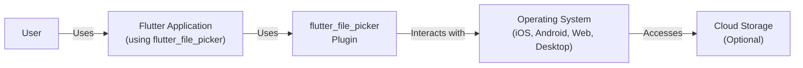
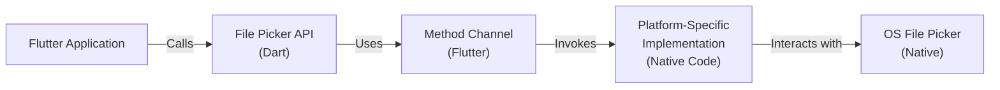
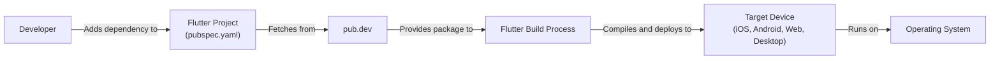
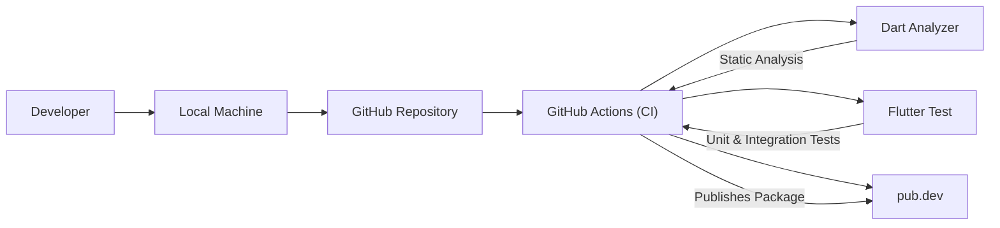

Okay, let's create a design document for the `flutter_file_picker` project.

# BUSINESS POSTURE

Business Priorities and Goals:

*   Enable developers to easily integrate file picking functionality into their Flutter applications across various platforms (iOS, Android, Web, Desktop).
*   Provide a consistent and user-friendly API for accessing files from different sources (local storage, cloud providers).
*   Maintain a high level of platform compatibility and adapt to evolving operating system file access mechanisms.
*   Minimize external dependencies to reduce the risk of supply chain attacks and maintain a small package size.
*   Provide good documentation and examples to facilitate easy adoption by developers.
*   Offer a flexible and customizable solution to cater to diverse application needs.

Business Risks:

*   Inconsistent behavior across different platforms, leading to application instability or user frustration.
*   Security vulnerabilities related to file access, potentially exposing sensitive user data.
*   Dependency on deprecated or insecure platform APIs, causing compatibility issues or security risks.
*   Lack of support for emerging file sources or storage mechanisms.
*   Difficult integration or usage, hindering developer adoption.
*   Failure to comply with platform-specific file access guidelines and permissions, leading to application rejection or runtime errors.

# SECURITY POSTURE

Existing Security Controls:

*   security control: Leverages platform-specific file access APIs (e.g., Android Intents, iOS Document Picker) to delegate file selection to the operating system, inheriting the OS's built-in security mechanisms.
*   security control: Uses standard Flutter/Dart mechanisms for inter-process communication (MethodChannel) to interact with native platform code, reducing the attack surface.
*   security control: The project is open-source, allowing for community review and identification of potential vulnerabilities.
*   security control: Follows semantic versioning, allowing users to control updates and avoid unexpected breaking changes.
*   security control: Implemented in Dart - memory-safe language.

Accepted Risks:

*   accepted risk: Relies on the security of the underlying platform's file access APIs and user's granting of appropriate permissions.
*   accepted risk: Limited control over the UI/UX of the native file pickers, as they are provided by the operating system.
*   accepted risk: Potential for future platform API changes to introduce compatibility issues or require updates to the plugin.

Recommended Security Controls:

*   security control: Implement robust input validation and sanitization for file paths and names returned by the platform APIs to prevent path traversal or other injection vulnerabilities.
*   security control: Provide clear documentation and guidelines on secure file handling practices for developers using the plugin, including recommendations for data encryption and storage.
*   security control: Regularly review and update dependencies to address known vulnerabilities.
*   security control: Consider implementing a mechanism for verifying the integrity of downloaded files (e.g., checksum validation) if the plugin supports downloading files from remote sources.
*   security control: Add static code analysis to CI pipeline.

Security Requirements:

*   Authentication:
    *   The plugin itself does not handle user authentication. Authentication, if required, is the responsibility of the application using the plugin or the underlying platform APIs (e.g., when accessing cloud storage).

*   Authorization:
    *   The plugin relies on the operating system's permission model to control access to files. The application using the plugin must request the necessary permissions (e.g., READ_EXTERNAL_STORAGE on Android) from the user.

*   Input Validation:
    *   File paths and names returned by the platform APIs should be treated as untrusted input and validated/sanitized before being used by the application. This is crucial to prevent path traversal vulnerabilities.

*   Cryptography:
    *   The plugin does not directly handle encryption. If encryption is required, it is the responsibility of the application using the plugin to encrypt/decrypt files before/after using the file picker.

# DESIGN

## C4 CONTEXT

Element Descriptions:

*   Element:
    *   Name: User
    *   Type: Person
    *   Description: The end-user interacting with the Flutter application.
    *   Responsibilities: Initiates file picking operations within the application.
    *   Security controls: N/A - The user is external to the system.

*   Element:
    *   Name: Flutter Application (using flutter\_file\_picker)
    *   Type: Software System
    *   Description: A Flutter application developed by a third party that utilizes the `flutter_file_picker` plugin.
    *   Responsibilities: Integrates the `flutter_file_picker` plugin, handles file picking results, and processes the selected files.
    *   Security controls: Responsible for implementing secure file handling practices, including input validation, data encryption, and secure storage.

*   Element:
    *   Name: flutter\_file\_picker Plugin
    *   Type: Software System
    *   Description: The `flutter_file_picker` plugin itself.
    *   Responsibilities: Provides a platform-agnostic API for file picking, interacts with native platform APIs, and returns file information to the Flutter application.
    *   Security controls: Leverages platform-specific security mechanisms, uses secure inter-process communication.

*   Element:
    *   Name: Operating System (iOS, Android, Web, Desktop)
    *   Type: Software System
    *   Description: The underlying operating system on which the Flutter application is running.
    *   Responsibilities: Provides the native file picking UI and handles file access permissions.
    *   Security controls: Enforces platform-specific security policies, including file access permissions and sandboxing.

*   Element:
    *   Name: Cloud Storage (Optional)
    *   Type: Software System
    *   Description: Cloud storage services (e.g., Google Drive, Dropbox, iCloud) that may be accessed through the native file picker.
    *   Responsibilities: Provides storage and retrieval of files.
    *   Security controls: Implements its own security mechanisms, including authentication, authorization, and data encryption.

## C4 CONTAINER

Element Descriptions:

*   Element:
    *   Name: Flutter Application
    *   Type: Container
    *   Description: The application using the `flutter_file_picker` plugin.
    *   Responsibilities: Initiates file picking, handles results, and processes files.
    *   Security controls: Implements application-level security measures.

*   Element:
    *   Name: File Picker API (Dart)
    *   Type: Container
    *   Description: The platform-agnostic Dart API exposed by the plugin.
    *   Responsibilities: Provides a consistent interface for file picking across different platforms.
    *   Security controls: Input validation (to the extent possible at the Dart level).

*   Element:
    *   Name: Method Channel (Flutter)
    *   Type: Container
    *   Description: Flutter's mechanism for inter-process communication between Dart and native code.
    *   Responsibilities: Facilitates communication between the Dart code and the platform-specific implementation.
    *   Security controls: Uses a defined protocol for communication, reducing the risk of injection attacks.

*   Element:
    *   Name: Platform-Specific Implementation (Native Code)
    *   Type: Container
    *   Description: The native code (Java/Kotlin for Android, Objective-C/Swift for iOS, etc.) that interacts with the OS file picker.
    *   Responsibilities: Bridges the gap between the Flutter plugin and the native file picking APIs.
    *   Security controls: Relies on the security of the underlying platform APIs.

*   Element:
    *   Name: OS File Picker (Native)
    *   Type: Container
    *   Description: The native file picker UI provided by the operating system.
    *   Responsibilities: Presents the file selection interface to the user and handles file access permissions.
    *   Security controls: Enforces OS-level security policies.

## DEPLOYMENT

Possible Deployment Solutions:

1.  **Flutter Package Deployment:** The primary deployment method is as a Flutter package hosted on [pub.dev](http://pub.dev/). Developers add the package as a dependency in their `pubspec.yaml` file.
2.  **Direct GitHub Repository Inclusion:** Developers can also include the plugin directly from the GitHub repository, although this is less common.
3.  **Local Copy:** A developer could download a copy of the repository and include it locally in their project. This is not recommended due to update and maintenance issues.

Chosen Solution (Flutter Package Deployment):

Element Descriptions:

*   Element:
    *   Name: Developer
    *   Type: Person
    *   Description: The developer integrating the `flutter_file_picker` plugin into their Flutter application.
    *   Responsibilities: Adds the plugin as a dependency and uses its API.
    *   Security controls: N/A

*   Element:
    *   Name: Flutter Project (pubspec.yaml)
    *   Type: Configuration File
    *   Description: The `pubspec.yaml` file of the Flutter application, which declares the dependency on `flutter_file_picker`.
    *   Responsibilities: Specifies the required version of the plugin.
    *   Security controls: Semantic versioning allows developers to control updates.

*   Element:
    *   Name: pub.dev
    *   Type: Package Repository
    *   Description: The official package repository for Flutter and Dart packages.
    *   Responsibilities: Hosts the `flutter_file_picker` package and its different versions.
    *   Security controls: Provides a central, trusted source for Flutter packages.

*   Element:
    *   Name: Flutter Build Process
    *   Type: Process
    *   Description: The process of building the Flutter application, including fetching dependencies and compiling code.
    *   Responsibilities: Retrieves the `flutter_file_picker` package from pub.dev and integrates it into the application.
    *   Security controls: Relies on the integrity of pub.dev and the downloaded package.

*   Element:
    *   Name: Target Device (iOS, Android, Web, Desktop)
    *   Type: Device
    *   Description: The device on which the Flutter application is running.
    *   Responsibilities: Executes the application code, including the `flutter_file_picker` plugin.
    *   Security controls: Relies on the operating system's security mechanisms.

*    Element:
    *   Name: Operating System
    *   Type: Software System
    *   Description: OS on target device.
    *   Responsibilities: Provides native file picker.
    *   Security controls: OS level security controls.

## BUILD

Build Process Description:

1.  **Development:** Developers write code and commit changes to the GitHub repository.
2.  **Continuous Integration (GitHub Actions):**
    *   A GitHub Actions workflow is triggered on each push or pull request.
    *   **Static Analysis:** `Dart Analyzer` performs static code analysis to identify potential issues and enforce code style.
    *   **Testing:** `Flutter Test` runs unit and integration tests to ensure code quality and functionality.
    *   **Publishing (on tagged commits):** If the workflow is triggered by a tagged commit, and all checks pass, the package is automatically published to pub.dev.
3.  **Package Publication:** The `flutter pub publish` command is used (within the GitHub Actions workflow) to upload the package to pub.dev.

Security Controls in Build Process:

*   security control: **GitHub Actions:** Automates the build, test, and publishing process, ensuring consistency and reducing manual errors.
*   security control: **Dart Analyzer:** Enforces code style and identifies potential issues through static analysis.
*   security control: **Flutter Test:** Runs automated tests to verify code correctness and prevent regressions.
*   security control: **Semantic Versioning:** Uses semantic versioning to manage releases and allow users to control updates.
*   security control: **Signed Commits:** Developers should sign their commits to ensure authenticity and prevent tampering.
*   security control: **Dependency Management:** Regularly review and update dependencies to address known vulnerabilities.

# RISK ASSESSMENT

Critical Business Processes:

*   **File Selection:** The core functionality of the plugin, enabling users to select files from various sources.
*   **Cross-Platform Compatibility:** Ensuring consistent behavior across different operating systems.
*   **Application Stability:** Preventing crashes or errors related to file picking.
*   **User Data Privacy:** Protecting user data accessed through the file picker.

Data Sensitivity:

*   **File Paths:** May reveal information about the user's file system structure. Sensitivity: Low to Medium.
*   **File Names:** May contain sensitive information, depending on the user's naming conventions. Sensitivity: Low to High.
*   **File Contents:** The actual content of the selected files, which can range from non-sensitive to highly sensitive (e.g., personal documents, financial records, medical information). Sensitivity: Variable, potentially High.

# QUESTIONS & ASSUMPTIONS

Questions:

*   Are there any specific compliance requirements (e.g., GDPR, HIPAA) that need to be considered when handling user files?
*   Are there any plans to support specific cloud storage providers directly (beyond what is offered by the native file pickers)?
*   What level of logging and error reporting is desired for the plugin?
*   Are there any specific performance requirements or limitations for file picking (e.g., maximum file size)?

Assumptions:

*   BUSINESS POSTURE: The primary goal is to provide a convenient and reliable file picking solution for Flutter developers.
*   BUSINESS POSTURE: The project prioritizes ease of use and cross-platform compatibility.
*   SECURITY POSTURE: The plugin relies heavily on the security of the underlying operating system's file access mechanisms.
*   SECURITY POSTURE: Developers using the plugin are responsible for implementing appropriate security measures in their applications, such as input validation and data encryption.
*   DESIGN: The plugin acts as a bridge between the Flutter application and the native file picking APIs.
*   DESIGN: The plugin does not directly handle file storage or management.
*   DESIGN: The plugin does not require any specific authentication mechanisms beyond what is provided by the operating system or cloud storage providers.