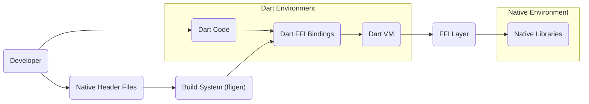

## Project Design Document: Dart Native Interoperability (`dart-lang/native`) - Improved

**1. Introduction**

This document provides an enhanced design overview of the Dart Native Interoperability project (`dart-lang/native`), with a strong focus on architectural details, data flow intricacies, and security considerations. This document is specifically crafted to serve as a robust foundation for subsequent threat modeling activities. It meticulously outlines the system's boundaries, major elements, and their interactions, facilitating a comprehensive analysis of potential security vulnerabilities and attack surfaces. The intended audience includes security engineers, developers working with native interop, and anyone involved in assessing the security posture of Dart applications utilizing native code.

**2. Project Overview**

The `dart-lang/native` project empowers Dart code to seamlessly interact with native code written in languages such as C, C++, and Objective-C. This interoperability is paramount for scenarios where Dart needs to:

*   **Access Platform-Specific APIs:** Leverage functionalities exposed by the underlying operating system or hardware that are not directly available through standard Dart libraries.
*   **Integrate with Existing Native Libraries:** Utilize pre-built, high-performance native libraries for tasks like image processing, cryptography, or system-level operations.
*   **Achieve Performance-Critical Operations:** Offload computationally intensive tasks to native code for optimized execution speed.
*   **Implement Low-Level System Interactions:** Interact directly with hardware or system resources that require native-level access.

The project provides a sophisticated set of mechanisms for:

*   **Direct Function Calls:** Invoking native functions from Dart code with minimal overhead.
*   **Data Marshalling and Unmarshalling:** Automatically converting data between Dart's managed memory and native memory representations, handling different data types and structures.
*   **Memory Management Across Boundaries:** Providing tools and patterns for safely managing memory allocated in both Dart and native environments.
*   **Structure and Union Handling:** Enabling Dart code to interact with complex native data structures like structs and unions.
*   **Callback Functionality:** Allowing native code to invoke Dart functions.
*   **Automated Binding Generation:** Utilizing tools like `package:ffigen` to automatically generate Dart FFI bindings from native header files, simplifying the integration process.

**3. System Architecture**

The architecture of the Dart Native Interoperability system is composed of several interconnected components, each playing a crucial role in facilitating communication between Dart and native code.

*   **"Dart Virtual Machine (VM)":** The core runtime environment responsible for executing Dart code. It manages the Dart heap, performs garbage collection for Dart objects, and provides the execution context for Dart isolates. It also hosts the FFI layer.
*   **"Foreign Function Interface (FFI) Layer":** The central bridge enabling communication between the Dart VM and native code. This layer is responsible for:
    *   Locating and loading native libraries.
    *   Managing the interface to native functions.
    *   Performing data marshalling and unmarshalling.
    *   Handling function calls across the language boundary.
    *   Managing memory interactions between Dart and native heaps.
*   **"Native Libraries":** External libraries, typically compiled shared objects or dynamic libraries (e.g., `.so`, `.dylib`, `.dll`), containing the native code that Dart interacts with. These libraries operate outside the direct management of the Dart VM.
*   **"Dart FFI Bindings":** Dart code that defines the interface to the native functions, data structures, and constants within the native libraries. These bindings act as a contract, specifying the types and calling conventions for interacting with native code. They can be manually written or automatically generated.
*   **"Build System (e.g., `package:ffigen`)":** A set of tools and processes used to automate the generation of Dart FFI bindings from native header files. `ffigen` parses C/C++ header files and generates the corresponding Dart code, significantly reducing manual effort and potential errors.
*   **"Developer Environment":** The environment where developers write, build, and debug Dart code that utilizes native interoperability. This includes IDEs, Dart SDK tools (compiler, analyzer), and potentially native compilers and debuggers.

**4. Data Flow - Detailed Examples**

The data flow for a Dart application interacting with native code can be illustrated with specific examples:

1. **Simple Function Call with Primitive Types:**
    *   Dart code calls a native function (defined in the FFI bindings) that takes an integer and returns an integer.
    *   The Dart VM intercepts the call and passes the integer value to the FFI layer.
    *   The FFI layer marshals the Dart integer into its native representation (e.g., `int` in C).
    *   The FFI layer invokes the native function, passing the marshalled integer.
    *   The native function executes and returns an integer.
    *   The FFI layer marshals the native integer back into a Dart integer.
    *   The Dart VM returns the Dart integer to the calling Dart code.

2. **Passing Complex Data Structures:**
    *   Dart code needs to pass a custom data structure (e.g., a struct representing a point with x and y coordinates) to a native function.
    *   The Dart FFI bindings define the Dart representation of this native struct.
    *   The Dart code creates an instance of this Dart representation.
    *   The FFI layer allocates memory in the native heap (or uses a provided pointer) to hold the native representation of the struct.
    *   The FFI layer copies the data from the Dart struct instance to the allocated native memory, performing necessary type conversions.
    *   The FFI layer invokes the native function, passing a pointer to the allocated native memory.
    *   The native function operates on the data in the native struct.
    *   Optionally, the FFI layer can copy data back from the native struct to the Dart struct instance after the native function returns.

3. **Native Callback to Dart:**
    *   Dart code registers a Dart function as a callback with a native library.
    *   The FFI layer creates a mechanism for the native code to invoke this Dart function.
    *   When a specific event occurs in the native code, it triggers the callback mechanism.
    *   The FFI layer intercepts the callback invocation from the native side.
    *   The FFI layer marshals any data passed from the native code to the Dart callback function.
    *   The Dart VM executes the registered Dart callback function with the marshalled data.

**5. Key Components and their Responsibilities (Expanded)**

*   **"Dart VM":**
    *   **Execution Management:** Executes Dart code within isolates, providing isolation and concurrency.
    *   **Memory Management:** Manages the Dart heap, performing automatic garbage collection to reclaim unused memory.
    *   **FFI Host:** Provides the runtime environment and necessary APIs for the FFI layer to operate.
    *   **Type System Enforcement:** Enforces Dart's strong type system within the Dart environment, but type safety across the FFI boundary relies on correct bindings and usage.
*   **"FFI Layer":**
    *   **Library Loading and Management:** Loads and manages native libraries, handling platform-specific loading mechanisms.
    *   **Function Resolution:** Resolves the addresses of native functions based on the provided symbols.
    *   **Data Marshalling/Unmarshalling:** Converts data between Dart and native representations, handling different data types, sizes, and endianness. This is a critical area for potential vulnerabilities.
    *   **Memory Management at the Boundary:**  Provides mechanisms for allocating and deallocating memory in the native heap from Dart, and vice-versa. Incorrect management can lead to memory leaks or corruption.
    *   **Callback Handling:** Manages the invocation of Dart functions from native code, requiring careful handling of execution contexts and data transfer.
    *   **Error Handling:** Provides mechanisms for propagating errors between Dart and native code.
*   **"Native Libraries":**
    *   **Native Code Execution:** Executes the native code logic invoked by Dart.
    *   **Resource Management:** Manages native resources (memory, file handles, etc.) independently of the Dart VM.
    *   **Platform-Specific Functionality:** Often provides access to platform-specific APIs and hardware capabilities.
*   **"Dart FFI Bindings":**
    *   **Interface Definition:** Defines the Dart-side representation of native functions, data structures, and constants.
    *   **Type Mapping:** Specifies the mapping between Dart and native data types, crucial for correct marshalling.
    *   **Calling Convention Specification:**  Indicates the calling conventions used by the native functions (e.g., cdecl, stdcall).
    *   **Safety and Correctness:** The accuracy and correctness of these bindings are paramount for the security and stability of the interop.
*   **"Build System (`package:ffigen`)":**
    *   **Header File Parsing:** Parses C/C++ header files to extract function declarations, struct definitions, and other relevant information.
    *   **Binding Code Generation:** Generates Dart code containing the FFI bindings, automating a potentially error-prone manual process.
    *   **Customization and Configuration:** Allows for customization of the binding generation process through configuration files.
*   **"Developer Environment":**
    *   **Code Authoring:** Provides tools for writing Dart code that utilizes FFI, including code completion and syntax highlighting.
    *   **Compilation and Linking:**  Involves compiling both Dart and native code and linking them together.
    *   **Debugging:** Provides tools for debugging issues that arise during native interop, which can be more complex than debugging pure Dart code.

**6. Security Considerations (Expanded for Threat Modeling)**

This section elaborates on potential security risks associated with the Dart Native Interoperability project, providing more specific examples for threat modeling.

*   **"Malicious Native Libraries":**
    *   **Threat:** A Dart application links to a compromised or intentionally malicious native library.
    *   **Impact:** Arbitrary code execution within the application's process, data exfiltration, system compromise.
    *   **Examples:** A seemingly benign image processing library that contains a backdoor, a cryptographic library with intentionally weakened algorithms.
*   **"Data Corruption at the Boundary":**
    *   **Threat:** Errors in marshalling or unmarshalling data lead to incorrect data representation on either side of the boundary.
    *   **Impact:** Unexpected program behavior, crashes, potential for exploitable vulnerabilities if corrupted data is used in security-sensitive operations.
    *   **Examples:** Incorrectly sized buffers leading to buffer overflows, misinterpretation of data types causing logic errors.
*   **"Memory Management Issues":**
    *   **Threat:** Incorrect memory management at the Dart/native boundary.
    *   **Impact:** Memory leaks leading to resource exhaustion, double frees causing crashes or potential for exploitation, dangling pointers leading to use-after-free vulnerabilities.
    *   **Examples:** Failing to free memory allocated in native code from Dart, native code accessing memory that has been garbage collected by the Dart VM.
*   **"Injection Vulnerabilities in Native Code":**
    *   **Threat:** Native code processes data received from Dart without proper sanitization or validation.
    *   **Impact:** Exploitation of vulnerabilities like SQL injection, command injection, or path traversal if the native code interacts with databases, operating system commands, or file systems.
    *   **Examples:** Passing unsanitized user input from Dart to a native function that constructs a SQL query.
*   **"Privilege Escalation":**
    *   **Threat:** Native code operates with higher privileges than the Dart application, and vulnerabilities in the native code are exploited.
    *   **Impact:** An attacker could leverage the compromised native code to perform actions with elevated privileges.
    *   **Examples:** A Dart application interacting with a privileged system service through native interop.
*   **"Build System Vulnerabilities":**
    *   **Threat:** Compromises in the build system or the tools used to generate FFI bindings.
    *   **Impact:** Introduction of malicious code or vulnerabilities into the application during the build process.
    *   **Examples:** A compromised `ffigen` plugin injecting malicious code into the generated bindings.
*   **"Developer Environment Security":**
    *   **Threat:** Security vulnerabilities in the developer's environment.
    *   **Impact:** Introduction of malicious code or compromised dependencies into the project.
    *   **Examples:** A developer's machine infected with malware that modifies the source code or build artifacts.
*   **"Information Disclosure":**
    *   **Threat:** Improper handling of sensitive data passed between Dart and native code.
    *   **Impact:** Exposure of sensitive information through logging, error messages, or memory leaks.
    *   **Examples:** Passing cryptographic keys or user credentials through the FFI without proper protection.
*   **"Denial of Service":**
    *   **Threat:** Resource exhaustion or crashes caused by interactions with native code.
    *   **Impact:** The application becomes unavailable or unresponsive.
    *   **Examples:** Native code allocating excessive memory or entering an infinite loop when called from Dart.
*   **"Callback Vulnerabilities":**
    *   **Threat:** Native code invoking Dart callbacks in unexpected or malicious ways.
    *   **Impact:** Potential for arbitrary code execution within the Dart isolate if the callback mechanism is not properly secured.
    *   **Examples:** Native code calling a Dart callback with unexpected arguments or at an unexpected time, leading to vulnerabilities in the Dart callback function.

**7. Assumptions and Constraints (Security Focused)**

*   **Developer Awareness:** It is assumed that developers utilizing native interop are aware of the inherent security risks and follow secure coding practices for both Dart and native code.
*   **Trusted Native Libraries:** The security of the native libraries themselves is paramount. This design assumes that developers are using trusted and vetted native libraries. Mechanisms for verifying the integrity of native libraries would be a valuable addition.
*   **Secure Build Pipeline:** A secure build pipeline is assumed, minimizing the risk of introducing malicious code during the build process.
*   **Platform Security:** The security of the underlying operating system and platform is a foundational assumption.
*   **No Implicit Trust:** The FFI layer should not implicitly trust data received from native code and should provide mechanisms for validation and sanitization.
*   **Memory Safety:** While Dart provides memory safety within its own environment, ensuring memory safety across the FFI boundary requires careful attention to memory management practices.

**8. Future Considerations (Security Enhancements)**

*   **Sandboxing of Native Code:** Explore mechanisms for sandboxing or isolating the execution of native code to limit the impact of potential vulnerabilities.
*   **Automated Security Analysis Tools:** Development of tools to automatically analyze Dart code using FFI for potential security vulnerabilities.
*   **Integrity Verification of Native Libraries:** Implement mechanisms for verifying the integrity and authenticity of loaded native libraries.
*   **Enhanced Memory Safety Features:** Investigate ways to improve memory safety across the FFI boundary, potentially through stricter type checking or memory management APIs.
*   **Secure Callback Mechanisms:** Develop more secure patterns and APIs for handling native callbacks to Dart, mitigating potential vulnerabilities.
*   **Formal Verification of FFI Bindings:** Explore the feasibility of using formal methods to verify the correctness and security of generated FFI bindings.
*   **Runtime Monitoring and Auditing:** Implement mechanisms for monitoring and auditing interactions across the FFI boundary to detect suspicious activity.

This improved design document provides a more comprehensive and detailed understanding of the Dart Native Interoperability project, specifically tailored for effective threat modeling. It highlights key components, intricate data flows, and a wide range of potential security considerations, enabling a more thorough and insightful security analysis.
