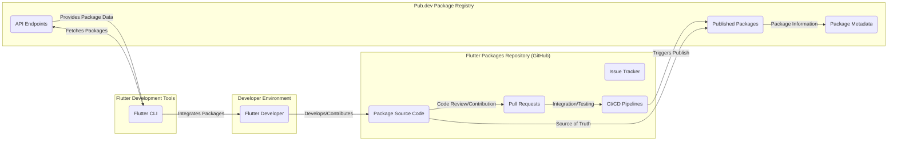
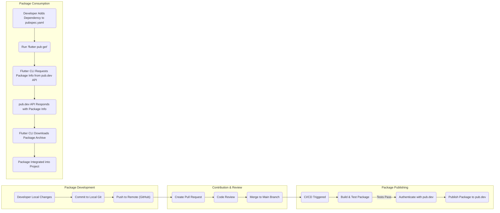

# Project Design Document: Flutter Packages Repository

**Version:** 1.1
**Date:** October 26, 2023
**Author:** Gemini (AI Language Model)

## 1. Introduction

This document provides a detailed design overview of the Flutter Packages repository (referenced by the GitHub link: https://github.com/flutter/packages). This document aims to clearly articulate the architecture, key components, and data flow within the project. It will serve as a foundation for subsequent threat modeling activities to identify potential security vulnerabilities and risks.

## 2. Goals and Objectives

The primary goals of the Flutter Packages repository are:

* To provide a curated collection of high-quality, reusable packages that extend the functionality of the Flutter framework.
* To facilitate the discovery and integration of these packages by Flutter developers.
* To establish a standardized process for package development, maintenance, and publishing.
* To foster a collaborative environment for package contributions from both the Flutter team and the wider community.

## 3. Scope

This design document covers the following aspects of the Flutter Packages repository:

* The structure and organization of the repository itself.
* The process of developing and contributing packages.
* The interaction between the repository and the pub.dev package registry.
* The consumption of packages by Flutter developers.
* The key technologies and tools involved.

This document does *not* cover:

* The internal implementation details of individual packages within the repository.
* The detailed infrastructure of the pub.dev package registry.
* The specifics of the Flutter framework itself.

## 4. High-Level Architecture

The Flutter Packages ecosystem involves several key actors and components interacting with each other. The following diagram illustrates the high-level architecture:

**Key Actors:**

* Flutter Developer: Developers who create, contribute to, and consume packages.

**Key Components:**

* Package Source Code (GitHub): The central repository hosting the source code for all packages.
* Issue Tracker (GitHub): Used for reporting bugs, suggesting features, and managing package issues.
* Pull Requests (GitHub): The mechanism for contributing code changes and new packages.
* CI/CD Pipelines (GitHub Actions/Other): Automated processes for building, testing, and publishing packages.
* Published Packages (Pub.dev): The publicly accessible registry where released versions of packages are stored.
* Package Metadata (Pub.dev): Information about each package, including its name, version, description, dependencies, and author.
* API Endpoints (Pub.dev): APIs used by the Flutter CLI and other tools to interact with the package registry.
* Flutter CLI: The command-line interface used by Flutter developers to manage dependencies, including fetching and integrating packages.

## 5. Key Components in Detail

This section provides a more detailed description of the core components:

* **Flutter Packages Repository (GitHub):**
    * Contains individual package directories, each with its own `pubspec.yaml` file defining package metadata and dependencies.
    * Utilizes Git for version control and collaboration.
    * Employs a branching strategy (e.g., `main`, `develop`) for managing development and releases.
    * Leverages GitHub features like issues, pull requests, and wikis for project management and documentation.
    * Integrates with CI/CD systems to automate testing and publishing workflows.

* **Pub.dev Package Registry:**
    * Serves as the central repository for published Flutter and Dart packages.
    * Provides a web interface for browsing and searching packages.
    * Offers an API for programmatic access to package information.
    * Enforces certain quality standards and security checks for published packages.
    * Manages package versions and dependencies.

* **Flutter CLI:**
    * A command-line tool that is part of the Flutter SDK.
    * Used by developers to create, build, test, and publish Flutter applications.
    * Includes commands for managing package dependencies (e.g., `flutter pub add`, `flutter pub get`).
    * Interacts with the pub.dev API to fetch package information and download package archives.

## 6. Data Flow

The lifecycle of a Flutter package involves the following key data flows:

* **Package Development and Contribution:**
    * A Flutter developer creates or modifies a package within the local repository.
    * Changes are committed to a local Git branch.
    * The developer pushes the branch to the remote GitHub repository.
    * A pull request is created to propose the changes for review.
    * Reviewers provide feedback and suggest modifications.
    * Upon approval, the pull request is merged into the main branch.

* **Package Publishing:**
    * Upon merging, the CI/CD pipeline is triggered.
    * The pipeline builds and tests the package.
    * If tests pass, the pipeline authenticates with pub.dev using appropriate credentials.
    * The pipeline publishes the package to pub.dev, including the package code and metadata from the `pubspec.yaml` file.

* **Package Consumption:**
    * A Flutter developer adds a package dependency to their application's `pubspec.yaml` file.
    * The developer runs `flutter pub get` or a similar command.
    * The Flutter CLI interacts with the pub.dev API to retrieve information about the specified package and its dependencies.
    * The Flutter CLI downloads the package archive from pub.dev.
    * The package is integrated into the developer's project, making its functionality available.

## 7. Security Considerations

This section outlines potential security considerations relevant to the Flutter Packages repository and its ecosystem. These will be further explored during threat modeling.

* **Supply Chain Security:**
    * **Compromised Developer Accounts:** Malicious actors gaining access to developer accounts could publish compromised packages.
    * **Malicious Package Dependencies:** Packages might depend on other malicious packages, introducing vulnerabilities indirectly.
    * **Code Injection:** Vulnerabilities in the package development or publishing process could allow for the injection of malicious code.

* **Repository Security:**
    * **Unauthorized Access:** Gaining unauthorized access to the GitHub repository could allow for code modification or deletion.
    * **Credential Management:** Secure storage and management of credentials used for publishing to pub.dev is crucial.
    * **Branch Protection Policies:** Enforcing strict branch protection policies can prevent unauthorized changes to critical branches.

* **Pub.dev Security:**
    * **Account Takeover:** Compromised pub.dev accounts could lead to the publishing of malicious packages.
    * **Vulnerabilities in Pub.dev Infrastructure:** Security flaws in the pub.dev platform itself could be exploited.
    * **Data Integrity:** Ensuring the integrity of package metadata and archives on pub.dev is important.

* **Package Consumer Security:**
    * **Vulnerable Packages:** Using packages with known vulnerabilities can expose applications to risks.
    * **Dependency Confusion:** Attackers could publish packages with similar names to legitimate ones, tricking developers into using malicious versions.

## 8. Technology Stack

The Flutter Packages repository and its ecosystem utilize the following key technologies:

* Programming Languages: Dart
* Version Control System: Git
* Hosting Platform: GitHub
* Package Registry: pub.dev
* Build and Test Automation: GitHub Actions (or potentially other CI/CD tools)
* Flutter SDK: Provides the Flutter CLI and core framework.
* Operating Systems: Cross-platform, supporting development on macOS, Linux, and Windows.

## 9. Deployment Model

The Flutter Packages repository itself is primarily a code repository hosted on GitHub. The published packages are deployed and served by the pub.dev package registry. Developers interact with these components through their local development environments using the Flutter CLI. This represents a distributed model where code is managed centrally but consumed and utilized locally.

## 10. Future Considerations

Potential future developments and considerations for the Flutter Packages repository include:

* Enhanced Security Scanning: Implementing automated security scanning of packages before and after publishing.
* Improved Package Verification: Strengthening the process for verifying the identity and trustworthiness of package publishers.
* Formal Security Audits: Conducting regular security audits of the repository and key packages.
* Community Security Guidelines: Establishing clear guidelines and best practices for secure package development.
* Integration with Security Tools: Exploring integration with third-party security analysis tools.

This design document provides a comprehensive overview of the Flutter Packages repository, laying the groundwork for effective threat modeling. By understanding the architecture, data flow, and key components, potential security vulnerabilities can be identified and mitigated.
