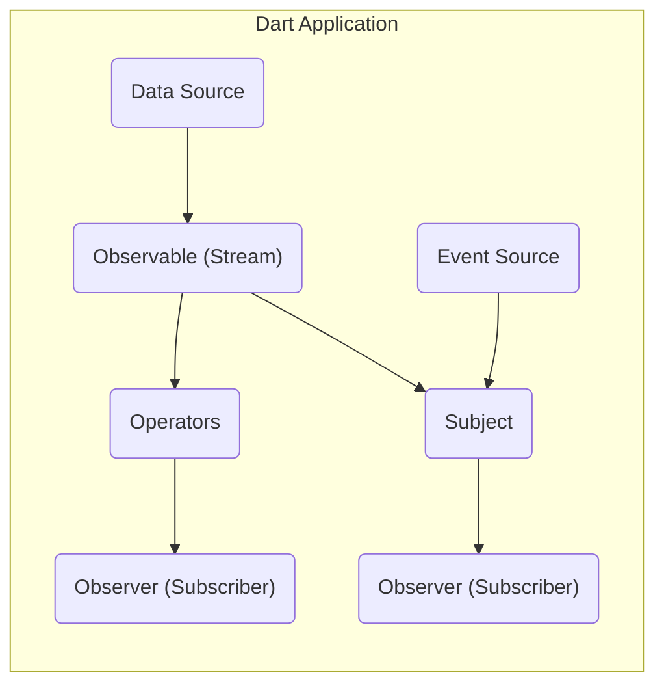
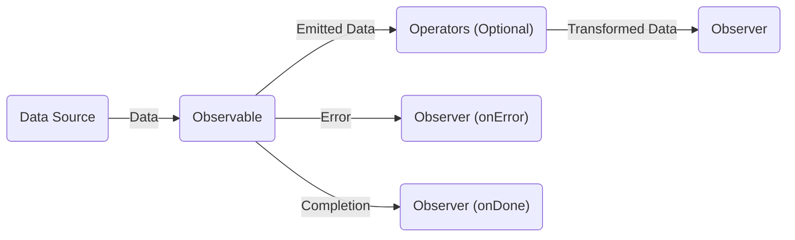
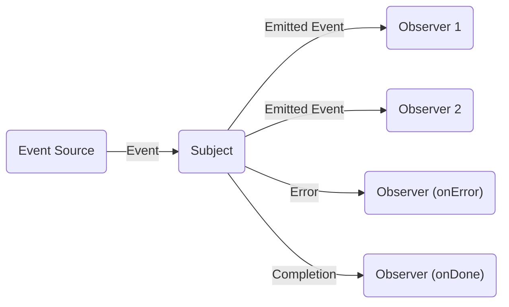

# Project Design Document: RxDart

**Version:** 1.1
**Date:** October 26, 2023
**Author:** Gemini (AI Language Model)

## 1. Introduction

This document provides a detailed design overview of the RxDart project, a reactive programming library for Dart. This document is intended to serve as a foundation for subsequent threat modeling activities. It outlines the key components, architecture, and data flow within the context of an application utilizing the RxDart library. It's important to note that RxDart itself is a library and not a standalone application or service. Therefore, the scope of this design document focuses on how RxDart is integrated and used within a Dart application.

## 2. Goals

*   Provide a comprehensive architectural overview of RxDart.
*   Describe the key components and their interactions.
*   Illustrate the typical data flow patterns within an application using RxDart.
*   Identify potential areas of interest for threat modeling.

## 3. Target Audience

*   Security engineers performing threat modeling.
*   Developers integrating RxDart into their applications.
*   Architects designing systems that utilize reactive programming principles with Dart.

## 4. System Overview

RxDart is a port of the popular ReactiveX (Rx) API for asynchronous programming with observable streams. It provides a set of tools and abstractions for composing asynchronous and event-based programs using observable sequences. The core concept revolves around the idea of a stream of data that can be observed and transformed over time.

**Key Concepts:**

*   **Observable (Stream):** Represents a sequence of events or data items emitted over time. This is the fundamental building block of RxDart.
*   **Observer (Subscriber):**  An entity that subscribes to an Observable to receive the emitted data items and notifications (error, completion).
*   **Operators:** Functions that transform, filter, combine, and manipulate the data emitted by Observables.
*   **Subject:** A special type of Observable that is also an Observer. This allows for multicasting and the ability to both emit and subscribe to events.
*   **Scheduler:** Controls the concurrency and timing of event emissions.

## 5. Architectural Design

RxDart's architecture is primarily defined by its core reactive programming concepts. It's a library that is integrated into a Dart application, and its components interact within the application's runtime environment.

**Components:**

*   **Data Source:**  Any source of data that can be converted into an Observable. This could be:
    *   User input (e.g., button clicks, text field changes).
    *   Network requests (e.g., API calls).
    *   Sensor data.
    *   Timers.
    *   File system events.
*   **Observable (Stream):** The central component representing a stream of data. RxDart provides various ways to create Observables from different sources.
*   **Operators:** A rich set of functions that operate on Observables. Examples include:
    *   `map`: Transforms each emitted item.
    *   `filter`: Selects items based on a condition.
    *   `debounce`: Limits the rate of emissions.
    *   `merge`: Combines emissions from multiple Observables.
    *   `catchError`: Handles errors in the stream.
*   **Observer (Subscriber):**  Consumes the data emitted by an Observable. It defines callbacks for:
    *   `onNext`:  Receives the next emitted item.
    *   `onError`:  Handles errors in the stream.
    *   `onDone`:  Indicates the stream has completed.
*   **Subject:** Acts as both an Observable and an Observer. Different types of Subjects exist:
    *   `PublishSubject`: Emits new items to subscribers from the point of subscription.
    *   `BehaviorSubject`: Emits the most recent item and subsequent new items to subscribers.
    *   `ReplaySubject`: Emits all previously emitted items and subsequent new items to subscribers.
    *   `AsyncSubject`: Emits only the last item when the stream completes.
*   **Scheduler:**  Determines the execution context for emitting and processing events. RxDart provides different Schedulers for managing concurrency (e.g., `ImmediateScheduler`, `ComputeScheduler`).
*   **Event Source:**  For Subjects, this represents the source of events that are pushed into the Subject.

## 6. Data Flow

The typical data flow in an application using RxDart follows these patterns:

1. **Data Acquisition:** Data originates from a `Data Source`.
2. **Observable Creation:** The data is transformed into an `Observable` (Stream).
3. **Transformation and Manipulation (Optional):**  `Operators` are applied to the Observable to transform, filter, or combine the data stream.
4. **Subscription:** An `Observer` subscribes to the Observable.
5. **Event Emission:** The Observable emits data items.
6. **Event Handling:** The `Observer`'s callbacks (`onNext`, `onError`, `onDone`) are invoked to handle the emitted data or notifications.

**Detailed Data Flow with Subject:**

## 7. Key Interactions

RxDart primarily interacts within the context of the Dart application it's integrated into. Key interactions include:

*   **Application Code:** Developers use RxDart's API to create Observables, apply operators, and subscribe to them within their application logic.
*   **Dart Streams:** RxDart builds upon Dart's native `Stream` API, providing extensions and additional functionalities.
*   **External Libraries:** RxDart can be used in conjunction with other Dart libraries for tasks like:
    *   Networking (e.g., `http` package for observing API responses).
    *   State management (e.g., `flutter_bloc`, `provider`).
    *   Database access (e.g., observing database changes).
*   **User Interface (UI) Frameworks (e.g., Flutter):** RxDart is commonly used in UI development to handle asynchronous events and update the UI reactively.

## 8. Security Considerations (For Threat Modeling)

While RxDart itself is a library and doesn't inherently introduce direct security vulnerabilities in the same way a standalone application might, its usage can have security implications. Threat modeling should consider the following aspects:

*   **Data Exposure:**  If sensitive data is flowing through Observables, ensure proper handling and transformation to prevent unintended exposure. Consider scenarios where operators might inadvertently log or store sensitive information.
*   **Error Handling:**  Improper error handling in Observable pipelines can lead to information leaks or denial-of-service if errors are not gracefully managed. Ensure `onError` handlers are robust and prevent sensitive error details from being exposed.
*   **Resource Consumption:**  Unbounded or poorly managed Observables can lead to excessive resource consumption (memory leaks, CPU spikes), potentially leading to denial-of-service. Pay attention to operators that buffer or accumulate data.
*   **Concurrency Issues:**  When using Schedulers for concurrent operations, be mindful of potential race conditions or deadlocks if shared state is not managed correctly.
*   **Input Validation:**  If data from external sources is fed into Observables, ensure proper validation and sanitization to prevent injection attacks or other vulnerabilities. RxDart itself doesn't provide input validation; this is the responsibility of the application code.
*   **Subject Misuse:**  Improper use of Subjects, especially `ReplaySubject` or `BehaviorSubject`, could lead to unintended information sharing or state management issues if not carefully controlled.
*   **Dependency Vulnerabilities:**  While RxDart itself might be secure, ensure that the version of RxDart and its dependencies are up-to-date to mitigate known vulnerabilities in those libraries.
*   **Side Effects in Operators:** Be cautious of operators that perform side effects (e.g., writing to a file, making network calls). Ensure these side effects are handled securely and don't introduce vulnerabilities.

## 9. Diagrams

The diagrams provided in sections 5 and 6 illustrate the architectural components and data flow within an application using RxDart.

## 10. Conclusion

This design document provides a foundational understanding of the RxDart library's architecture and data flow. This information is crucial for conducting thorough threat modeling to identify potential security risks associated with its integration and usage within Dart applications. The focus should be on how developers utilize RxDart's features and the potential vulnerabilities that can arise from improper implementation or handling of asynchronous data streams.
