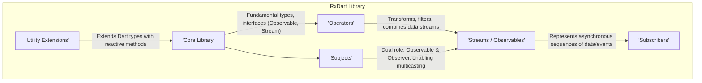
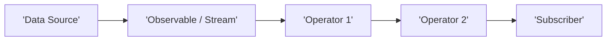
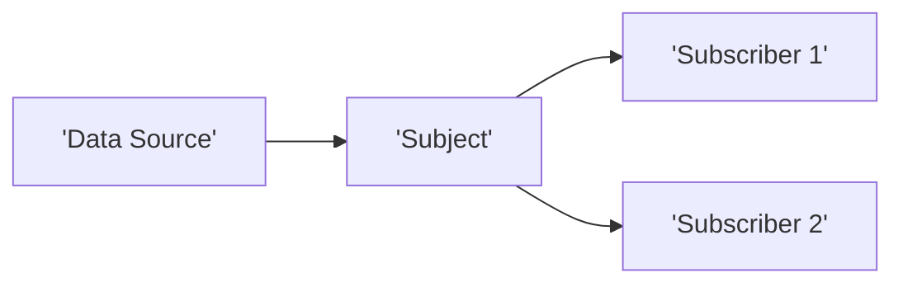

# Project Design Document: RxDart

**Version:** 1.1
**Date:** October 26, 2023
**Author:** AI Software Architect

## 1. Introduction

This document provides an enhanced design overview of the RxDart project, a reactive programming library for the Dart language. It aims to provide a clear, detailed, and well-structured description of the library's architecture, core components, and their interactions. This document is specifically intended to serve as a foundation for subsequent threat modeling activities, enabling a comprehensive understanding of potential attack surfaces and security considerations.

RxDart implements the principles of Reactive Extensions (Rx) within the Dart ecosystem. It empowers developers to manage asynchronous data streams and events using a declarative, composable, and functional style. This document focuses on the internal architectural design of the RxDart library itself, rather than the design of specific applications built upon it.

## 2. Goals

*   To present a clear, comprehensive, and detailed explanation of the RxDart library's internal architecture.
*   To precisely identify the key components within RxDart and delineate their specific responsibilities and functionalities.
*   To clearly illustrate the flow of data and the interactions between these core components.
*   To establish a robust and well-defined foundation for conducting thorough threat modeling of the RxDart library.
*   To document critical assumptions and security-relevant considerations that are inherent in the library's design.

## 3. Non-Goals

*   A granular, exhaustive explanation of every individual operator or class present within the RxDart library.
*   Detailed performance benchmarks, analysis, or optimization strategies for RxDart.
*   Specific, concrete use cases or practical examples demonstrating how to utilize RxDart within applications.
*   A comparative analysis of RxDart against other reactive programming libraries or paradigms.
*   In-depth exploration of the implementation specifics of the Dart language itself.

## 4. High-Level Architecture

The architectural design of the RxDart library is centered around the fundamental concepts of Reactive Extensions. At a high level, it can be visualized as a set of interconnected modules working together:

*   **'Core Library':** Contains the foundational building blocks of RxDart, including core interfaces and abstract classes like `Observable` and extensions to the native Dart `Stream`. This layer defines the fundamental contracts and behaviors.
*   **'Operators':**  A collection of functions that operate on `Observable` instances to transform, filter, combine, and manipulate the data flowing through them. These are the primary means of composing reactive logic.
*   **'Subjects':** Specialized types of `Observable` that also implement the `Observer` interface. This dual nature allows them to both emit and receive events, making them useful for multicasting and event aggregation.
*   **'Streams / Observables':** Represent the asynchronous sequences of data or events over time. In RxDart, `Observable` often wraps a standard Dart `Stream`, augmenting it with the rich set of Rx operators.
*   **'Subscribers':** Entities that listen to and react to the data and notifications (completion, error) emitted by `Observable` instances. They establish the endpoint of a reactive pipeline.
*   **'Utility Extensions':** Provides extension methods on standard Dart types (like `Future`, `Iterable`) to seamlessly integrate them into reactive workflows by converting them into `Observable` instances.

## 5. Component Details

This section provides a more detailed examination of the key components within RxDart:

*   **Streams and Observables:**
    *   Represent a sequence of asynchronous events or data points emitted over time.
    *   Can emit zero or more data events, followed by optional completion or error signals.
    *   The `Observable` class in RxDart typically wraps a native Dart `Stream`, enhancing it with Rx-specific operators and functionalities.
    *   Core methods include `listen` (to subscribe), and a vast array of operators like `map`, `filter`, `reduce`, `debounce`, `throttleTime`, etc.
    *   Manage the lifecycle of asynchronous operations and provide mechanisms for handling data, errors, and completion.
*   **Operators:**
    *   Pure functions that take one or more `Observable` instances as input and return a new `Observable` as output, representing a transformation of the data stream.
    *   Categorized based on their function: creation, transformation, filtering, combination, error handling, utility, etc.
    *   Examples include: `map` (transforms each emitted item), `filter` (selectively emits items), `debounceTime` (emits an item only after a specified timespan has passed without another emission), `merge` (combines emissions from multiple Observables), `catchError` (handles errors).
    *   Operators are designed to be composable, allowing developers to chain them together to create intricate and expressive data processing pipelines.
*   **Subjects:**
    *   Act as both an `Observable` (data source) and an `Observer` (data consumer).
    *   Enable multicasting, where a single emitted event can be received by multiple subscribers.
    *   Different Subject types offer varying behaviors regarding how and when subscribers receive data:
        *   **'PublishSubject':** Only forwards events that occur *after* a subscriber begins listening.
        *   **'BehaviorSubject':** Emits the most recent item (or a seed value) to new subscribers immediately upon subscription, and subsequently emitted items.
        *   **'ReplaySubject':** Buffers a specified number of the most recent emissions (or all emissions) and replays them to new subscribers.
        *   **'AsyncSubject':** Only emits the last value of the sequence, and only after the Subject completes.
        *   **'CompletableSubject':**  Does not emit data values but signals completion or error.
        *   **'SingleSubject':**  Designed to emit a single successful value or an error.
*   **Schedulers (Implicit):**
    *   While not a direct class, the concept of scheduling is fundamental to RxDart's asynchronous nature.
    *   Determines the execution context (e.g., isolate, event loop) where operations within the reactive pipeline are performed.
    *   RxDart leverages Dart's event loop and asynchronous capabilities. Operators might implicitly introduce scheduling considerations.
    *   Careful consideration of scheduling is important for managing concurrency and avoiding blocking operations on the main isolate.
*   **Error Handling Mechanisms:**
    *   `Observable` streams can emit error events to signal failures during asynchronous operations.
    *   Operators like `catchError`, `onErrorReturn`, and `retry` provide declarative ways to handle errors within the reactive pipeline, allowing for recovery or fallback strategies.
    *   Unhandled errors can propagate through the stream, potentially leading to application-level exceptions if not properly managed.
*   **Subscription Management:**
    *   When a subscriber starts listening to an `Observable`, a `StreamSubscription` object is returned.
    *   This object provides control over the subscription, allowing for pausing, resuming, and crucially, canceling the subscription.
    *   Proper subscription management is critical to prevent resource leaks (e.g., preventing ongoing network requests or preventing memory leaks from streams that continue to emit). Unsubscribing releases resources associated with the stream.

## 6. Data Flow

The typical flow of data within an RxDart pipeline can be visualized as follows:

1. **'Data Source':** The origin of the data being processed. This could be anything that produces asynchronous data, such as network requests, user interactions, sensor readings, or timer events.
2. **'Observable / Stream':** The data source is typically wrapped in an `Observable` (or a native Dart `Stream`). This makes the data source manageable within the reactive paradigm.
3. **'Operator 1', 'Operator 2':** Data flows through a sequence of operators. Each operator performs a specific transformation or filtering operation on the data emitted by the preceding `Observable`.
4. **'Subscriber':** The final consumer of the processed data. The subscriber's `listen` method defines how it reacts to the emitted data, error, or completion signals.

The data flow involving `Subject` instances differs slightly due to their dual nature:

1. **'Data Source':** Data is explicitly pushed into the `Subject` using methods like `add()`.
2. **'Subject':** The `Subject` receives the data.
3. **'Subscriber 1', 'Subscriber 2':** The `Subject` then multicasts the received data to all its currently active subscribers.

## 7. Key Interactions

*   **Fluent Operator Chaining:** Operators are chained together using a fluent interface. Each operator subscribes to the preceding `Observable` in the chain and returns a new `Observable` representing the transformed data stream. This creates a declarative pipeline for data processing.
*   **Subscription Establishment:** When a subscriber begins listening to an `Observable` (via the `listen` method), a subscription is established. This action triggers the data flow from the source, through the chain of operators, to the subscriber.
*   **Event Emission and Propagation:** Data sources emit events. These events flow through the `Observable` pipeline, being transformed or filtered by each operator in the chain.
*   **Error Handling and Propagation:** Errors encountered during the processing of a stream can propagate through the pipeline. Operators designed for error handling can intercept these errors and implement recovery or fallback logic. If unhandled, errors can terminate the stream.
*   **Completion Signaling:** An `Observable` can emit a completion signal, indicating that no further data will be produced. This signal propagates to subscribers, allowing them to perform cleanup or finalization tasks.
*   **Subject Broadcasting Mechanism:** When a `Subject` receives a new data event, it immediately broadcasts that event to all its currently active subscribers. The specific behavior (e.g., replaying past events) depends on the type of `Subject`.
*   **Subscription Cancellation and Resource Management:** When a subscriber cancels its subscription, it signals that it is no longer interested in receiving events. This should ideally trigger the disposal of resources associated with the `Observable` pipeline to prevent leaks (e.g., canceling pending network requests).

## 8. Security Considerations (Pre-Threat Model)

Considering the architecture of RxDart, several potential security considerations emerge, which will be crucial for detailed threat modeling:

*   **Unhandled Errors Leading to Information Disclosure:** If errors within operators or subscriber code are not properly handled, they could potentially expose sensitive information through error messages or unexpected application states.
*   **Resource Exhaustion Due to Unmanaged Subscriptions:** Failure to properly cancel subscriptions can lead to resource leaks, such as memory leaks from streams that continue to hold references or ongoing network requests that consume bandwidth and resources unnecessarily, potentially leading to denial-of-service.
*   **Vulnerabilities in Custom Operators:** If developers implement custom operators, these could introduce vulnerabilities if not carefully designed and reviewed. Malicious or poorly implemented logic within custom operators could compromise the integrity of the data stream or the application.
*   **Security Implications of Subject Behavior:** The different behaviors of `Subject` types need careful consideration. For instance, a `ReplaySubject` might unintentionally retain sensitive data in its buffer for longer than necessary, potentially increasing the window of opportunity for unauthorized access.
*   **Concurrency Issues and Race Conditions:** The asynchronous nature of RxDart, if not managed correctly, can introduce concurrency issues and race conditions, potentially leading to inconsistent data states or unexpected behavior that could be exploited.
*   **Data Integrity During Transformations:** When operators transform data, there is a risk of introducing vulnerabilities if the transformations are not performed securely. For example, inadequate sanitization of user input within a transformation operator could lead to injection vulnerabilities.
*   **Backpressure Exploitation:** In scenarios where the data source emits events much faster than the subscriber can process them, a malicious actor could potentially exploit the lack of proper backpressure handling to overwhelm the application and cause a denial-of-service.
*   **Exposure of Internal State through Subjects:**  Care must be taken to ensure that Subjects are not inadvertently exposing internal application state or sensitive data to unintended subscribers.

## 9. Assumptions

*   Developers utilizing RxDart possess a foundational understanding of reactive programming principles and the Dart programming language.
*   The underlying Dart platform and its inherent asynchronous mechanisms are considered to be secure and reliable.
*   Standard secure coding practices and security principles are consistently followed when developing applications that incorporate RxDart.

## 10. Glossary

*   **'Observable':** Represents an asynchronous stream of data or events, often enhanced with Rx-specific operators and functionalities.
*   **'Stream':** The fundamental abstraction for asynchronous data sequences in the Dart language.
*   **'Operator':** A function that operates on `Observable` instances to transform, filter, combine, or otherwise manipulate the data stream.
*   **'Subject':** A special type of `Observable` that also acts as an `Observer`, enabling it to both emit and receive events, facilitating multicasting.
*   **'Subscriber':** An entity that listens to and reacts to the data, error, or completion signals emitted by an `Observable`.
*   **'Subscription':** The active connection established when a subscriber begins listening to an `Observable`. This connection allows for controlling the flow of events.
*   **'Event':** A discrete piece of data emitted by an `Observable` as part of its data stream.
*   **'Error':** A signal emitted by an `Observable` indicating that an error condition has occurred during the processing of the stream.
*   **'Completion':** A signal emitted by an `Observable` indicating that it has finished emitting data and the stream has terminated successfully.
*   **'Backpressure':** A situation where the rate of data production exceeds the rate of data consumption, potentially leading to resource issues.

This enhanced design document provides a more detailed and refined understanding of the RxDart library's architecture, explicitly focusing on aspects relevant to security considerations and threat modeling. The detailed descriptions of components, data flows, and interactions aim to provide a solid foundation for identifying and mitigating potential security risks.
