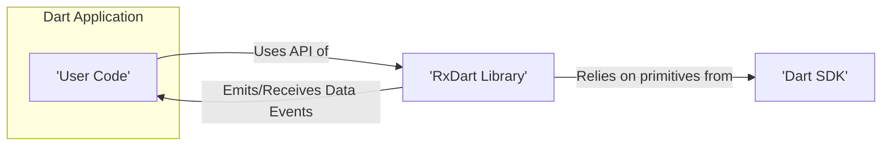

# Project Design Document: RxDart

**Version:** 1.1
**Date:** October 26, 2023
**Author:** AI Software Architect

## 1. Introduction

This document provides an enhanced and detailed design overview of the RxDart project, a reactive programming library for Dart. This document aims to clearly articulate the architecture, components, and interactions within RxDart to facilitate a comprehensive threat modeling exercise. It outlines the key elements of the library, focusing on its structure and how it enables asynchronous data streams and transformations in Dart applications. This revision includes more detailed explanations and diagrams to aid in understanding the library's inner workings for security analysis.

## 2. Goals and Objectives

The primary goal of this document is to provide a clear and comprehensive design overview of RxDart for security analysis and threat modeling. Specific objectives include:

*   Clearly identifying the core components and their functionalities within RxDart with greater detail.
*   Illustrating the data flow and interactions between these components using enhanced descriptions and diagrams.
*   Highlighting potential areas of interest for security considerations with more specific examples.
*   Providing a robust foundation for understanding the library's internal workings to support effective threat modeling.

## 3. Scope

This document focuses on the architectural design of the RxDart library itself. It covers the core concepts, key classes, and their relationships with a deeper level of explanation. The scope includes:

*   The fundamental building blocks of RxDart (Streams, Observables, Subjects, Operators) with detailed descriptions of their roles.
*   The mechanisms for creating, transforming, and managing streams, including the lifecycle of subscriptions.
*   The interaction between user code and the RxDart library, focusing on the API boundaries.

This document does *not* cover:

*   Specific implementations of applications using RxDart beyond illustrative examples.
*   The underlying implementation details of the Dart SDK beyond their direct interaction with RxDart.
*   Detailed performance benchmarking or optimization strategies for RxDart.

## 4. High-Level Architecture

The following diagram illustrates the high-level architecture of RxDart:



**Description:**

*   **User Code:** Represents the Dart application code that utilizes the RxDart library through its public API.
*   **RxDart Library:** The core library providing reactive programming functionalities, built upon Dart's asynchronous capabilities.
*   **Dart SDK:** The underlying Dart Software Development Kit that provides the foundational `Stream` class and other asynchronous primitives that RxDart extends.

**Key Interactions:**

*   User code interacts with the RxDart library by calling methods on its classes (e.g., creating Observables, subscribing to them).
*   The RxDart library internally utilizes and extends the fundamental stream capabilities provided by the Dart SDK.
*   Data, in the form of events, flows between the user code and the RxDart library as streams are processed.

## 5. Detailed Design

### 5.1 Core Concepts

*   **Stream (from Dart SDK):**  A sequence of asynchronous events, the fundamental building block for handling asynchronous data in Dart. RxDart leverages and extends this concept.
*   **Observable:** RxDart's central abstraction for representing an asynchronous data stream. It provides a rich and composable API through operators for transforming, filtering, and combining streams. Think of it as a more feature-rich version of a Dart `Stream`.
*   **Observer:** An interface that defines the contract for consuming events emitted by an Observable. It specifies methods for handling different types of events:
    *   `onNext(T data)`: Called when a new data event is emitted.
    *   `onError(Object error, StackTrace stackTrace)`: Called when an error occurs in the stream.
    *   `onDone()`: Called when the stream has finished emitting events.
*   **Subscription:** Represents the active link between an Observable and an Observer. It provides a mechanism to unsubscribe, effectively stopping the flow of events to the Observer and potentially releasing resources held by the Observable.
*   **Subject:** A special type of Observable that also acts as an Observer (or more accurately, a Sink). This dual nature allows Subjects to both emit events to subscribers and receive events that are then broadcast to those subscribers. This makes them useful for multicasting and event aggregation.
*   **Operator:** Functions that operate on Observables to transform the sequence of emitted items. Operators are chained together to create complex data processing pipelines. They return new Observables based on the source Observable.
*   **Scheduler:** Controls the execution context in which stream events are processed. This allows for managing concurrency and ensuring operations happen on the desired thread or isolate. RxDart provides default schedulers and allows for custom implementations.
*   **Sink:** An object used to add events to a stream controller. While not directly exposed in most user interactions with RxDart's higher-level APIs, it's a fundamental concept for how events are pushed into streams, especially within Subjects.

### 5.2 Key Components

*   **`Stream` (from Dart SDK):** The foundational class for asynchronous data sequences. RxDart builds upon this, often wrapping `Stream` instances within `Observable`s.
*   **`Observable`:**
    *   Represents a stream of data that can be subscribed to by Observers.
    *   Provides a fluent and chainable API for applying operators.
    *   Abstract base class with various concrete implementations, such as:
        *   `StreamObservable`: Wraps a standard Dart `Stream`.
        *   `FutureObservable`: Emits the result of a `Future` and then completes.
        *   `TimerObservable`: Emits a sequence of values after a specified delay.
*   **`Observer`:**
    *   An interface defining the `onNext`, `onError`, and `onDone` methods for handling stream events.
    *   Typically implemented anonymously when subscribing to an Observable.
*   **`Subscription`:**
    *   An object returned when an Observer subscribes to an Observable.
    *   Has a crucial `unsubscribe()` method to stop the flow of events and release resources. Proper management of subscriptions is vital to prevent memory leaks.
*   **`Subject`:**
    *   Implements both the `Observable` interface (allowing subscription) and the `Sink` interface (allowing adding events).
    *   Different types of Subjects offer varying behaviors:
        *   `PublishSubject`: Emits new items to subscribers only after subscription.
        *   `BehaviorSubject`: Emits the most recent item and subsequent new items to subscribers.
        *   `ReplaySubject`: Buffers a specified number of recent items and emits them to new subscribers.
        *   `CompletableSubject`: Represents a process that completes successfully or with an error, emitting only completion or error signals.
        *   `SingleSubject`: Represents a process that will emit a single value or an error.
*   **Operators (as extension methods on `Observable`):**
    *   A rich set of functions that extend the functionality of `Observable`.
    *   Implemented as extension methods for a clean and readable API.
    *   Categorized by their function (e.g., transforming, filtering, combining):
        *   **Transformation Operators:** `map`, `flatMap`, `scan`, `buffer`.
        *   **Filtering Operators:** `filter`, `debounceTime`, `distinct`.
        *   **Combination Operators:** `merge`, `combineLatest`, `zip`.
        *   **Error Handling Operators:** `catchError`, `retry`.
        *   **Utility Operators:** `delay`, `timeout`.
*   **`Scheduler`:**
    *   An abstract class defining the contract for scheduling tasks.
    *   Concrete implementations:
        *   `ImmediateScheduler`: Executes tasks immediately on the current thread.
        *   `AsyncScheduler`: Executes tasks asynchronously.
        *   Custom schedulers can be implemented for specific needs.
    *   Used internally by operators to manage the timing and concurrency of operations.
*   **`Sink`:**
    *   An interface for adding events to a stream controller.
    *   Used internally by Subjects and stream creation methods to push events into the stream pipeline.

### 5.3 Data Flow

The typical data flow within an RxDart application involves the following steps:

1. **Stream Creation:** An `Observable` is created. This can involve wrapping an existing `Stream`, using a `Subject`, or employing factory methods provided by `Observable` (e.g., `Observable.fromFuture`, `Observable.periodic`).
2. **Operator Application:** Operators are chained together using the fluent API of `Observable`. Each operator subscribes to the preceding `Observable` and creates a new `Observable` that transforms the emitted events.

    ```mermaid
    graph LR
        A["'Source Observable'"] --> B("'.map(transform)'")
        B --> C("'.filter(condition)'")
        C --> D["'Resulting Observable'"]
    ```

3. **Subscription:** An `Observer` subscribes to the final `Observable` in the chain. This initiates the flow of data.
4. **Event Emission:** Events are emitted by the source of the stream. This could be a `Subject` receiving external input, a timer firing, or data arriving from an asynchronous operation.
5. **Event Processing:** Events flow through the chain of operators. Each operator performs its defined transformation or filtering on the event before passing it to the next operator in the chain.
6. **Event Delivery:** The final transformed event is delivered to the `Observer`'s `onNext` method.
7. **Error Handling:** If an error occurs at any point in the stream processing pipeline, the error is propagated down the chain, and the `onError` method of the `Observer` is called. Operators like `catchError` can intercept and handle errors.
8. **Completion:** When the source `Observable` completes (no more events will be emitted), the `onDone` method of the `Observer` is called.
9. **Unsubscription:** The `Subscription` object allows the `Observer` to unsubscribe, stopping the flow of events and potentially releasing resources held by the `Observable` chain.

### 5.4 Key Interactions

*   **User Code and Observable Creation:** User code interacts with RxDart to instantiate `Observable` objects, often using factory methods or by wrapping existing asynchronous sources.
*   **Observable and Operator Interaction:** Operators are applied to `Observable` instances, creating new `Observable`s that represent the transformed data stream. This composition is a fundamental aspect of RxDart.
*   **Observable and Observer Interaction:** Observers attach to Observables via the `subscribe()` method to begin receiving events. The `Subscription` object manages this connection and allows for termination.
*   **Subject as a Bridge:** Subjects act as intermediaries, allowing external code to inject events into a stream that can be observed by multiple subscribers. This is crucial for event handling and state management scenarios.
*   **Scheduler and Operator Execution:** Operators may utilize Schedulers to control the threading or timing of their operations, enabling asynchronous and concurrent processing. For example, `debounceTime` uses a scheduler to delay emissions.

## 6. Security Considerations

While RxDart itself is a library focused on asynchronous data management and doesn't inherently handle sensitive data or network communication directly, potential security considerations arise from its usage and the nature of reactive programming:

*   **Information Disclosure through Error Handling:**  Ensure that error handling logic within stream pipelines does not inadvertently expose sensitive information through error messages or stack traces. Implement specific error handling with logging that avoids revealing confidential data.
*   **Resource Exhaustion and Denial of Service:**  Carefully manage subscriptions and avoid creating unbounded streams or operator chains that could lead to excessive memory consumption or CPU usage, potentially causing denial-of-service conditions. Implement backpressure strategies where necessary.
*   **Data Integrity and Malicious Transformations:**  When using operators to transform data, ensure that these transformations are secure and do not introduce vulnerabilities or allow for malicious manipulation of data within the stream. Validate data at appropriate points in the pipeline.
*   **Security Implications of Side Effects:**  Be cautious when performing side effects within stream processing logic. Ensure that these side effects are idempotent and do not introduce security vulnerabilities, such as modifying shared state in an unsafe manner.
*   **Dependency Vulnerabilities (Dart SDK):**  Keep the Dart SDK updated to mitigate any potential vulnerabilities in the underlying platform that could affect RxDart. Regularly review security advisories for the Dart ecosystem.
*   **Subject Security and Unauthorized Data Injection:**  If using `Subject` instances, especially in scenarios where external input is involved, implement appropriate access controls and validation to prevent unauthorized entities from injecting malicious data into the stream. Consider using immutable data structures to prevent unintended modifications.
*   **Backpressure Vulnerabilities:**  If backpressure is not handled correctly, a fast producer could overwhelm a slow consumer, leading to dropped events or resource exhaustion. Implement appropriate backpressure strategies like buffering, dropping, or throttling.
*   **Timing Attacks:** Be mindful of potential timing attacks if sensitive operations are performed within stream pipelines. Operators like `debounceTime` or `throttleTime` could inadvertently reveal information about the timing of events.

## 7. Dependencies

RxDart primarily depends on the core Dart SDK. It leverages the `dart:async` library for fundamental asynchronous capabilities, including `Stream` and `Future`.

*   **Dart SDK:** The underlying platform for execution and provides core asynchronous primitives.
*   **`dart:async`:** Provides essential classes like `Stream`, `Future`, and `StreamController`.

## 8. Deployment

RxDart is deployed as a Dart package that is included as a dependency in Dart projects. It is typically added to the `pubspec.yaml` file and fetched using the `pub get` command. The library itself doesn't have a separate deployment process beyond being included in an application's build.

## 9. Future Considerations

*   More detailed sequence diagrams illustrating the interaction between different components during specific operations (e.g., subscription, event processing through operators).
*   In-depth analysis of potential security vulnerabilities related to specific RxDart operators and their usage patterns.
*   Guidance on security best practices for using RxDart in various application architectures and security contexts.

## 10. Conclusion

This document provides an enhanced and more detailed design overview of the RxDart library, elaborating on its core concepts, components, and interactions. This information serves as a stronger foundation for understanding the library's architecture and will be more valuable for conducting thorough threat modeling exercises to identify and mitigate potential security risks associated with its use. By deeply understanding the data flow, the responsibilities of each component, and potential misuse scenarios, security analysts can more effectively assess the attack surface and potential vulnerabilities within applications leveraging RxDart.