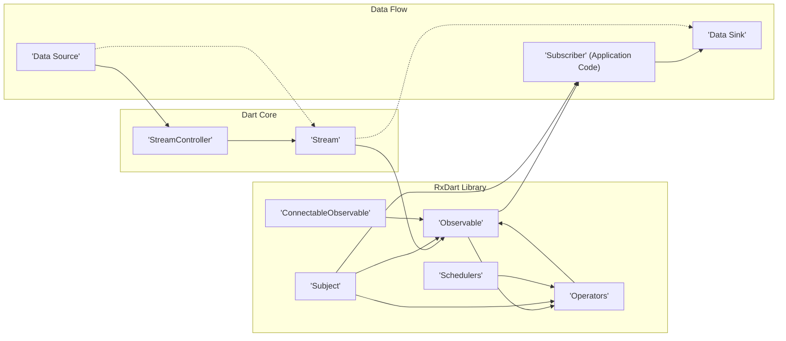

## Project Design Document: RxDart Library for Threat Modeling (Improved)

**Project Name:** RxDart Library

**Project Repository:** [https://github.com/reactivex/rxdart](https://github.com/reactivex/rxdart)

**Document Version:** 1.1

**Date:** 2023-10-27

**Author:** Gemini (AI Expert in Software, Cloud, and Cybersecurity Architecture)

**1. Introduction**

This document provides an enhanced design overview of the RxDart library, a reactive programming library for Dart, specifically tailored for threat modeling. Building upon the initial design document, this version offers more detailed security considerations and a clearer focus on how to use this document for effective threat modeling activities. It outlines the architecture, key components, data flow, and refined security considerations of RxDart to facilitate a more in-depth identification of potential vulnerabilities and security risks in applications utilizing RxDart.

**2. Project Overview**

RxDart is a Dart library that augments the core Dart `Stream` API with Reactive Extensions (Rx) patterns. It empowers developers to construct asynchronous and event-driven programs in a declarative and composable style through a rich set of operators, stream transformers, and utilities. RxDart is a popular choice in Flutter and Dart development for managing intricate asynchronous data streams, user interactions, and application state.  Understanding its architecture is crucial for securing applications that rely on it.

**3. System Architecture**

RxDart's architecture is library-centric, designed to extend and enrich Dart's native `Stream` capabilities.  It's not a standalone application but a set of tools integrated into Dart projects. The core architectural elements revolve around Observables, Operators, Subjects, and Subscribers, all operating within the Dart `Stream` ecosystem. This layered approach provides flexibility but also necessitates careful security consideration at each layer.



**4. Component Description (Detailed Security Considerations)**

This section provides a detailed breakdown of RxDart components, with an emphasis on security implications and potential vulnerabilities associated with each.

*   **4.1. Stream (Dart Core):**
    *   **Description:** The foundational asynchronous data sequence in Dart.  It's a conduit for data events, completion signals, and error notifications.
    *   **Functionality:** Emits a sequence of data events, signals errors, and indicates completion. Streams can be listened to by multiple subscribers, enabling broadcast patterns.
    *   **Security Relevance:** While Streams themselves aren't inherently vulnerable, their usage within applications can introduce security risks.
        *   **Unhandled Errors:**  If errors within a stream are not properly handled (e.g., using `onError` handlers in subscribers or `catchError` operators), they can propagate up, potentially crashing the application or leading to unexpected behavior. This can be exploited for Denial of Service or to bypass error handling logic.
        *   **Resource Leaks:** Streams that are not properly closed or disposed of, especially those tied to external resources (like file handles or network connections), can lead to resource leaks over time, impacting application stability and potentially opening avenues for resource exhaustion attacks.

*   **4.2. StreamController (Dart Core):**
    *   **Description:**  A mechanism to programmatically create and manage Streams. It acts as a bridge between imperative code and the reactive stream world.
    *   **Functionality:** Provides a `sink` to add data (`sink.add`), errors (`sink.addError`), and close the stream (`close`).  Offers control over the stream's lifecycle.
    *   **Security Relevance:** Improper `StreamController` usage can introduce vulnerabilities:
        *   **Unclosed Streams & Resource Exhaustion:** Failing to `close()` a `StreamController` when it's no longer needed can lead to resource leaks, especially if the stream is continuously emitting events or holding onto resources. This can contribute to Denial of Service.
        *   **Uncontrolled Sink Access:** If the `StreamController`'s `sink` is exposed without proper access control, unauthorized components could inject data or errors into the stream, potentially disrupting application logic or injecting malicious data.  Consider encapsulation and access modifiers to limit sink access.
        *   **Data Injection Vulnerabilities:** If external, untrusted input is directly fed into a `StreamController`'s sink without validation, it can become a vector for injection attacks.  Always validate and sanitize data before adding it to the sink.

*   **4.3. Observable (RxDart):**
    *   **Description:** RxDart's enhanced Stream, providing a rich API of operators for stream manipulation. It's the central abstraction for reactive programming in RxDart.
    *   **Functionality:** Wraps a Dart `Stream` and extends it with a vast library of Rx operators. Manages subscriptions and event propagation.
    *   **Security Relevance:** Operators within Observables perform data transformations and control flow, making them critical points for security analysis.
        *   **Operator Logic Flaws:** Bugs or vulnerabilities in custom or even built-in operators can lead to unexpected data manipulation, information leakage, or application crashes. Thorough testing and code review of operator logic are essential.
        *   **Resource Exhaustion via Buffering Operators:** Operators like `buffer`, `window`, `debounce` (with long durations), if misconfigured or used with unbounded input streams, can lead to excessive memory consumption, causing performance degradation or Denial of Service.  Always consider backpressure and resource limits when using buffering operators.
        *   **Timing-Based Vulnerabilities:** Operators dealing with time (e.g., `debounce`, `throttle`, `delay`) might introduce timing-related vulnerabilities if not implemented and used correctly. For example, incorrect use of `debounce` in authentication flows could create bypass opportunities.
        *   **Information Leakage through Error Handling:**  Default error handling in operator chains might inadvertently expose sensitive information in error messages or stack traces. Use `catchError` operators to sanitize error information before it propagates to subscribers or logs.

*   **4.4. Subject (RxDart):**
    *   **Description:** A versatile Observable that is also an Observer, acting as both a source and a consumer of events. Subjects are multicast, broadcasting events to multiple subscribers.
    *   **Functionality:** Allows manual event addition (`add`), error signaling (`addError`), and stream completion (`close`). Different Subject types (`BehaviorSubject`, `ReplaySubject`, `PublishSubject`, `AsyncSubject`) offer varying event delivery semantics.
    *   **Security Relevance:** Subjects, due to their dual nature and multicasting behavior, require careful security consideration:
        *   **Unintended Multicast Exposure:**  If a Subject is used to broadcast sensitive data, ensure that only authorized subscribers are registered to receive those events.  Improperly scoped Subjects can lead to unintended information disclosure to unauthorized parts of the application.
        *   **Stateful Subject Information Disclosure (BehaviorSubject, ReplaySubject):** `BehaviorSubject` and `ReplaySubject` retain previously emitted values. New subscribers might receive this historical data, potentially exposing sensitive information that should not be accessible to them.  Carefully consider the lifecycle and scope of stateful Subjects.
        *   **Uncontrolled Input via Subjects:** Subjects can act as entry points for external data. If untrusted input is directly fed into a Subject, it becomes a prime target for injection attacks.  Strict input validation and sanitization are crucial before adding data to a Subject.
        *   **Race Conditions in Multicast Scenarios:** In concurrent environments, if multiple subscribers react to events from a Subject and modify shared state, race conditions can occur, leading to unpredictable behavior and potential security vulnerabilities.  Proper synchronization mechanisms might be needed when using Subjects in concurrent contexts.

*   **4.5. Operators (RxDart):**
    *   **Description:** Functions that transform, filter, combine, or control event streams. RxDart provides a comprehensive set of operators inspired by ReactiveX principles.
    *   **Functionality:** Modify stream behavior. Examples include data transformation (`map`), filtering (`filter`), timing control (`debounce`, `throttle`), stream combination (`merge`, `concat`), data aggregation (`scan`, `buffer`), and error management (`catchError`, `retry`).
    *   **Security Relevance:** Operators are the workhorses of RxDart pipelines, and their security is paramount.
        *   **Logic Flaws in Operator Implementations:**  Incorrectly implemented operators, especially custom ones, can introduce vulnerabilities. Thorough testing, code reviews, and potentially formal verification techniques are recommended for complex custom operators.
        *   **Data Transformation Vulnerabilities:** Operators that transform data must be designed to avoid introducing vulnerabilities during transformation. For example, improper string manipulation in `map` operators could lead to format string bugs (less common in Dart but still a concern in certain contexts) or data corruption.
        *   **Error Handling Gaps in Operators:**  Insufficient error handling within operators can lead to unhandled exceptions, application crashes, or information leakage. Operators should gracefully handle potential errors and use `catchError` or similar mechanisms to manage exceptions within the stream pipeline.
        *   **Side Effects in Operators and Security Implications:** Operators with side effects (e.g., logging, API calls, database updates) can introduce security risks if these side effects are not carefully controlled and secured. For example, logging sensitive data within an operator could lead to information leakage if logs are not properly secured. Ensure side effects are necessary and secure.

*   **4.6. ConnectableObservable (RxDart):**
    *   **Description:** An Observable that delays event emission until its `connect()` method is invoked. Enables shared subscriptions and controlled event initiation.
    *   **Functionality:** Provides explicit control over when an Observable starts emitting events to its subscribers. Useful for scenarios requiring synchronization or batch processing.
    *   **Security Relevance:** ConnectableObservables introduce timing and synchronization considerations that can have security implications.
        *   **Race Conditions in Connection Management:** If the `connect()` call is not properly synchronized in concurrent environments, race conditions might occur, leading to unexpected event emission timing or missed events, potentially impacting security-sensitive operations that rely on specific event sequences.
        *   **Denial of Service through Delayed Connection:** In scenarios where connection is resource-intensive, delaying connection indefinitely could be exploited for Denial of Service if an attacker can prevent the `connect()` call from ever happening, tying up resources without releasing them.

*   **4.7. Schedulers (RxDart):**
    *   **Description:** Control the execution context (thread or isolate) for operators and subscribers. RxDart offers schedulers for different execution environments (e.g., `ImmediateScheduler`, `ComputeScheduler`, `EventLoopScheduler`).
    *   **Functionality:** Allows specifying where stream processing and event handling occur, enabling concurrency and offloading work to background isolates.
    *   **Security Relevance:** Schedulers indirectly impact security by influencing performance, resource utilization, and concurrency behavior.
        *   **Concurrency Vulnerabilities:** Incorrect use of concurrency with schedulers can introduce race conditions, deadlocks, or other concurrency-related vulnerabilities, especially when shared mutable state is accessed from different execution contexts.  Careful synchronization and thread-safety considerations are crucial.
        *   **Performance Degradation and DoS:**  Misusing schedulers, for example, by performing computationally intensive operations on the main thread or by overloading isolates, can lead to performance degradation and potentially contribute to Denial of Service.  Choose appropriate schedulers based on the workload and resource constraints.
        *   **Security Context Switching:** When switching schedulers, be mindful of security context switching. Ensure that security-sensitive operations are performed in the appropriate security context and that context switching does not inadvertently weaken security controls.

*   **4.8. Subscriber (Application Code):**
    *   **Description:** The consumer of events from Observables or Subjects. Application logic that reacts to and processes data from RxDart streams.
    *   **Functionality:** Provides callbacks (`onData`, `onError`, `onDone`) to handle events emitted by the Observable. Implements the application's reactive logic.
    *   **Security Relevance:** Subscriber code is where application-specific logic resides and is often the point where vulnerabilities are exploited.
        *   **Input Validation and Sanitization (Critical):** Subscribers *must* validate and sanitize all data received from streams before using it in application logic. Failure to do so is a primary source of vulnerabilities like injection attacks (XSS, SQL Injection, Command Injection, etc.).
        *   **Secure Data Handling (Confidentiality, Integrity, Availability):** Subscribers handling sensitive data must implement secure data handling practices, including encryption in transit and at rest, access control, and secure storage.
        *   **Error Handling and Information Disclosure Prevention:** Subscribers must handle errors gracefully and avoid exposing sensitive information in error messages, logs, or user interfaces. Sanitize error messages and log only necessary information.
        *   **Resource Management in Subscribers:** Subscribers should properly manage resources acquired during stream processing (e.g., closing database connections, releasing file handles, disposing of objects) to prevent resource leaks and ensure application stability.
        *   **Authorization and Access Control:** Subscribers should enforce authorization and access control policies to ensure that only authorized users or components can access and process sensitive data from streams.

**5. Data Flow Diagram (Enhanced)**

This diagram provides a more detailed view of data flow, including data sources and sinks, and emphasizes the role of operators in data transformation.

```mermaid
graph LR
    A["'External Data Source' (API, User Input, Sensor)"] --> B["'StreamController'"];
    B --> C["'Stream'"];
    C --> D["'Observable'"];
    D --> E["'Operator Chain' (map, filter, validate, sanitize, etc.)'"];
    E --> F["'Subject' (optional - for multicasting)"];
    F --> G["'Subscriber 1' (Application Logic - e.g., UI Update)"];
    F --> H["'Subscriber 2' (Logging, Analytics)"];
    G --> I["'Data Sink' (Database, UI, External System)"];
    H --> J["'Log Storage'"];

    style A fill:#f9f,stroke:#333,stroke-width:2px,color:#333
    style G fill:#ccf,stroke:#333,stroke-width:2px,color:#333
    style H fill:#ccf,stroke:#333,stroke-width:2px,color:#333
    style I fill:#eee,stroke:#333,stroke-width:2px,color:#333
    style J fill:#eee,stroke:#333,stroke-width:2px,color:#333

    linkStyle 0,1,2,3,4,5,6,7,8,9 stroke:#333,stroke-width:1px;
```

**Data Flow Description (Enhanced):**

1.  **External Data Source:** Data originates from external sources, which are often untrusted or partially trusted (APIs, user input, sensors, network connections).
2.  **StreamController (Entry Point):** `StreamController` acts as the entry point for external data into the RxDart pipeline.
3.  **Stream (Data Channel):** The `Stream` represents the flow of data.
4.  **Observable (RxDart Abstraction):** The `Stream` is wrapped in an `Observable` for RxDart operator usage.
5.  **Operator Chain (Transformation & Security):** This is a crucial stage where operators are applied.  **Crucially, security-focused operators like validation and sanitization should be included in this chain *before* data reaches subscribers.** Data transformation, filtering, and security hardening occur here.
6.  **Subject (Multicasting - Optional):**  A `Subject` (if used) multicasts events to multiple subscribers.
7.  **Subscribers (Application Logic & Sinks):** Subscribers consume the processed data.
    *   **Subscriber 1 (Application Logic):** Performs core application logic, often updating the UI or triggering business processes.
    *   **Subscriber 2 (Non-Critical Functions):** Handles secondary functions like logging or analytics.
8.  **Data Sink (Output):** Subscribers often write data to data sinks, such as databases, user interfaces, external systems, or log storage.

**6. Security Considerations (Categorized and Actionable)**

This section categorizes security considerations and provides actionable recommendations for mitigating risks when using RxDart.

*   **6.1. Input Validation and Sanitization (Prevention of Injection Attacks):**
    *   **Risk:** Failure to validate and sanitize input data from external sources before it enters the RxDart pipeline can lead to injection attacks (XSS, SQL Injection, Command Injection, etc.).
    *   **Actionable Recommendations:**
        *   **Validate all external input:** Implement validation operators (custom or using libraries) early in the operator chain to ensure data conforms to expected formats and constraints.
        *   **Sanitize input data:** Use sanitization operators to remove or encode potentially malicious characters or code from input data before it is processed or displayed.
        *   **Principle of Least Privilege:**  Grant RxDart components only the necessary permissions to access data sources and sinks.
        *   **Regular Security Audits:** Conduct regular security audits of RxDart pipelines to identify potential input validation gaps.

*   **6.2. Error Handling and Information Disclosure (Maintaining Confidentiality & Availability):**
    *   **Risk:** Unhandled errors can crash the application or expose sensitive information in error messages or logs.
    *   **Actionable Recommendations:**
        *   **Implement comprehensive error handling:** Use `catchError` operators throughout the RxDart pipeline to gracefully handle errors and prevent unhandled exceptions from propagating.
        *   **Sanitize error messages:** Ensure error messages logged or displayed to users do not contain sensitive information. Log detailed error information securely for debugging purposes, but not in production logs accessible to unauthorized parties.
        *   **Centralized Error Logging:** Implement centralized and secure error logging to monitor application health and identify potential security incidents.
        *   **Circuit Breaker Pattern:** Consider using circuit breaker patterns (potentially with custom operators) to prevent cascading failures in reactive systems and improve resilience.

*   **6.3. Resource Management and Denial of Service (Ensuring Availability):**
    *   **Risk:** Resource leaks (memory, connections) and unbounded resource consumption can lead to performance degradation and Denial of Service.
    *   **Actionable Recommendations:**
        *   **Properly close streams and dispose of resources:** Ensure `StreamController`s are closed when no longer needed, and subscribers dispose of any resources they acquire.
        *   **Implement backpressure:** Use backpressure mechanisms (e.g., `throttle`, `debounce`, `sample`, custom backpressure operators) to control the rate of data flow and prevent overwhelming subscribers or operators.
        *   **Set resource limits:** Configure operators that buffer data (e.g., `buffer`, `window`) with appropriate size limits to prevent unbounded memory consumption.
        *   **Monitor resource usage:** Monitor application resource usage (CPU, memory, network) to detect and address potential resource leaks or excessive consumption.

*   **6.4. Logic Flaws in Operators (Maintaining Integrity):**
    *   **Risk:** Bugs or vulnerabilities in custom or built-in operators can lead to incorrect data processing, information leakage, or application crashes.
    *   **Actionable Recommendations:**
        *   **Thoroughly test operators:** Implement comprehensive unit and integration tests for all operators, especially custom ones, to verify their correctness and security properties.
        *   **Code reviews for operator logic:** Conduct code reviews of operator implementations to identify potential logic flaws or security vulnerabilities.
        *   **Static analysis:** Use static analysis tools to detect potential vulnerabilities in operator code.
        *   **Consider using well-vetted operators:** Prefer using well-established and community-vetted RxDart operators over creating complex custom operators when possible.

*   **6.5. State Management Vulnerabilities (Subjects - Maintaining Confidentiality & Integrity):**
    *   **Risk:** Improper use of Subjects, especially stateful Subjects, can lead to unintended information disclosure or data corruption.
    *   **Actionable Recommendations:**
        *   **Minimize stateful Subject usage:**  Avoid using stateful Subjects (`BehaviorSubject`, `ReplaySubject`) for sensitive data unless absolutely necessary.
        *   **Scope Subjects appropriately:** Limit the scope and visibility of Subjects to minimize the risk of unintended access or modification.
        *   **Access control for Subjects:** Implement access control mechanisms to restrict who can publish events to or subscribe to Subjects, especially for sensitive data streams.
        *   **Document Subject lifecycle and state management:** Clearly document the lifecycle and state management behavior of Subjects to ensure developers understand their implications.

*   **6.6. Concurrency Vulnerabilities (Schedulers - Maintaining Integrity & Availability):**
    *   **Risk:** Incorrect concurrency management with schedulers can introduce race conditions, deadlocks, and other concurrency-related vulnerabilities.
    *   **Actionable Recommendations:**
        *   **Minimize shared mutable state:** Reduce the use of shared mutable state in concurrent RxDart pipelines. Prefer immutable data structures and functional programming principles.
        *   **Synchronization mechanisms:** Use appropriate synchronization mechanisms (locks, mutexes, atomic operations) when shared mutable state is unavoidable in concurrent contexts.
        *   **Thread-safety audits:** Conduct thread-safety audits of RxDart pipelines that utilize concurrency to identify and address potential race conditions or other concurrency issues.
        *   **Choose appropriate schedulers:** Select schedulers that are appropriate for the workload and resource constraints, avoiding overloading the main thread or isolates.

*   **6.7. Dependency Vulnerabilities (Maintaining Integrity & Availability):**
    *   **Risk:** RxDart and its dependencies may contain known vulnerabilities that could be exploited.
    *   **Actionable Recommendations:**
        *   **Regularly update dependencies:** Keep RxDart and its dependencies up-to-date with the latest versions to patch known vulnerabilities.
        *   **Dependency vulnerability scanning:** Use dependency vulnerability scanning tools to identify and address known vulnerabilities in project dependencies.
        *   **Monitor security advisories:** Subscribe to security advisories for RxDart and its dependencies to stay informed about newly discovered vulnerabilities.

**7. Threat Modeling Focus (Using STRIDE Methodology)**

This design document facilitates threat modeling using methodologies like STRIDE. Here's how to apply STRIDE to RxDart components:

| Component          | STRIDE Threat Category | Example Threat                                                                 | Mitigation Strategy (Refer to Section 6)                                      |
|----------------------|------------------------|---------------------------------------------------------------------------------|---------------------------------------------------------------------------------|
| **StreamController** | Spoofing               | Unauthorized component injects malicious data into the stream.                   | Access control for `sink`, input validation.                                    |
|                      | Tampering              | Data added to the stream is modified in transit.                               | Integrity checks (if applicable at data source), secure communication channels. |
|                      | Repudiation            | Action of adding data to the stream cannot be attributed.                       | Auditing and logging of stream events (if required for compliance).             |
|                      | Information Disclosure | Error messages from `StreamController` expose sensitive data.                   | Sanitize error messages, secure logging.                                        |
|                      | Denial of Service      | Unclosed `StreamController` leads to resource leaks.                             | Proper resource management, stream lifecycle management.                        |
|                      | Elevation of Privilege |  (Less applicable to `StreamController` itself, more to its context of use)     | Context-dependent access control and privilege management.                     |
| **Observable/Operators**| Spoofing               | Operator impersonates another component. (Less direct threat)                  | Code review, operator integrity checks (if applicable).                         |
|                      | Tampering              | Operator logic is flawed, corrupting data.                                     | Thorough testing, code reviews, static analysis.                               |
|                      | Repudiation            | Actions within operators are not auditable. (Less direct threat)                 | Logging of operator actions (if required for auditing).                         |
|                      | Information Disclosure | Operator logic leaks sensitive data during transformation or error handling.    | Secure coding practices, sanitize error messages, secure logging.                |
|                      | Denial of Service      | Resource-intensive operators (buffering) cause memory exhaustion.               | Resource limits, backpressure, appropriate operator selection.                  |
|                      | Elevation of Privilege | Operator logic bypasses security checks.                                        | Secure coding practices, thorough testing, code reviews.                         |
| **Subject**          | Spoofing               | Unauthorized subscriber receives sensitive data multicast by Subject.           | Access control for subscribers, proper Subject scoping.                         |
|                      | Tampering              | State maintained by Subject is corrupted.                                       | Secure state management, immutability (where possible).                         |
|                      | Repudiation            | Actions related to Subject events are not auditable. (Less direct threat)        | Logging of Subject events (if required for auditing).                         |
|                      | Information Disclosure | Stateful Subject exposes historical sensitive data to new subscribers.          | Minimize stateful Subject usage, proper Subject lifecycle management.           |
|                      | Denial of Service      | Subject processing becomes a bottleneck, causing performance degradation.       | Performance optimization, appropriate scheduler selection.                      |
|                      | Elevation of Privilege | Subject allows unauthorized access to data or functionality.                    | Access control for Subjects, secure application logic.                         |
| **Subscriber**       | Spoofing               | Subscriber impersonates another component. (Less direct threat)                  | Authentication and authorization in application logic.                           |
|                      | Tampering              | Subscriber logic corrupts data in data sinks.                                   | Input validation before writing to sinks, data integrity checks at sinks.        |
|                      | Repudiation            | Actions performed by subscriber are not auditable.                              | Auditing and logging of subscriber actions (especially for security-sensitive operations). |
|                      | Information Disclosure | Subscriber logs or displays sensitive data insecurely.                          | Secure logging practices, sanitize output, access control for logs.              |
|                      | Denial of Service      | Subscriber logic consumes excessive resources, causing DoS.                     | Resource management in subscriber code, performance optimization.                 |
|                      | Elevation of Privilege | Subscriber logic bypasses authorization checks or gains unauthorized access. | Secure application logic, authorization enforcement in subscribers.             |

**8. Next Steps & Actionable Recommendations**

1.  **Conduct a Threat Modeling Workshop:** Use this document as a basis for a threat modeling workshop involving developers, security engineers, and stakeholders.
2.  **Apply STRIDE (or other methodology):** Systematically apply a threat modeling methodology like STRIDE (as exemplified in Section 7) to each component of your application's RxDart pipelines.
3.  **Prioritize and Mitigate Threats:** Prioritize identified threats based on risk (likelihood and impact) and develop mitigation strategies based on the actionable recommendations in Section 6.
4.  **Implement Security Controls:** Implement the identified security controls within your application's RxDart code, focusing on input validation, sanitization, error handling, resource management, and secure coding practices.
5.  **Regular Security Reviews:** Incorporate regular security reviews of RxDart pipelines into your development lifecycle to proactively identify and address new threats or vulnerabilities.
6.  **Security Testing:** Perform security testing (e.g., penetration testing, vulnerability scanning) of applications using RxDart to validate the effectiveness of implemented security controls.
7.  **Continuous Monitoring:** Implement continuous security monitoring to detect and respond to security incidents in real-time.

By following these steps and utilizing this design document, organizations can significantly enhance the security posture of applications built with RxDart and proactively mitigate potential threats.