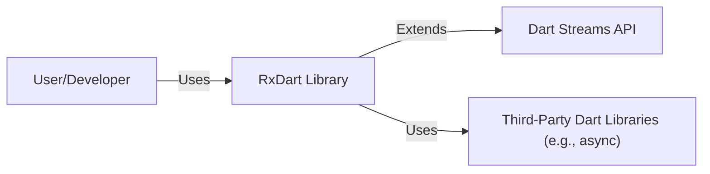
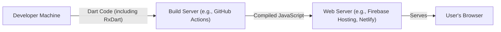
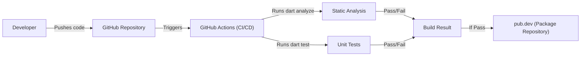

Okay, let's create a design document for the RxDart project.

# BUSINESS POSTURE

RxDart extends the capabilities of Dart Streams and StreamControllers. It's an implementation of the ReactiveX API for Dart. The primary business goal is to provide Dart developers with a powerful and familiar (for those coming from other ReactiveX implementations) way to handle asynchronous data streams, making their applications more responsive and easier to manage.

Business Priorities:

*   Developer Productivity: Enable developers to write cleaner, more maintainable asynchronous code.
*   Cross-Platform Compatibility: Support the various platforms Dart targets (web, mobile, server).
*   Community Adoption: Grow a strong community around the library.
*   Performance: Ensure the library adds minimal overhead to stream processing.
*   Interoperability: Seamlessly integrate with existing Dart code and the broader Dart ecosystem.

Business Risks:

*   Inconsistent API: Deviations from the ReactiveX standard or confusing API design could hinder adoption.
*   Performance Bottlenecks: Inefficient implementation could lead to performance issues in applications using RxDart.
*   Lack of Maintenance: Insufficient maintenance and updates could lead to bugs and compatibility issues with newer Dart versions.
*   Security Vulnerabilities: While primarily a functional library, vulnerabilities in stream handling could potentially be exploited. This is a lower risk than, say, a web framework, but still needs consideration.
*   Steep Learning Curve: Developers unfamiliar with Reactive programming concepts might find it difficult to adopt.

# SECURITY POSTURE

Existing Security Controls:

*   security control: Code Reviews: The GitHub repository shows evidence of pull requests and code reviews, which are essential for catching potential issues.
*   security control: Static Analysis: Dart's built-in analyzer and potentially custom linting rules help enforce code quality and identify potential problems.
*   security control: Testing: The project includes a comprehensive test suite, which helps ensure the correctness and stability of the library.
*   security control: Dependency Management: The project uses `pubspec.yaml` and `pubspec.lock` to manage dependencies, which helps ensure consistent builds and reduces the risk of using vulnerable versions.
*   security control: Community Scrutiny: Being an open-source project, RxDart benefits from the scrutiny of the community, which can help identify and report potential security issues.

Accepted Risks:

*   accepted risk: Limited Direct Security Focus: As a functional library focused on stream manipulation, RxDart doesn't directly handle sensitive data or authentication/authorization. The primary security focus is on preventing code-level vulnerabilities that could be indirectly exploited.
*   accepted risk: Reliance on Dart's Security: RxDart relies on the underlying security of the Dart runtime and standard libraries. Any vulnerabilities in those components could potentially affect RxDart.
*   accepted risk: Third-Party Dependencies: While dependency management is in place, there's always a residual risk associated with vulnerabilities in third-party packages.

Recommended Security Controls:

*   security control: Fuzz Testing: Implement fuzz testing to identify potential edge cases and vulnerabilities in stream processing.
*   security control: Dependency Scanning: Integrate automated dependency scanning tools (e.g., Dependabot or similar) to proactively identify and address vulnerabilities in dependencies.
*   security control: Security Policy: Add a `SECURITY.md` file to the repository to provide clear instructions on how to report security vulnerabilities.

Security Requirements:

*   Authentication: Not directly applicable to RxDart, as it's not involved in authentication.
*   Authorization: Not directly applicable to RxDart.
*   Input Validation: While RxDart itself doesn't handle user input directly, it's crucial for applications using RxDart to properly validate any data entering the streams.  This is the responsibility of the application using RxDart, not RxDart itself.
*   Cryptography: Not directly applicable to RxDart.
*   Error Handling: RxDart provides mechanisms for handling errors within streams (e.g., `onError`). Applications should use these mechanisms to gracefully handle errors and prevent unexpected behavior.
*   Data Sanitization: If streams handle data from untrusted sources, the application using RxDart must sanitize the data appropriately before processing it. This is outside the scope of RxDart itself.

# DESIGN

## C4 CONTEXT

Context Diagram Element Description:

*   Element:
    *   Name: User/Developer
    *   Type: Person
    *   Description: A Dart developer who uses the RxDart library in their application.
    *   Responsibilities: Integrates RxDart into their application, creates and manages RxDart streams, handles stream events and errors.
    *   Security controls: N/A (external to the library)

*   Element:
    *   Name: RxDart Library
    *   Type: Software System
    *   Description: The RxDart library itself, providing ReactiveX extensions for Dart streams.
    *   Responsibilities: Provides operators and classes for manipulating streams, manages stream subscriptions, handles error propagation.
    *   Security controls: Code Reviews, Static Analysis, Testing, Dependency Management, Community Scrutiny.

*   Element:
    *   Name: Dart Streams API
    *   Type: Software System
    *   Description: The built-in Dart Streams API, which RxDart extends.
    *   Responsibilities: Provides the fundamental building blocks for asynchronous data streams in Dart.
    *   Security controls: Relies on the security of the Dart SDK.

*   Element:
    *   Name: Third-Party Dart Libraries (e.g., async)
    *   Type: Software System
    *   Description: Other Dart libraries that RxDart might depend on.
    *   Responsibilities: Provide supporting functionality (e.g., asynchronous operations).
    *   Security controls: Dependency Management, Dependency Scanning (recommended).

## C4 CONTAINER

Since RxDart is a library, the container diagram is essentially the same as the context diagram. It doesn't have separate deployable units.

Container Diagram Element Description:

*   Element:
    *   Name: User/Developer
    *   Type: Person
    *   Description: A Dart developer who uses the RxDart library in their application.
    *   Responsibilities: Integrates RxDart into their application, creates and manages RxDart streams, handles stream events and errors.
    *   Security controls: N/A (external to the library)

*   Element:
    *   Name: RxDart Library
    *   Type: Software System
    *   Description: The RxDart library itself, providing ReactiveX extensions for Dart streams.
    *   Responsibilities: Provides operators and classes for manipulating streams, manages stream subscriptions, handles error propagation.
    *   Security controls: Code Reviews, Static Analysis, Testing, Dependency Management, Community Scrutiny.

*   Element:
    *   Name: Dart Streams API
    *   Type: Software System
    *   Description: The built-in Dart Streams API, which RxDart extends.
    *   Responsibilities: Provides the fundamental building blocks for asynchronous data streams in Dart.
    *   Security controls: Relies on the security of the Dart SDK.

*   Element:
    *   Name: Third-Party Dart Libraries (e.g., async)
    *   Type: Software System
    *   Description: Other Dart libraries that RxDart might depend on.
    *   Responsibilities: Provide supporting functionality (e.g., asynchronous operations).
    *   Security controls: Dependency Management, Dependency Scanning (recommended).

## DEPLOYMENT

RxDart is a library, not a standalone application. Therefore, it's "deployed" as part of a larger Dart application.  The deployment process depends on the target platform of the application (web, mobile, server).

Possible Deployment Solutions:

1.  Web Application (using `webdev` or `build_runner`): The Dart code (including RxDart) is compiled to JavaScript and deployed to a web server.
2.  Mobile Application (Flutter): The Dart code (including RxDart) is compiled to native code for Android and iOS.
3.  Server-Side Application (Dart VM): The Dart code (including RxDart) is run directly on the Dart VM.

Chosen Deployment Solution (Example: Web Application):

Deployment Diagram Element Description:

*   Element:
    *   Name: Developer Machine
    *   Type: Infrastructure Node
    *   Description: The developer's local machine where the code is written and tested.
    *   Responsibilities: Code development, local testing.
    *   Security controls: Standard developer machine security practices.

*   Element:
    *   Name: Build Server (e.g., GitHub Actions)
    *   Type: Infrastructure Node
    *   Description: A server that automates the build process.
    *   Responsibilities: Compiles Dart code to JavaScript, runs tests.
    *   Security controls: Secure configuration of the build server, access controls.

*   Element:
    *   Name: Web Server (e.g., Firebase Hosting, Netlify)
    *   Type: Infrastructure Node
    *   Description: A server that hosts the compiled JavaScript code.
    *   Responsibilities: Serves the web application to users.
    *   Security controls: Standard web server security practices (HTTPS, etc.).

*   Element:
    *   Name: User's Browser
    *   Type: Client
    *   Description: The user's web browser, where the application runs.
    *   Responsibilities: Executes the JavaScript code.
    *   Security controls: Browser security features.

## BUILD

The RxDart project uses GitHub Actions for its CI/CD pipeline. The build process involves:

1.  Developer pushes code to GitHub.
2.  GitHub Actions triggers a workflow.
3.  The workflow sets up the Dart environment.
4.  The workflow runs `dart analyze` to check for static analysis errors.
5.  The workflow runs `dart test` to execute the test suite.
6.  If all checks pass, the workflow might publish the package to `pub.dev` (although this is not explicitly shown in the provided repository, it's a common practice for Dart libraries).

Build Process Security Controls:

*   security control: GitHub Actions: Uses a managed CI/CD service, reducing the risk of self-hosting build infrastructure.
*   security control: Static Analysis: `dart analyze` is used to identify potential code quality and security issues.
*   security control: Automated Testing: `dart test` ensures that the code behaves as expected and helps prevent regressions.
*   security control: Dependency Management: `pubspec.yaml` and `pubspec.lock` ensure consistent builds and reduce the risk of using vulnerable dependencies.

# RISK ASSESSMENT

*   Critical Business Process: Providing a reliable and efficient way for Dart developers to handle asynchronous data streams.
*   Data Sensitivity: RxDart itself does not handle sensitive data directly. The sensitivity of the data depends on the application using RxDart.  The library operates on *data streams*, but the *content* of those streams is entirely determined by the application using the library. Therefore, data sensitivity is "Application-Dependent."

# QUESTIONS & ASSUMPTIONS

*   Questions:
    *   Are there any specific performance benchmarks or targets for RxDart?
    *   Are there plans to add more advanced security features, such as support for signed packages?
    *   What is the process for handling security vulnerabilities reported by the community? (This should ideally be documented in a `SECURITY.md` file).
    *   Is there any consideration for using RxDart in security-sensitive contexts, and if so, what additional precautions should be taken?

*   Assumptions:
    *   BUSINESS POSTURE: The primary goal is to provide a functional library, not to handle sensitive data directly.
    *   SECURITY POSTURE: The existing security controls (code reviews, testing, etc.) are sufficient for the current risk profile.
    *   DESIGN: The library will continue to be a single, cohesive unit (no separate deployable components).
    *   The Dart SDK and underlying platform provide a secure foundation.
    *   Developers using RxDart are responsible for securing their own applications, including data validation and sanitization.
    *   Third-party dependencies are reasonably well-maintained and secure.
    *   The build process is secure and reliable.