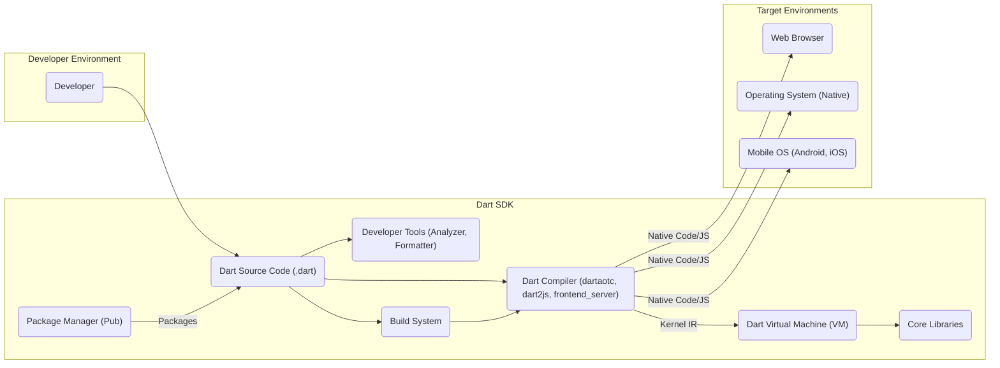
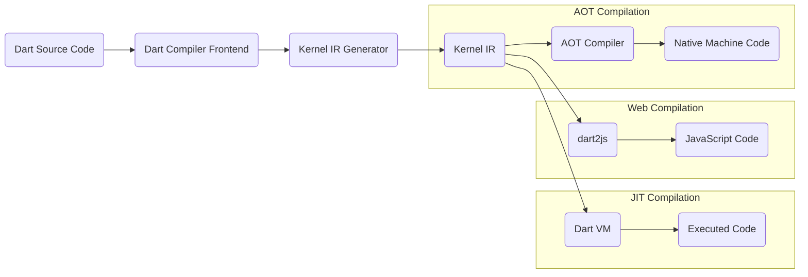
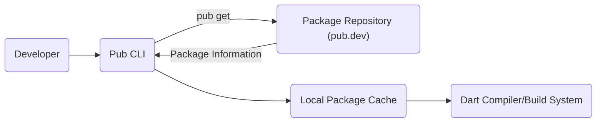

# Project Design Document: Dart SDK

**Version:** 1.1
**Date:** October 26, 2023
**Prepared By:** Gemini (AI Language Model)

## 1. Introduction

This document provides a high-level architectural design of the Dart SDK (Software Development Kit), as represented by the codebase at [https://github.com/dart-lang/sdk](https://github.com/dart-lang/sdk). This document is intended to serve as a foundation for subsequent threat modeling activities. It outlines the key components, their interactions, and the data flows within the SDK.

## 2. Goals and Objectives

The primary goals of the Dart SDK are to:

* Provide developers with the necessary tools and libraries to build and run Dart applications.
* Enable cross-platform development targeting web, mobile, and desktop environments.
* Offer high performance and developer productivity.
* Facilitate a robust and secure development ecosystem.

## 3. Scope

This design document focuses on the core components of the Dart SDK that are relevant for threat modeling. It includes:

* The Dart Compiler (`dartaotc`, `dart2js`, `frontend_server`).
* The Dart Virtual Machine (VM).
* The Core Libraries (`dart:core`, `dart:async`, etc.).
* The Package Manager (Pub).
* Key Developer Tools (Analyzer, Formatter).
* The Build System.

This document does not cover:

* Specific applications built using the Dart SDK.
* The detailed implementation of individual libraries or tools.
* The infrastructure hosting the Dart SDK website or repositories.

## 4. High-Level Architecture

## 5. Component Details

This section provides a more detailed description of the key components within the Dart SDK.

### 5.1. Dart Compiler

* **Description:** The Dart Compiler is responsible for translating Dart source code into executable code for various target platforms.
* **Responsibilities:**
    * Parsing Dart source code.
    * Performing static analysis and type checking.
    * Optimizing code for performance.
    * Generating machine code (AOT compilation via `dartaotc`).
    * Generating JavaScript code (JIT/AOT compilation via `dart2js`).
    * Generating Kernel Intermediate Representation (IR) (`frontend_server`).
* **Interactions:**
    * Takes Dart source code as input.
    * Outputs native machine code for AOT compilation.
    * Outputs JavaScript code for web compilation.
    * Outputs Kernel IR for the Dart VM.
    * Interacts with the Core Libraries for built-in functionalities.
    * May interact with the Package Manager to resolve dependencies.

### 5.2. Dart Virtual Machine (VM)

* **Description:** The Dart VM is a runtime environment that executes Dart code.
* **Responsibilities:**
    * Loading and executing Kernel IR.
    * Managing memory (garbage collection).
    * Providing just-in-time (JIT) compilation for optimized execution.
    * Providing core runtime services.
    * Interfacing with the underlying operating system.
* **Interactions:**
    * Receives Kernel IR from the compiler.
    * Executes Dart code.
    * Interacts with the Core Libraries.
    * Makes system calls to the operating system.

### 5.3. Core Libraries

* **Description:** The Core Libraries provide fundamental functionalities and data structures for Dart development.
* **Responsibilities:**
    * Providing basic data types (e.g., `int`, `String`, `List`).
    * Offering asynchronous programming capabilities (`dart:async`).
    * Providing I/O functionalities (`dart:io`).
    * Offering collection classes (`dart:collection`).
    * Providing mathematical functions (`dart:math`).
* **Interactions:**
    * Used by the Dart Compiler during compilation.
    * Used by the Dart VM during runtime.
    * Directly accessed by Dart application code.

### 5.4. Package Manager (Pub)

* **Description:** Pub is the package manager for Dart, used for managing dependencies and distributing reusable code.
* **Responsibilities:**
    * Resolving package dependencies.
    * Downloading packages from package repositories (e.g., pub.dev).
    * Managing package versions.
    * Publishing Dart packages.
* **Interactions:**
    * Interacts with developers to specify dependencies in `pubspec.yaml`.
    * Communicates with package repositories over the network (HTTPS).
    * Downloads and stores package files locally.
    * Used by the Build System and Compiler to locate dependencies.

### 5.5. Developer Tools

* **Description:** These tools enhance the developer experience and aid in code quality.
* **Responsibilities:**
    * **Analyzer:** Performs static analysis to identify potential errors, warnings, and style issues.
    * **Formatter:** Automatically formats Dart code according to style guidelines.
* **Interactions:**
    * Takes Dart source code as input.
    * Provides feedback and suggestions to developers.
    * Can be integrated into IDEs and build processes.

### 5.6. Build System

* **Description:** The Build System orchestrates the process of compiling and packaging Dart applications for different target platforms.
* **Responsibilities:**
    * Managing the build process.
    * Invoking the Dart Compiler with appropriate configurations.
    * Packaging applications for deployment.
    * Integrating with the Package Manager to manage dependencies.
* **Interactions:**
    * Takes Dart source code and build configurations as input.
    * Invokes the Dart Compiler.
    * Interacts with the Package Manager.
    * Produces deployable artifacts.

## 6. Data Flow Diagrams

This section illustrates key data flows within the Dart SDK.

### 6.1. Compilation Process

### 6.2. Package Management

## 7. Security Considerations (Preliminary)

This section outlines initial security considerations based on the architectural design. A more detailed threat model will build upon these points.

* **Supply Chain Security (Pub):**
    * Risk of malicious packages being published and downloaded.
    * Potential for dependency confusion attacks.
    * Integrity of the package repository.
* **Compiler Security:**
    * Vulnerabilities in the compiler could lead to code injection or unexpected behavior.
    * Risk of exploiting compiler optimizations for malicious purposes.
* **VM Security:**
    * Vulnerabilities in the VM could allow for sandbox escape or arbitrary code execution.
    * Memory safety issues (e.g., buffer overflows).
    * Security of JIT compilation process.
* **Core Libraries Security:**
    * Vulnerabilities in core libraries could be exploited by applications.
    * Secure handling of sensitive data (e.g., cryptography).
* **Developer Tools Security:**
    * Risk of vulnerabilities in developer tools being exploited by malicious actors targeting developers.
    * Secure handling of project files and configurations.
* **Build System Security:**
    * Risk of build process manipulation leading to compromised artifacts.
    * Secure handling of build secrets and credentials.

## 8. Assumptions and Constraints

* It is assumed that the codebase at the provided GitHub repository accurately reflects the current architecture of the Dart SDK.
* This document provides a high-level overview and does not delve into the implementation details of each component.
* The security considerations are preliminary and will be further explored during the threat modeling process.

## 9. Future Considerations

* Detailed data flow diagrams for specific use cases (e.g., running a Flutter application).
* Integration with external services and platforms.
* Security mechanisms implemented within each component.

This document serves as a starting point for understanding the architecture of the Dart SDK and will be used as input for subsequent threat modeling activities.
