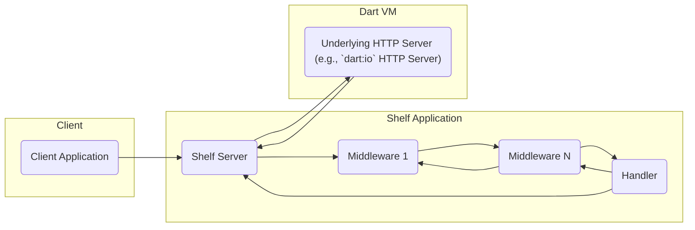
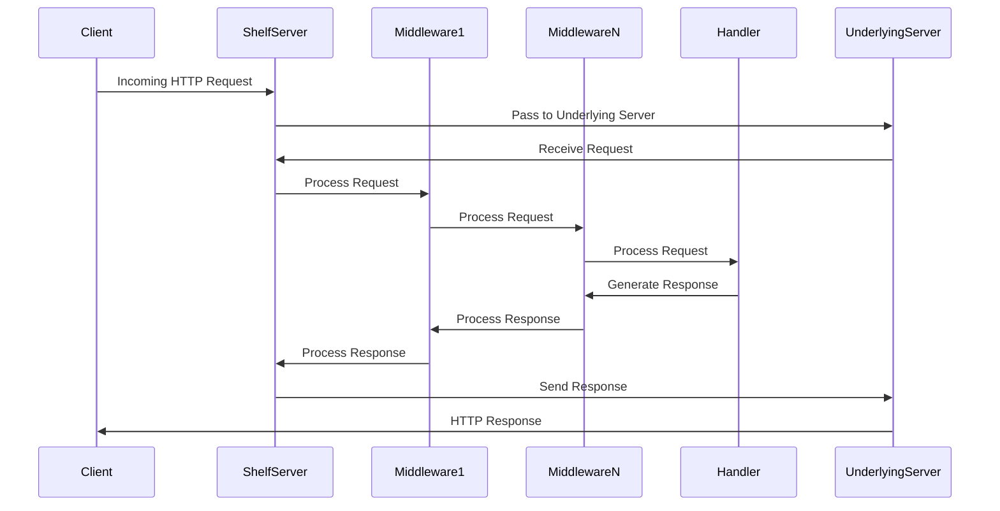

# Project Design Document: Shelf - A Composable HTTP Server Framework for Dart

**Version:** 1.1
**Date:** October 26, 2023
**Author:** AI Software Architect

## 1. Introduction

This document provides a detailed design overview of the `shelf` package, a composable HTTP server framework for Dart. It outlines the key components, their interactions, and the overall architecture of the framework. This document is intended to serve as a foundation for future threat modeling activities.

## 2. Goals

* Provide a simple and composable way to build HTTP servers in Dart.
* Offer a flexible middleware system for request and response processing.
* Abstract away the complexities of the underlying HTTP server implementation.
* Enable easy testing of HTTP handlers and middleware.
* Promote code reusability through composable handlers and middleware.

## 3. Non-Goals

* Providing a full-fledged web application framework with templating engines or ORM integration.
* Implementing specific routing mechanisms (this is handled by separate packages like `shelf_router`).
* Handling low-level socket management or HTTP protocol details directly.
* Providing a built-in mechanism for static file serving (this is handled by packages like `shelf_static`).

## 4. High-Level Architecture

The `shelf` framework revolves around the concept of **Handlers** and **Middleware**. A request flows through a series of middleware before reaching a final handler, and the response follows a similar path back.

* Client Application: Any application (web browser, mobile app, another service) that sends HTTP requests to the `shelf` application.
* Shelf Server: The entry point for incoming HTTP requests. It listens on a specified port and accepts connections.
* Middleware: Functions that intercept and process HTTP requests and responses. They can modify the request, the response, or perform side effects like logging or authentication. Middleware forms a pipeline.
* Handler: A function that takes a `Request` object and returns a `Response` object. This is the core logic that processes the request and generates the response.
* Underlying HTTP Server: The actual HTTP server implementation provided by the Dart VM (e.g., the `HttpServer` class from `dart:io`). `shelf` abstracts away the details of this server.

## 5. Component Details

### 5.1. `Handler`

* Purpose: The fundamental unit of request processing in `shelf`. It receives a `Request` object and returns a `Response` object.
* Functionality: Contains the application-specific logic for handling a particular request.
* Example: A handler that returns a simple "Hello, World!" response.

### 5.2. `Middleware`

* Purpose: To intercept and process HTTP requests and responses.
* Functionality: A middleware function takes a `Handler` as input and returns a new `Handler`. This allows for chaining and wrapping of handlers. Middleware can:
    * Modify the incoming `Request`.
    * Modify the outgoing `Response`.
    * Perform actions before or after the inner handler is invoked (e.g., logging, authentication).
    * Short-circuit the request processing by returning a `Response` directly.
* Types:
    * Request Middleware: Primarily focuses on processing the incoming request.
    * Response Middleware: Primarily focuses on processing the outgoing response.
* Composition: Middleware is composed using the `Pipeline` class or by directly chaining middleware functions.

### 5.3. `Request`

* Purpose: Represents an incoming HTTP request.
* Attributes: Contains information about the request, such as:
    * `url`: The requested URL.
    * `method`: The HTTP method (GET, POST, PUT, DELETE, etc.).
    * `headers`: HTTP headers.
    * `body`: The request body (as a stream).
    * `context`: A mutable map for sharing data between middleware and handlers.

### 5.4. `Response`

* Purpose: Represents an outgoing HTTP response.
* Attributes: Contains information about the response, such as:
    * `statusCode`: The HTTP status code (200, 404, 500, etc.).
    * `headers`: HTTP headers.
    * `body`: The response body (can be a string, a stream, or `null`).

### 5.5. `Server` (from `shelf/shelf_io.dart`)

* Purpose: Provides a concrete implementation of an HTTP server using the `dart:io` library.
* Functionality:
    * Listens on a specified host and port.
    * Accepts incoming connections.
    * Passes incoming requests to the provided `Handler` (which is typically the end of a middleware pipeline).
    * Sends the `Response` generated by the handler back to the client.

### 5.6. `Pipeline`

* Purpose: A utility class for building a chain of middleware.
* Functionality: Provides a fluent interface for adding middleware to a pipeline. The `addHandler` method adds the final handler to the pipeline.

## 6. Data Flow

The typical flow of an HTTP request through a `shelf` application is as follows:

1. Client sends an HTTP request: The client application initiates an HTTP request to the `shelf` server.
2. Shelf Server receives the request: The `shelf` server, backed by the underlying HTTP server, receives the incoming request.
3. Request passes through middleware pipeline: The request is passed through a chain of middleware functions in the order they were added to the pipeline. Each middleware can inspect or modify the request.
4. Request reaches the handler: After passing through all the middleware, the request reaches the final handler.
5. Handler processes the request: The handler executes its logic based on the request and generates a `Response` object.
6. Response passes back through middleware pipeline: The generated `Response` is passed back through the middleware pipeline in reverse order. Middleware can inspect or modify the response.
7. Shelf Server sends the response: The `shelf` server sends the final `Response` back to the client through the underlying HTTP server.
8. Client receives the response: The client application receives the HTTP response.

## 7. Security Considerations (Initial)

This section outlines initial security considerations based on the architecture. A more detailed threat model will be developed later.

* Input Validation: Handlers and middleware need to validate incoming request data (headers, parameters, body) to prevent injection attacks (e.g., SQL injection, cross-site scripting).
* Authentication and Authorization: Middleware can be used to implement authentication and authorization mechanisms to control access to resources.
* Secure Defaults: The framework should encourage secure defaults, such as setting appropriate security headers in responses.
* CORS (Cross-Origin Resource Sharing): Middleware is often used to configure CORS policies to control which origins are allowed to access resources.
* Request Body Handling: Care must be taken when processing request bodies to prevent denial-of-service attacks (e.g., large uploads).
* Error Handling: Proper error handling is crucial to prevent information leakage through error messages.
* Dependency Management: Security vulnerabilities in dependencies need to be monitored and addressed.
* TLS/SSL: While `shelf` itself doesn't handle TLS/SSL termination directly, it relies on the underlying HTTP server. Proper configuration of the underlying server is essential for secure communication.

## 8. Deployment Considerations

`shelf` applications can be deployed in various environments:

* Standalone Dart applications: Using the `shelf_io` package to run directly on a server.
* Within a Docker container: Containerizing the application for easier deployment and scaling.
* On cloud platforms: Deploying to cloud providers like Google Cloud Platform (using Cloud Run or Compute Engine), AWS, or Azure.
* Behind a reverse proxy: Deploying behind a reverse proxy like Nginx or Apache, which can handle TLS termination, load balancing, and other tasks.

## 9. Future Considerations

* Improved Error Handling Abstractions: Potentially providing more structured ways to handle errors within the middleware pipeline.
* Metrics and Monitoring Integration: Providing hooks or interfaces for integrating with metrics and monitoring systems.
* Advanced Request/Response Manipulation: Exploring more sophisticated ways to modify requests and responses within middleware.
* Integration with other Dart Ecosystem Packages: Continued integration with packages like `shelf_router`, `shelf_static`, and others to provide a more complete web development experience.

This document provides a comprehensive overview of the `shelf` framework's design. It serves as a valuable resource for understanding the architecture and will be used as the basis for subsequent threat modeling activities.
