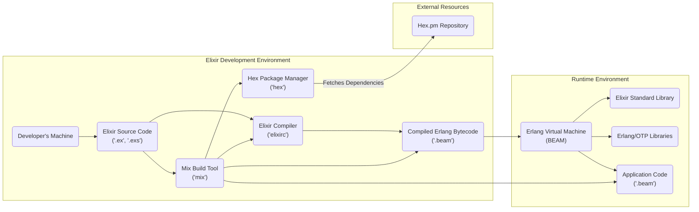
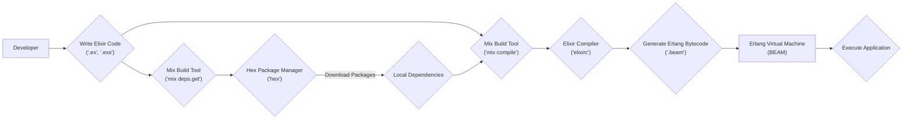

## Project Design Document: Elixir Programming Language

**1. Introduction**

This document provides a detailed architectural design of the Elixir programming language project, focusing on its core components and ecosystem. This design serves as a foundation for subsequent threat modeling activities, outlining key components, their interactions, and the overall data flow within the Elixir project to facilitate the identification of potential security vulnerabilities.

**2. Project Overview**

Elixir is a dynamic, functional programming language that runs on the Erlang Virtual Machine (BEAM). It is designed for building scalable and maintainable applications, particularly those requiring high concurrency and fault tolerance. The core of the Elixir project encompasses the language specification, its compiler (`elixirc`), the standard library (a collection of built-in modules), the Mix build tool for project management, and the Hex package manager for dependency management and distribution. Elixir leverages the battle-tested features of the Erlang/OTP platform, providing developers with a robust and reliable environment for building complex systems.

**3. Architectural Design**

The Elixir project can be conceptually divided into the following key interacting components:

*   **Elixir Language and Compiler (`elixirc`):** This component is responsible for parsing Elixir source code (`.ex` for regular code, `.exs` for scripting), performing semantic analysis, type inference (where applicable), and ultimately generating Erlang bytecode (`.beam` files) that can be executed on the BEAM.
*   **Erlang Virtual Machine (BEAM):** The runtime environment for Elixir code. It provides essential features such as lightweight processes (actors), message passing for inter-process communication, supervision trees for fault tolerance, and garbage collection. Elixir code directly benefits from the BEAM's concurrency and resilience capabilities.
*   **Elixir Standard Library:** A set of core modules providing fundamental functionalities for Elixir developers. This includes data structures (lists, maps, tuples), I/O operations (file system access, networking), concurrency primitives (Tasks, Agents, GenServers), and utilities for working with strings, dates, and more.
*   **Mix Build Tool (`mix`):** A command-line tool that provides essential build automation and project management capabilities for Elixir projects. It handles tasks such as compiling Elixir code, managing dependencies, running tests, creating and managing releases, and executing custom tasks.
*   **Hex Package Manager (`hex`):** The official package manager for the Elixir ecosystem. It allows developers to discover, share, and reuse libraries (packages). `hex` interacts with the central Hex.pm repository to download and manage project dependencies.

**4. Component Diagram**

**5. Data Flow**

The typical data flow within the Elixir project during development and runtime involves the following stages:

*   **Code Development:** A developer writes Elixir source code using a text editor or IDE, saving the files with `.ex` or `.exs` extensions.
*   **Compilation Process:** The developer uses the `mix compile` command, which invokes the `elixirc` compiler. The compiler reads the Elixir source code, resolves dependencies (managed by Mix), and generates Erlang bytecode (`.beam` files).
*   **Dependency Resolution:** When compiling, Mix checks the project's `mix.exs` file for dependencies. If external dependencies are declared, Mix uses the `hex` client to download the required packages from the Hex.pm repository. These downloaded packages are then compiled as well.
*   **Execution on the BEAM:** To run an Elixir application, the BEAM is started, and it loads the compiled bytecode (`.beam` files). The BEAM manages the execution of Elixir code, including the creation and management of lightweight processes, message passing, and supervision trees.
*   **Package Management:** Developers use Mix commands (e.g., `mix deps.get`, `mix hex.publish`) to interact with the Hex package manager. This involves downloading dependencies from Hex.pm or publishing their own packages to the repository.

**6. Key Components and their Responsibilities**

*   **Elixir Compiler (`elixirc`):**
    *   **Parsing:** Reads and interprets Elixir source code, ensuring it conforms to the language syntax.
    *   **Semantic Analysis:** Checks the meaning and consistency of the code, identifying type errors and other semantic issues.
    *   **Code Generation:** Translates the validated Elixir code into Erlang bytecode (`.beam` files) that the BEAM can execute.
    *   **Macro Expansion:** Executes Elixir macros, which are code transformations performed at compile time.
    *   **Warning and Error Reporting:** Provides feedback to the developer about potential issues or errors in the code.

*   **Erlang Virtual Machine (BEAM):**
    *   **Process Management:** Creates and manages lightweight processes (actors) that execute concurrently.
    *   **Message Passing:** Facilitates communication between processes through asynchronous message passing.
    *   **Fault Tolerance:** Implements supervision trees to automatically restart failing processes, ensuring application resilience.
    *   **Memory Management:** Handles memory allocation and garbage collection for Elixir applications.
    *   **Runtime Environment:** Provides the necessary environment for executing compiled Erlang bytecode.

*   **Elixir Standard Library:**
    *   **Data Structures:** Offers built-in data structures like lists, tuples, maps, and atoms for organizing and manipulating data.
    *   **Input/Output (I/O):** Provides modules for interacting with the file system, network sockets, and other input/output streams.
    *   **Concurrency Primitives:** Includes modules for working with concurrent operations, such as `Task`, `Agent`, `GenServer`, and `Supervisor`.
    *   **Utilities:** Offers various utility functions for string manipulation, date and time operations, and more.

*   **Mix Build Tool (`mix`):**
    *   **Project Creation and Management:** Provides commands for creating new Elixir projects and managing their structure.
    *   **Dependency Management:** Allows developers to declare project dependencies in the `mix.exs` file and automatically downloads and manages them.
    *   **Compilation:** Orchestrates the compilation process, invoking the `elixirc` compiler.
    *   **Testing:** Provides a framework for writing and running unit and integration tests.
    *   **Release Management:** Enables the creation of self-contained releases of Elixir applications for deployment.
    *   **Task Execution:** Allows developers to define and execute custom build and development tasks.

*   **Hex Package Manager (`hex`):**
    *   **Package Hosting:** Provides a central repository (Hex.pm) for hosting and distributing Elixir packages.
    *   **Package Discovery:** Allows developers to search for and discover available packages.
    *   **Package Installation:** Enables the installation of packages and their dependencies into Elixir projects.
    *   **Package Publishing:** Allows developers to publish their own libraries as packages to the Hex.pm repository.
    *   **Version Management:** Manages package versions and ensures compatibility between dependencies.

**7. Security Considerations (For Threat Modeling)**

This section outlines potential security considerations that should be thoroughly investigated during the threat modeling process:

*   **Compiler Vulnerabilities:**
    *   **Malicious Code Injection:** A compromised compiler could inject malicious code into the generated bytecode, potentially leading to arbitrary code execution on the target system.
    *   **Denial of Service:** Compiler vulnerabilities could be exploited to cause excessive resource consumption during compilation.

*   **Erlang VM (BEAM) Vulnerabilities:**
    *   **Remote Code Execution:** Exploitable vulnerabilities in the BEAM could allow attackers to execute arbitrary code on the server running the Elixir application.
    *   **Denial of Service:**  Bugs in the BEAM's concurrency or memory management could be exploited to cause crashes or resource exhaustion.
    *   **Information Disclosure:** Vulnerabilities might allow attackers to access sensitive information from the VM's memory.

*   **Elixir Standard Library Vulnerabilities:**
    *   **Injection Attacks:** Flaws in modules handling external input (e.g., networking, file I/O) could be exploited for injection attacks (e.g., command injection, SQL injection if interacting with databases).
    *   **Cryptographic Weaknesses:** Improper use or vulnerabilities in cryptographic modules could compromise data confidentiality and integrity.

*   **Mix and Hex Security:**
    *   **Dependency Confusion/Substitution Attacks:** Attackers could publish malicious packages with the same name as internal dependencies, potentially leading to the inclusion of malicious code in a project.
    *   **Supply Chain Attacks:** Compromised packages on Hex.pm could introduce vulnerabilities or malicious code into dependent projects.
    *   **Hex.pm Infrastructure Security:** Security vulnerabilities in the Hex.pm platform itself could compromise the integrity of the package repository.
    *   **Insecure Build Tasks:** Custom Mix tasks could execute arbitrary code, posing a risk if not carefully reviewed.

*   **Build Process Security:**
    *   **Compromised Development Environment:** If a developer's machine is compromised, malicious code could be introduced during the development or build process.
    *   **Insecure Build Servers:** Vulnerabilities in build servers could allow attackers to tamper with the build process and inject malicious code.

**8. Dependencies**

The Elixir project fundamentally depends on the Erlang/OTP platform. Key dependencies include:

*   **Erlang/OTP:** This is the core dependency, providing the BEAM virtual machine, the Erlang standard libraries, and the OTP (Open Telecom Platform) framework, which offers robust concurrency and fault-tolerance mechanisms.

**9. Deployment Considerations**

Elixir applications are typically deployed as compiled releases. Common deployment environments include:

*   **Bare Metal Servers:** Deploying directly onto physical servers.
*   **Virtual Machines (VMs):** Deploying onto virtualized environments.
*   **Containerization (Docker, Kubernetes):** Packaging applications and their dependencies into containers for easier deployment and scaling.
*   **Cloud Platforms (AWS, Google Cloud, Azure):** Utilizing cloud services for hosting and managing Elixir applications.
*   **Embedded Systems:** Elixir and Erlang can be used in embedded systems due to their lightweight nature and concurrency capabilities.

**10. Future Considerations**

This design document provides a comprehensive overview of the core Elixir project. Future expansions could include:

*   Detailed design documents for specific Elixir frameworks built on top of the core language (e.g., Phoenix).
*   A deeper dive into the security architecture of the Hex.pm platform and its mitigation strategies against supply chain attacks.
*   Analysis of the security implications of different Elixir deployment strategies and best practices for securing deployed applications.
*   Exploration of security-focused libraries and tools within the Elixir ecosystem.
