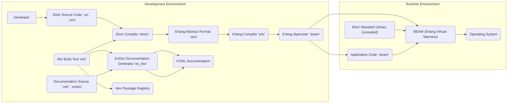
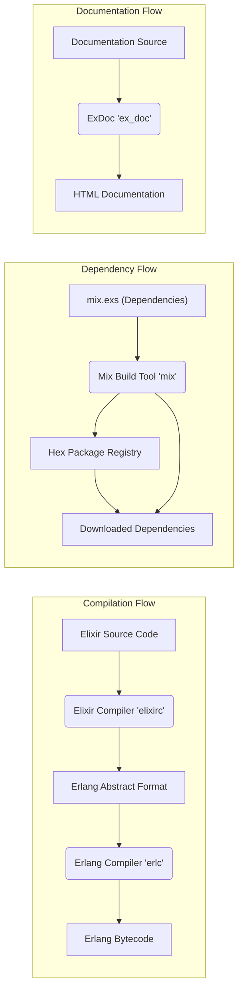

# Project Design Document: Elixir Programming Language

**Version:** 1.1
**Date:** October 26, 2023
**Prepared By:** Gemini (AI Language Model)

## 1. Introduction

This document provides a detailed architectural overview and component descriptions of the Elixir programming language project, as represented by the codebase at [https://github.com/elixir-lang/elixir](https://github.com/elixir-lang/elixir). This document is intended to serve as a robust foundation for subsequent threat modeling activities, offering a clear understanding of the system's structure, data flow, and key components. It is primarily targeted towards security engineers, but also beneficial for developers and architects involved in assessing and mitigating potential security risks associated with the Elixir language and its ecosystem.

## 2. Goals

*   Provide a comprehensive and well-structured architectural overview of the Elixir language project.
*   Clearly identify key components and articulate their specific responsibilities.
*   Describe the data flow within the system with sufficient detail for security analysis.
*   Highlight potential areas of interest and specific examples relevant for security analysis and threat modeling.
*   Serve as a reliable and up-to-date reference point for understanding the system's design and implementation.

## 3. Scope

This document focuses on the core elements of the Elixir language itself, with a particular emphasis on aspects relevant to security. This includes:

*   The Elixir compiler and its compilation process.
*   The Elixir standard library (with focus on security-sensitive modules and interactions with the core language).
*   The `mix` build tool and its role in dependency management and build processes.
*   The mechanisms and interfaces for interacting with the underlying Erlang/OTP platform, including key OTP behaviors.
*   The documentation generation process and potential security implications.

This document intentionally excludes:

*   In-depth analysis of the Erlang/OTP platform internals (though its crucial role and interactions with Elixir are thoroughly discussed).
*   Specific details of third-party Elixir libraries and frameworks (e.g., Phoenix), unless directly relevant to the core language's security.
*   The implementation specifics of individual applications built using Elixir.
*   An exhaustive listing of every function within the standard library; instead, it focuses on categories and examples relevant to security.

## 4. High-Level Architecture

Elixir is a functional, concurrent, general-purpose programming language that runs on the Erlang virtual machine (BEAM). It leverages the robust concurrency and fault-tolerance features of Erlang/OTP. The `mix` tool is central to the development workflow, managing compilation, dependencies, and other project tasks.

**Description of Components:**

*   **Developer:** The software engineer writing Elixir code.
*   **Elixir Source Code ('.ex', '.exs'):** Files containing the human-readable Elixir programming language code.
*   **Mix Build Tool ('mix'):** The build automation tool for Elixir projects, responsible for compilation, dependency management, running tests, and more.
*   **Elixir Compiler ('elixirc'):** The component that translates Elixir source code into Erlang Abstract Format (EAF).
*   **Erlang Abstract Format ('.eex'):** An intermediate representation of the code, serving as input for the Erlang compiler.
*   **Erlang Compiler ('erlc'):** The Erlang compiler, which takes the EAF and generates Erlang bytecode.
*   **Erlang Bytecode ('.beam'):** The executable code that runs on the BEAM.
*   **Documentation Source ('.md', '.exdoc'):** Files containing documentation written in Markdown or using ExDoc's specific syntax.
*   **ExDoc Documentation Generator ('ex_doc'):** A tool that parses documentation source files and generates HTML documentation for Elixir projects.
*   **HTML Documentation:** The generated documentation for Elixir and its libraries, typically served online or included in project distributions.
*   **Hex Package Registry:** The primary package registry for Elixir and Erlang libraries, used by `mix` for dependency management.
*   **BEAM (Erlang Virtual Machine):** The runtime environment that executes Erlang bytecode, providing robust concurrency, fault tolerance, and distribution capabilities.
*   **Elixir Standard Library (compiled):** Pre-compiled modules offering essential functionalities for Elixir programs, built upon Erlang/OTP.
*   **Application Code ('.beam'):** The compiled bytecode of the specific Elixir application being developed.
*   **Operating System:** The underlying operating system on which the BEAM is running.

## 5. Detailed Component Description

### 5.1. Elixir Compiler (`elixirc`)

*   **Responsibility:** Parses Elixir source code, performs semantic analysis, macro expansion, and translates it into Erlang Abstract Format (EAF). This process includes validating the syntax and semantics of the Elixir code.
*   **Input:** Elixir source files (`.ex`, `.exs`).
*   **Output:** Erlang Abstract Format files (`.eex`).
*   **Key Functions:**
    *   Lexing and parsing of Elixir syntax, ensuring code conforms to the language grammar.
    *   Semantic analysis, including type checking (where applicable), variable resolution, and ensuring code logic is sound.
    *   Macro expansion, where code transformations defined by macros are applied. This is a powerful feature but also a potential area for security concerns.
    *   Code generation into EAF, the intermediate representation understood by the Erlang compiler.
    *   Reporting errors and warnings to the developer, crucial for identifying potential issues early in the development cycle.
*   **Potential Security Considerations:**
    *   **Parser vulnerabilities:** Flaws in the parser could be exploited with crafted malicious input, potentially leading to denial-of-service or, in severe cases, arbitrary code execution during compilation.
    *   **Semantic analysis bypasses:** Bugs in the semantic analysis phase could allow the compilation of code with inherent security flaws that would normally be caught.
    *   **Malicious macro expansion:** If the compiler doesn't properly sanitize or control macro expansions, a malicious macro could inject arbitrary code into the compilation process or the final bytecode.
    *   **Code injection vulnerabilities:** Although less direct, vulnerabilities in code generation could theoretically lead to the injection of unintended code into the EAF.

### 5.2. Mix Build Tool (`mix`)

*   **Responsibility:** Provides build automation, dependency management, project management, and task execution for Elixir projects. It orchestrates the compilation process and manages external dependencies.
*   **Input:** `mix.exs` configuration file, Elixir source code, dependency specifications, and user commands.
*   **Output:** Compiled Erlang bytecode, managed dependencies in the `_build` directory, test results, generated documentation, and other project artifacts.
*   **Key Functions:**
    *   Compiling Elixir code by invoking `elixirc`.
    *   Fetching and managing project dependencies from package repositories like Hex.pm, including resolving version conflicts.
    *   Running unit and integration tests.
    *   Generating documentation using ExDoc.
    *   Creating, managing, and packaging Elixir projects into releases.
    *   Executing custom tasks defined in the `mix.exs` file.
*   **Potential Security Considerations:**
    *   **Arbitrary code execution during build:** Vulnerabilities in `mix` itself or in custom mix tasks could allow attackers to execute arbitrary code during the build process, potentially compromising the development environment or the final application.
    *   **Dependency vulnerabilities (Supply Chain Attacks):** `mix` relies on the security of package repositories. Compromised or malicious dependencies fetched from Hex.pm can introduce significant security risks into a project. This includes dependency confusion attacks.
    *   **Insecure handling of project configuration:**  If `mix` doesn't properly sanitize or validate the `mix.exs` file or environment variables, it could be susceptible to injection attacks.
    *   **Man-in-the-middle attacks on dependency downloads:** If the connection to the package repository is not properly secured (e.g., using HTTPS with proper certificate validation), attackers could intercept and replace legitimate dependencies with malicious ones.

### 5.3. Elixir Standard Library

*   **Responsibility:** Provides a comprehensive set of built-in modules and functions that offer core functionalities for Elixir programs. These modules handle common tasks like data manipulation, I/O operations, networking, concurrency primitives (leveraging OTP), and more.
*   **Input:** Called by user application code.
*   **Output:** Results of function execution, data manipulation, side effects (e.g., writing to a file, sending a network request).
*   **Key Modules (Examples with Security Relevance):**
    *   `IO`: Functions for input/output operations. Improper use (e.g., constructing shell commands from user input) can lead to command injection.
    *   `File`: Functions for interacting with the file system. Vulnerabilities here could allow unauthorized file access or manipulation.
    *   `String`: Functions for string manipulation. Improper handling of strings can lead to vulnerabilities like cross-site scripting (XSS) if used in web contexts.
    *   `Enum`: Functions for working with collections. While generally safe, inefficient use could lead to resource exhaustion.
    *   `Task`, `Agent`, `GenServer`, `Supervisor` (from OTP, but integral to Elixir): Concurrency primitives. Incorrect use can lead to race conditions or deadlocks, which can sometimes have security implications.
    *   `crypto`: Provides cryptographic functions. Incorrect usage (e.g., weak key generation, insecure algorithms) can severely compromise security.
    *   `URI`, `HTTPc`: Modules for working with URIs and making HTTP requests. Vulnerabilities in these modules or improper usage can lead to SSRF (Server-Side Request Forgery) or other network-based attacks.
*   **Potential Security Considerations:**
    *   **Vulnerabilities in standard library functions:** Bugs like buffer overflows, injection flaws, or incorrect access control within standard library functions could be directly exploited by malicious code.
    *   **Improper use by developers:** Even secure standard library functions can be used insecurely by developers, leading to vulnerabilities in applications. This highlights the importance of secure coding practices.
    *   **Security of underlying Erlang/OTP primitives:** The Elixir standard library relies heavily on Erlang/OTP. Any vulnerabilities in the underlying OTP primitives will also affect Elixir applications.

### 5.4. BEAM (Erlang Virtual Machine)

*   **Responsibility:** Executes Erlang bytecode, providing the runtime environment for Elixir applications. It is responsible for process management, memory management, concurrency, fault tolerance, and distribution.
*   **Input:** Erlang bytecode (`.beam`).
*   **Output:** Execution of the application logic, managing processes, and handling inter-process communication.
*   **Key Features (with Security Relevance):**
    *   **Process-based concurrency model:**  Processes are isolated, which enhances security by limiting the impact of vulnerabilities within a single process.
    *   **Message passing between processes:**  The primary mechanism for communication. Security considerations include ensuring messages are not tampered with and that processes only receive messages they are authorized to handle.
    *   **Fault tolerance through supervisors:**  Supervisors restart failing processes, increasing the resilience of applications. However, misconfigured supervisors can mask underlying security issues.
    *   **Distribution across multiple nodes:** Allows for building distributed systems. Security considerations include authentication and authorization between nodes, and secure communication channels.
    *   **Memory management (garbage collection):**  Automatic memory management reduces the risk of memory-related vulnerabilities like buffer overflows, although vulnerabilities can still exist in native code interfaces (NIFs).
*   **Potential Security Considerations:**
    *   **BEAM vulnerabilities:**  Security flaws within the BEAM itself would have a significant impact on all applications running on it.
    *   **Inter-process communication security:** Ensuring the integrity and confidentiality of messages passed between processes is crucial.
    *   **Resource exhaustion:**  Attackers might try to exhaust BEAM resources (CPU, memory, number of processes) to cause denial-of-service.
    *   **Distribution protocol security:**  The protocol used for communication between distributed BEAM nodes needs to be secure to prevent eavesdropping or tampering.
    *   **Native Implemented Functions (NIFs):**  Elixir and Erlang can interface with native C code through NIFs. Vulnerabilities in these NIFs can introduce security risks.

### 5.5. Documentation Generator (`ExDoc`)

*   **Responsibility:** Generates static HTML documentation from Elixir source code comments, Markdown files, and `.exdoc` files. It helps developers understand the API and usage of libraries and applications.
*   **Input:** Elixir source files with documentation comments, `.md` files, `.exdoc` files.
*   **Output:** Static HTML documentation files.
*   **Key Functions:**
    *   Parsing documentation comments and files, extracting relevant information.
    *   Rendering Markdown and ExDoc-specific syntax into HTML.
    *   Generating HTML output with features like cross-linking between modules and functions, and search functionality.
*   **Potential Security Considerations:**
    *   **Cross-site scripting (XSS) vulnerabilities:** If user-provided content in documentation comments or files is not properly sanitized before being included in the generated HTML, it could lead to XSS vulnerabilities when the documentation is viewed in a browser.
    *   **Denial-of-service vulnerabilities:**  A maliciously crafted documentation file could potentially exploit vulnerabilities in the ExDoc parser, leading to excessive resource consumption or crashes during documentation generation.
    *   **Information disclosure:**  If ExDoc incorrectly processes documentation, it might inadvertently expose sensitive information that was intended to be private.

## 6. Data Flow

The primary data flow involves the transformation of Elixir source code into executable bytecode and the management of dependencies:

1. **Developer writes Elixir source code (`.ex`, `.exs`).**
2. **The `mix` tool is invoked, triggering the compilation process.**
3. **`mix` invokes the Elixir compiler (`elixirc`).**
4. **`elixirc` reads the source code and generates Erlang Abstract Format (`.eex`).**
5. **The Erlang compiler (`erlc`) reads the EAF and generates Erlang bytecode (`.beam`).**
6. **The BEAM loads and executes the `.beam` files at runtime.**

A crucial secondary data flow is dependency management:

1. **The `mix.exs` file defines project dependencies.**
2. **`mix` resolves these dependencies and fetches them from package repositories (e.g., Hex.pm).**
3. **Downloaded dependencies are stored in the project's `_build` directory or a global cache.**
4. **During compilation, the compiler uses these dependencies to resolve module and function calls.**

Documentation generation also represents a distinct data flow:

1. **Developers write documentation in source code comments, `.md`, or `.exdoc` files.**
2. **The `mix` tool invokes the ExDoc documentation generator.**
3. **ExDoc parses these files and generates HTML documentation.**

## 7. Security Considerations (Specific Examples)

Building upon the initial thoughts, here are more specific examples of potential security concerns:

*   **Compiler Vulnerabilities:** A buffer overflow in the Elixir parser could be triggered by a specially crafted Elixir file, leading to a crash or potentially arbitrary code execution during compilation.
*   **Mix Build Tool Security:** A malicious package on Hex.pm could contain code that, when included as a dependency, steals environment variables or injects backdoors into the application during the build process. A vulnerability in `mix`'s dependency resolution could be exploited to force the installation of a compromised package.
*   **Standard Library Vulnerabilities:** A format string vulnerability in the `IO.puts/1` function could be exploited if user-controlled input is directly passed to it. Improper validation in `File.read!/1` could lead to path traversal vulnerabilities. Incorrect use of the `crypto` module might result in storing passwords using weak hashing algorithms.
*   **BEAM Security:** A vulnerability in the BEAM's process scheduling algorithm could be exploited to cause a denial-of-service by starving other processes of CPU time. A flaw in the distribution protocol could allow an attacker to impersonate a node in a distributed system.
*   **Documentation Generation:** An attacker could contribute a pull request with malicious JavaScript embedded in a documentation comment. If ExDoc doesn't sanitize this input, viewing the generated documentation could execute the malicious script in a user's browser.
*   **Supply Chain Security:**  Typosquatting attacks on Hex.pm could trick developers into downloading malicious packages with names similar to legitimate ones.
*   **Macro Security:** A poorly written macro could introduce unintended side effects or security vulnerabilities when expanded. A malicious macro could be designed to inject harmful code during compilation.
*   **Input Validation:**  Failure to properly validate user input in Elixir applications can lead to common vulnerabilities like SQL injection (if interacting with databases), command injection (if executing shell commands), and cross-site scripting (in web applications).

## 8. Dependencies

Elixir's core functionality is tightly integrated with the Erlang/OTP platform. Key dependencies include:

*   **Erlang/OTP:** Provides the underlying virtual machine (BEAM), core libraries (like `stdlib` and `kernel`), and the OTP framework for building robust and concurrent applications (including behaviors like `GenServer` and `Supervisor`).
*   **Operating System:** The OS provides the necessary resources and environment for the BEAM to run.
*   **Package Repositories (e.g., Hex.pm):** The primary source for external Elixir and Erlang libraries, managed by the `mix` tool.

## 9. Deployment

Elixir applications are typically deployed as compiled Erlang bytecode (`.beam` files) packaged into releases. Common deployment methods include:

*   **Building a release using `mix release`:** This command compiles the application and its dependencies into a self-contained package.
*   **Deploying the release to target servers:** This can involve copying the release artifact, using tools like `rsync` or `scp`.
*   **Containerization (e.g., Docker):** Packaging the release within a Docker container for consistent deployment across environments.
*   **Cloud deployment platforms:** Utilizing services like Heroku, AWS Elastic Beanstalk, or Google Cloud Run, which often provide specific support for Elixir releases.
*   **Running the BEAM with the application's release:** The deployed release includes the necessary scripts to start the BEAM and run the application.

## 10. Future Considerations

This document provides a comprehensive design overview suitable for threat modeling. Future enhancements could include:

*   More granular details on the security features and mechanisms within the BEAM.
*   A deeper analysis of the security implications of specific Elixir language features, such as metaprogramming and code generation.
*   Documentation of common security patterns and best practices for Elixir development.
*   Regular updates to reflect changes in the Elixir language and its ecosystem.
*   Integration with the output of threat modeling exercises to track identified threats and mitigation strategies.
