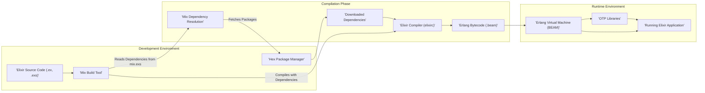
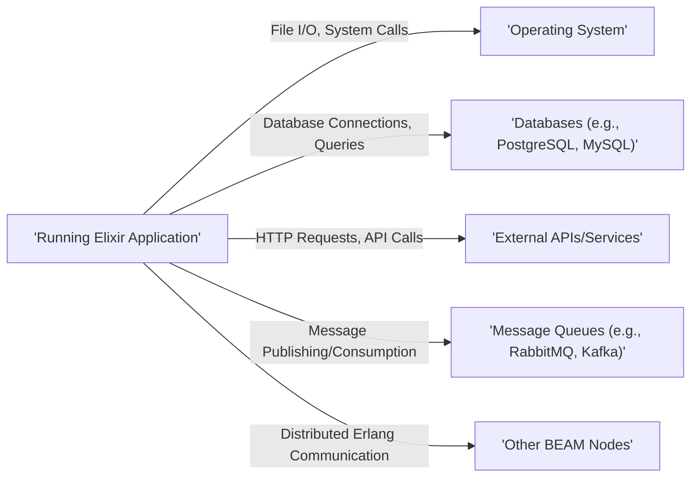

## Project Design Document: Elixir Programming Language

**Version:** 1.1
**Date:** October 26, 2023
**Author:** AI Software Architect

### 1. Introduction

This document provides an enhanced and detailed design overview of the Elixir programming language and its core components, specifically tailored for threat modeling activities. It aims to clearly outline the architecture, key components, data flow, and interactions of the Elixir ecosystem to facilitate the identification of potential security vulnerabilities and risks.

### 2. Project Overview

Elixir is a dynamic, functional language designed for building scalable and maintainable applications. It leverages the Erlang virtual machine (BEAM) for its concurrency and fault-tolerance capabilities. Elixir offers a productive and extensible environment suitable for developing diverse applications, including web services, distributed systems, and embedded software. Its foundation on the BEAM provides inherent resilience and scalability characteristics.

### 3. System Architecture

Elixir's architecture is fundamentally built upon the Erlang/OTP platform. Key architectural elements include:

*   **Elixir Language:** The high-level, functional programming language with its specific syntax, semantics, and features like metaprogramming.
*   **Elixir Compiler:** Translates human-readable Elixir source code (`.ex`, `.exs`) into platform-independent Erlang bytecode (`.beam` files).
*   **Erlang Virtual Machine (BEAM):** The robust runtime environment responsible for executing Elixir (and Erlang) bytecode. It provides core functionalities like process management, scheduling, memory management (garbage collection), and inter-process communication.
*   **OTP (Open Telecom Platform):** A collection of Erlang libraries, design principles, and a set of behaviors for building resilient and scalable applications. Elixir heavily relies on OTP's supervision trees, actors (processes), and various built-in applications.
*   **Mix Build Tool:** Elixir's command-line build tool, offering functionalities for project creation, dependency management, compilation, testing, release management, and more.
*   **Hex Package Manager:** The official package manager for the Erlang ecosystem, used by Mix to manage project dependencies, including downloading, installing, and updating libraries.

### 4. Core Components

This section provides a more granular view of the key components within the Elixir ecosystem:

*   **Elixir Language Core:**
    *   Defines the syntax, data types (e.g., atoms, lists, tuples, maps), and core language constructs (e.g., pattern matching, function definitions, modules).
    *   Supports functional programming paradigms, including immutability and higher-order functions.
    *   Enables metaprogramming capabilities through macros.
*   **Elixir Compiler (`elixirc`):**
    *   Parses Elixir source code files.
    *   Performs static analysis, including semantic analysis and type checking (inferred).
    *   Generates Erlang bytecode (`.beam` files) that are platform-independent.
    *   Handles compilation of dependencies.
*   **Erlang Virtual Machine (BEAM):**
    *   Executes Erlang bytecode (`.beam` files`).
    *   Manages lightweight processes (actors) with their own memory space.
    *   Provides preemptive scheduling of processes.
    *   Handles garbage collection for efficient memory management.
    *   Facilitates inter-process communication through asynchronous message passing.
    *   Offers fault tolerance through the supervision tree mechanism.
*   **OTP Libraries:**
    *   **Supervisors:** Processes that monitor child processes and restart them in case of failures, ensuring application resilience. Examples include `Supervisor`, `SimpleSupervisor`.
    *   **Actors (Processes):** Independent units of execution that communicate via asynchronous message passing. Fundamental building blocks for concurrency.
    *   **GenServer:** A behavior for implementing stateful processes that handle synchronous and asynchronous requests.
    *   **Supervisor Trees:** Hierarchical structures of supervisors that manage the lifecycle and fault tolerance of application components.
    *   **Applications:** A unit of deployment and management for a set of modules, processes, and supervisors. Examples include `Kernel`, `stdlib`.
    *   **Erlang Term Storage (ETS):** An in-memory key-value store accessible by multiple processes.
    *   **Mnesia:** A distributed database management system built into Erlang/OTP.
*   **Mix Build Tool:**
    *   **Project Management:** Initializes new Elixir projects, manages project configuration (`mix.exs`).
    *   **Dependency Management:** Defines and resolves project dependencies specified in `mix.exs`, interacts with Hex to fetch packages.
    *   **Compilation:** Invokes the Elixir compiler (`elixirc`) to compile source code and dependencies.
    *   **Testing:** Provides a testing framework and runs unit and integration tests.
    *   **Release Management:** Creates deployable releases of Elixir applications, including the BEAM and necessary dependencies.
    *   **Task Execution:** Allows developers to define and run custom tasks for various development and deployment needs.
*   **Hex Package Manager:**
    *   Serves as a central repository for Erlang and Elixir packages (libraries and dependencies).
    *   Allows developers to publish and share their own packages.
    *   Mix interacts with Hex to download, install, and manage project dependencies based on the `mix.lock` file for reproducible builds.

### 5. Data Flow

The following diagram illustrates the typical data flow within the Elixir development, compilation, and runtime execution lifecycle:

**Data Flow Description:**

1. **Development:** Developers write Elixir source code in `.ex` and `.exs` files.
2. **Dependency Management:** The `Mix` build tool reads the project's dependencies from the `mix.exs` file.
3. **Dependency Resolution:** Mix resolves the dependency tree and interacts with the `Hex` package manager.
4. **Package Download:** `Hex` downloads the required dependency packages.
5. **Compilation:** The `Mix` build tool invokes the `Elixir Compiler` (`elixirc`), providing it with the source code and downloaded dependencies.
6. **Bytecode Generation:** The `Elixir Compiler` parses the source code, performs analysis, and generates Erlang bytecode (`.beam` files).
7. **Runtime Execution:** The Erlang Virtual Machine (BEAM) loads and executes the generated `.beam` files.
8. **OTP Utilization:** The running Elixir application leverages OTP libraries for concurrency, fault tolerance, and other functionalities.

### 6. External Interactions

Elixir applications frequently interact with external systems and resources to fulfill their functionalities:

*   **Operating System:**
    *   File system access (reading, writing, and manipulating files and directories).
    *   Network operations (establishing socket connections, making HTTP requests, listening on ports).
    *   Process management (spawning and managing external processes).
    *   Accessing system environment variables.
*   **Databases:**
    *   Interactions with various database systems (e.g., PostgreSQL, MySQL, MongoDB, Redis) through database drivers (e.g., Ecto).
    *   Executing database queries and managing data persistence.
*   **External APIs and Services:**
    *   Communication with external services via HTTP/HTTPS or other protocols (e.g., REST, GraphQL).
    *   Consuming and providing data through APIs.
    *   Integration with third-party libraries and services.
*   **Message Queues:**
    *   Interaction with message brokers (e.g., RabbitMQ, Kafka, Redis Pub/Sub) for asynchronous communication and task processing.
    *   Publishing and consuming messages.
*   **Other Erlang/BEAM Nodes:**
    *   Communication with other Elixir or Erlang nodes running on different machines in a distributed system.
    *   Utilizing Erlang's distribution mechanisms for inter-node communication.

### 7. Deployment Considerations

Elixir applications offer flexibility in deployment strategies:

*   **Bare Metal Servers:** Deploying directly on physical servers, requiring manual configuration and management.
*   **Virtual Machines (VMs):** Running within virtualized environments, providing isolation and resource management.
*   **Containers (e.g., Docker):** Packaging applications and their dependencies into containers for portability, consistency, and isolation. Often orchestrated with tools like Kubernetes.
*   **Cloud Platforms (e.g., AWS, Google Cloud, Azure):** Utilizing cloud services for deployment, scaling, and management, leveraging services like virtual machines, containers, or serverless functions.
*   **Embedded Systems:** Running on resource-constrained devices, often requiring cross-compilation and specific configurations.

The typical deployment process involves:

*   **Building a Release:** Using Mix to create a self-contained release of the Elixir application, including the BEAM runtime and necessary dependencies.
*   **Configuration:** Configuring the application for the target environment, including environment variables, database connection details, and other settings. This is often done using configuration files or environment variables.
*   **Packaging:** Packaging the release into an artifact suitable for deployment (e.g., a tarball or a Docker image).
*   **Deployment:** Transferring the packaged release to the target environment.
*   **Execution:** Starting the Elixir application on the target environment.
*   **Monitoring and Management:** Implementing mechanisms for monitoring the application's health, performance, and logs.

### 8. Security Considerations (For Threat Modeling)

This section outlines key security considerations relevant for threat modeling the Elixir ecosystem:

*   **Dependency Management:**
    *   **Risk:** Introduction of vulnerabilities through compromised or malicious dependencies from Hex.
    *   **Threats:** Supply chain attacks, dependency confusion attacks.
    *   **Mitigation:** Using dependency scanning tools, verifying dependency integrity (checksums), using private Hex repositories for internal libraries.
*   **Code Execution:**
    *   **Risk:** Vulnerabilities in application code leading to remote code execution (RCE).
    *   **Threats:** Injection flaws (e.g., command injection, OS command injection via `System.cmd`), insecure deserialization (though less common in Elixir's typical data handling).
    *   **Mitigation:** Secure coding practices, input validation and sanitization, avoiding dynamic code evaluation where possible, using parameterized queries for database interactions.
*   **Input Validation:**
    *   **Risk:** Improper validation of user-supplied input leading to various attacks.
    *   **Threats:** Cross-site scripting (XSS) in web applications (though Elixir frameworks like Phoenix provide mitigations), SQL injection if using raw SQL queries, command injection.
    *   **Mitigation:** Implementing robust input validation and sanitization at all entry points, using appropriate data types and constraints.
*   **Authentication and Authorization:**
    *   **Risk:** Unauthorized access to application resources and data.
    *   **Threats:** Brute-force attacks, credential stuffing, insecure storage of credentials, privilege escalation.
    *   **Mitigation:** Implementing strong authentication mechanisms (e.g., multi-factor authentication), using secure password hashing, implementing role-based access control (RBAC) or attribute-based access control (ABAC).
*   **Network Security:**
    *   **Risk:** Exposure of sensitive data and application vulnerabilities through network attacks.
    *   **Threats:** Man-in-the-middle (MITM) attacks, eavesdropping, denial-of-service (DoS) attacks, distributed denial-of-service (DDoS) attacks.
    *   **Mitigation:** Using TLS/SSL for secure communication, implementing network segmentation, using firewalls, rate limiting, and intrusion detection/prevention systems.
*   **Data Security:**
    *   **Risk:** Unauthorized access, modification, or disclosure of sensitive data.
    *   **Threats:** Data breaches, insecure storage of sensitive data, insufficient encryption.
    *   **Mitigation:** Encrypting sensitive data at rest and in transit, using secure storage mechanisms, implementing access controls, data masking, and tokenization.
*   **Logging and Monitoring:**
    *   **Risk:** Insufficient logging and monitoring hindering incident detection and response.
    *   **Threats:** Delayed detection of security incidents, difficulty in forensic analysis.
    *   **Mitigation:** Implementing comprehensive logging of security-relevant events, using centralized logging systems, setting up alerts for suspicious activity, and regular security audits.
*   **Denial of Service (DoS):**
    *   **Risk:** Application unavailability due to resource exhaustion.
    *   **Threats:** CPU exhaustion, memory exhaustion, network flooding.
    *   **Mitigation:** Implementing rate limiting, input validation to prevent resource-intensive operations, using load balancing, and employing techniques to handle sudden spikes in traffic.
*   **Erlang VM Security:**
    *   **Risk:** Vulnerabilities in the underlying Erlang VM potentially affecting Elixir applications.
    *   **Threats:** Exploitation of known BEAM vulnerabilities.
    *   **Mitigation:** Keeping the Erlang VM updated with the latest security patches, understanding the security implications of BEAM features (e.g., distribution).

### 9. Threat Model Scope

The scope of the threat model based on this design document includes:

*   The Elixir language and its core syntax and features.
*   The Elixir compiler and its compilation process.
*   The Erlang Virtual Machine (BEAM) as the runtime environment.
*   OTP libraries and their functionalities.
*   The Mix build tool and its role in dependency management, compilation, and release management.
*   The Hex package manager and the management of external dependencies.
*   Typical external interactions of Elixir applications (OS, databases, APIs, message queues).
*   Common deployment scenarios for Elixir applications.

The threat model will primarily focus on potential vulnerabilities and threats within these components and their interactions.

### 10. Target Audience

This document is primarily intended for:

*   Security architects and engineers involved in threat modeling Elixir-based systems.
*   Software developers working with Elixir who need to understand the security implications of their design and code.
*   DevOps engineers responsible for deploying and managing Elixir applications securely.

This improved design document provides a more detailed and security-focused overview of the Elixir ecosystem, making it a more effective foundation for subsequent threat modeling activities.