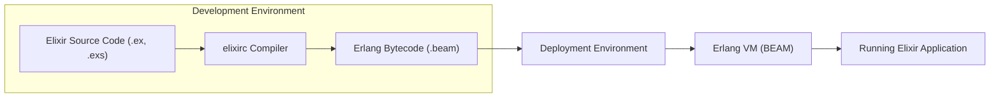
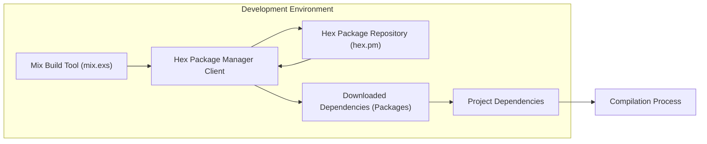
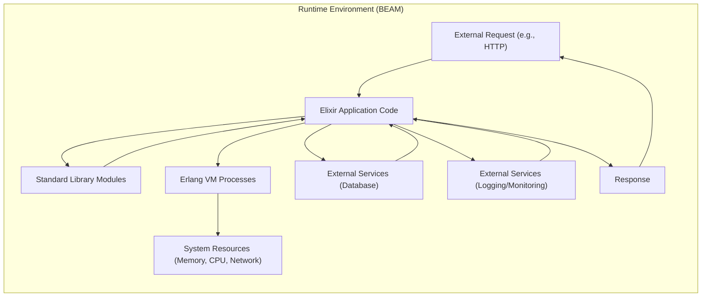

## Project Design Document: Elixir Programming Language

**Project Name:** Elixir Programming Language

**Project Repository:** [https://github.com/elixir-lang/elixir](https://github.com/elixir-lang/elixir)

**Document Version:** 1.1

**Date:** October 26, 2023

**Author:** Gemini (AI Language Model)

**1. Introduction**

This document provides a refined high-level design overview of the Elixir programming language project, specifically tailored for threat modeling. Building upon version 1.0, this iteration enhances the description of the architecture, components, and data flows with a stronger focus on security considerations. The aim is to create a robust foundation for identifying potential threats, vulnerabilities, and attack vectors within the Elixir ecosystem. This document outlines system boundaries, key components, data flow, and technologies, explicitly highlighting areas critical for security analysis.

**2. Project Overview**

Elixir remains a dynamic, functional programming language engineered for building scalable and maintainable applications. Its core strength lies in leveraging the Erlang Virtual Machine (BEAM), inheriting its robust fault tolerance, concurrency model, and distributed system capabilities. Elixir prioritizes developer productivity while offering a rich ecosystem suitable for diverse applications, from web development and real-time systems to embedded software and beyond.

**3. System Architecture Overview**

Elixir's architecture is structured in distinct layers, each contributing to its overall functionality and security profile:

* **Language Core:** Defines the fundamental syntax, semantics, and core language features of Elixir, including its functional paradigm.
* **Compiler (`elixirc`):** Translates human-readable Elixir source code into platform-agnostic Erlang bytecode for execution on the BEAM.
* **Erlang Virtual Machine (BEAM):** The robust runtime environment executing the bytecode, providing concurrency, fault tolerance, and distribution.
* **Standard Library (Elixir Standard Library):** Offers a comprehensive set of built-in modules and functions for common programming tasks, extending the core language.
* **Mix Build Tool:** A powerful build automation tool for Elixir projects, managing dependencies, compilation, testing, release creation, and project lifecycle.
* **Package Manager (Hex):** The official package manager for the Erlang ecosystem, used by Mix to manage and resolve Elixir and Erlang dependencies from a central repository.
* **Runtime Environment (Deployment Environment):** The complete environment where Elixir applications are deployed and executed, encompassing the operating system, Erlang VM, application code, configuration, and external dependencies.

**4. Component Details**

This section provides detailed descriptions of each key component within the Elixir project, emphasizing their functionalities and associated security considerations for threat modeling.

**4.1. Language Core**

* **Description:** The foundational layer of Elixir, defining its syntax, data types (atoms, lists, tuples, maps, etc.), control flow, and functional programming principles (immutability, recursion, higher-order functions, pattern matching).
* **Functionality:** Provides the essential building blocks and paradigms for writing secure and reliable Elixir code.
* **Security Considerations:**
    * **Metaprogramming Risks:** Elixir's powerful metaprogramming capabilities, while beneficial, can introduce risks if misused. Uncontrolled or unsanitized code generation could lead to injection vulnerabilities if input data influences metaprogramming logic without proper validation.
    * **Dynamic Code Execution:** Features like `Code.eval_string` and similar functions, if used with untrusted input, can create code injection vulnerabilities. Secure coding practices must be enforced to avoid executing arbitrary code.
    * **Implicit Type Conversions:** While Elixir is dynamically typed, implicit type conversions could lead to unexpected behavior and potential vulnerabilities if not carefully considered during development.
    * **Denial of Service through Resource Exhaustion:**  Careless use of recursion or unbounded data structures could lead to stack overflow or memory exhaustion, resulting in denial-of-service.

**4.2. Compiler (`elixirc`)**

* **Description:** The Elixir compiler (`elixirc`) is responsible for parsing Elixir source code (`.ex`, `.exs` files) and transforming it into efficient Erlang bytecode (`.beam` files) suitable for execution on the BEAM.
* **Functionality:**
    * **Lexing and Parsing:** Converts Elixir source code into an Abstract Syntax Tree (AST).
    * **Semantic Analysis and Limited Type Checking:** Performs semantic analysis and basic type checking to identify syntax and semantic errors.
    * **Code Optimization:** Applies optimizations to improve the performance of the generated bytecode.
    * **Bytecode Generation:** Generates Erlang bytecode (`.beam` files) as output.
* **Security Considerations:**
    * **Compiler Vulnerabilities:** A compromised compiler is a critical supply chain risk. If an attacker gains control of the compiler, they could inject malicious code directly into the generated bytecode, affecting all applications compiled with that compromised compiler.
    * **Code Injection during Compilation (Indirect):** While direct code injection into the compiler itself is less likely, vulnerabilities in compiler plugins or build scripts that the compiler interacts with could be exploited to inject malicious code during the build process.
    * **Dependency Security (via Mix and Hex):** The compiler relies on Mix and Hex for dependency resolution.  Vulnerabilities in the dependency resolution process or compromised dependencies can indirectly impact the security of compiled applications. Supply chain attacks targeting dependencies are a significant concern.
    * **Denial of Service through Malformed Input:**  The compiler should be robust against malformed or excessively large input files to prevent denial-of-service attacks during the compilation phase.

**4.3. Erlang Virtual Machine (BEAM)**

* **Description:** The BEAM is the robust and highly concurrent runtime environment for Elixir (and Erlang) applications. It is renowned for its fault tolerance, concurrency through lightweight processes, and distributed capabilities.
* **Functionality:**
    * **Bytecode Execution:** Executes Erlang bytecode efficiently.
    * **Process Management:** Manages lightweight processes, enabling concurrency and parallelism.
    * **Message Passing:** Provides asynchronous message passing for inter-process communication, the foundation of Elixir's concurrency model.
    * **Fault Tolerance and Supervision:** Implements supervision trees for automatic error detection and recovery, enhancing application resilience.
    * **Distribution:** Supports distributed computing across multiple nodes, enabling scalable and fault-tolerant distributed systems.
* **Security Considerations:**
    * **VM Vulnerabilities:** Exploits in the BEAM itself are critical vulnerabilities.  These could allow attackers to bypass security mechanisms, gain control of processes, or even compromise the entire system. Regular security updates for the BEAM are crucial.
    * **Process Isolation Weaknesses:** While BEAM processes are isolated, vulnerabilities in the VM or standard libraries could potentially allow for cross-process information leakage or even privilege escalation.
    * **Resource Management and Denial of Service:** Improper resource management within the BEAM, or vulnerabilities that allow resource exhaustion (CPU, memory, file descriptors), can lead to denial-of-service attacks. Rate limiting and resource quotas are important mitigations.
    * **Distribution Security:** Security mechanisms for distributed Erlang/Elixir nodes are paramount.  Insecure distribution configurations (e.g., using default Erlang cookies, unencrypted communication) can lead to unauthorized access, node hijacking, and data breaches in clustered environments. Strong authentication, authorization, and encrypted communication (TLS) are essential for distributed systems.
    * **JIT Compiler Vulnerabilities:** The BEAM includes a Just-In-Time (JIT) compiler. Vulnerabilities in the JIT compiler could potentially be exploited for code execution.

**4.4. Standard Library (Elixir Standard Library)**

* **Description:** A comprehensive collection of modules and functions provided as part of Elixir, offering essential functionalities for various programming tasks, including data manipulation, input/output operations, networking, concurrency primitives, and more. Examples include `IO`, `String`, `List`, `Enum`, `Task`, `GenServer`, `Supervisor`, `HTTPoison` (though external, commonly used).
* **Functionality:** Provides reusable, well-tested components and abstractions to simplify application development and promote secure coding practices.
* **Security Considerations:**
    * **Vulnerabilities in Standard Library Modules:** Bugs or security flaws in standard library functions are potential vulnerabilities. Examples could include parsing vulnerabilities in modules like `String` or `URI`, or vulnerabilities in networking modules like `HTTPoison` (if considered part of the ecosystem).
    * **Insecure Defaults:** Some standard library functions might have default configurations that are not secure by default. Developers need to be aware of these and configure them appropriately for production environments. For example, default network timeouts or insecure TLS settings.
    * **Denial of Service through Resource Exhaustion:** Certain functions, if misused or exploited with malicious input, could lead to resource exhaustion and DoS attacks. For example, inefficient algorithms in data processing modules or unbounded loops.
    * **Information Disclosure:**  Improper handling of sensitive data within standard library functions could lead to information disclosure vulnerabilities. For example, logging sensitive data or exposing error messages containing sensitive information.
    * **Injection Vulnerabilities (Indirect):**  Vulnerabilities in standard library functions that handle external input (e.g., parsing user-provided strings, handling network requests) could indirectly lead to injection vulnerabilities in applications using these functions if input is not properly validated and sanitized.

**4.5. Mix Build Tool**

* **Description:** Mix is the official build tool for Elixir projects. It provides a rich set of tasks for project creation, compilation, testing, dependency management (via Hex), release creation, documentation generation, and overall project lifecycle management.
* **Functionality:**
    * **Project Setup and Management:** Initializes new projects, manages project configuration (`mix.exs`), and provides project-level tasks.
    * **Dependency Management (Hex Integration):** Integrates with Hex to download, manage, and resolve project dependencies.
    * **Compilation Orchestration:** Compiles Elixir code and manages the compilation process.
    * **Testing Framework:** Provides a built-in testing framework and tasks for running tests.
    * **Release Management:** Creates self-contained releases for deployment, packaging the application and the Erlang VM.
    * **Documentation Generation:** Generates documentation from Elixir code.
* **Security Considerations:**
    * **Dependency Management Vulnerabilities (Supply Chain):** Mix relies heavily on Hex for dependency management. This introduces significant supply chain risks. Compromised packages in Hex, dependency confusion attacks, or vulnerabilities in the dependency resolution process itself could introduce malicious code or vulnerable libraries into projects.
    * **Build Process Manipulation:** If the build process is not properly secured, attackers might be able to inject malicious code or alter build artifacts. This could involve compromising build scripts, configuration files, or developer environments.
    * **Secrets Management during Build:** Handling sensitive information (API keys, database credentials, certificates) during the build process needs to be done securely. Storing secrets directly in build scripts or configuration files is a major security risk. Secure secret management practices (environment variables, dedicated secret vaults) should be employed.
    * **Build Artifact Tampering:**  Ensuring the integrity of build artifacts is crucial.  Mechanisms to verify the authenticity and integrity of releases and compiled code should be considered to prevent tampering after the build process.

**4.6. Hex Package Manager**

* **Description:** Hex is the package manager for the Erlang ecosystem, serving as a central repository for Elixir and Erlang packages. Mix uses Hex to manage project dependencies. It provides tools for publishing, installing, and managing packages.
* **Functionality:**
    * **Package Repository and Hosting (hex.pm):** Hosts a central repository of Erlang and Elixir packages.
    * **Package Installation and Dependency Resolution:** Provides tools for installing packages and resolving dependencies based on project requirements.
    * **Package Publishing:** Allows developers to publish their own packages to the Hex repository.
    * **Package Versioning and Management:** Supports package versioning and management, allowing developers to specify and manage specific package versions.
    * **Package Signing and Verification:**  Hex supports package signing to ensure package integrity and authenticity.
* **Security Considerations:**
    * **Package Repository Compromise (hex.pm):** If the Hex repository itself (hex.pm) is compromised, attackers could distribute malicious packages on a large scale, impacting the entire Erlang and Elixir ecosystem. Robust security measures are essential to protect the Hex repository infrastructure.
    * **Malicious Packages:**  Users could inadvertently download and use packages containing malware, vulnerabilities, or backdoors. Package vetting processes, security scanning, and community reporting are important to mitigate this risk.
    * **Dependency Confusion Attacks:** Attackers might attempt to inject malicious packages with names similar to internal or private dependencies, hoping that developers will mistakenly download and use the malicious packages. Using private package registries or namespaces can help mitigate this.
    * **Supply Chain Attacks:** Compromising the Hex package supply chain, even without directly compromising hex.pm, could have widespread impact. This could involve compromising package maintainer accounts, build pipelines, or package signing keys.
    * **Package Integrity and Authenticity:**  Ensuring the integrity and authenticity of packages downloaded from Hex is crucial. Package signing and verification mechanisms should be used to prevent tampering and ensure that packages come from trusted sources.

**4.7. Runtime Environment (Deployment Environment)**

* **Description:** The complete environment where Elixir applications are deployed and executed. This encompasses the operating system, Erlang VM installation, application code, configuration, dependencies, and any external services or infrastructure.
* **Functionality:** Provides the necessary infrastructure and runtime context for running Elixir applications in production, staging, or development environments.
* **Security Considerations:**
    * **Operating System Security:** The underlying operating system (Linux, macOS, Windows, etc.) must be secured and hardened. Regular security patching, secure configuration, and minimizing the attack surface are essential. OS vulnerabilities can directly impact the security of Elixir applications.
    * **Erlang VM Configuration Security:** Properly configuring the BEAM is critical for security. This includes setting appropriate resource limits, configuring network listeners securely (restricting ports, using TLS), managing user permissions for the BEAM process, and disabling unnecessary features.
    * **Application Configuration Security:** Securely managing application configuration, especially sensitive data like database credentials, API keys, and encryption keys, is paramount. Configuration should be stored securely (e.g., using environment variables, dedicated secret vaults), encrypted at rest and in transit, and accessed with appropriate authorization. Avoid hardcoding secrets in application code or configuration files.
    * **Network Security:** Securing network communication between Elixir nodes, clients, and external services is critical. Use TLS/SSL for encrypted communication, implement firewalls to restrict network access, and consider network segmentation to isolate application components.
    * **Access Control and Authorization:** Implement robust authentication and authorization mechanisms to control access to Elixir applications and their resources. Use strong authentication methods (e.g., multi-factor authentication), enforce least privilege principles, and implement proper authorization checks within the application.
    * **Logging and Monitoring Security:** Secure logging and monitoring are essential for detecting and responding to security incidents. Logs should be stored securely, access to logs should be restricted, and monitoring systems should be configured to detect suspicious activity.
    * **Dependency Management in Deployment:** Ensure that dependencies deployed with the application are also secure and up-to-date. Regularly scan dependencies for vulnerabilities and apply security patches.
    * **Container and Orchestration Security (if applicable):** If deploying in containers (Docker) or using orchestration platforms (Kubernetes), ensure that these environments are also securely configured and managed. Follow container security best practices and Kubernetes security guidelines.
    * **Regular Security Updates and Patching:**  Maintain a process for regularly updating the Erlang VM, operating system, application dependencies, and all other components of the runtime environment with the latest security patches. Vulnerability management is a continuous process.

**5. Data Flow Diagrams**

**5.1. Compilation Process**

**5.2. Dependency Resolution (Mix & Hex)**

**5.3. Runtime Application Flow (Simplified)**

**6. Technologies Used**

* **Programming Language:** Elixir
* **Virtual Machine:** Erlang VM (BEAM)
* **Build Tool:** Mix
* **Package Manager:** Hex
* **Underlying Language (for BEAM):** C, Erlang, Assembly
* **Operating Systems (Deployment):** Linux, macOS, Windows, FreeBSD, and others supporting Erlang VM

**7. Deployment Considerations**

Elixir applications are typically deployed as releases, which are self-contained packages including the Erlang VM, application code, and dependencies, facilitating consistent and reproducible deployments. Deployment can be on a wide range of platforms:

* **Cloud Platforms (IaaS, PaaS, FaaS):** AWS, Google Cloud, Azure, Heroku, Fly.io, etc. Leverage cloud-provider security features (firewalls, IAM, security scanning).
* **Containers (Docker, Podman):** Containerization provides isolation and portability. Follow container security best practices (minimal images, vulnerability scanning, secure registries). Orchestration platforms like Kubernetes add another layer of complexity and security considerations.
* **Bare Metal Servers and Virtual Machines:** Traditional server deployments require careful OS hardening, network security configuration, and ongoing maintenance.
* **Embedded Systems and IoT Devices:** Elixir/Erlang's lightweight nature makes it suitable for embedded systems. Security considerations are amplified in resource-constrained environments. Secure boot, firmware updates, and device authentication are critical.

Security best practices during deployment include:

* **Secure Infrastructure Hardening:**  Implement OS hardening, network segmentation, firewalls, intrusion detection/prevention systems (IDS/IPS).
* **Secure Configuration Management:**  Automate configuration management using tools like Ansible, Chef, or Puppet to ensure consistent and secure configurations across environments.
* **Robust Access Control and Monitoring:** Implement strong authentication and authorization, role-based access control (RBAC), and comprehensive monitoring and alerting systems.
* **Regular Security Audits and Penetration Testing:** Conduct periodic security audits and penetration testing to identify vulnerabilities and weaknesses in deployed applications and infrastructure.
* **Incident Response Plan:**  Develop and maintain an incident response plan to effectively handle security incidents and breaches.
* **Vulnerability Management and Patching:** Establish a process for continuous vulnerability scanning, tracking, and patching for all components of the runtime environment, including the OS, Erlang VM, application dependencies, and container images.
* **Security Scanning and Static Analysis:** Integrate security scanning tools into the CI/CD pipeline to automatically detect vulnerabilities in code and dependencies before deployment. Static analysis tools can help identify potential security flaws in Elixir code.

**8. Conclusion**

This enhanced design document provides a more detailed and security-focused overview of the Elixir programming language project, intended as a robust foundation for threat modeling activities. It expands upon the previous version by providing more specific and actionable security considerations for each component, elaborating on data flows, and detailing deployment security best practices. This document serves as a crucial starting point for in-depth threat modeling exercises, enabling the identification of potential vulnerabilities, attack vectors, and the development of effective security mitigations for Elixir-based systems across various deployment scenarios. Further analysis should leverage this document to conduct structured threat modeling (e.g., STRIDE analysis) for each component and data flow to proactively address security risks within the Elixir ecosystem.