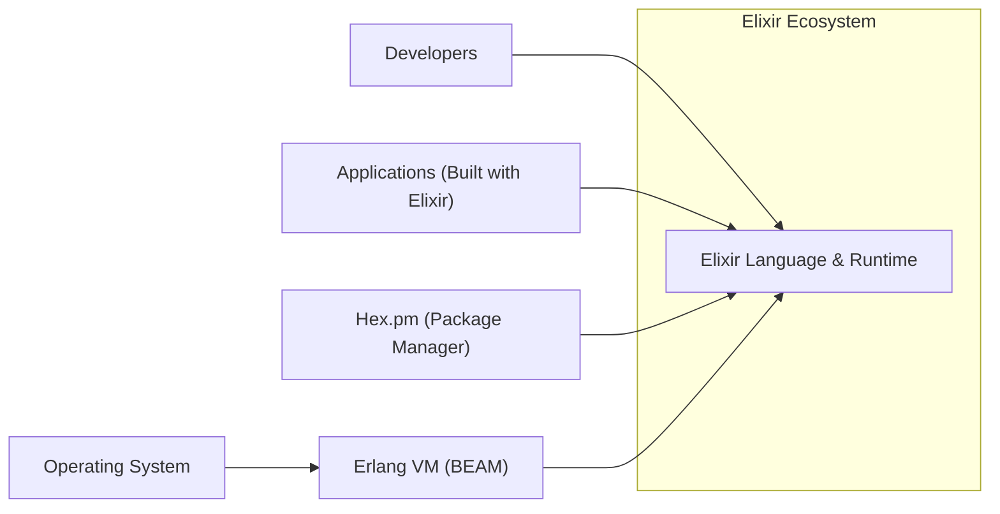
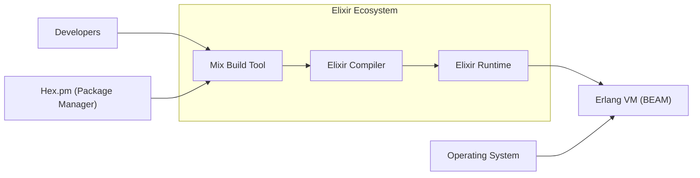

Okay, let's create a design document for the Elixir programming language, focusing on aspects relevant for threat modeling.

# BUSINESS POSTURE

Elixir is a dynamic, functional language designed for building scalable and maintainable applications.  It leverages the Erlang VM (BEAM), known for its fault-tolerance and concurrency capabilities.  The business priorities and goals that Elixir addresses are:

*   High Availability and Fault Tolerance:  Businesses needing systems that can handle failures gracefully and remain operational are a primary target. This is crucial for telecommunications, financial services, and other industries where downtime is extremely costly.
*   Scalability:  Elixir's concurrency model allows applications to scale efficiently to handle large numbers of users or transactions. This is important for growing businesses and applications with fluctuating demand.
*   Maintainability:  The language's functional nature and emphasis on immutability promote code that is easier to understand, test, and maintain over time. This reduces long-term development costs.
*   Developer Productivity: Elixir aims to be a productive language with a clean syntax and powerful tooling, enabling faster development cycles.
*   Open Source Community: Being an open-source project, Elixir benefits from community contributions, fostering transparency and collaboration.

Based on these priorities, the most important business risks that need to be addressed are:

*   Vulnerabilities in the Erlang VM (BEAM): Since Elixir runs on the BEAM, any security flaws in the VM could impact all Elixir applications.
*   Supply Chain Attacks: Compromised dependencies or build tools could introduce malicious code into Elixir projects.
*   Denial of Service (DoS):  Exploiting concurrency weaknesses or resource exhaustion vulnerabilities could disrupt Elixir applications.
*   Improper Input Validation:  Failure to properly validate user inputs could lead to various attacks, including code injection or data corruption.
*   Insecure Configuration:  Misconfigured Elixir or Erlang settings could expose applications to unnecessary risks.

# SECURITY POSTURE

Existing security controls and accepted risks, focusing on the Elixir language and its ecosystem (not specific applications built with Elixir):

*   security control: Erlang VM Security Features: The BEAM provides built-in features like process isolation, which limits the impact of crashes and potential exploits within a single process. Described in Erlang documentation and BEAM internals.
*   security control: Immutable Data Structures: Elixir's emphasis on immutability reduces the risk of certain types of bugs and vulnerabilities related to shared mutable state. This is a core language feature.
*   security control: Pattern Matching: Elixir's pattern matching can help enforce type safety and data validation, reducing the likelihood of unexpected inputs. This is a core language feature.
*   security control: Open Source Auditing: The open-source nature of Elixir allows for community scrutiny and identification of potential security issues. Visible on GitHub.
*   security control: Security Advisories: The Elixir Security team and community publish security advisories for vulnerabilities found in Elixir and its core libraries.
*   accepted risk: Dependency Vulnerabilities: Like any language, Elixir projects rely on external dependencies (Hex packages), which may contain vulnerabilities.  Mitigation relies on developers keeping dependencies up-to-date and using tools like `mix audit`.
*   accepted risk: Erlang VM Complexity: The BEAM is a complex system, and while robust, undiscovered vulnerabilities are possible.
*   accepted risk: Developer Errors: Elixir itself cannot prevent developers from writing insecure code within their applications.

Recommended Security Controls (High Priority):

*   Implement a robust dependency management process with regular security audits (e.g., `mix hex.audit` and automated tooling).
*   Establish a clear security policy for the Elixir project, including vulnerability reporting and response procedures.
*   Provide security training and guidelines for Elixir developers, emphasizing secure coding practices.
*   Consider static analysis tools to identify potential vulnerabilities in Elixir code.

Security Requirements:

*   Authentication: Not directly applicable to the language itself, but Elixir applications should implement robust authentication mechanisms where needed.
*   Authorization: Not directly applicable to the language itself, but Elixir applications should implement appropriate authorization controls to restrict access to resources.
*   Input Validation: Elixir applications must thoroughly validate all inputs, especially those from external sources, to prevent injection attacks and other vulnerabilities. Pattern matching and dedicated validation libraries can be used.
*   Cryptography: Elixir provides access to Erlang's `:crypto` module, which offers a range of cryptographic functions. Applications should use these functions appropriately to protect sensitive data.

# DESIGN

## C4 CONTEXT



Element Descriptions:

*   Element:
    *   Name: Elixir Language & Runtime
    *   Type: Software System
    *   Description: The Elixir programming language, compiler, and runtime environment.
    *   Responsibilities: Provides the core language features, compilation, and execution of Elixir code.
    *   Security controls: Immutable data structures, pattern matching, process isolation (via BEAM).

*   Element:
    *   Name: Developers
    *   Type: Person
    *   Description: Software developers who write and maintain Elixir code.
    *   Responsibilities: Writing, testing, and deploying Elixir applications.
    *   Security controls: Secure coding practices, code reviews, using security tools.

*   Element:
    *   Name: Applications (Built with Elixir)
    *   Type: Software System
    *   Description: Applications created using the Elixir language.
    *   Responsibilities: Varies depending on the specific application.
    *   Security controls: Application-specific security measures (authentication, authorization, input validation, etc.).

*   Element:
    *   Name: Hex.pm (Package Manager)
    *   Type: Software System
    *   Description: The package manager for Elixir and Erlang.
    *   Responsibilities: Managing and distributing Elixir and Erlang packages.
    *   Security controls: Package signing (optional), vulnerability reporting.

*   Element:
    *   Name: Erlang VM (BEAM)
    *   Type: Software System
    *   Description: The virtual machine that runs Elixir and Erlang code.
    *   Responsibilities: Process management, memory management, concurrency, fault tolerance.
    *   Security controls: Process isolation, memory safety features.

*   Element:
    *   Name: Operating System
    *   Type: Software System
    *   Description: The underlying operating system on which the Erlang VM runs.
    *   Responsibilities: Providing the foundation for the entire system.
    *   Security controls: OS-level security measures (firewalls, access controls, etc.).

## C4 CONTAINER

In this case, the Elixir language itself is relatively simple from a container perspective. The containers are largely defined by the underlying Erlang VM. The container diagram is essentially an extension of the context diagram.



Element Descriptions:

*   Element:
    *   Name: Elixir Compiler
    *   Type: Component
    *   Description: Compiles Elixir code into BEAM bytecode.
    *   Responsibilities: Translating Elixir source code into executable bytecode.
    *   Security controls: Code analysis during compilation (limited).

*   Element:
    *   Name: Elixir Runtime
    *   Type: Component
    *   Description: Provides the runtime environment for Elixir code, interacting with the BEAM.
    *   Responsibilities: Managing Elixir-specific features on top of the BEAM.
    *   Security controls: Relies on BEAM security features.

*   Element:
    *   Name: Mix Build Tool
    *   Type: Component
    *   Description: The build tool for Elixir projects.
    *   Responsibilities: Compiling code, managing dependencies, running tests, etc.
    *   Security controls: Dependency auditing (mix hex.audit).

*   Element:
    *   Name: Hex.pm (Package Manager)
    *   Type: Software System
    *   Description: The package manager for Elixir and Erlang.
    *   Responsibilities: Managing and distributing Elixir and Erlang packages.
    *   Security controls: Package signing (optional), vulnerability reporting.

*   Element:
    *   Name: Erlang VM (BEAM)
    *   Type: Software System
    *   Description: The virtual machine that runs Elixir and Erlang code.
    *   Responsibilities: Process management, memory management, concurrency, fault tolerance.
    *   Security controls: Process isolation, memory safety features.

*   Element:
    *   Name: Operating System
    *   Type: Software System
    *   Description: The underlying operating system on which the Erlang VM runs.
    *   Responsibilities: Providing the foundation for the entire system.
    *   Security controls: OS-level security measures (firewalls, access controls, etc.).

*   Element:
    *   Name: Developers
    *   Type: Person
    *   Description: Software developers who write and maintain Elixir code.
    *   Responsibilities: Writing, testing, and deploying Elixir applications.
    *   Security controls: Secure coding practices, code reviews, using security tools.

## DEPLOYMENT

Elixir applications can be deployed in various ways, leveraging the Erlang VM's capabilities:

1.  **Bare Metal/Virtual Machines:**  Deploying directly onto servers (physical or virtual).
2.  **Containers (Docker):** Packaging Elixir applications within Docker containers for portability and isolation.
3.  **Kubernetes:** Orchestrating Elixir deployments using Kubernetes for scalability and management.
4.  **Serverless (less common):**  While less common due to the stateful nature of many Elixir applications, it's possible to deploy parts of an Elixir system as serverless functions.

We'll describe a Docker-based deployment, as it's a common and well-understood approach.

```mermaid
graph LR
    subgraph Deployment Environment (Docker)
        ElixirApp["Elixir Application Container"]
        PostgresDB["Database Container (e.g., PostgreSQL)"]
        Redis["Cache Container (e.g., Redis)"]
    end
    ElixirApp --> PostgresDB
    ElixirApp --> Redis
    Internet["Internet"] --> ElixirApp
    HostOS["Host Operating System"]
    DockerDaemon["Docker Daemon"]
    HostOS --> DockerDaemon
    DockerDaemon --> ElixirApp
    DockerDaemon --> PostgresDB
    DockerDaemon --> Redis

```

Element Descriptions:

*   Element:
    *   Name: Elixir Application Container
    *   Type: Container
    *   Description: A Docker container running the compiled Elixir application.
    *   Responsibilities: Handling application logic, processing requests.
    *   Security controls: Application-level security, container isolation.

*   Element:
    *   Name: Database Container (e.g., PostgreSQL)
    *   Type: Container
    *   Description: A Docker container running a database (e.g., PostgreSQL).
    *   Responsibilities: Storing and managing application data.
    *   Security controls: Database security configuration, network isolation.

*   Element:
    *   Name: Cache Container (e.g., Redis)
    *   Type: Container
    *   Description: A Docker container running a caching system (e.g., Redis).
    *   Responsibilities: Caching frequently accessed data.
    *   Security controls: Cache security configuration, network isolation.

*   Element:
    *   Name: Internet
    *   Type: External Entity
    *   Description: The external network.
    *   Responsibilities: Source of external requests.
    *   Security controls: Firewall, intrusion detection/prevention systems.

*   Element:
    *   Name: Host Operating System
    *   Type: Operating System
    *   Description: The operating system of the host machine.
    *   Responsibilities: Providing the foundation for Docker.
    *   Security controls: OS-level security measures.

*   Element:
    *   Name: Docker Daemon
    *   Type: Software System
    *   Description: The Docker daemon managing the containers.
    *   Responsibilities: Creating, running, and managing containers.
    *   Security controls: Docker security configuration.

## BUILD

Elixir projects typically use the `mix` build tool.  A common build process involves:

1.  **Developer:** Writes code and commits to a version control system (e.g., Git).
2.  **CI Server (e.g., GitHub Actions, Jenkins):**  Triggered by code commits.
3.  **Fetch Dependencies:** `mix deps.get` retrieves project dependencies from Hex.pm.
4.  **Compile Code:** `mix compile` compiles the Elixir code.
5.  **Run Tests:** `mix test` executes the project's test suite.
6.  **Security Checks:**
    *   **Dependency Auditing:** `mix hex.audit` checks for known vulnerabilities in dependencies.
    *   **Static Analysis (Optional):** Tools like `credo` (linter) or dedicated security analysis tools can be integrated.
7.  **Create Release (Optional):**  `mix release` creates a self-contained release package.
8.  **Publish Artifact (Optional):** The release or Docker image is pushed to a registry.

```mermaid
graph LR
    Developer["Developer"] --> Git["Version Control (Git)"]
    Git --> CIServer["CI Server (e.g., GitHub Actions)"]
    subgraph CI Server
        Fetch["Fetch Dependencies (mix deps.get)"]
        Compile["Compile Code (mix compile)"]
        Test["Run Tests (mix test)"]
        Audit["Dependency Audit (mix hex.audit)"]
        StaticAnalysis["Static Analysis (Optional)"]
        Release["Create Release (mix release - Optional)"]
    end
    CIServer --> Fetch
    Fetch --> Compile
    Compile --> Test
    Test --> Audit
    Audit --> StaticAnalysis
    StaticAnalysis --> Release
    Release --> ArtifactRegistry["Artifact Registry (e.g., Docker Hub)"]

```



Security Controls in Build Process:

*   Version Control: Tracks code changes and enables rollbacks.
*   Dependency Auditing: Identifies known vulnerabilities in dependencies.
*   Automated Testing: Ensures code quality and helps prevent regressions.
*   Static Analysis (Optional): Can detect potential security issues in code.
*   Signed Releases (Optional): Ensures the integrity of release packages.

# RISK ASSESSMENT

*   **Critical Business Processes:**  The critical business processes depend on the specific Elixir application. However, generally, these include:
    *   Maintaining application uptime and availability.
    *   Ensuring data integrity and confidentiality.
    *   Providing a responsive and reliable user experience.
    *   Protecting against financial loss or reputational damage.

*   **Data Protection:**  The data Elixir applications handle varies widely. Sensitivity levels could range from:
    *   **Public:**  Non-sensitive information.
    *   **Internal:**  Company-internal data.
    *   **Confidential:**  Sensitive business data, potentially including PII (Personally Identifiable Information) or financial data.
    *   **Restricted:**  Highly sensitive data subject to strict regulations (e.g., HIPAA, GDPR).

    Elixir applications must implement appropriate data protection measures based on the sensitivity of the data they handle. This includes encryption at rest and in transit, access controls, and data loss prevention mechanisms.

# QUESTIONS & ASSUMPTIONS

*   **Questions:**
    *   Are there any specific compliance requirements (e.g., PCI DSS, GDPR) that apply to Elixir applications?
    *   What is the expected threat model for typical Elixir applications (e.g., web applications, backend services)?
    *   What level of security expertise is assumed for Elixir developers?
    *   What is the process for handling security vulnerabilities discovered in Elixir or its core libraries?

*   **Assumptions:**
    *   **BUSINESS POSTURE:** Assumes a general need for high availability, scalability, and maintainability, typical of Elixir use cases.
    *   **SECURITY POSTURE:** Assumes developers are responsible for securing their own applications built with Elixir.  The document focuses on the security of the language and its ecosystem, not specific application security.
    *   **DESIGN:** Assumes a standard deployment model using Docker containers. Other deployment models are possible but not detailed here. The build process assumes the use of `mix` and a CI/CD system.
    *   It's assumed that developers will use secure coding practices and follow security guidelines.
    *   It's assumed that the underlying operating system and Erlang VM are kept up-to-date with security patches.