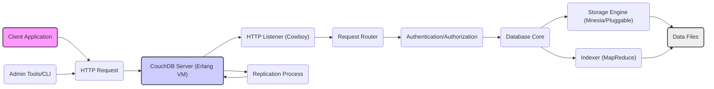
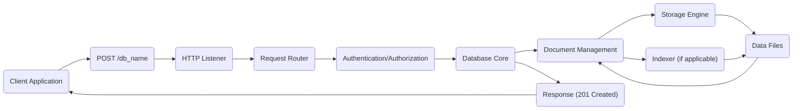
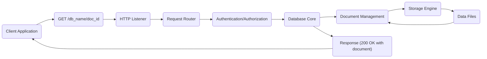
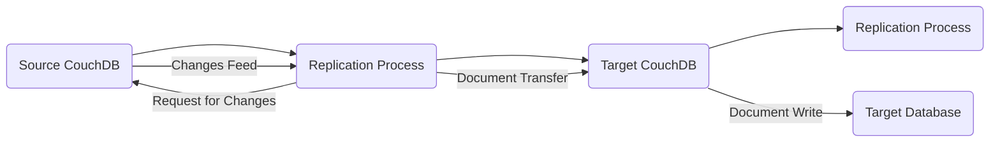

# Project Design Document: Apache CouchDB (Improved)

**Version:** 1.1
**Date:** October 26, 2023
**Prepared By:** AI Software Architect

## 1. Introduction

This document provides an enhanced architectural overview of Apache CouchDB, an open-source, document-oriented NoSQL database. This design document is specifically tailored to serve as a robust foundation for subsequent threat modeling activities. It offers a detailed exploration of CouchDB's key components, data flows, and underlying technologies, with a heightened focus on identifying potential areas of security concern and attack surfaces.

## 2. Project Overview

Apache CouchDB is a distributed, fault-tolerant, and schema-free NoSQL database. It leverages JSON for document storage, JavaScript for defining MapReduce indexes, and a comprehensive RESTful HTTP API for all interactions. Its design emphasizes high availability, scalability, and ease of use, making it suitable for a wide range of applications requiring flexible data models and robust data management.

## 3. Architectural Overview

CouchDB employs a multi-process architecture, primarily implemented in Erlang, leveraging its inherent concurrency and fault-tolerance capabilities. All functionalities are exposed through a well-defined RESTful HTTP API, facilitating integration with various client applications and services.

### 3.1. High-Level Architecture

*   **Client Application:** Any software application, service, or user interface that interacts with CouchDB by sending HTTP requests to its API endpoints. This could range from web browsers and mobile apps to backend services.
*   **HTTP Request:** The standardized communication protocol used by clients to interact with the CouchDB server. These requests encapsulate actions like creating, reading, updating, and deleting data.
*   **CouchDB Server (Erlang VM):** The core runtime environment for the CouchDB application. The Erlang Virtual Machine provides the necessary concurrency, fault tolerance, and distribution capabilities.
*   **HTTP Listener (Cowboy):** An efficient and robust Erlang-based HTTP server responsible for accepting and managing incoming HTTP connections and requests. It acts as the entry point for all client interactions.
*   **Request Router:**  A component within the CouchDB server that analyzes the incoming HTTP request's URL path and method to determine the appropriate handler or module to process the request.
*   **Authentication/Authorization:**  A critical security module responsible for verifying the identity of clients (authentication) and ensuring they have the necessary permissions to access the requested resources and perform the intended actions (authorization).
*   **Database Core:**  The central component responsible for managing databases, documents, and views. It orchestrates operations like document creation, retrieval, updates, and deletions, and interacts with the storage engine and indexer.
*   **Storage Engine (Mnesia/Pluggable):** The underlying mechanism responsible for the persistent storage of data on disk. Mnesia is the default, in-memory, real-time distributed database management system provided by Erlang. CouchDB also supports pluggable storage engines, allowing for alternative storage backends.
*   **Data Files:** The physical files on the server's file system where the database documents, indexes, and metadata are stored. The format and structure of these files depend on the chosen storage engine.
*   **Indexer (MapReduce):**  The component that builds and maintains indexes based on user-defined JavaScript MapReduce functions. These indexes enable efficient querying and retrieval of data based on specific criteria.
*   **Replication Process:**  A background process responsible for synchronizing data between different CouchDB instances. This enables features like data backup, distribution, and offline access.
*   **Admin Tools/CLI:**  Command-line interface tools and other utilities used by administrators to manage and configure the CouchDB server, including tasks like database creation, user management, and monitoring.

### 3.2. Component-Level Architecture

This section provides a more granular view of the key components within the CouchDB server and their specific functionalities.

*   **HTTP API Layer:**
    *   Serves as the primary interface for all client interactions.
    *   Utilizes the Cowboy web server for handling HTTP requests and responses.
    *   Exposes a comprehensive set of RESTful endpoints for managing databases (e.g., creating, deleting), manipulating documents (e.g., creating, reading, updating, deleting), querying data (e.g., using views, `_find`), and performing administrative tasks.
    *   Performs initial request validation, such as checking for valid JSON or content types.

*   **Authentication and Authorization Module:**
    *   Manages user accounts, roles, and permissions.
    *   Supports various authentication mechanisms, including Basic Authentication, Cookie Authentication, and potentially OAuth or other custom authentication schemes.
    *   Enforces access control policies at the database and document level, ensuring that only authorized users can perform specific actions.
    *   Handles session management, maintaining user login states.

*   **Request Handling and Routing:**
    *   Receives and parses incoming HTTP requests, extracting relevant information such as the HTTP method, URL path, and headers.
    *   Utilizes a routing mechanism to map incoming requests to the appropriate handler functions or modules based on the URL structure (e.g., requests to `/mydb` are routed to database management functions, while requests to `/mydb/mydoc` are routed to document management functions).
    *   Handles different HTTP methods (GET for retrieval, POST for creation, PUT for updates, DELETE for deletion) and dispatches them accordingly.

*   **Database Management:**
    *   Provides functionalities for creating new databases, deleting existing databases, and listing available databases.
    *   Manages database-level metadata, such as creation timestamps and modification history.

*   **Document Management:**
    *   Handles the core operations related to JSON documents: creation, retrieval, updating, and deletion.
    *   Implements Multi-Version Concurrency Control (MVCC) to manage concurrent access to documents and prevent data corruption. Each document update creates a new revision, allowing for consistent reads and conflict resolution.
    *   Supports bulk document operations, allowing for efficient processing of multiple documents in a single request.

*   **Indexing and Querying (MapReduce):**
    *   Allows developers to define custom views of the data using JavaScript Map and Reduce functions. The Map function extracts relevant information from documents, and the Reduce function aggregates or summarizes this information.
    *   Builds and maintains indexes based on these defined views, enabling efficient querying of data based on specific criteria.
    *   Provides query endpoints to retrieve data based on the indexed views.
    *   Supports ad-hoc queries using the `_find` endpoint (introduced in CouchDB 2.0), which allows for more flexible querying using a JSON-based query language.

*   **Replication:**
    *   Facilitates the synchronization of databases between different CouchDB instances.
    *   Supports both one-way and two-way replication, allowing for various data distribution and backup scenarios.
    *   Implements conflict resolution mechanisms to handle situations where the same document is modified concurrently on different instances.
    *   Utilizes a pull and push mechanism to transfer changes between the source and target databases.

*   **Storage Engine:**
    *   The default storage engine is Mnesia, an Erlang built-in database known for its real-time characteristics and fault tolerance.
    *   CouchDB's pluggable storage engine architecture allows for the integration of alternative storage backends, such as LevelDB or custom implementations, offering flexibility in terms of performance and storage characteristics.
    *   Manages the persistence of documents, indexes, and metadata to disk, ensuring data durability.

*   **Administration Interface:**
    *   Provides endpoints and tools for performing administrative tasks, such as configuring server settings, managing user accounts, inspecting logs, and monitoring server statistics.
    *   Often accessed through command-line tools like `couchdb-admin` or web-based interfaces like Fauxton.

## 4. Data Flow

This section illustrates the typical flow of data within the CouchDB system for common operations, highlighting potential points of interaction and data transformation.

### 4.1. Document Creation

*   The **Client Application** initiates the document creation process by sending an HTTP `POST` request to the specific database URL (`/db_name`). The request body typically contains the JSON representation of the document to be created.
*   The **HTTP Listener** receives the incoming `POST` request.
*   The **Request Router** analyzes the request URL and method and directs it to the appropriate handler for document creation.
*   The **Authentication/Authorization** module verifies the client's identity and ensures they have the necessary permissions to create documents in the specified database.
*   The **Database Core** receives the validated request and delegates the document creation to the **Document Management** component.
*   The **Document Management** component processes the JSON document, assigns it a unique ID (if not provided), and interacts with the **Storage Engine** to persist the document.
*   The **Storage Engine** writes the document data to the **Data Files** on disk.
*   Optionally, if there are defined indexes for the database, the **Indexer** is notified of the new document and updates the relevant indexes.
*   Finally, the **Database Core** sends a success response (e.g., HTTP status code 201 Created) back to the **Client Application**, often including the document ID and revision number.

### 4.2. Document Retrieval

*   The **Client Application** requests a specific document by sending an HTTP `GET` request to the document's URL (`/db_name/doc_id`).
*   The **HTTP Listener** receives the `GET` request.
*   The **Request Router** directs the request to the appropriate handler for document retrieval.
*   The **Authentication/Authorization** module verifies the client's identity and permissions to access the requested document.
*   The **Database Core** receives the validated request and delegates the retrieval to the **Document Management** component.
*   The **Document Management** component interacts with the **Storage Engine** to fetch the document from the **Data Files**.
*   The **Storage Engine** retrieves the document data from disk.
*   The **Database Core** then sends a success response (e.g., HTTP status code 200 OK) back to the **Client Application**, with the document's JSON representation in the response body.

### 4.3. Data Replication

*   The **Replication Process** on the **Source CouchDB** initiates the replication process, either periodically or on demand.
*   The **Replication Process** on the source sends a "Request for Changes" to the **Source CouchDB**, specifying the target database and any relevant filters or parameters.
*   The **Source CouchDB** generates a "Changes Feed," which is a stream of updates (new documents, modified documents, deleted documents) that have occurred since the last replication.
*   The **Replication Process** on the source receives the "Changes Feed" and begins transferring the relevant documents to the **Target CouchDB**.
*   The **Replication Process** on the source sends the "Document Transfer" requests to the **Target CouchDB**.
*   The **Target CouchDB** receives the documents and performs a "Document Write" operation to its **Target Database**, potentially involving conflict resolution if the same document has been modified on both the source and target.

## 5. Key Technologies

*   **Erlang:** The foundational programming language for the CouchDB server, providing robust concurrency, fault tolerance, and distribution capabilities.
*   **HTTP:** The standard communication protocol used for the API, enabling interoperability with a wide range of clients and tools.
*   **JSON:** The lightweight data-interchange format used for storing documents and exchanging data through the API.
*   **JavaScript:** Used for defining Map and Reduce functions for creating custom indexes and performing data aggregation.
*   **Mnesia:** The default real-time distributed database management system provided by Erlang, used for storing CouchDB's data and metadata.
*   **Cowboy:** A high-performance, small-footprint HTTP server written in Erlang, used as the HTTP listener for CouchDB.
*   **OAuth (Optional):** A standard authorization framework that can be integrated for more secure and flexible authentication.
*   **SSL/TLS:** Essential for securing communication over HTTPS, encrypting data in transit between clients and the CouchDB server.

## 6. Security Considerations (Pre-Threat Modeling)

This section outlines potential security concerns that will be the focus of subsequent threat modeling activities.

*   **Authentication and Authorization Vulnerabilities:**
    *   Weak or default credentials.
    *   Bypass vulnerabilities allowing unauthorized access.
    *   Insufficient granularity in access control policies.
    *   Vulnerabilities in session management leading to session hijacking.
*   **Data Confidentiality Breaches:**
    *   Unencrypted data transmission over HTTP.
    *   Unauthorized access to data files on the server.
    *   Exposure of sensitive data in error messages or logs.
    *   Lack of encryption at rest for sensitive data.
*   **Data Integrity Compromises:**
    *   Malicious modification of data by unauthorized users.
    *   Data corruption due to software bugs or hardware failures.
    *   Injection attacks (e.g., NoSQL injection) leading to unintended data manipulation.
*   **Input Validation Failures:**
    *   Insufficient validation of user-supplied input, leading to injection attacks (e.g., JavaScript injection in MapReduce functions).
    *   Buffer overflows or other memory corruption vulnerabilities due to unchecked input lengths.
*   **Insecure Communication:**
    *   Lack of HTTPS enforcement, allowing for eavesdropping and man-in-the-middle attacks.
    *   Use of outdated or weak cryptographic protocols.
*   **Denial of Service (DoS) Attacks:**
    *   Resource exhaustion attacks targeting CPU, memory, or network bandwidth.
    *   Slowloris or other connection exhaustion attacks.
    *   Abuse of API endpoints to overload the server.
*   **Replication Security Issues:**
    *   Unauthorized access to replication streams.
    *   Man-in-the-middle attacks during replication.
    *   Data corruption or injection during replication.
*   **Third-Party Dependency Vulnerabilities:**
    *   Security flaws in external libraries or components used by CouchDB.
    *   Lack of timely patching of vulnerabilities in dependencies.
*   **Administrative Access Control Weaknesses:**
    *   Inadequate protection of administrative credentials.
    *   Overly permissive access granted to administrative functionalities.
*   **Default Configuration Risks:**
    *   Use of default passwords or insecure default settings.
    *   Exposure of unnecessary services or ports.

## 7. Deployment Considerations

The deployment environment significantly influences the security posture of a CouchDB instance.

*   **Single Node vs. Cluster Deployment:**
    *   Clustered deployments introduce complexities in inter-node communication and require secure mechanisms for node authentication and data synchronization.
    *   Security vulnerabilities in inter-node communication protocols could compromise the entire cluster.
*   **Network Configuration and Segmentation:**
    *   Proper firewall rules are crucial to restrict access to CouchDB ports and services.
    *   Network segmentation can isolate the database tier from other application components, limiting the impact of potential breaches.
*   **Operating System and Infrastructure Security:**
    *   The underlying operating system needs to be hardened and regularly patched to address security vulnerabilities.
    *   Secure configuration of the hosting infrastructure (e.g., cloud provider settings, virtual machine configurations) is essential.
*   **Cloud vs. On-Premises Deployment:**
    *   Cloud deployments introduce a shared responsibility model for security, requiring careful understanding of the provider's security controls and the user's responsibilities.
    *   On-premises deployments require organizations to manage all aspects of security, from physical security to network configuration.
*   **Containerization (e.g., Docker, Kubernetes):**
    *   Container security best practices should be followed, including using minimal base images, scanning for vulnerabilities, and implementing proper resource limits.
    *   Orchestration platforms like Kubernetes require secure configuration and access control.
*   **Backup and Recovery Procedures:**
    *   Secure backup and recovery mechanisms are essential to protect against data loss and ensure business continuity.
    *   Backups should be stored securely and access should be restricted.

## 8. Conclusion

This enhanced design document provides a detailed architectural overview of Apache CouchDB, with a strong emphasis on security considerations relevant for threat modeling. It outlines the key components, data flows, and technologies, highlighting potential areas of vulnerability and attack surfaces. The identified security considerations and deployment factors will serve as crucial inputs for a comprehensive threat modeling exercise, enabling the identification of potential threats and the development of appropriate mitigation strategies. This document will be maintained and updated as the project evolves.