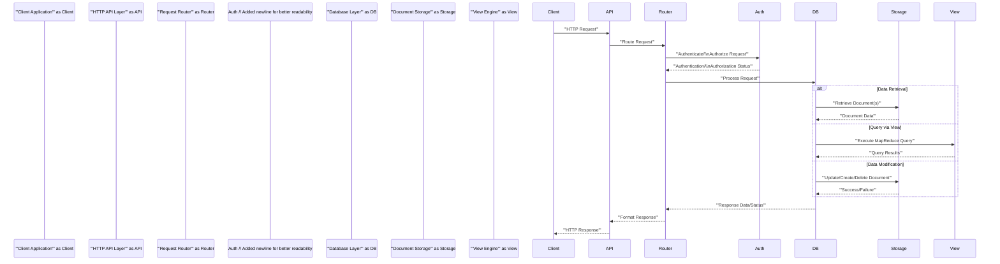

## Project Design Document: Apache CouchDB (Improved)

**1. Introduction**

This document provides an enhanced architectural design overview of Apache CouchDB, a NoSQL document database. It is specifically designed to serve as a robust foundation for subsequent threat modeling activities. This document details the key components, their interactions, and the data flow within the CouchDB system, with a greater emphasis on security-relevant aspects.

**2. Project Overview**

Apache CouchDB is an open-source, distributed, fault-tolerant, and schema-free document-oriented NoSQL database accessible via a RESTful HTTP API. It utilizes JSON for data storage, JavaScript for query definition through MapReduce, and achieves eventual consistency via Multi-Version Concurrency Control (MVCC) and asynchronous replication. Its design prioritizes resilience and scalability.

**3. Architectural Overview**

CouchDB's architecture is built around a central Erlang-based server responsible for managing data persistence, indexing mechanisms, and handling API requests.

```mermaid
graph LR
    subgraph "Client Applications"
        A["'Web Browser'"]
        B["'Mobile App'"]
        C["'Backend Service'"]
    end
    D["'HTTP Requests'"] --> E("'CouchDB Server'");
    E --> F("'Erlang VM'");
    F --> G("'HTTP API Layer'");
    G --> H("'Request Router'");
    H --> I("'Authentication/Authorization'");// More explicit name
    H --> J("'Database Layer'");
    J --> K("'Document Storage (B-tree)'");// Clarified storage type
    J --> L("'View Engine (MapReduce)'");
    L --> K;
    E --> M("'Replication Process'");
    M --> E;
    N["'Admin Tools'"] --> E;

    style A fill:#f9f,stroke:#333,stroke-width:2px
    style B fill:#ccf,stroke:#333,stroke-width:2px
    style C fill:#ccf,stroke:#333,stroke-width:2px
    style E fill:#bbb,stroke:#333,stroke-width:2px
    style F fill:#eee,stroke:#333,stroke-width:2px
    style G fill:#eee,stroke:#333,stroke-width:2px
    style H fill:#eee,stroke:#333,stroke-width:2px
    style I fill:#eee,stroke:#333,stroke-width:2px
    style J fill:#ddd,stroke:#333,stroke-width:2px
    style K fill:#ccc,stroke:#333,stroke-width:2px
    style L fill:#ccc,stroke:#333,stroke-width:2px
    style M fill:#eee,stroke:#333,stroke-width:2px
    style N fill:#ccf,stroke:#333,stroke-width:2px

```

**4. Component Description**

*   **Client Applications:**  Entities that interact with CouchDB to perform CRUD operations on data. This includes web browsers, mobile applications, and other server-side applications.
*   **HTTP Requests:** The standard communication protocol for interacting with CouchDB, utilizing methods like GET, POST, PUT, and DELETE. Security considerations include the use of HTTPS for encryption in transit.
*   **CouchDB Server:** The core Erlang process responsible for managing all aspects of the database, including request handling, data storage, indexing, and replication.
*   **Erlang VM:**  The runtime environment for CouchDB, providing concurrency, fault tolerance, and distribution capabilities. Security considerations related to the VM itself are generally handled by the Erlang ecosystem.
*   **HTTP API Layer:**  Exposes CouchDB's functionality through a RESTful interface. This layer is responsible for request parsing, response formatting (typically JSON), and routing. Security considerations include input validation and rate limiting.
*   **Request Router:**  Directs incoming HTTP requests to the appropriate handler based on the URL path. Proper routing is crucial to prevent unauthorized access to resources.
*   **Authentication/Authorization:**  Manages user authentication (verifying identity) and authorization (granting access to specific resources). CouchDB supports various authentication mechanisms, including Basic Authentication, Cookie Authentication, and OAuth. Authorization is typically role-based or based on database permissions.
*   **Database Layer:**  Handles the management of individual databases within CouchDB, including creation, deletion, and access control.
*   **Document Storage (B-tree):**  CouchDB uses an append-only B-tree structure to store JSON documents efficiently. Each document is identified by a unique ID and includes revision history due to MVCC. Security considerations include encryption at rest for sensitive data.
*   **View Engine (MapReduce):**  Allows for the creation of secondary indexes and the execution of complex queries using JavaScript-based Map and Reduce functions. Security considerations include potential risks associated with executing user-defined JavaScript code.
*   **Replication Process:** Enables the synchronization of databases between CouchDB instances. This is crucial for high availability, disaster recovery, and data distribution. Security considerations include secure communication channels and authentication between replicating nodes.
*   **Admin Tools:**  Provides interfaces (like the command-line tools and Fauxton) for managing the CouchDB server, databases, users, and replication settings. Access to these tools requires strong authentication and authorization.

**5. Data Flow**

A typical data flow for a client request involves these steps:

*   A client application initiates an HTTP request targeting the CouchDB server.
*   The HTTP API Layer receives the request and performs initial parsing and validation.
*   The Request Router analyzes the request URL to determine the intended resource and action.
*   The Authentication/Authorization module verifies the client's identity and checks if they have the necessary permissions to access the requested resource.
*   If authorized, the request is passed to the Database Layer.
*   For data retrieval:
    *   The Database Layer interacts with the Document Storage to fetch the requested document(s).
    *   Alternatively, for queries, the Database Layer utilizes the View Engine to execute the MapReduce functions and retrieve the results.
*   For data modification:
    *   The Database Layer interacts with the Document Storage to create, update, or delete documents, ensuring MVCC compliance.
*   The Database Layer returns the processed data or status to the HTTP API Layer.
*   The HTTP API Layer formats the response (typically in JSON) and sends it back to the client application.



**6. Security Considerations (Detailed)**

This section provides a more detailed overview of potential security considerations relevant for threat modeling.

*   **Authentication and Authorization:**
    *   **Threats:** Brute-force attacks on login credentials, weak password policies, privilege escalation due to misconfigured roles or permissions, session hijacking.
    *   **Considerations:** Strength of configured authentication mechanisms, enforcement of strong password policies, proper role-based access control configuration, secure session management (e.g., HTTPOnly and Secure flags on cookies).
*   **Data Confidentiality:**
    *   **Threats:** Unauthorized access to sensitive data, data breaches, exposure of data in transit or at rest.
    *   **Considerations:**  Enforcement of HTTPS for all communication, encryption at rest for sensitive databases or fields, proper key management practices, access control lists on databases and documents.
*   **Data Integrity:**
    *   **Threats:** Unauthorized modification or deletion of data, data corruption.
    *   **Considerations:**  Write access controls, audit logging of data modifications, ensuring data consistency across replicas, protection against intentional or accidental data corruption.
*   **Availability:**
    *   **Threats:** Denial-of-service (DoS) and distributed denial-of-service (DDoS) attacks, resource exhaustion, infrastructure failures.
    *   **Considerations:**  Rate limiting on API endpoints, input validation to prevent resource-intensive operations, proper resource allocation, redundancy and failover mechanisms, monitoring for anomalous activity.
*   **Input Validation:**
    *   **Threats:** Injection attacks (e.g., NoSQL injection, JavaScript injection in MapReduce functions), cross-site scripting (XSS) if data is rendered in web applications without proper sanitization.
    *   **Considerations:**  Strict input validation on all API endpoints, sanitization of user-provided data before storage and rendering, secure coding practices in MapReduce functions.
*   **API Security:**
    *   **Threats:**  Cross-site request forgery (CSRF), man-in-the-middle attacks, exposure of sensitive information in API responses, insecure default configurations.
    *   **Considerations:**  Implementation of CSRF protection mechanisms, enforcement of HTTPS, careful design of API endpoints to avoid exposing sensitive data unnecessarily, following security best practices for RESTful APIs.
*   **Replication Security:**
    *   **Threats:**  Unauthorized access to replication streams, man-in-the-middle attacks during replication, data corruption during replication.
    *   **Considerations:**  Authentication and authorization for replication processes, encryption of data during replication, secure configuration of replication channels.
*   **Administrative Access:**
    *   **Threats:**  Unauthorized access to administrative interfaces, use of default credentials, insecure remote access.
    *   **Considerations:**  Strong authentication for administrative users, restricting access to administrative interfaces to authorized networks, disabling default credentials, secure remote access methods (e.g., VPN).
*   **Dependency Management:**
    *   **Threats:**  Vulnerabilities in third-party libraries and dependencies used by CouchDB.
    *   **Considerations:**  Regularly updating dependencies to the latest secure versions, vulnerability scanning of dependencies.

**7. Assumptions and Out of Scope**

*   **Assumptions:**
    *   This document describes the general architectural principles of a typical CouchDB deployment.
    *   The focus is primarily on the server-side components and their interactions.
    *   Security best practices are assumed to be implemented at the operating system and network levels.
*   **Out of Scope:**
    *   Detailed implementation specifics of individual Erlang modules or functions.
    *   Specific deployment configurations (e.g., containerization, orchestration).
    *   Detailed design of specific client applications interacting with CouchDB.
    *   Performance tuning and optimization strategies.
    *   Security policies and procedures of the organization deploying CouchDB.
    *   Specific versions of CouchDB and their unique features (unless broadly applicable).

**8. Conclusion**

This improved design document provides a more comprehensive and security-focused overview of the Apache CouchDB architecture. By detailing the key components, data flow, and potential security considerations, this document serves as a valuable resource for conducting thorough threat modeling exercises and identifying potential vulnerabilities within the CouchDB system. The outlined security considerations should be further investigated and addressed to ensure a secure and resilient deployment.
