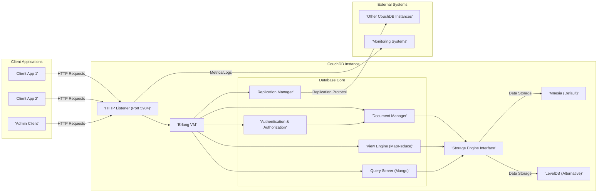

## Project Design Document: Apache CouchDB for Threat Modeling (Improved)

**1. Introduction**

This document provides an enhanced architectural overview of Apache CouchDB, a NoSQL document database, specifically designed for effective threat modeling. It details the core components, data flows, underlying technologies, and crucial security considerations to facilitate the identification of potential vulnerabilities and attack vectors. This document serves as a refined foundation for security assessments and will be the primary input for subsequent threat modeling activities.

**2. Project Overview**

Apache CouchDB is an open-source, document-oriented NoSQL database leveraging JSON for data storage, JavaScript for querying via MapReduce, and HTTP for its API. Its design emphasizes reliability, horizontal scalability, and ease of use. The schemaless nature allows for flexible data structures, and its multi-master replication capabilities are ideal for distributed and offline-first applications.

**3. System Architecture**

The following diagram provides a more detailed illustration of the architecture of a CouchDB instance:

**4. Key Components and Functionality (Detailed)**

*   **HTTP Listener (Port 5984):**
    *   The primary network interface for all external interactions.
    *   Accepts and processes incoming HTTP requests (GET, POST, PUT, DELETE, COPY, HEAD).
    *   Handles authentication challenges and session management.
    *   Routes requests to the appropriate internal CouchDB components based on the URL path.

*   **Erlang VM:**
    *   The robust and concurrent runtime environment for CouchDB, built upon the Erlang programming language.
    *   Provides fault tolerance, concurrency through lightweight processes, and distributed capabilities.

*   **Database Core:**
    *   **Document Manager:** Responsible for all operations related to individual documents (CRUD - Create, Read, Update, Delete). Manages document revisions and conflict resolution.
    *   **View Engine (MapReduce):** Executes JavaScript functions defined in design documents to create indexes and generate views of the data.
    *   **Query Server (Mango):** Provides a more declarative, JSON-based query language for retrieving documents based on specified criteria.
    *   **Replication Manager:** Oversees the process of synchronizing databases between CouchDB instances, handling conflict resolution and data transfer.
    *   **Authentication & Authorization:** Manages user authentication (verifying identity) and authorization (granting access to resources). Supports various authentication schemes and role-based access control.

*   **Storage Engine Interface:**
    *   An abstraction layer that allows CouchDB to utilize different storage backends.

*   **Mnesia (Default):**
    *   The default storage engine, a real-time distributed database management system native to Erlang. Suitable for smaller datasets and scenarios prioritizing consistency within a single node.

*   **LevelDB (Alternative):**
    *   A fast key-value storage library developed by Google, often used for larger datasets and scenarios where performance is critical.

**5. Data Flow (Enhanced)**

The following details the typical data flow within a CouchDB instance, highlighting security-relevant aspects:

*   **Document Creation:**
    *   A client application sends an HTTP POST request to the `/db_name` endpoint with the document data in JSON format.
    *   The **HTTP Listener** receives the request and may perform initial checks (e.g., rate limiting, basic authentication).
    *   The request is passed to the **Authentication & Authorization** module for verification.
    *   If authorized, the request is forwarded to the **Document Manager**.
    *   The **Document Manager** validates the JSON structure, assigns a unique `_id` (if not provided), and generates an initial `_rev` (revision token).
    *   The document is written to the underlying **Storage Engine** (Mnesia or LevelDB).
    *   The **View Engine** and **Query Server** update relevant indexes based on the new document.
    *   A success response (HTTP 201 Created) is returned to the client, including the new `_id` and `_rev`.

*   **Document Retrieval:**
    *   A client application sends an HTTP GET request to the `/db_name/document_id` endpoint.
    *   The **HTTP Listener** receives the request and performs necessary checks.
    *   The **Authentication & Authorization** module verifies the client's access rights to the specified document.
    *   If authorized, the request is passed to the **Document Manager**.
    *   The **Document Manager** retrieves the document from the **Storage Engine**.
    *   The document is returned to the client in JSON format (HTTP 200 OK).

*   **Document Update:**
    *   A client application sends an HTTP PUT request to the `/db_name/document_id` endpoint with the updated document data, *including the current `_rev`*.
    *   The **HTTP Listener** receives the request and performs initial checks.
    *   The **Authentication & Authorization** module verifies the client's update rights.
    *   The request is passed to the **Document Manager**.
    *   The **Document Manager** *verifies the provided `_rev` to prevent lost updates*.
    *   If the `_rev` matches the current revision, the document is updated in the **Storage Engine**, creating a new revision and updating the `_rev`.
    *   Indexes are updated by the **View Engine** and **Query Server**.
    *   A success response (HTTP 201 Created or HTTP 200 OK) with the new `_rev` is returned.

*   **Document Deletion:**
    *   A client application sends an HTTP DELETE request to the `/db_name/document_id` endpoint, *including the current `_rev`*.
    *   The **HTTP Listener** receives the request and performs initial checks.
    *   The **Authentication & Authorization** module verifies the client's deletion rights.
    *   The request is passed to the **Document Manager**.
    *   The **Document Manager** *verifies the provided `_rev`*.
    *   If the `_rev` matches, the document is marked as deleted in the **Storage Engine** (a tombstone document is created).
    *   Indexes are updated.
    *   A success response (HTTP 200 OK) is returned.

*   **Replication:**
    *   A replication process is initiated, either through the API or configuration.
    *   The **Replication Manager** on the source CouchDB instance authenticates with the target instance.
    *   The source instance enumerates changes in the specified database since the last replication (or from the beginning).
    *   Changes (documents and their revisions) are transferred to the target CouchDB instance via the replication protocol (typically HTTP).
    *   The **Replication Manager** on the target instance applies the changes, resolving conflicts if necessary.

**6. Key Technologies and Dependencies (Security Implications)**

*   **Erlang/OTP:** The foundation of CouchDB. Security vulnerabilities in the Erlang VM or OTP libraries could directly impact CouchDB.
*   **HTTP:** The primary communication protocol. Proper HTTPS configuration is critical to prevent eavesdropping and tampering.
*   **JSON:** The data serialization format. Vulnerabilities in JSON parsing libraries could be exploited.
*   **JavaScript (for MapReduce):**  Untrusted JavaScript code execution within the CouchDB server is a significant security risk if not properly sandboxed or if vulnerabilities exist in the JavaScript engine.
*   **Mnesia/LevelDB:** Security vulnerabilities in the underlying storage engines could lead to data breaches or corruption.
*   **Mozilla SpiderMonkey (JavaScript Engine):**  The specific version of the JavaScript engine used by CouchDB needs to be monitored for vulnerabilities.
*   **cURL (for HTTP requests in replication):** Vulnerabilities in the cURL library could be exploited during replication.

**7. Security Considerations (Expanded)**

*   **Authentication:**
    *   CouchDB supports per-database authentication, where users are specific to a database.
    *   The `_users` database stores user credentials. Its security is paramount.
    *   Consider using strong password policies and multi-factor authentication where possible (often implemented at the application layer in front of CouchDB).
    *   Regularly review and rotate API keys or tokens if used for authentication.

*   **Authorization:**
    *   Role-based access control (RBAC) allows for granular control over who can access and modify data.
    *   Carefully define roles and assign appropriate permissions to users.
    *   The `_security` object within each database defines access control lists (ACLs).

*   **Data Protection:**
    *   **Encryption in Transit (TLS/SSL):** Enforce HTTPS for all client and inter-node communication. Properly configure TLS certificates and protocols.
    *   **Encryption at Rest:** CouchDB does not natively provide encryption at rest. Implement encryption at the filesystem level (e.g., LUKS, dm-crypt) or use cloud provider encryption services.

*   **Network Security:**
    *   Implement firewalls to restrict access to port 5984 to only trusted sources.
    *   Consider using a reverse proxy for added security and load balancing.
    *   Isolate CouchDB instances within private networks where possible.

*   **Input Validation and Sanitization:**
    *   While CouchDB validates JSON structure, applications interacting with CouchDB must implement robust input validation and sanitization to prevent injection attacks (e.g., NoSQL injection).

*   **Rate Limiting:**
    *   Implement rate limiting to prevent denial-of-service attacks by limiting the number of requests from a single source. This can be done at the reverse proxy or application layer.

*   **Output Encoding:**
    *   Ensure proper output encoding to prevent cross-site scripting (XSS) vulnerabilities if CouchDB data is displayed in web applications.

*   **Replication Security:**
    *   Secure replication endpoints with authentication.
    *   Encrypt replication traffic, especially over untrusted networks.
    *   Carefully manage replication credentials.

*   **Administration Interface Security:**
    *   Restrict access to Futon/Fauxton to authorized administrators only.
    *   Disable or secure the administrative interface in production environments if not needed.

*   **Regular Security Audits and Updates:**
    *   Regularly audit CouchDB configurations and access controls.
    *   Keep CouchDB and its dependencies up-to-date with the latest security patches. Subscribe to security mailing lists and monitor for vulnerabilities.

**8. Deployment Architecture (Threat Surface Considerations)**

*   **Single Server Deployment:**  A single point of failure. If compromised, all data is at risk. The attack surface includes the server OS, CouchDB itself, and network access to the server.
*   **Clustered Deployment:** Increases availability and scalability but also expands the attack surface. Security needs to be configured across all nodes, and inter-node communication must be secured.
*   **Cloud Deployment:** Security responsibilities are shared with the cloud provider. Ensure proper configuration of cloud security features (e.g., network security groups, access control policies, encryption). Be aware of the cloud provider's security posture.

**9. Potential Threat Areas (Categorized)**

*   **Authentication and Authorization Vulnerabilities:**
    *   Bypass authentication mechanisms.
    *   Privilege escalation.
    *   Credential theft or compromise.
    *   Unauthorized access to databases or documents.

*   **Data Manipulation and Integrity Threats:**
    *   NoSQL injection attacks.
    *   Data tampering or corruption.
    *   Unauthorized data modification or deletion.

*   **Availability Threats (Denial of Service):**
    *   Resource exhaustion attacks.
    *   Network flooding.
    *   Exploiting vulnerabilities that cause crashes or hangs.

*   **Information Disclosure:**
    *   Unauthorized access to sensitive data due to misconfigurations.
    *   Data leaks through insecure replication.
    *   Exposure of sensitive information in error messages or logs.

*   **Remote Code Execution (RCE):**
    *   Exploiting vulnerabilities in CouchDB, Erlang, or JavaScript engine to execute arbitrary code on the server.

*   **Replication-Specific Threats:**
    *   Man-in-the-middle attacks on replication traffic.
    *   Unauthorized replication leading to data breaches.
    *   Injection of malicious data through replication.

*   **Supply Chain Vulnerabilities:**
    *   Compromised dependencies or third-party libraries.

**10. Conclusion**

This improved design document provides a more detailed and security-focused architectural overview of Apache CouchDB. By understanding these components, data flows, and security considerations, security professionals can conduct more thorough and effective threat modeling exercises. This document serves as a critical input for identifying potential vulnerabilities and developing robust mitigation strategies to secure applications utilizing Apache CouchDB.