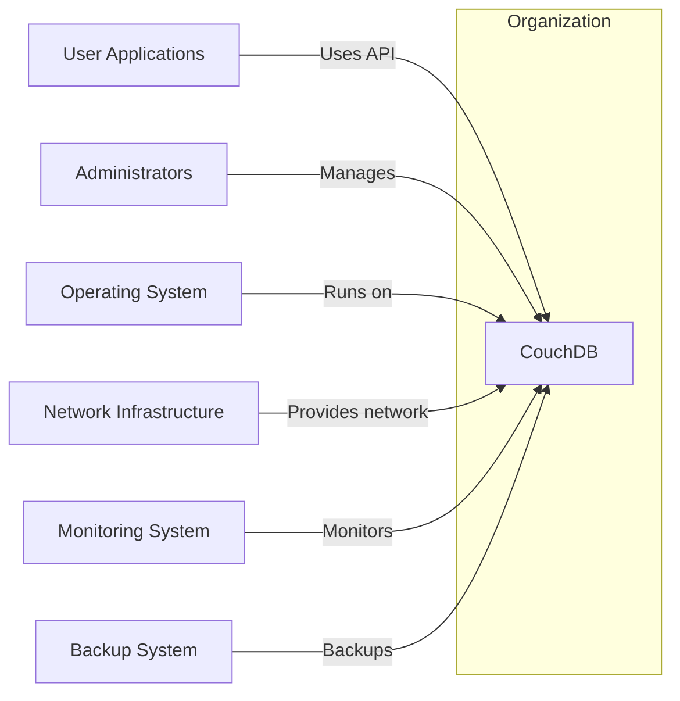
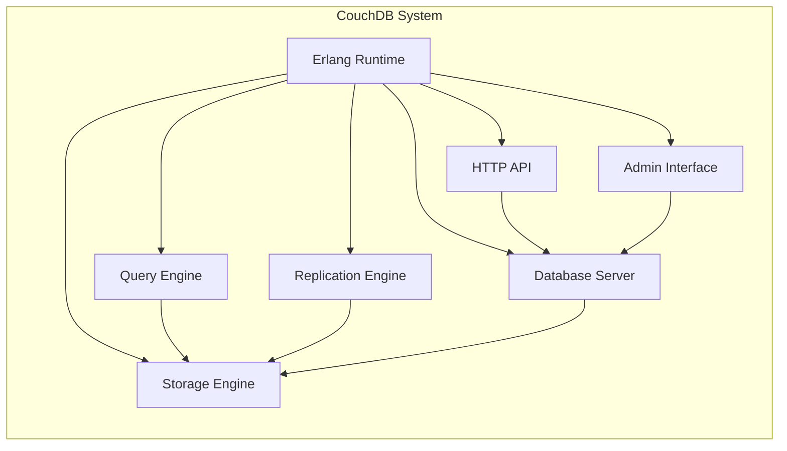
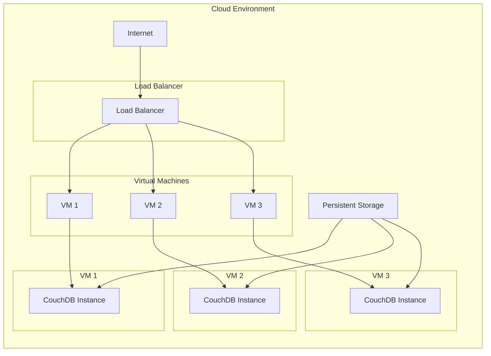
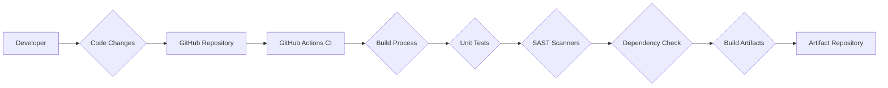

# BUSINESS POSTURE

This project aims to provide a robust, scalable, and fault-tolerant NoSQL database solution. The primary business priority is to offer a reliable data storage and retrieval system that can be used in a wide range of applications, from web applications to mobile apps and IoT devices. Key business goals include:

- Providing a flexible and schema-less data model.
- Ensuring high availability and data durability.
- Offering easy scalability to handle growing data volumes and user traffic.
- Supporting offline and mobile applications through replication capabilities.
- Enabling efficient data querying and indexing.

The most important business risks that need to be addressed are:

- Data loss due to system failures or disasters.
- Unauthorized access to sensitive data.
- Data corruption or integrity issues.
- Performance bottlenecks and service disruptions.
- Compliance violations with data privacy regulations.

# SECURITY POSTURE

Existing security controls:

- security control: Access control lists (ACLs) for database and document level authorization. (Implemented within CouchDB core)
- security control: Authentication mechanisms including username/password and cookie-based authentication. (Implemented within CouchDB core)
- security control: HTTPS support for encrypted communication. (Requires external configuration of web server or load balancer)
- security control: Role-based access control (RBAC). (Implemented within CouchDB core)
- security control: Input validation on API endpoints to prevent injection attacks. (Implemented within CouchDB core)
- accepted risk: Reliance on external infrastructure for network security and physical security of servers.
- accepted risk: Complexity of configuration can lead to misconfigurations and security vulnerabilities.

Recommended security controls:

- security control: Implement audit logging to track access and modifications to data and system configurations.
- security control: Integrate with external authentication providers (e.g., LDAP, OAuth 2.0) for centralized user management.
- security control: Regularly perform security vulnerability scanning and penetration testing.
- security control: Implement database encryption at rest to protect data stored on disk.
- security control: Enhance input validation and sanitization to cover a wider range of potential injection vectors.

Security requirements:

- Authentication:
    - Requirement: The system must authenticate users before granting access to data or administrative functions.
    - Requirement: Support for strong password policies and multi-factor authentication should be considered.
    - Requirement: Securely store and manage user credentials.

- Authorization:
    - Requirement: The system must enforce granular access control to ensure users can only access data and perform actions they are authorized for.
    - Requirement: Role-based access control should be implemented to simplify user management and authorization.
    - Requirement: Principle of least privilege should be applied to all users and processes.

- Input Validation:
    - Requirement: All user inputs, especially those from external sources (API requests, user interfaces), must be validated to prevent injection attacks (e.g., SQL injection, NoSQL injection, command injection).
    - Requirement: Input validation should be performed on both the client-side and server-side.
    - Requirement: Sanitize user inputs before storing them in the database to prevent cross-site scripting (XSS) attacks.

- Cryptography:
    - Requirement: Sensitive data in transit must be encrypted using HTTPS.
    - Requirement: Consider encryption at rest for sensitive data stored in the database.
    - Requirement: Use strong cryptographic algorithms and protocols.
    - Requirement: Securely manage cryptographic keys.

# DESIGN

## C4 CONTEXT

Context Diagram Elements:

- Element:
    - Name: User Applications
    - Type: System
    - Description: Applications developed by users or third-parties that utilize CouchDB to store and retrieve data. These applications can be web applications, mobile apps, or backend services.
    - Responsibilities: Interacting with CouchDB API to perform CRUD operations on data, presenting data to end-users, and enforcing application-level business logic.
    - Security controls: Application-level authentication and authorization, input validation, secure coding practices.

- Element:
    - Name: Administrators
    - Type: Person
    - Description: Individuals responsible for installing, configuring, managing, and maintaining the CouchDB system.
    - Responsibilities: System installation, configuration, user management, performance monitoring, backups, security patching, and troubleshooting.
    - Security controls: Strong authentication credentials, role-based access control to administrative functions, audit logging of administrative actions.

- Element:
    - Name: CouchDB
    - Type: System
    - Description: The Apache CouchDB NoSQL database system, providing document storage, retrieval, and management capabilities.
    - Responsibilities: Storing and managing JSON documents, providing API for data access, handling data replication, indexing data for efficient queries, and ensuring data consistency and availability.
    - Security controls: Authentication, authorization, input validation, HTTPS support, access control lists, role-based access control.

- Element:
    - Name: Operating System
    - Type: System
    - Description: The underlying operating system (e.g., Linux, Windows, macOS) on which CouchDB is installed and runs.
    - Responsibilities: Providing system resources (CPU, memory, disk), managing processes, handling network communication, and providing basic security features.
    - Security controls: Operating system hardening, access control, security patching, firewall, intrusion detection system.

- Element:
    - Name: Network Infrastructure
    - Type: System
    - Description: The network infrastructure (routers, switches, firewalls, load balancers) that connects CouchDB to users and other systems.
    - Responsibilities: Providing network connectivity, routing traffic, load balancing, and enforcing network security policies.
    - Security controls: Firewall rules, network segmentation, intrusion prevention system, DDoS protection.

- Element:
    - Name: Monitoring System
    - Type: System
    - Description: A system used to monitor the health, performance, and security of the CouchDB system and its underlying infrastructure.
    - Responsibilities: Collecting metrics, logging events, alerting administrators to issues, and providing dashboards for visualization.
    - Security controls: Secure access to monitoring data, secure communication channels, access control for monitoring system.

- Element:
    - Name: Backup System
    - Type: System
    - Description: A system responsible for backing up CouchDB data to ensure data recovery in case of failures or disasters.
    - Responsibilities: Regularly backing up CouchDB data, storing backups securely, and providing mechanisms for data restoration.
    - Security controls: Encryption of backups, secure storage of backups, access control to backups.

## C4 CONTAINER

Container Diagram Elements:

- Element:
    - Name: Erlang Runtime
    - Type: Container
    - Description: The Erlang virtual machine that provides the runtime environment for CouchDB, handling concurrency, distribution, and fault tolerance.
    - Responsibilities: Process management, memory management, inter-process communication, and providing core Erlang libraries.
    - Security controls: Operating system level security controls, resource limits, security updates for Erlang runtime.

- Element:
    - Name: Database Server
    - Type: Container
    - Description: The core CouchDB server process responsible for managing databases, documents, and user requests.
    - Responsibilities: Handling API requests, managing database metadata, enforcing access control, coordinating with other containers, and managing data consistency.
    - Security controls: Authentication, authorization, input validation, access control lists, role-based access control, audit logging.

- Element:
    - Name: Query Engine
    - Type: Container
    - Description:  Component responsible for processing queries against the stored data, including MapReduce and search queries.
    - Responsibilities: Parsing queries, optimizing query execution, retrieving data from storage engine, and returning query results.
    - Security controls: Query sanitization, resource limits for queries, access control to query functions.

- Element:
    - Name: Replication Engine
    - Type: Container
    - Description: Handles data replication between CouchDB instances, enabling high availability and data distribution.
    - Responsibilities: Synchronizing data between databases, handling conflict resolution, and ensuring data consistency across replicas.
    - Security controls: Secure replication protocol (HTTPS), authentication and authorization for replication, encryption of data during replication.

- Element:
    - Name: HTTP API
    - Type: Container
    - Description: Provides the primary interface for interacting with CouchDB, exposing RESTful API endpoints for data access and management.
    - Responsibilities: Receiving HTTP requests, routing requests to appropriate components, handling authentication and authorization, and returning HTTP responses.
    - Security controls: HTTPS encryption, input validation, rate limiting, API authentication and authorization.

- Element:
    - Name: Admin Interface
    - Type: Container
    - Description: A web-based interface for administrative tasks such as database management, user management, and configuration.
    - Responsibilities: Providing a user-friendly interface for administrators to manage CouchDB, performing administrative actions based on user input.
    - Security controls: Authentication, authorization, secure session management, input validation, protection against cross-site scripting (XSS) and cross-site request forgery (CSRF).

- Element:
    - Name: Storage Engine
    - Type: Container
    - Description: Responsible for the physical storage of data on disk, including indexing and data retrieval.
    - Responsibilities: Writing data to disk, reading data from disk, managing indexes, ensuring data durability and consistency at the storage level.
    - Security controls: File system permissions, disk encryption, data integrity checks.

## DEPLOYMENT

Deployment Solution: Clustered Deployment on Virtual Machines

Description: CouchDB is deployed as a cluster across multiple virtual machines (VMs) in a cloud environment. A load balancer distributes traffic across the CouchDB nodes. Each VM runs a CouchDB instance and relies on the underlying cloud infrastructure for networking and storage.

Deployment Diagram Elements:

- Element:
    - Name: Load Balancer
    - Type: Infrastructure
    - Description: A load balancer distributes incoming traffic across multiple CouchDB instances to ensure high availability and scalability.
    - Responsibilities: Distributing traffic, health checking CouchDB instances, and providing a single entry point to the CouchDB cluster.
    - Security controls: HTTPS termination, DDoS protection, access control lists, security monitoring.

- Element:
    - Name: VM 1, VM 2, VM 3
    - Type: Infrastructure
    - Description: Virtual machines running in a cloud environment, each hosting a CouchDB instance.
    - Responsibilities: Providing compute resources, network connectivity, and isolation for CouchDB instances.
    - Security controls: VM hardening, security patching, access control, security monitoring.

- Element:
    - Name: CouchDB Instance (CDB1, CDB2, CDB3)
    - Type: Container Instance
    - Description: Instances of the CouchDB software running within each virtual machine.
    - Responsibilities: Storing and managing data, handling API requests, participating in cluster replication, and providing database services.
    - Security controls: CouchDB security configurations (authentication, authorization, etc.), operating system level security controls within the VM.

- Element:
    - Name: Persistent Storage
    - Type: Infrastructure
    - Description: Persistent storage volumes attached to the VMs to store CouchDB data.
    - Responsibilities: Providing durable storage for CouchDB data, ensuring data persistence across VM restarts.
    - Security controls: Storage encryption, access control lists, data backups.

- Element:
    - Name: Internet
    - Type: External
    - Description: Represents external users and applications accessing CouchDB over the internet.
    - Responsibilities: Sending requests to CouchDB, receiving responses, and interacting with the CouchDB API.
    - Security controls: Client-side security controls, secure communication protocols (HTTPS).

## BUILD

Build Process Description:

1. Developer: Developers write code and make changes.
2. Code Changes: Code changes are committed and pushed to the GitHub repository.
3. GitHub Repository: The central repository hosting the CouchDB source code.
4. GitHub Actions CI: GitHub Actions is used as the CI/CD system to automate the build process.
5. Build Process: The build process compiles the code, builds binaries, and packages the software. This includes compiling Erlang and C code, and building JavaScript components.
6. Unit Tests: Automated unit tests are executed to ensure code quality and functionality.
7. SAST Scanners: Static Application Security Testing (SAST) scanners are used to analyze the source code for potential security vulnerabilities.
8. Dependency Check: Dependencies are checked for known vulnerabilities using dependency scanning tools.
9. Build Artifacts: Successful build process produces build artifacts, such as binaries, packages (e.g., Debian packages, RPM packages), and Docker images.
10. Artifact Repository: Build artifacts are stored in an artifact repository (e.g., GitHub Packages, Docker Hub, or a dedicated artifact repository).

Build Security Controls:

- security control: Secure coding practices are followed by developers.
- security control: Code reviews are performed to identify potential security issues and code quality problems.
- security control: Automated build process using GitHub Actions to ensure consistency and repeatability.
- security control: Unit tests to verify functionality and prevent regressions.
- security control: Static Application Security Testing (SAST) scanners integrated into the build pipeline to detect vulnerabilities in source code.
- security control: Dependency scanning to identify and manage vulnerable dependencies.
- security control: Build environment security - using secure and hardened build agents.
- security control: Signing of build artifacts to ensure integrity and authenticity.
- security control: Access control to the artifact repository to restrict access to authorized users and systems.
- security control: Regular security updates of build tools and dependencies.

# RISK ASSESSMENT

Critical business processes we are trying to protect:

- Data storage and retrieval for user applications.
- Data replication for high availability and disaster recovery.
- Database administration and management.
- Software updates and patching.

Data we are trying to protect and their sensitivity:

- User data stored in documents: Sensitivity varies depending on the application, could include Personally Identifiable Information (PII), financial data, health records, etc. Sensitivity level: High to Confidential.
- Database credentials and access keys: Used for authentication and authorization. Sensitivity level: Critical.
- System configuration data: Sensitive information about system setup and security configurations. Sensitivity level: High.
- Audit logs: Contain information about user activity and system events, potentially sensitive for compliance and security monitoring. Sensitivity level: Medium to High.
- Backup data: Contains copies of all data, inherits the sensitivity of the original data. Sensitivity level: High to Confidential.

# QUESTIONS & ASSUMPTIONS

Questions:

- What are the specific compliance requirements for CouchDB deployments (e.g., GDPR, HIPAA, PCI DSS)?
- What are the expected performance and scalability requirements for the CouchDB system?
- What are the specific use cases and applications that will be using CouchDB?
- What is the organization's risk appetite regarding data security and system availability?
- Are there any existing security policies or standards that CouchDB deployment must adhere to?
- What are the preferred methods for monitoring and logging within the organization?

Assumptions:

- CouchDB will be used to store sensitive user data.
- High availability and data durability are critical requirements.
- Security is a high priority for the organization.
- The organization has a cloud-first strategy and prefers cloud-based deployments.
- The organization has a mature DevOps practice and utilizes CI/CD pipelines.
- The organization is willing to invest in security controls to mitigate identified risks.