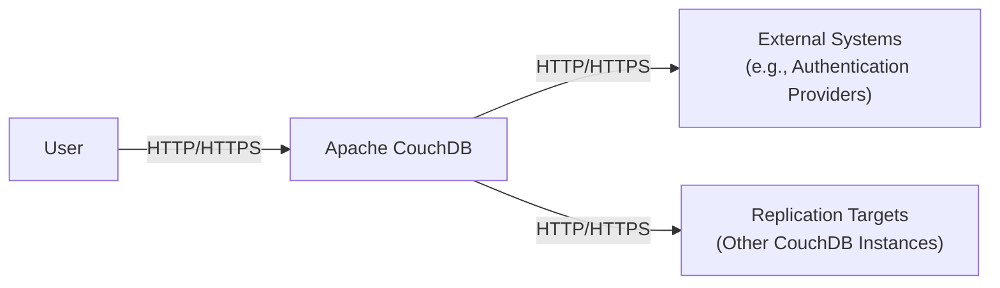
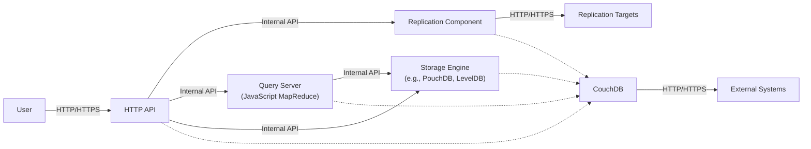
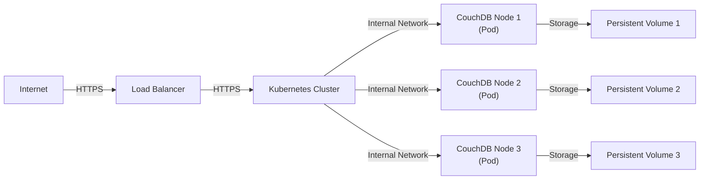
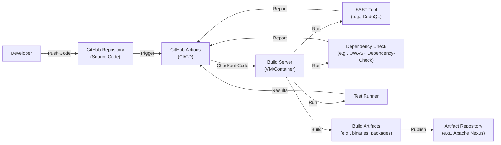

# BUSINESS POSTURE

Apache CouchDB is an open-source, document-oriented NoSQL database that uses JSON to store data, JavaScript as its query language using MapReduce, and HTTP for an API. It is designed for reliability, scalability, and ease of use. Given its nature and the Apache Foundation's backing, the business posture can be inferred as follows:

Priorities and Goals:

*   Provide a robust, reliable, and scalable database solution suitable for web and mobile applications.
*   Ensure data consistency and availability, even in distributed environments.
*   Offer an easy-to-use and developer-friendly database system.
*   Foster a strong open-source community around the project.
*   Maintain compatibility with various platforms and environments.
*   Continuous improvement and adaptation to evolving web and application development needs.

Business Risks:

*   Data Breaches: Unauthorized access to sensitive data stored in CouchDB instances.
*   Data Loss: Loss of data due to hardware failures, software bugs, or operational errors.
*   Service Downtime: Unavailability of the database, leading to application outages.
*   Performance Bottlenecks: Slow query performance or database responsiveness under heavy load.
*   Compliance Violations: Failure to meet regulatory requirements related to data storage and privacy.
*   Community Fragmentation: Loss of developer interest or a split in the open-source community.
*   Technology Obsolescence: Failure to keep up with advancements in database technology.

# SECURITY POSTURE

Existing Security Controls:

*   security control: Authentication: CouchDB supports various authentication mechanisms, including cookie-based, basic authentication, and OAuth. It also allows integration with external authentication providers. Described in documentation and implemented in code.
*   security control: Authorization: CouchDB provides a role-based access control system, allowing administrators to define permissions for users and roles. Described in documentation and implemented in code.
*   security control: HTTPS Support: CouchDB can be configured to use HTTPS, encrypting communication between clients and the server. Described in documentation.
*   security control: Input Validation: While CouchDB itself doesn't perform extensive input validation (as it stores JSON documents), validation can be implemented using validation functions within design documents. Described in documentation and implemented in code.
*   security control: _security object: Each database has a _security object that defines reader and admin roles. Described in documentation and implemented in code.

Accepted Risks:

*   accepted risk: Default Configuration: CouchDB's default configuration may not be secure for production environments, requiring administrators to properly configure security settings.
*   accepted risk: JavaScript Security: The use of JavaScript for MapReduce and validation functions introduces potential security risks if not carefully managed.
*   accepted risk: No built-in encryption at rest: CouchDB does not natively encrypt data at rest.

Recommended Security Controls:

*   security control: Encryption at Rest: Implement full-disk encryption or database-level encryption to protect data stored on disk.
*   security control: Auditing: Enable comprehensive audit logging to track database access and changes.
*   security control: Regular Security Updates: Establish a process for promptly applying security patches and updates.
*   security control: Network Segmentation: Isolate CouchDB instances within a secure network segment to limit exposure.
*   security control: Intrusion Detection/Prevention: Deploy intrusion detection and prevention systems to monitor for malicious activity.
*   security control: Enhanced Input Validation: Implement robust input validation using validation functions and consider external validation services.

Security Requirements:

*   Authentication:
    *   Support strong password policies.
    *   Implement multi-factor authentication (MFA).
    *   Integrate with existing enterprise identity providers (e.g., LDAP, Active Directory).
*   Authorization:
    *   Implement granular, role-based access control (RBAC).
    *   Follow the principle of least privilege.
    *   Regularly review and update access permissions.
*   Input Validation:
    *   Validate all data received from clients.
    *   Sanitize data to prevent injection attacks.
    *   Use a whitelist approach to validation where possible.
*   Cryptography:
    *   Use strong, industry-standard cryptographic algorithms.
    *   Securely manage cryptographic keys.
    *   Encrypt data in transit using TLS/SSL.
    *   Consider encrypting sensitive data at rest.

# DESIGN

## C4 CONTEXT

Element Descriptions:

*   Element:
    *   Name: User
    *   Type: Person
    *   Description: Represents a user interacting with CouchDB, either directly or through an application.
    *   Responsibilities: Accessing data, querying data, modifying data.
    *   Security controls: Authentication, Authorization.

*   Element:
    *   Name: Apache CouchDB
    *   Type: Software System
    *   Description: The core CouchDB database system.
    *   Responsibilities: Storing data, processing queries, managing replication.
    *   Security controls: Authentication, Authorization, HTTPS Support, Input Validation (via design documents).

*   Element:
    *   Name: External Systems
    *   Type: Software System
    *   Description: External systems that CouchDB interacts with, such as authentication providers (LDAP, OAuth providers).
    *   Responsibilities: Providing authentication services, potentially other integrations.
    *   Security controls: Dependent on the specific external system.

*   Element:
    *   Name: Replication Targets
    *   Type: Software System
    *   Description: Other CouchDB instances that data is replicated to.
    *   Responsibilities: Receiving and storing replicated data.
    *   Security controls: Authentication, Authorization, HTTPS Support.

## C4 CONTAINER

Element Descriptions:

*   Element:
    *   Name: User
    *   Type: Person
    *   Description: Represents a user interacting with CouchDB.
    *   Responsibilities: Accessing and manipulating data.
    *   Security controls: Authentication, Authorization (handled by HTTP API).

*   Element:
    *   Name: HTTP API
    *   Type: API
    *   Description: The primary interface for interacting with CouchDB.
    *   Responsibilities: Handling HTTP requests, authentication, authorization, routing requests to other components.
    *   Security controls: Authentication, Authorization, HTTPS Support.

*   Element:
    *   Name: Replication Component
    *   Type: Component
    *   Description: Handles replication between CouchDB instances.
    *   Responsibilities: Managing data synchronization with other CouchDB databases.
    *   Security controls: Authentication, Authorization (for replication connections), HTTPS Support.

*   Element:
    *   Name: Query Server (JavaScript MapReduce)
    *   Type: Component
    *   Description: Executes MapReduce queries written in JavaScript.
    *   Responsibilities: Processing queries, generating views.
    *   Security controls: Input Validation (within design documents), Sandboxing (to limit JavaScript execution risks).

*   Element:
    *   Name: Storage Engine (e.g., PouchDB, LevelDB)
    *   Type: Component
    *   Description: Handles the underlying storage of data.
    *   Responsibilities: Persisting data to disk, retrieving data.
    *   Security controls: Access controls (managed by higher-level components), Encryption at Rest (if implemented).

*   Element:
    *   Name: External Systems
    *   Type: Software System
    *   Description: External systems, such as authentication providers.
    *   Responsibilities: Varies depending on the system.
    *   Security controls: Dependent on the specific external system.

*   Element:
    *   Name: Replication Targets
    *   Type: Software System
    *   Description: Other CouchDB instances involved in replication.
    *   Responsibilities: Receiving and storing replicated data.
    *   Security controls: Authentication, Authorization, HTTPS Support.

*   Element:
    *   Name: CouchDB
    *   Type: Software System
    *   Description: The core CouchDB database system.
    *   Responsibilities: Overall system coordination.
    *   Security controls: Aggregation of controls from contained components.

## DEPLOYMENT

Possible Deployment Solutions:

1.  Single Server Deployment: Simplest setup, suitable for development or small-scale deployments.
2.  Clustered Deployment: Multiple CouchDB nodes configured as a cluster for high availability and scalability.
3.  Cloud-Based Deployment: Using managed CouchDB services like IBM Cloudant or deploying CouchDB on cloud infrastructure (e.g., AWS, Azure, GCP).
4.  Containerized Deployment: Deploying CouchDB using Docker and Kubernetes.

Chosen Solution: Containerized Deployment using Docker and Kubernetes.

Element Descriptions:

*   Element:
    *   Name: Internet
    *   Type: Network
    *   Description: The public internet.
    *   Responsibilities: Routing traffic to the load balancer.
    *   Security controls: Firewall, DDoS protection (typically provided by the cloud provider or network infrastructure).

*   Element:
    *   Name: Load Balancer
    *   Type: Infrastructure
    *   Description: Distributes incoming traffic across multiple CouchDB nodes.
    *   Responsibilities: Load balancing, SSL termination.
    *   Security controls: HTTPS configuration, access control lists.

*   Element:
    *   Name: Kubernetes Cluster
    *   Type: Infrastructure
    *   Description: The Kubernetes cluster managing the CouchDB deployment.
    *   Responsibilities: Orchestrating containers, managing resources, providing networking.
    *   Security controls: Kubernetes RBAC, network policies, pod security policies.

*   Element:
    *   Name: CouchDB Node 1 (Pod)
    *   Type: Container
    *   Description: A single instance of CouchDB running within a Kubernetes pod.
    *   Responsibilities: Storing data, processing requests.
    *   Security controls: Container image security, resource limits, network policies.

*   Element:
    *   Name: CouchDB Node 2 (Pod)
    *   Type: Container
    *   Description: A single instance of CouchDB running within a Kubernetes pod.
    *   Responsibilities: Storing data, processing requests.
    *   Security controls: Container image security, resource limits, network policies.

*   Element:
    *   Name: CouchDB Node 3 (Pod)
    *   Type: Container
    *   Description: A single instance of CouchDB running within a Kubernetes pod.
    *   Responsibilities: Storing data, processing requests.
    *   Security controls: Container image security, resource limits, network policies.

*   Element:
    *   Name: Persistent Volume 1
    *   Type: Storage
    *   Description: Persistent storage for CouchDB Node 1.
    *   Responsibilities: Providing durable storage for data.
    *   Security controls: Encryption at rest (if configured), access controls (managed by Kubernetes).

*   Element:
    *   Name: Persistent Volume 2
    *   Type: Storage
    *   Description: Persistent storage for CouchDB Node 2.
    *   Responsibilities: Providing durable storage for data.
    *   Security controls: Encryption at rest (if configured), access controls (managed by Kubernetes).

*   Element:
    *   Name: Persistent Volume 3
    *   Type: Storage
    *   Description: Persistent storage for CouchDB Node 3.
    *   Responsibilities: Providing durable storage for data.
    *   Security controls: Encryption at rest (if configured), access controls (managed by Kubernetes).

## BUILD

The build process for Apache CouchDB involves compiling the source code, running tests, and packaging the software for distribution.  While the specifics can vary, a typical build process, incorporating security controls, is described below.  This process leverages GitHub Actions for CI/CD.

Build Process Description:

1.  Developer pushes code changes to the GitHub repository.
2.  This triggers a GitHub Actions workflow.
3.  GitHub Actions spins up a build server (VM or container).
4.  The build server checks out the source code from the repository.
5.  A Static Application Security Testing (SAST) tool (e.g., CodeQL) is run to analyze the code for vulnerabilities.
6.  A dependency check tool (e.g., OWASP Dependency-Check) is run to identify known vulnerabilities in project dependencies.
7.  The build process compiles the source code.
8.  Unit tests and integration tests are executed.
9.  If all tests pass and security checks are satisfactory, build artifacts (binaries, packages) are created.
10. The artifacts are published to an artifact repository (e.g., Apache Nexus, or directly to releases within GitHub).

Security Controls:

*   security control: SAST: Static analysis of the source code to identify potential vulnerabilities.
*   security control: Dependency Scanning: Checking for known vulnerabilities in project dependencies.
*   security control: Code Signing: Build artifacts can be digitally signed to ensure authenticity and integrity.
*   security control: Build Automation: Using a CI/CD system (GitHub Actions) ensures a consistent and repeatable build process.
*   security control: Least Privilege: Build servers should run with minimal necessary privileges.
*   security control: Immutable Infrastructure: Build servers should be treated as immutable, with new instances created for each build.

# RISK ASSESSMENT

Critical Business Processes:

*   Data Storage and Retrieval: The core function of CouchDB is to reliably store and retrieve data. Any disruption to this process is critical.
*   Data Replication: Ensuring data consistency and availability across multiple nodes or data centers is crucial for many applications.
*   Application Functionality: Many applications rely on CouchDB as their backend database.  Outages or data loss can directly impact application functionality.

Data Sensitivity:

*   The sensitivity of data stored in CouchDB depends entirely on the application using it.  CouchDB can store anything from publicly available data to highly sensitive personal or financial information.
*   Examples:
    *   Low Sensitivity: Publicly available documents, website content.
    *   Medium Sensitivity: User profiles, application settings, internal documents.
    *   High Sensitivity: Personally Identifiable Information (PII), financial records, healthcare data.

# QUESTIONS & ASSUMPTIONS

Questions:

*   What specific compliance requirements (e.g., GDPR, HIPAA, PCI DSS) apply to applications using CouchDB in different contexts?
*   What are the specific performance requirements and expected load for CouchDB deployments?
*   What are the existing disaster recovery and business continuity plans for applications using CouchDB?
*   What level of expertise is available for managing and securing CouchDB deployments?
*   Are there any specific external systems that CouchDB needs to integrate with, beyond authentication providers?

Assumptions:

*   BUSINESS POSTURE: The Apache Foundation prioritizes open-source development, community engagement, and providing a reliable and robust database solution.
*   SECURITY POSTURE: Administrators will take responsibility for properly configuring and securing CouchDB deployments.  The default configuration is assumed to be insecure for production use.
*   DESIGN: The design focuses on a containerized deployment using Kubernetes, but other deployment models are possible. The build process leverages GitHub Actions, but other CI/CD systems could be used.