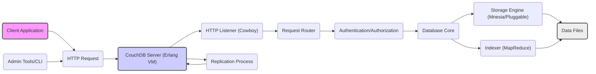
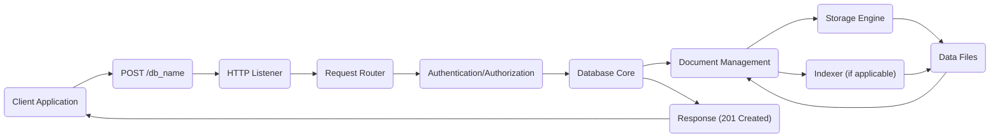
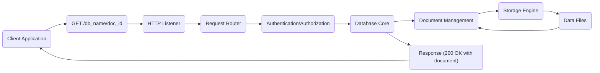
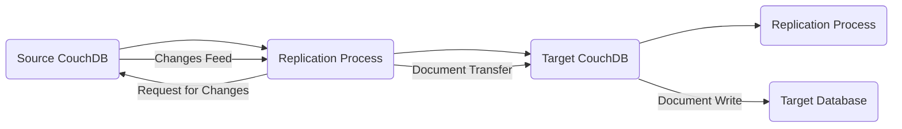

# Project Design Document: Apache CouchDB

**Version:** 1.1
**Date:** October 26, 2023
**Prepared By:** AI Software Architect

## 1. Introduction

This document provides a detailed architectural overview of Apache CouchDB, an open-source, document-oriented NoSQL database. This design document is specifically created to serve as a foundation for subsequent threat modeling activities. It outlines the key components, data flows, and technologies involved in CouchDB, highlighting potential areas of interest for security analysis. This version includes clarifications and improvements based on initial review.

## 2. Project Overview

Apache CouchDB is a database that uses JSON for documents, JavaScript for MapReduce indexes, and HTTP for an API. It is designed for reliability, scalability, and ease of use. CouchDB is a schema-free database, meaning that different documents in the same database can have different structures. This flexibility makes it well-suited for applications with evolving data requirements and decentralized architectures. Its RESTful API allows for straightforward integration with various client applications.

## 3. Architectural Overview

CouchDB follows a multi-process architecture, primarily written in Erlang. It exposes a RESTful HTTP API for all its functionalities, making it accessible to a wide range of clients and programming languages.

### 3.1. High-Level Architecture

*   **Client Application:** Any application or service that interacts with CouchDB via its HTTP API. This could be a web application, a mobile app, or another backend service.
*   **HTTP Request:**  The communication protocol used by clients to interact with CouchDB. These requests conform to standard HTTP methods (GET, POST, PUT, DELETE, etc.).
*   **CouchDB Server (Erlang VM):** The core process running the CouchDB application, leveraging the Erlang virtual machine for concurrency and fault tolerance. Erlang's actor model contributes to CouchDB's resilience.
*   **HTTP Listener (Cowboy):** An Erlang-based HTTP server responsible for receiving and processing incoming HTTP requests. Cowboy is known for its performance and robustness.
*   **Request Router:**  Component that directs incoming requests to the appropriate handler based on the URL path. This component interprets the RESTful API calls.
*   **Authentication/Authorization:**  Module responsible for verifying the identity of clients and ensuring they have the necessary permissions to access resources. This is a critical component for security.
*   **Database Core:**  The central logic for managing databases, documents, and views. It orchestrates the interactions between other components.
*   **Storage Engine (Mnesia/Pluggable):**  The underlying mechanism for storing data on disk. Mnesia is the default, an Erlang built-in database suitable for many use cases. CouchDB also supports pluggable storage engines like LevelDB for different performance characteristics.
*   **Data Files:** The physical files where the database documents and indexes are stored. The format and structure of these files are specific to the chosen storage engine.
*   **Indexer (MapReduce):**  The component responsible for building and maintaining indexes based on JavaScript MapReduce functions. This allows for efficient querying of data based on custom logic.
*   **Replication Process:**  Handles the synchronization of data between different CouchDB instances. This is a key feature for distributed deployments and data backup.
*   **Admin Tools/CLI:**  Utilities used for administrative tasks such as database creation, user management, configuration, and monitoring. Examples include `curl` and the `couchdb-admin` command-line tool.

### 3.2. Component-Level Architecture

This section delves deeper into the key components within the CouchDB server, providing more detail on their functionalities.

*   **HTTP API Layer:**
    *   Handles all incoming HTTP requests, acting as the entry point to the CouchDB server.
    *   Uses the Cowboy web server, leveraging its asynchronous request handling capabilities.
    *   Exposes a comprehensive set of RESTful endpoints for database management (e.g., creating, deleting), document manipulation (e.g., creating, reading, updating, deleting), querying (e.g., views, `_find`), and administration (e.g., server configuration, user management).
    *   Performs initial request validation, such as checking for valid JSON or correct HTTP methods.

*   **Authentication and Authorization Module:**
    *   Manages user accounts and roles, defining who has access to which resources.
    *   Supports various authentication methods, including Basic Authentication (over HTTPS), Cookie Authentication (for session management), and potentially OAuth or other custom authentication schemes.
    *   Enforces access control policies based on roles and permissions, determining if a user is authorized to perform a specific action on a particular resource. This includes database-level and document-level authorization.
    *   Handles session management, maintaining user sessions after successful authentication.

*   **Request Handling and Routing:**
    *   Parses incoming HTTP requests, extracting information such as the HTTP method, URL path, and request headers.
    *   Routes requests to the appropriate handler based on the URL path, effectively mapping API endpoints to internal functions. For example, a request to `/mydb/mydoc` will be routed to the document handling logic for the `mydb` database and the `mydoc` document.
    *   Handles different HTTP methods (GET for retrieval, POST for creation, PUT for updating, DELETE for deletion), ensuring the correct action is performed based on the method used.

*   **Database Management:**
    *   Responsible for creating, deleting, and listing databases. Each database is a container for documents.
    *   Manages database metadata, such as creation timestamps and update sequences.

*   **Document Management:**
    *   Handles the core operations on JSON documents: creation, retrieval, updating, and deletion.
    *   Manages document revisions using Multi-Version Concurrency Control (MVCC), allowing for concurrent updates without data corruption. Each update creates a new revision of the document.
    *   Supports bulk document operations, allowing for efficient creation, updating, or deletion of multiple documents in a single request.

*   **Indexing and Querying (MapReduce):**
    *   Allows defining views using JavaScript Map and Reduce functions. The Map function extracts data from documents, and the Reduce function aggregates or summarizes that data.
    *   Builds and maintains indexes based on these views, allowing for efficient querying of data based on the logic defined in the MapReduce functions.
    *   Provides query endpoints to retrieve data based on indexed views. Queries can be parameterized to filter and sort results.
    *   Supports ad-hoc queries using the `_find` endpoint (introduced in CouchDB 2.0+), which provides a more flexible query language based on JSON selectors.

*   **Replication:**
    *   Enables synchronization of databases between CouchDB instances, forming the basis for distributed deployments and offline access patterns.
    *   Supports one-way and two-way replication, allowing for data to be pushed or pulled between instances.
    *   Handles conflict resolution when the same document is modified on different instances concurrently. CouchDB uses a revision tree to manage conflicts.
    *   Uses a pull and push mechanism to transfer changes, tracking the sequence of updates to ensure all changes are synchronized.

*   **Storage Engine:**
    *   The default storage engine is Mnesia, an Erlang built-in database known for its real-time characteristics and fault tolerance within a cluster.
    *   Pluggable storage engine architecture allows for alternative storage backends like LevelDB, which might offer different performance trade-offs, such as better disk space utilization.
    *   Manages the persistence of documents and indexes to disk, ensuring data durability.

*   **Administration Interface:**
    *   Provides endpoints for administrative tasks such as server configuration (e.g., setting memory limits, configuring ports), log management (accessing and managing server logs), and statistics (monitoring server performance and resource usage).
    *   Often accessed through command-line tools like `curl` or the `couchdb-admin` utility, or through web-based interfaces like Fauxton, the official CouchDB web administration tool.

## 4. Data Flow

This section describes the typical flow of data within the CouchDB system for common operations, providing a visual representation of the steps involved.

### 4.1. Document Creation

*   The client application sends an HTTP `POST` request to the database URL (`/db_name`), with the document data in the request body (typically as JSON).
*   The HTTP listener receives the request and passes it to the next stage.
*   The request router analyzes the URL and method and directs the request to the appropriate handler for document creation.
*   Authentication and authorization are performed to ensure the client has the necessary permissions to create documents in the specified database.
*   The database core receives the request and initiates the document creation process.
*   The document management component handles the creation of the new document, assigning it a unique ID (if not provided) and managing its revision.
*   The storage engine persists the document to the data files, ensuring its durability.
*   If applicable, the indexer updates the indexes based on the content of the new document, making it searchable through views.
*   A success response (e.g., 201 Created) is sent back to the client, typically including the document ID and revision.

### 4.2. Document Retrieval

*   The client application sends an HTTP `GET` request to the document URL (`/db_name/doc_id`).
*   The HTTP listener receives the request.
*   The request router directs the request to the appropriate handler for document retrieval.
*   Authentication and authorization are performed to ensure the client has permission to read the specified document.
*   The database core receives the request.
*   The document management component retrieves the document based on its ID.
*   The storage engine fetches the document from the data files.
*   A success response (e.g., 200 OK) containing the document (as JSON) is sent back to the client.

### 4.3. Data Replication

*   The replication process on the source CouchDB initiates the replication, either based on a scheduled task or an explicit request.
*   It requests a feed of changes from the source database, specifying the point from which to start replicating.
*   The source CouchDB provides the changes feed, which includes information about new, modified, and deleted documents.
*   The replication process on the source transfers the documents (or information about deletions) to the target CouchDB.
*   The replication process on the target writes the documents to the target database, resolving any potential conflicts based on revision history.

## 5. Key Technologies

*   **Erlang:** The primary programming language used for the CouchDB server, chosen for its concurrency, fault-tolerance, and distributed capabilities, making it well-suited for building robust and scalable systems.
*   **HTTP:** The ubiquitous communication protocol used for the API, ensuring broad compatibility with various clients and tools.
*   **JSON:** The lightweight and human-readable data format used for documents, facilitating easy data exchange and manipulation.
*   **JavaScript:** Used for defining Map and Reduce functions for indexing, allowing developers to implement custom data transformations and aggregations.
*   **Mnesia:** The default embedded database system used for storage, providing transactional capabilities and data persistence.
*   **Cowboy:** An Erlang-based HTTP server known for its performance, low resource consumption, and support for WebSockets.
*   **OAuth (Optional):** Can be integrated for more sophisticated and secure authentication and authorization workflows.
*   **SSL/TLS:** Essential for secure communication over HTTPS, encrypting data in transit between clients and the server.

## 6. Security Considerations (Pre-Threat Modeling)

This section highlights potential areas of security concern that will be further explored during threat modeling. These are initial considerations to guide the threat modeling process.

*   **Authentication and Authorization:** Ensuring robust authentication mechanisms and fine-grained authorization policies are in place to prevent unauthorized access to data and administrative functions. Weaknesses here are critical vulnerabilities.
*   **Data Confidentiality:** Protecting sensitive data from unauthorized disclosure, both while being transmitted over the network (using HTTPS) and when stored at rest (considering encryption options for data files).
*   **Data Integrity:** Ensuring data is not tampered with or corrupted, either maliciously or accidentally. This includes protecting against unauthorized modifications and ensuring data consistency.
*   **Input Validation:**  Properly validating all input from clients, including data in document bodies and query parameters, to prevent injection attacks such as NoSQL injection or cross-site scripting (XSS) if user-provided data is rendered in a web interface.
*   **Secure Communication:**  Enforcing the use of HTTPS to encrypt all communication between clients and the server, protecting sensitive data from eavesdropping and man-in-the-middle attacks.
*   **Denial of Service (DoS):** Protecting the server from attacks that aim to exhaust resources (CPU, memory, network bandwidth) and make the service unavailable to legitimate users. This includes rate limiting and resource management.
*   **Replication Security:** Ensuring the security of data replication processes, especially when replicating across untrusted networks. This involves authenticating replication partners and encrypting data during replication.
*   **Third-Party Dependencies:**  Regularly assessing the security of any external libraries or components used by CouchDB and updating them to address known vulnerabilities.
*   **Administrative Access:** Securing access to administrative functionalities, ensuring that only authorized administrators can perform sensitive operations. This includes strong authentication for administrative users.
*   **Default Configurations:** Reviewing and hardening default configurations to minimize security risks. Default credentials and insecure settings should be changed immediately upon deployment.

## 7. Deployment Considerations

The deployment environment can significantly impact the security posture of CouchDB. Understanding these considerations is crucial for a comprehensive threat model.

*   **Single Node vs. Cluster:**  Clustered deployments introduce additional complexities and potential attack vectors related to inter-node communication, consensus mechanisms, and data distribution. Secure inter-node communication is essential.
*   **Network Configuration:** Proper firewall rules and network segmentation are crucial to restrict access to the CouchDB server and its components. Only necessary ports should be exposed.
*   **Operating System Security:**  The underlying operating system needs to be secured and regularly patched to address vulnerabilities that could be exploited to compromise the CouchDB instance.
*   **Cloud vs. On-Premises:** Cloud deployments may introduce shared responsibility models for security, requiring a clear understanding of which security aspects are managed by the cloud provider and which are the responsibility of the user.
*   **Containerization (e.g., Docker):**  When deploying CouchDB in containers, container security best practices should be followed, including using minimal base images, scanning for vulnerabilities, and properly configuring container networking and resource limits.

## 8. Conclusion

This document provides a comprehensive architectural overview of Apache CouchDB, focusing on aspects relevant to security. It outlines the key components, data flows, and technologies involved, laying the groundwork for a thorough threat modeling exercise. The identified security considerations will be further analyzed to identify potential vulnerabilities and develop mitigation strategies. This document will be a living document and updated as the project evolves and new insights are gained.