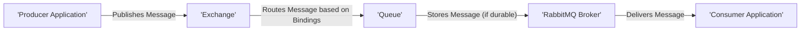

# Project Design Document: RabbitMQ Server

**Version:** 1.1
**Date:** October 26, 2023
**Author:** AI Software Architect

## 1. Introduction

This document provides a detailed architectural design of the RabbitMQ server, an open-source message broker software. This design document is specifically created to serve as a foundation for subsequent threat modeling activities. It outlines the key components, data flows, and interactions within the RabbitMQ system, with a strong emphasis on identifying areas relevant to security considerations and potential vulnerabilities.

## 2. Goals and Objectives

The primary goal of the RabbitMQ server is to provide a reliable, scalable, and high-performance message queuing system. Key objectives include:

*   Facilitating asynchronous communication between applications.
*   Decoupling producers and consumers of messages.
*   Providing various message routing strategies for flexible message delivery.
*   Ensuring message delivery guarantees through mechanisms like persistence and acknowledgements.
*   Supporting multiple messaging protocols to cater to diverse application needs.
*   Offering comprehensive management and monitoring capabilities for operational oversight.
*   Maintaining a secure and resilient platform for message handling.

## 3. System Architecture

The RabbitMQ server follows a client-server architecture with a central broker responsible for receiving, routing, and delivering messages. The broker encompasses several interconnected components that handle different aspects of message processing.

```mermaid
graph LR
    subgraph "RabbitMQ Broker"
        A["'Client (Producer/Consumer)'"]
        B["'Connection Handler'"]
        C["'Channel'"]
        D["'Exchange'"]
        E["'Queue'"]
        F["'Binding'"]
        G["'Message Store (Mnesia/Riak)'"]
        H["'Authentication/Authorization'"]
        I["'Management Interface'"]
        J["'Clustering'"]
    end
    K["'External Systems (e.g., Databases, Monitoring)'"]

    A -- "Connects via Protocols (AMQP, MQTT, STOMP, HTTP)" --> B
    B -- "Manages multiple" --> C
    C -- "Operates on" --> D
    C -- "Operates on" --> E
    D -- "Routes messages to" --> E
    E -- "Persists messages in" --> G
    D -- "Based on" --> F
    A -- "Authenticated/Authorized by" --> H
    I -- "Manages and monitors" --> B
    I -- "Manages and monitors" --> D
    I -- "Manages and monitors" --> E
    J -- "Synchronizes data with other brokers" --> "Other Broker Instances"
    B -- "Interacts with" --> H
    B -- "Interacts with" --> G
    I -- "Interacts with" --> K
```

### 3.1. Key Components

*   **Client (Producer/Consumer):** Applications or services that interact with the RabbitMQ broker. Producers send messages, and consumers receive them. These clients connect using various supported protocols.
*   **Connection Handler:** Responsible for managing network connections from clients. This includes handling protocol negotiation, connection establishment, and connection lifecycle management. It's a key entry point for client interactions.
*   **Channel:** A lightweight, virtual session within a TCP connection. Multiple channels can be multiplexed over a single connection, allowing for concurrent operations without the overhead of establishing multiple TCP connections.
*   **Exchange:**  The message routing agent within the broker. Exchanges receive messages from producers and route them to appropriate queues based on predefined rules called bindings. Different exchange types offer various routing strategies.
*   **Queue:** A named mailbox that holds messages until they are consumed by consumers. Queues have specific attributes like durability, exclusivity, and auto-deletion, influencing message persistence and availability.
*   **Binding:** A rule that establishes a relationship between an exchange and a queue. Bindings define the criteria (e.g., routing key, headers) used by the exchange to route messages to the queue.
*   **Message Store:**  The component responsible for persisting durable messages to disk. RabbitMQ primarily uses Mnesia, an Erlang-based distributed database, but can also be configured to use Riak. This ensures message survival across broker restarts.
*   **Authentication/Authorization:**  Handles the crucial task of verifying the identity of connecting clients and controlling their access to broker resources. This component enforces security policies to prevent unauthorized access and actions.
*   **Management Interface:** Provides a web-based user interface and an HTTP API for monitoring and managing the RabbitMQ broker. This interface allows administrators to observe broker status, configure settings, and perform administrative tasks.
*   **Clustering:** Enables multiple RabbitMQ server instances to operate as a single logical broker. This provides high availability and scalability by distributing the workload and providing redundancy.

### 3.2. Communication Protocols

RabbitMQ supports a variety of messaging protocols, allowing diverse applications to interact with the broker:

*   **AMQP (Advanced Message Queuing Protocol):** The primary and most feature-rich protocol supported by RabbitMQ. It offers a wide range of messaging patterns and guarantees.
*   **MQTT (Message Queuing Telemetry Transport):** A lightweight publish/subscribe protocol, well-suited for IoT devices and constrained network environments.
*   **STOMP (Simple Text Oriented Messaging Protocol):** A simple, text-based protocol that provides interoperability with various messaging clients.
*   **HTTP:** Used primarily for the management interface and can also be used for basic message publishing and consumption through the REST API.

### 3.3. Data Flow

The typical message flow within RabbitMQ involves the following steps, highlighting potential points of interaction and security relevance:



**Detailed Message Flow with Security Considerations:**

1. **Producer Application connects to the RabbitMQ Broker:** The producer initiates a connection, which involves authentication and authorization by the broker. This step verifies the producer's identity and permissions.
2. **The producer publishes a message to a specific Exchange:** The producer sends a message along with routing information (routing key, headers). Access control on the exchange determines if the producer is allowed to publish to it. Message content itself is a potential target for interception or manipulation.
3. **The Exchange receives the message:** The exchange evaluates the message's routing information against its bindings. Misconfigured exchanges or bindings can lead to messages being routed incorrectly.
4. **Based on the exchange type and Bindings, the message is routed to one or more Queues:** The routing logic determines which queues receive the message. Security implications arise from potentially unintended message delivery due to incorrect bindings.
5. **The message is stored in the Queue(s):** If the queue is durable, the message is persisted to the message store. The security of the message store (encryption at rest) becomes relevant here.
6. **A Consumer Application connects to the Broker and subscribes to a specific Queue:** Similar to the producer, the consumer undergoes authentication and authorization to access the queue.
7. **The Broker delivers the message to the Consumer:** The broker retrieves the message from the queue and sends it to the authorized consumer. Message integrity during transit is a concern.
8. **The Consumer acknowledges the message (optional):**  The consumer sends an acknowledgement back to the broker, confirming successful processing. This ensures message delivery guarantees. Lack of proper acknowledgement handling can lead to message loss or redelivery issues.

## 4. Key Components in Detail

### 4.1. Exchanges

*   **Functionality:** Receive messages from producers and route them to queues based on binding rules. Act as the entry point for messages into the broker's routing fabric.
*   **Types:**
    *   **Direct:** Routes messages to queues where the routing key of the message exactly matches the binding key of the queue.
    *   **Topic:** Routes messages to queues where the routing key matches a pattern defined in the binding key, allowing for more flexible routing.
    *   **Fanout:** Routes messages to all queues bound to the exchange, regardless of the routing key.
    *   **Headers:** Routes messages based on the presence and values of message headers instead of the routing key.
*   **Security Considerations:**
    *   **Access Control:**  Proper authorization is crucial to control which producers can publish to specific exchanges. Unauthorized publishing can lead to message flooding or injection of malicious messages.
    *   **Exchange Configuration:** Incorrectly configured exchange types or settings can lead to unintended message delivery or denial of service.
    *   **Binding Management:**  Unauthorized creation or modification of bindings can disrupt message flow and potentially expose messages to unintended consumers.

### 4.2. Queues

*   **Functionality:** Store messages until they are consumed. Act as the endpoint for message routing and provide message buffering.
*   **Attributes:**
    *   **Durable:**  Persists messages to disk, ensuring they survive broker restarts. This has implications for storage security.
    *   **Exclusive:**  Can only be accessed by the connection that declared it and is automatically deleted when the connection closes. This can be used for temporary, connection-specific queues.
    *   **Auto-delete:**  Deleted automatically when the last consumer unsubscribes. Useful for ephemeral queues.
    *   **Message TTL (Time-To-Live):**  Messages in the queue will be discarded after a specified time.
    *   **Queue Length Limit:**  Limits the number of messages that can be stored in the queue.
*   **Security Considerations:**
    *   **Access Control:**  Authorization is essential to control which consumers can consume messages from specific queues. Unauthorized access can lead to data breaches.
    *   **Queue Configuration:**  Incorrectly configured queue attributes (e.g., non-durable for critical messages) can lead to data loss.
    *   **Message Security:** Messages stored in queues might contain sensitive information and require encryption at rest.
    *   **Queue Monitoring:** Monitoring queue lengths and consumer activity can help detect potential denial-of-service attacks or unauthorized access.

### 4.3. Bindings

*   **Functionality:** Define the relationship between exchanges and queues, specifying how messages are routed. Act as the rules engine for message delivery.
*   **Mechanism:** Based on routing keys or headers, depending on the exchange type.
*   **Security Considerations:**
    *   **Binding Configuration:** Incorrectly configured bindings can lead to messages being delivered to unintended queues, potentially exposing sensitive information.
    *   **Unauthorized Binding Management:**  Unauthorized creation or deletion of bindings can disrupt message flow and impact application functionality.
    *   **Binding Complexity:** Overly complex binding configurations can be difficult to manage and audit, potentially introducing security vulnerabilities.

### 4.4. Message Store (Mnesia/Riak)

*   **Functionality:** Persists durable messages to disk, ensuring message delivery even if the broker restarts. Provides data persistence for reliable messaging.
*   **Technology:**  Uses Mnesia, a distributed database built into Erlang, by default. Can also be configured to use Riak, another distributed database.
*   **Security Considerations:**
    *   **Data at Rest Encryption:**  Sensitive messages stored in the message store should be encrypted to protect confidentiality.
    *   **Access Control:**  Access to the underlying database should be restricted to authorized RabbitMQ processes.
    *   **Integrity:** Mechanisms to ensure the integrity of stored messages are important to prevent tampering.
    *   **Backup and Recovery:**  Regular backups and a robust recovery plan are crucial to prevent data loss.

### 4.5. Authentication and Authorization

*   **Functionality:** Verifies the identity of clients and controls their access to broker resources. Enforces security policies for client interactions.
*   **Mechanisms:**
    *   **Username/Password:** Basic authentication mechanism.
    *   **X.509 Certificates:**  Used for TLS-based authentication, providing stronger security.
    *   **Plugins:**  Support for integrating with external authentication providers (e.g., LDAP, OAuth 2.0) for centralized identity management.
*   **Authorization:** Controls permissions for actions like publishing to exchanges, consuming from queues, creating/deleting queues and exchanges, and managing the broker.
*   **Security Considerations:**
    *   **Strong Authentication:**  Using strong passwords or certificate-based authentication is crucial.
    *   **Granular Authorization:** Implementing fine-grained access control policies based on the principle of least privilege.
    *   **Secure Credential Storage:**  Properly storing and managing user credentials.
    *   **Regular Auditing:**  Auditing authentication attempts and authorization decisions to detect suspicious activity.
    *   **Protection Against Brute-Force Attacks:** Implementing measures to prevent brute-force attacks on authentication mechanisms.

### 4.6. Management Interface

*   **Functionality:** Provides a web UI and an HTTP API for monitoring and managing the broker. Offers administrative oversight and control.
*   **Features:**  Viewing queues, exchanges, connections, channels, setting up users and permissions, configuring parameters, and performing administrative tasks.
*   **Security Considerations:**
    *   **Authentication and Authorization:**  The management interface must be protected by strong authentication and authorization mechanisms.
    *   **Secure Communication (HTTPS):**  All communication with the management interface should be encrypted using HTTPS.
    *   **Access Control:**  Access to the management interface should be restricted to authorized administrators only.
    *   **Protection Against Common Web Vulnerabilities:**  Implementing security measures to protect against common web vulnerabilities like Cross-Site Scripting (XSS) and Cross-Site Request Forgery (CSRF).
    *   **Rate Limiting:**  Implementing rate limiting to prevent denial-of-service attacks against the management interface.

### 4.7. Clustering

*   **Functionality:** Allows multiple RabbitMQ server instances to form a cluster, providing high availability, fault tolerance, and increased message throughput. Enhances the resilience and scalability of the messaging infrastructure.
*   **Mechanism:** Nodes in a cluster share metadata about exchanges, queues, and bindings. Messages can be mirrored across nodes for redundancy. Communication between nodes relies on Erlang's distribution protocol.
*   **Security Considerations:**
    *   **Node Authentication:**  Securely authenticating nodes joining the cluster to prevent unauthorized nodes from joining.
    *   **Secure Inter-Node Communication:**  Encrypting communication between cluster nodes to protect sensitive information exchanged between them.
    *   **Access Control:**  Controlling which users or applications can interact with the cluster as a whole.
    *   **Network Segmentation:**  Isolating the cluster network to limit the impact of potential security breaches.

## 5. Deployment Model

RabbitMQ can be deployed in various environments, each with its own security implications:

*   **Standalone Server:** A single instance of the RabbitMQ broker. Simpler to manage but lacks inherent high availability. Security relies heavily on the host system's security.
*   **Clustered Environment:** Multiple RabbitMQ instances working together. Provides high availability and scalability but introduces complexities in inter-node communication security.
*   **Cloud-based Deployments:** Using managed services like Amazon MQ, Azure Service Bus, or Google Cloud Pub/Sub. Security is a shared responsibility, relying on the cloud provider's security measures and proper configuration by the user.
*   **Containerized Environments:** Using Docker and Kubernetes. Requires careful consideration of container image security, network policies, and access control within the container orchestration platform.

## 6. Assumptions and Constraints

*   This design document focuses on the core RabbitMQ server architecture and common configurations. Specific plugins and extensions are not covered in detail, and their security implications would need separate analysis.
*   It is assumed that the underlying network infrastructure provides basic security measures, such as firewalls and network segmentation.
*   Security best practices for the host operating system and supporting infrastructure (e.g., DNS, NTP) are assumed to be in place.
*   The threat model derived from this document will focus on the RabbitMQ server itself and its immediate interactions, not the security of the applications producing or consuming messages.

## 7. Future Considerations

*   **Enhanced Message Encryption:** Implementing more robust options for end-to-end message encryption, ensuring confidentiality even within the broker.
*   **Improved Auditing and Logging:**  Expanding auditing capabilities to track more security-relevant events and providing more detailed logs for security analysis.
*   **Fine-grained Access Control:**  Exploring more granular access control mechanisms for specific operations and resources within the broker.
*   **Integration with Security Information and Event Management (SIEM) Systems:**  Facilitating integration with SIEM systems for centralized security monitoring and alerting.
*   **Support for Hardware Security Modules (HSMs):**  Integrating with HSMs for secure key management and cryptographic operations.

This document provides a comprehensive and security-focused overview of the RabbitMQ server architecture, serving as a solid foundation for conducting thorough threat modeling activities. By understanding the intricacies of its components, data flows, and security mechanisms, potential vulnerabilities can be proactively identified and mitigated.