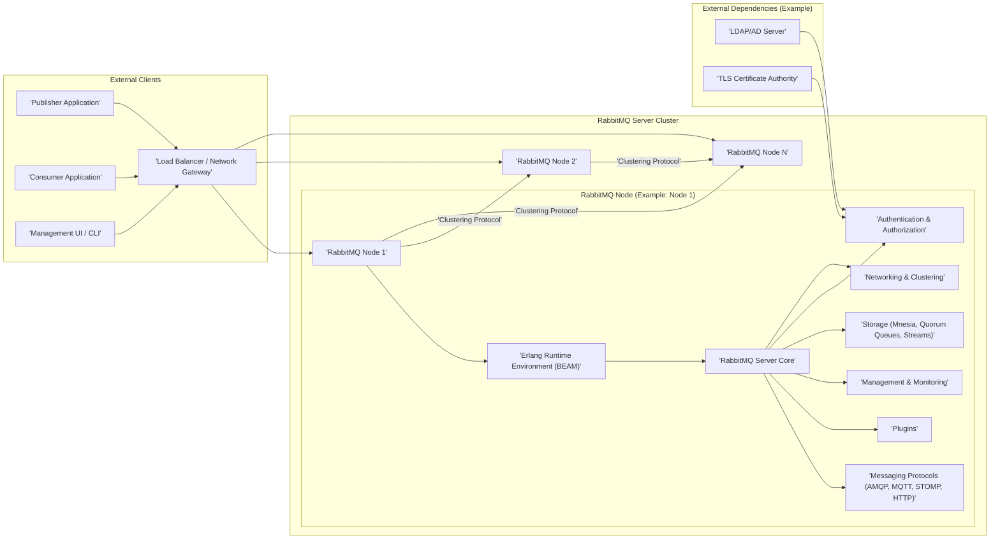

# RabbitMQ Server Project Design Document for Threat Modeling - Improved

## 1. Project Overview

**Project Name:** RabbitMQ Server

**Project Repository:** [https://github.com/rabbitmq/rabbitmq-server](https://github.com/rabbitmq/rabbitmq-server)

**Project Description:** RabbitMQ is a robust, open-source message broker, acting as middleware for asynchronous communication. It primarily implements the Advanced Message Queuing Protocol (AMQP) and also supports protocols like MQTT, STOMP, and HTTP, offering flexibility for diverse application needs. RabbitMQ facilitates decoupling of applications, enabling publishers to send messages without needing immediate responses from consumers. It ensures reliable message delivery through features like persistence, acknowledgements, and routing mechanisms (exchanges, queues, bindings).  Clustering capabilities provide high availability and scalability, making it suitable for enterprise environments. A rich plugin ecosystem further extends its functionality.

**Purpose of this Document:** This document provides a detailed architectural blueprint of the RabbitMQ server, specifically tailored for threat modeling. It outlines key components, data flow paths, and security boundaries to facilitate a structured security analysis. The goal is to identify potential threats, vulnerabilities, and attack vectors within the RabbitMQ system, enabling proactive security measures and risk mitigation strategies. This document will serve as the primary input for threat modeling exercises using methodologies like STRIDE or PASTA.

## 2. System Architecture

The following diagram illustrates the high-level architecture of the RabbitMQ server.

**Diagram Components Description:**

*   **External Clients:** Entities interacting with RabbitMQ from outside the server cluster.
    *   **Publisher Application:** Applications that send messages to RabbitMQ for distribution.
    *   **Consumer Application:** Applications that receive and process messages from RabbitMQ queues.
    *   **Management UI / CLI:** Tools used by administrators to configure, monitor, and manage the RabbitMQ server.
*   **Load Balancer / Network Gateway:** (Optional, but highly recommended for production)  Distributes incoming client connections across multiple RabbitMQ nodes, enhancing availability and performance. It can also incorporate network security functions like firewalls and intrusion detection/prevention systems (IDS/IPS).
*   **RabbitMQ Server Cluster:** A group of interconnected RabbitMQ nodes working collaboratively to provide scalability, fault tolerance, and high availability.
    *   **RabbitMQ Node:** A single instance of the RabbitMQ server software running on a dedicated server or virtual machine.
        *   **Erlang Runtime Environment (BEAM):** The underlying virtual machine that executes the Erlang-based RabbitMQ server. It provides concurrency, distribution, and fault tolerance.
        *   **RabbitMQ Server Core:** The central component responsible for core message broker functionalities: routing, queue management, exchange handling, policy enforcement, and message delivery.
        *   **Messaging Protocols (AMQP, MQTT, STOMP, HTTP):** Protocol-specific adapters that enable clients to communicate with RabbitMQ using various messaging protocols.
        *   **Plugins:**  Modules that extend RabbitMQ's base functionality, adding features like new protocols, authentication mechanisms, management enhancements, and integrations.
        *   **Management & Monitoring:** Provides interfaces (HTTP API, web UI, CLI tools) for administrators to manage the server, monitor performance, and troubleshoot issues.
        *   **Storage (Mnesia, Quorum Queues, Streams):** Mechanisms for persisting messages and broker metadata. Mnesia is the default embedded database. Quorum Queues and Streams offer different persistence and replication models for enhanced data safety and consistency.
        *   **Authentication & Authorization:** Manages user authentication (verifying identity) and authorization (controlling access to resources like virtual hosts, exchanges, queues).
        *   **Networking & Clustering:** Handles network communication within the cluster (node-to-node) and with external clients. Manages cluster formation, node discovery, and inter-node data synchronization.
*   **Clustering Protocol:** The internal communication protocol used by RabbitMQ nodes to maintain cluster state, synchronize data (depending on queue type), and ensure consistent operation across the cluster.
*   **External Dependencies (Example):**  Illustrative examples of external systems RabbitMQ might integrate with for security or functionality.
    *   **LDAP/AD Server:**  External directory services used for user authentication and authorization.
    *   **TLS Certificate Authority:**  Used for issuing and managing TLS certificates for secure communication.

## 3. Component Description and Security Considerations

This section provides a detailed description of each RabbitMQ component, focusing on security aspects relevant for threat modeling. For each component, we will consider potential threats, vulnerabilities, and recommended security controls.

### 3.1. Erlang Runtime Environment (BEAM)

*   **Description:** The BEAM VM is the foundation of RabbitMQ, providing concurrency, fault tolerance, and distribution. Its security is paramount to RabbitMQ's overall security.
*   **Security Considerations:**
    *   **Threats:**
        *   **Erlang VM Exploits:** Vulnerabilities in the Erlang VM itself could be exploited to compromise the RabbitMQ server.
        *   **Resource Exhaustion:**  Malicious actors could attempt to exhaust BEAM resources (CPU, memory) leading to DoS.
    *   **Vulnerabilities:**
        *   Outdated Erlang VM versions with known security flaws.
        *   Misconfigurations in BEAM settings that weaken security.
    *   **Security Controls:**
        *   **Regular Updates:** Keep the Erlang VM updated to the latest stable version with security patches.
        *   **Resource Limits:** Implement OS-level and RabbitMQ-level resource limits to prevent resource exhaustion.
        *   **Secure Configuration:** Follow Erlang security best practices and RabbitMQ recommendations for BEAM configuration.
        *   **Monitoring:** Monitor BEAM resource usage for anomalies that might indicate attacks.

### 3.2. RabbitMQ Server Core

*   **Description:** The core logic of RabbitMQ, handling message routing, queue management, exchange operations, and policy enforcement.
*   **Security Considerations:**
    *   **Threats:**
        *   **Message Manipulation:** Attackers might try to intercept and modify messages in transit or at rest.
        *   **Unauthorized Access to Queues/Exchanges:**  Gaining unauthorized access to queues or exchanges to consume, publish, or delete messages.
        *   **Denial of Service (DoS):** Overloading the server with messages, queue creation requests, or management operations.
        *   **Routing Misconfiguration Exploitation:** Exploiting misconfigured exchanges or bindings to redirect or drop messages.
    *   **Vulnerabilities:**
        *   Bugs in routing logic leading to unintended message delivery or security breaches.
        *   Weaknesses in queue and exchange management APIs allowing unauthorized operations.
        *   Lack of proper input validation leading to injection attacks or buffer overflows.
    *   **Security Controls:**
        *   **Robust Access Control:** Implement fine-grained access control policies for virtual hosts, exchanges, queues, and bindings.
        *   **Input Validation:**  Thoroughly validate all inputs, especially message content and management requests.
        *   **Queue Limits and Policies:** Configure queue limits (message count, length) and policies to prevent resource exhaustion and DoS.
        *   **Secure Exchange Configuration:**  Carefully configure exchange types and routing rules to prevent unintended message routing.
        *   **Message Integrity:** Consider message signing or encryption to ensure message integrity and authenticity.

### 3.3. Messaging Protocols (AMQP, MQTT, STOMP, HTTP)

*   **Description:** Protocol adapters enabling communication with RabbitMQ using different messaging protocols.
*   **Security Considerations:**
    *   **Threats:**
        *   **Protocol-Specific Attacks:** Exploiting vulnerabilities specific to each protocol (e.g., AMQP framing attacks, MQTT injection).
        *   **Protocol Downgrade Attacks:** Forcing clients to use less secure protocol versions or configurations.
        *   **Man-in-the-Middle (MITM) Attacks:** Intercepting and potentially modifying communication if protocols are not secured with TLS.
        *   **Authentication Bypass:** Exploiting weaknesses in protocol-specific authentication mechanisms.
    *   **Vulnerabilities:**
        *   Implementation flaws in protocol adapters.
        *   Lack of TLS encryption for protocol communication.
        *   Weak or default authentication configurations for protocols.
    *   **Security Controls:**
        *   **Enforce TLS Encryption:**  Mandate TLS encryption for all client-server communication for all supported protocols.
        *   **Strong Authentication:**  Use strong authentication mechanisms for each protocol (e.g., SASL for AMQP, username/password or certificate-based for MQTT).
        *   **Protocol Version Control:**  Enforce the use of secure protocol versions and disable older, less secure versions.
        *   **Input Sanitization:** Sanitize and validate all data received through protocol adapters to prevent injection attacks.
        *   **Regular Security Audits:** Conduct security audits of protocol adapter implementations and configurations.

### 3.4. Plugins

*   **Description:** Extend RabbitMQ functionality, but can also introduce security risks if not managed properly.
*   **Security Considerations:**
    *   **Threats:**
        *   **Malicious Plugins:** Installation of plugins containing malware or backdoors.
        *   **Vulnerable Plugins:**  Plugins with security vulnerabilities that can be exploited.
        *   **Plugin Conflicts:**  Conflicts between plugins leading to unexpected behavior or security weaknesses.
        *   **Privilege Escalation:** Plugins gaining excessive privileges and compromising server security.
    *   **Vulnerabilities:**
        *   Third-party plugins with unvetted code and potential vulnerabilities.
        *   Outdated plugins with known security flaws.
        *   Plugins with overly permissive access rights.
    *   **Security Controls:**
        *   **Plugin Vetting:**  Thoroughly vet plugins before installation, preferably using official or trusted sources.
        *   **Plugin Audits:** Regularly audit installed plugins for security vulnerabilities and updates.
        *   **Principle of Least Privilege for Plugins:**  Grant plugins only the necessary permissions.
        *   **Plugin Management:** Implement a secure plugin management process, including installation, updates, and removal.
        *   **Disable Unnecessary Plugins:** Disable plugins that are not actively used to reduce the attack surface.

### 3.5. Management & Monitoring

*   **Description:** Interfaces for managing and monitoring RabbitMQ, crucial for operational security but also potential attack vectors.
*   **Security Considerations:**
    *   **Threats:**
        *   **Unauthorized Management Access:** Attackers gaining access to management interfaces to reconfigure, disrupt, or compromise the server.
        *   **Management Interface Exploits:** Exploiting vulnerabilities in the web UI or HTTP API (e.g., XSS, CSRF, API injection).
        *   **Information Disclosure:** Management interfaces revealing sensitive information to unauthorized users.
        *   **Credential Theft:**  Compromising management credentials through phishing, brute-force attacks, or insecure storage.
    *   **Vulnerabilities:**
        *   Default or weak management credentials.
        *   Web application vulnerabilities in the Management UI (XSS, CSRF, etc.).
        *   API vulnerabilities in the HTTP API (injection, insecure authentication).
        *   Insufficient access control to management interfaces.
    *   **Security Controls:**
        *   **Strong Authentication for Management:** Enforce strong passwords, multi-factor authentication (MFA) for management users.
        *   **Secure Management Protocols:**  Always use HTTPS for management interfaces.
        *   **Web Application Security Best Practices:** Implement standard web security measures to protect the Management UI (CSP, input sanitization, output encoding, etc.).
        *   **API Security Best Practices:** Secure the HTTP API with strong authentication (API keys, OAuth 2.0), authorization, and rate limiting.
        *   **Role-Based Access Control (RBAC):** Implement RBAC for management users to restrict access based on roles and responsibilities.
        *   **Regular Security Audits and Penetration Testing:**  Conduct regular security assessments of management interfaces.

### 3.6. Storage (Mnesia, Quorum Queues, Streams)

*   **Description:** Mechanisms for persisting messages and broker state, critical for data confidentiality, integrity, and availability.
*   **Security Considerations:**
    *   **Threats:**
        *   **Data Breach:** Unauthorized access to persisted messages or broker configuration data.
        *   **Data Tampering:**  Modification or deletion of persisted messages or broker state.
        *   **Data Loss:**  Data loss due to storage failures or attacks.
        *   **Storage Exhaustion:** Filling up storage space leading to DoS.
    *   **Vulnerabilities:**
        *   Unencrypted data at rest.
        *   Weak access controls to storage files or databases.
        *   Storage system vulnerabilities.
        *   Insufficient storage capacity or monitoring.
    *   **Security Controls:**
        *   **Encryption at Rest:** Encrypt sensitive data at rest, including persisted messages and broker configuration.
        *   **Storage Access Control:** Restrict access to storage files and databases to only authorized processes and users.
        *   **Storage Integrity Checks:** Implement mechanisms to detect data corruption or tampering.
        *   **Data Backup and Recovery:** Implement secure and reliable backup and recovery procedures.
        *   **Storage Monitoring:** Monitor storage usage and performance to prevent exhaustion and detect anomalies.
        *   **Secure Storage Configuration:** Follow storage system security best practices and RabbitMQ recommendations for storage configuration.

### 3.7. Authentication & Authorization

*   **Description:**  Critical security component responsible for verifying user identity and controlling access to RabbitMQ resources.
*   **Security Considerations:**
    *   **Threats:**
        *   **Authentication Bypass:** Attackers bypassing authentication to gain unauthorized access.
        *   **Authorization Bypass:**  Authenticated users gaining access to resources they are not authorized to access.
        *   **Credential Compromise:**  Stealing or guessing user credentials.
        *   **Privilege Escalation:**  Users gaining higher privileges than intended.
    *   **Vulnerabilities:**
        *   Weak or default authentication mechanisms.
        *   Authentication bypass vulnerabilities in the authentication logic.
        *   Authorization bypass vulnerabilities in the authorization logic.
        *   Insufficient authorization granularity.
        *   Insecure credential storage or management.
    *   **Security Controls:**
        *   **Strong Authentication Mechanisms:** Use strong authentication methods (e.g., password policies, LDAP/AD integration, x509 certificates, OAuth 2.0).
        *   **Multi-Factor Authentication (MFA):** Implement MFA for enhanced authentication security, especially for management users.
        *   **Robust Authorization Model:** Implement a fine-grained authorization model with clear roles and permissions.
        *   **Principle of Least Privilege:** Grant users only the necessary permissions.
        *   **Secure Credential Management:** Store and manage user credentials securely (e.g., using strong hashing algorithms, secrets management systems).
        *   **Regular Security Audits of Authentication & Authorization:**  Periodically review and audit authentication and authorization configurations and implementations.

### 3.8. Networking & Clustering

*   **Description:** Handles network communication, including client connections and inter-node communication within a cluster.
*   **Security Considerations:**
    *   **Threats:**
        *   **Network Eavesdropping:** Intercepting unencrypted network traffic to steal sensitive data.
        *   **Man-in-the-Middle (MITM) Attacks:** Intercepting and potentially modifying network communication.
        *   **Replay Attacks:**  Replaying captured network traffic to gain unauthorized access or disrupt service.
        *   **Unauthorized Cluster Access:**  Unauthorized nodes joining the cluster.
        *   **Network Segmentation Bypass:** Attackers moving laterally within the network from compromised systems to RabbitMQ servers.
    *   **Vulnerabilities:**
        *   Unencrypted network communication (client-server, node-to-node).
        *   Weak or no authentication for cluster joining.
        *   Insecure clustering protocol configuration.
        *   Lack of network segmentation.
        *   Insufficient firewall rules.
    *   **Security Controls:**
        *   **Enforce TLS Encryption for All Network Communication:** Mandate TLS encryption for client-server and node-to-node communication.
        *   **Secure Clustering Protocol:** Configure the clustering protocol for secure communication and authentication.
        *   **Node Authentication for Cluster Joining:** Implement strong authentication mechanisms for nodes joining the cluster.
        *   **Network Segmentation:**  Deploy RabbitMQ servers in a segmented network, isolated from public networks and untrusted zones.
        *   **Firewall Configuration:** Configure firewalls to restrict network access to RabbitMQ servers to only necessary ports and trusted sources.
        *   **Intrusion Detection/Prevention Systems (IDS/IPS):** Deploy IDS/IPS to monitor network traffic for malicious activity.

## 4. Data Flow Diagram - Improved

This diagram provides a more detailed view of data flow, including security control points.

```mermaid
graph LR
    subgraph "Publisher"
        PA["'Publisher Application'"]
    end
    subgraph "Consumer"
        CA["'Consumer Application'"]
    end
    subgraph "Management Client"
        MA["'Management UI/CLI'"]
    end
    subgraph "RabbitMQ Node"
        P["'Protocol Adapter (AMQP, MQTT, etc.)'"]
        TLS_In_P["'TLS Decryption (Protocol Adapter)'"]
        Input_Validation_P["'Input Validation (Protocol Adapter)'"]
        Auth_P["'Authentication (Protocol Adapter)'"]
        E["'Exchange'"]
        Routing_E["'Routing Logic (Exchange)'"]
        Q["'Queue'"]
        Policy_Q["'Queue Policy Enforcement'"]
        S["'Storage (Mnesia, Quorum Queues, Streams)'"]
        Encryption_S["'Encryption at Rest (Storage)'"]
        A["'Authentication & Authorization'"]
        Auth_M["'Authentication (Management Interface)'"]
        AuthZ_M["'Authorization (Management Interface)'"]
        M["'Management Interface'"]
        TLS_Out_P["'TLS Encryption (Protocol Adapter)'"]
    end

    PA --> P -- "'Publish Message (Unencrypted)'" --> TLS_In_P;
    TLS_In_P -- "'Publish Message (Encrypted)'" --> Input_Validation_P;
    Input_Validation_P -- "'Validated Message'" --> Auth_P;
    Auth_P -- "'Authenticated Message'" --> E;
    E -- "'Route Message'" --> Routing_E;
    Routing_E -- "'Routed Message'" --> Q;
    Q -- "'Policy Enforcement'" --> Policy_Q;
    Policy_Q -- "'Store Message (if persistent)'" --> S;
    S -- "'Encryption at Rest'" --> Encryption_S;
    Encryption_S --> S;
    S -- "'Retrieve Message'" --> Q;
    Q -- "'Deliver Message'" --> P;
    P --> TLS_Out_P -- "'Deliver Message (Encrypted)'" --> CA;
    TLS_Out_P -- "'Deliver Message (Unencrypted)'" --> CA;


    MA --> M -- "'Management Request (Unencrypted)'" --> Auth_M;
    Auth_M -- "'Authentication Check'" --> AuthZ_M;
    AuthZ_M -- "'Authorization Check'" --> M;
    M -- "'Manage/Monitor'" --> I["'Internal State & Configuration'"];
    I --> S -- "'Store Configuration/State'" --> S;
    S --> I -- "'Retrieve Configuration/State'" --> I;
    I --> M -- "'Return Response'" --> MA;

    style P,E,Q,S,A,M,TLS_In_P,Input_Validation_P,Auth_P,Routing_E,Policy_Q,Encryption_S,Auth_M,AuthZ_M,TLS_Out_P fill:#eee,stroke:#333,stroke-width:1px
    style Auth_P,Auth_M,AuthZ_M fill:#ccf,stroke:#333,stroke-width:1px
    style TLS_In_P,TLS_Out_P,Encryption_S fill:#ccf,stroke:#333,stroke-width:1px
    style Input_Validation_P,Policy_Q,Routing_E fill:#ccf,stroke:#333,stroke-width:1px
```

**Data Flow Description (Improved):**

*   **Message Flow (Publisher to Consumer) with Security Controls Highlighted:**
    1.  **Publisher Application** sends a message to the **Protocol Adapter** (unencrypted initially).
    2.  **TLS Decryption (Protocol Adapter):** If TLS is enabled, the **Protocol Adapter** decrypts the incoming message.
    3.  **Input Validation (Protocol Adapter):** The **Protocol Adapter** validates the message format and content to prevent injection attacks.
    4.  **Authentication (Protocol Adapter):** The **Protocol Adapter** authenticates the publisher based on the configured protocol and authentication mechanisms.
    5.  **Exchange:** The authenticated message is passed to the **Exchange**.
    6.  **Routing Logic (Exchange):** The **Exchange** routes the message to appropriate **Queues** based on bindings and routing keys.
    7.  **Queue:** The message arrives at the designated **Queue**.
    8.  **Queue Policy Enforcement:** **Queue Policies** are enforced (e.g., message TTL, queue length limits).
    9.  **Storage (if persistent):** If the message is persistent, it is stored in **Storage**.
    10. **Encryption at Rest (Storage):**  Messages in **Storage** are encrypted at rest if configured.
    11. **Delivery to Consumer:** The **Queue** delivers the message to the **Protocol Adapter** for a **Consumer Application**.
    12. **TLS Encryption (Protocol Adapter):** If TLS is enabled, the **Protocol Adapter** encrypts the message before sending it to the consumer.
    13. **Consumer Application:** The **Consumer Application** receives the message (potentially unencrypted after TLS termination at the client or load balancer).

*   **Management Data Flow (Management Client to Server) with Security Controls Highlighted:**
    1.  **Management Client** sends a management request to the **Management Interface** (unencrypted initially).
    2.  **Authentication (Management Interface):** The **Management Interface** authenticates the management client (e.g., using username/password, API keys).
    3.  **Authorization (Management Interface):** The **Management Interface** authorizes the authenticated user to perform the requested management operation based on RBAC.
    4.  **Management Interface:** Processes the authorized request, interacting with **Internal State & Configuration** and potentially **Storage**.
    5.  **Internal State & Configuration** retrieves or updates server configuration and state, potentially interacting with **Storage**.
    6.  **Management Interface** returns a response to the **Management Client**.

## 5. Deployment Considerations - Enhanced

These deployment considerations are crucial for establishing a secure RabbitMQ environment.

*   **Network Segmentation (Critical):** Isolate RabbitMQ servers within a dedicated, secure network segment (e.g., DMZ or internal network). Implement strict firewall rules to control inbound and outbound traffic, allowing only necessary ports and protocols.
*   **Operating System Hardening (Essential):** Harden the underlying operating systems of RabbitMQ nodes. Apply security patches promptly, disable unnecessary services, configure secure boot, implement intrusion detection systems (HIDS), and enforce strong password policies.
*   **Resource Limits (Proactive Defense):** Implement both OS-level (e.g., `ulimit` on Linux) and RabbitMQ-level resource limits (e.g., connection limits, queue limits, memory limits) to prevent resource exhaustion attacks and ensure system stability under load.
*   **Regular Security Updates and Patch Management (Continuous Security):** Establish a robust patch management process to ensure timely updates for RabbitMQ server, Erlang runtime, plugins, and the operating system. Subscribe to security mailing lists and monitor security advisories.
*   **Comprehensive Monitoring and Logging (Detection and Response):** Implement centralized logging and monitoring for RabbitMQ servers. Monitor key metrics (CPU, memory, disk I/O, connection counts, queue depths, error logs, audit logs). Integrate with a SIEM system for security event correlation and alerting. Enable audit logging in RabbitMQ to track administrative actions.
*   **Backup and Disaster Recovery (Resilience):** Develop and regularly test secure backup and disaster recovery procedures for RabbitMQ data and configuration. Store backups in a secure, offsite location. Ensure backups are encrypted and access-controlled.
*   **Secure Configuration Management (Consistency and Control):** Utilize configuration management tools (e.g., Ansible, Chef, Puppet) to automate and enforce consistent security configurations across all RabbitMQ nodes. Store configurations in version control and implement code review processes for configuration changes.
*   **Principle of Least Privilege (Access Control):** Adhere to the principle of least privilege for all user accounts, service accounts, and application access to RabbitMQ. Grant only the minimum necessary permissions required for each entity to perform its function. Implement Role-Based Access Control (RBAC) effectively.
*   **TLS Everywhere (Confidentiality and Integrity):** Enforce TLS encryption for all communication channels: client-to-server, server-to-server (clustering), and management interfaces. Use strong cipher suites and regularly rotate TLS certificates.
*   **Regular Security Audits and Penetration Testing (Validation):** Conduct periodic security audits and penetration testing of the RabbitMQ infrastructure to identify vulnerabilities and weaknesses. Engage external security experts for independent assessments.
*   **Incident Response Plan (Preparedness):** Develop and maintain a comprehensive incident response plan specifically for RabbitMQ security incidents. Define roles, responsibilities, communication channels, and procedures for handling security breaches.

## 6. Threat Modeling Process and Utilization of this Document

This document is designed to be a core input for a structured threat modeling process. We recommend using methodologies like STRIDE or PASTA.

**How to use this document for Threat Modeling:**

1.  **Decomposition:** This document provides the system decomposition, outlining key components (Section 3) and data flows (Section 4). Use these sections to understand the system's boundaries and interactions.
2.  **Threat Identification (using STRIDE as an example):** For each component and data flow identified in Sections 3 and 4, systematically apply the STRIDE categories:
    *   **Spoofing:**  Can an attacker impersonate a component or user? (e.g., Spoofing a publisher application).
    *   **Tampering:** Can data be modified in transit or at rest? (e.g., Tampering with messages in queues).
    *   **Repudiation:** Can a user deny performing an action? (Less relevant for RabbitMQ core, more for audit logging).
    *   **Information Disclosure:** Can sensitive information be exposed to unauthorized parties? (e.g., Disclosure of message content, management data).
    *   **Denial of Service:** Can the system be made unavailable? (e.g., DoS attacks on RabbitMQ nodes).
    *   **Elevation of Privilege:** Can an attacker gain higher privileges than intended? (e.g., Privilege escalation through plugin vulnerabilities).
3.  **Vulnerability Analysis:** For each identified threat, analyze potential vulnerabilities that could be exploited. Section 3 provides a starting point by listing vulnerabilities for each component.
4.  **Risk Assessment:** Assess the likelihood and impact of each threat and vulnerability combination to prioritize risks.
5.  **Security Control Identification and Mitigation:** Based on the risk assessment, identify and implement appropriate security controls to mitigate the identified risks. Section 3 and 5 provide recommended security controls.
6.  **Documentation and Review:** Document the threat model, including identified threats, vulnerabilities, risks, and implemented security controls. Regularly review and update the threat model as the system evolves.

This document provides a solid foundation for these steps by offering a detailed architectural overview and highlighting key security considerations. By systematically applying a threat modeling methodology using this document, organizations can proactively identify and mitigate security risks in their RabbitMQ deployments.

## 7. Conclusion

This improved design document provides a comprehensive and security-focused overview of the RabbitMQ server. It details the architecture, components, data flows, and critical security considerations, enhanced with specific threat examples and recommended security controls. This document is explicitly designed to be a valuable resource for conducting thorough threat modeling exercises, enabling organizations to build and operate more secure and resilient RabbitMQ-based messaging systems.  Regularly reviewing and updating this document, along with continuous threat modeling, is crucial to maintain a strong security posture for RabbitMQ deployments.