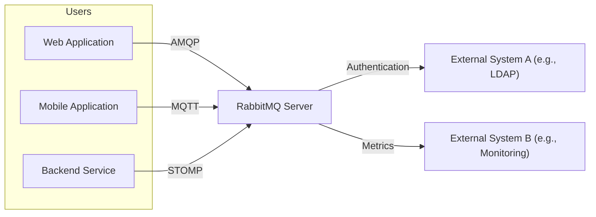
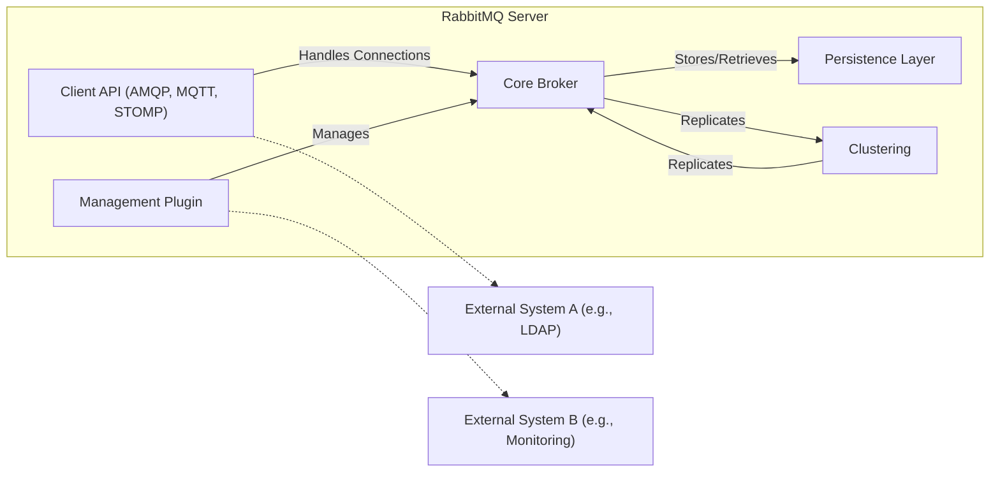
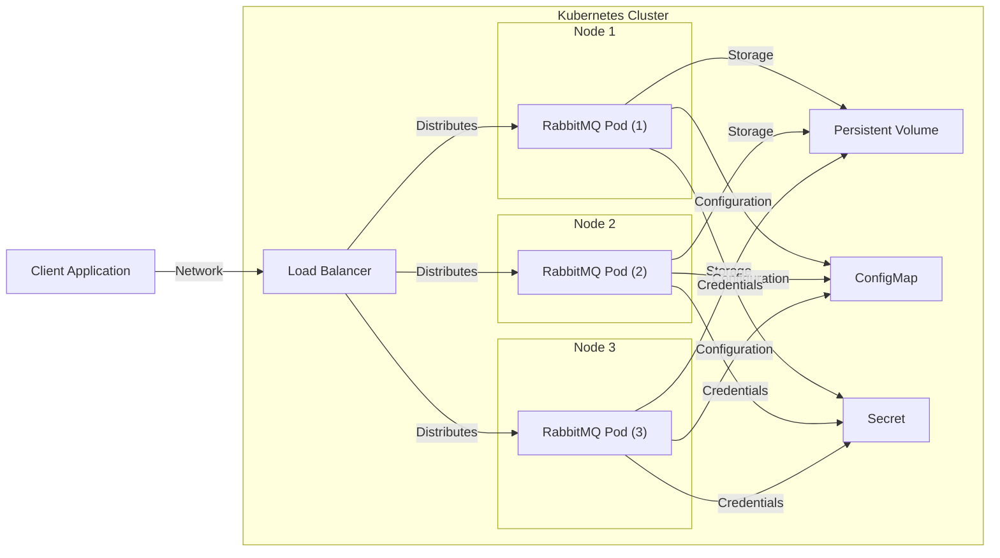
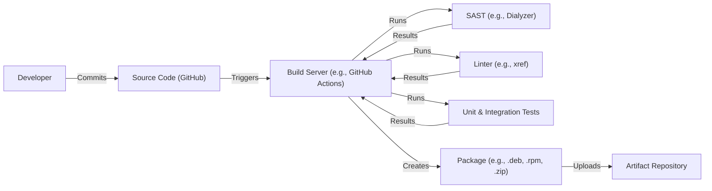

Okay, let's create a design document for the RabbitMQ server project, focusing on aspects relevant for threat modeling.

# BUSINESS POSTURE

RabbitMQ is a widely-used, open-source message broker.  It's often a critical component in distributed systems, microservices architectures, and event-driven applications.  Its primary purpose is to provide reliable and efficient message queuing and routing.

Business Priorities:

*   Reliability:  Ensure messages are delivered as expected, even in the face of network or component failures.  Downtime directly translates to application failure.
*   Performance:  Handle high message throughput and low latency to meet the demands of real-time applications.
*   Scalability:  Adapt to increasing message volume and user load without significant performance degradation.
*   Maintainability:  Ease of operation, configuration, monitoring, and upgrades.  This impacts operational costs and the ability to respond to issues quickly.
*   Interoperability: Support various messaging protocols (AMQP, STOMP, MQTT) and client libraries to integrate with diverse systems.
*   Community & Ecosystem: Foster a strong open-source community and a rich ecosystem of plugins and tools.

Business Goals:

*   Provide a robust and dependable messaging infrastructure for a wide range of applications.
*   Become/remain the message broker of choice for developers and organizations.
*   Enable asynchronous communication patterns to improve application resilience and scalability.

Most Important Business Risks:

*   Message Loss:  Failure to deliver messages reliably can lead to data loss, inconsistent application state, and broken business processes.
*   Service Outage:  RabbitMQ downtime can cause widespread application failures, impacting users and potentially causing financial losses.
*   Security Breach:  Unauthorized access to messages or the broker itself could expose sensitive data or disrupt operations.
*   Performance Bottlenecks:  Inability to handle peak loads can lead to application slowdowns and user dissatisfaction.
*   Operational Complexity:  Difficulty in managing and monitoring the broker can increase operational costs and the risk of misconfiguration.

# SECURITY POSTURE

Existing Security Controls:

*   security control: Authentication: Supports various authentication mechanisms, including username/password, X.509 certificates, and external authentication providers (LDAP, OAuth 2.0). Implemented in core server and plugins. Described in documentation and configuration files.
*   security control: Authorization: Fine-grained access control lists (ACLs) allow administrators to define permissions for users and virtual hosts. Implemented in core server. Described in documentation and configuration files.
*   security control: TLS/SSL:  Encryption of network traffic between clients and the broker, and between nodes in a cluster. Implemented using Erlang's SSL library. Described in documentation and configuration files.
*   security control: Virtual Hosts (vhosts):  Logical separation of message spaces, providing isolation between different applications or tenants. Implemented in core server. Described in documentation.
*   security control: User Management:  Tools and APIs for managing users, permissions, and virtual hosts. Implemented in core server and management plugin. Described in documentation.
*   security control: Plugins: Extensible architecture allows for custom security plugins (e.g., for authentication, authorization, or auditing). Described in documentation.
*   security control: Regular Security Audits: The RabbitMQ team and community conduct regular security reviews and address vulnerabilities. Described in security advisories and release notes.
*   security control: Security Advisories: Public disclosure of security vulnerabilities and their fixes. Described on the RabbitMQ website.

Accepted Risks:

*   accepted risk: Default configurations may not be secure out-of-the-box.  Administrators are responsible for configuring appropriate security settings.
*   accepted risk:  Plugin vulnerabilities:  Third-party plugins may introduce security risks that are not directly controlled by the core RabbitMQ team.
*   accepted risk:  Complexity of configuration:  The extensive configuration options can lead to misconfigurations if not carefully managed.
*   accepted risk: Reliance on Erlang/OTP security: Vulnerabilities in the underlying Erlang/OTP platform could impact RabbitMQ.

Recommended Security Controls:

*   security control: Implement Network Policies: Restrict network access to the RabbitMQ broker to only authorized clients and servers using firewalls or cloud-native network policies.
*   security control: Enable Auditing:  Log all authentication and authorization events, as well as significant broker operations, to facilitate security monitoring and incident response.
*   security control: Regularly Update and Patch:  Stay up-to-date with the latest RabbitMQ releases and security patches to address known vulnerabilities.
*   security control: Use Strong Passwords and Credentials:  Enforce strong password policies and avoid using default credentials.
*   security control: Principle of Least Privilege: Grant users and applications only the minimum necessary permissions.
*   security control: Monitor Resource Usage: Track CPU, memory, and disk usage to detect potential denial-of-service attacks or resource exhaustion issues.
*   security control: Consider a dedicated security review of any custom-developed plugins.

Security Requirements:

*   Authentication:
    *   Support for strong authentication mechanisms (e.g., multi-factor authentication).
    *   Integration with existing identity providers (e.g., LDAP, Active Directory, OAuth 2.0).
    *   Secure storage of user credentials.
*   Authorization:
    *   Fine-grained access control based on user roles and permissions.
    *   Ability to restrict access to specific virtual hosts, exchanges, and queues.
    *   Auditing of authorization decisions.
*   Input Validation:
    *   Validation of message headers and properties to prevent injection attacks.
    *   Protection against malformed messages that could cause denial-of-service.
*   Cryptography:
    *   Use of TLS/SSL for all network communication (client-broker and inter-node).
    *   Support for strong cipher suites and key exchange algorithms.
    *   Secure generation and management of cryptographic keys.
    *   Option for message encryption at rest (if required by specific use cases).

# DESIGN

## C4 CONTEXT

Context Diagram Element List:

*   1.  Name: Web Application
    *   Type: User
    *   Description: A web-based application that interacts with RabbitMQ to send or receive messages.
    *   Responsibilities: Publish messages to RabbitMQ, Consume messages from RabbitMQ.
    *   Security controls: TLS/SSL, Authentication (username/password), Authorization (ACLs).

*   2.  Name: Mobile Application
    *   Type: User
    *   Description: A mobile application that uses RabbitMQ for asynchronous communication.
    *   Responsibilities: Publish messages, Consume messages.
    *   Security controls: TLS/SSL, Authentication (OAuth 2.0), Authorization (ACLs).

*   3.  Name: Backend Service
    *   Type: User
    *   Description: A backend service that uses RabbitMQ for inter-service communication.
    *   Responsibilities: Publish messages, Consume messages, Process messages.
    *   Security controls: TLS/SSL, Authentication (X.509 certificates), Authorization (ACLs).

*   4.  Name: RabbitMQ Server
    *   Type: System
    *   Description: The core message broker that routes and delivers messages.
    *   Responsibilities: Message routing, Message queuing, Message persistence, User management, Access control.
    *   Security controls: Authentication, Authorization, TLS/SSL, Virtual Hosts, Plugins.

*   5.  Name: External System A (e.g., LDAP)
    *   Type: External System
    *   Description: An external system used for authentication, such as an LDAP directory.
    *   Responsibilities: Authenticate users.
    *   Security controls: Secure communication with RabbitMQ (e.g., LDAPS).

*   6.  Name: External System B (e.g., Monitoring)
    *   Type: External System
    *   Description: An external system used for monitoring RabbitMQ performance and health.
    *   Responsibilities: Collect metrics, Provide alerts.
    *   Security controls: Secure communication with RabbitMQ (e.g., TLS/SSL), Authentication.

## C4 CONTAINER

Container Diagram Element List:

*   1.  Name: Client API (AMQP, MQTT, STOMP)
    *   Type: Container
    *   Description:  Handles client connections and protocol-specific interactions.
    *   Responsibilities:  Accept client connections, Decode/encode messages, Handle protocol-specific commands.
    *   Security controls:  TLS/SSL, Authentication, Protocol-specific security features.

*   2.  Name: Management Plugin
    *   Type: Container
    *   Description: Provides a web-based interface and API for managing and monitoring RabbitMQ.
    *   Responsibilities: User management, Virtual host management, Queue management, Monitoring, Configuration.
    *   Security controls: Authentication, Authorization, HTTPS.

*   3.  Name: Core Broker
    *   Type: Container
    *   Description: The core message routing and queuing engine.
    *   Responsibilities: Message routing, Message queuing, Exchange management, Binding management, Access control.
    *   Security controls: Authorization (ACLs), Virtual Hosts.

*   4.  Name: Persistence Layer
    *   Type: Container
    *   Description: Handles message persistence to disk (for durable queues and messages).
    *   Responsibilities: Write messages to disk, Read messages from disk, Manage disk space.
    *   Security controls: File system permissions, (Optional) Data encryption at rest.

*   5.  Name: Clustering
    *   Type: Container
    *   Description: Enables multiple RabbitMQ nodes to work together as a single cluster.
    *   Responsibilities: Replicate messages, Distribute queues, Handle node failures.
    *   Security controls: TLS/SSL for inter-node communication, Authentication between nodes.

*   6.  Name: External System A (e.g., LDAP)
    *   Type: External System
    *   Description: An external system used for authentication.
    *   Responsibilities: Authenticate users.
    *   Security controls: Secure communication with RabbitMQ (e.g., LDAPS).

*   7.  Name: External System B (e.g., Monitoring)
    *   Type: External System
    *   Description: An external system used for monitoring.
    *   Responsibilities: Collect and display metrics.
    *   Security controls: Secure communication with RabbitMQ.

## DEPLOYMENT

Possible Deployment Solutions:

1.  Bare Metal/Virtual Machines:  Traditional deployment on physical or virtual servers.
2.  Docker Containers:  Packaging RabbitMQ and its dependencies into Docker containers.
3.  Kubernetes:  Orchestrating RabbitMQ deployments using Kubernetes.
4.  Cloud Provider Managed Services:  Using managed RabbitMQ offerings from cloud providers (e.g., Amazon MQ, Azure Service Bus).

Chosen Solution (for detailed description): Kubernetes

Deployment Diagram Element List:

*   1.  Name: Kubernetes Cluster
    *   Type: Deployment Environment
    *   Description: A Kubernetes cluster that orchestrates the RabbitMQ deployment.
    *   Responsibilities: Resource management, Scheduling, Scaling, Self-healing.
    *   Security controls: Kubernetes RBAC, Network Policies, Pod Security Policies.

*   2.  Name: Node 1, Node 2, Node 3
    *   Type: Node
    *   Description: Worker nodes in the Kubernetes cluster.
    *   Responsibilities: Run RabbitMQ pods.
    *   Security controls: Node-level security hardening.

*   3.  Name: RabbitMQ Pod (1, 2, 3)
    *   Type: Pod
    *   Description:  Instances of the RabbitMQ container running within the Kubernetes cluster.
    *   Responsibilities:  Run the RabbitMQ server.
    *   Security controls:  Container image security, Resource limits.

*   4.  Name: Load Balancer
    *   Type: Service
    *   Description:  A Kubernetes Service that exposes RabbitMQ to external clients.
    *   Responsibilities:  Distribute traffic across RabbitMQ pods.
    *   Security controls:  TLS termination (if configured).

*   5.  Name: Persistent Volume
    *   Type: Storage
    *   Description:  Persistent storage for durable RabbitMQ queues and messages.
    *   Responsibilities:  Provide persistent storage.
    *   Security controls:  Storage encryption (if configured).

*   6.  Name: ConfigMap
    *   Type: Configuration
    *   Description:  Kubernetes ConfigMap for storing RabbitMQ configuration files.
    *   Responsibilities:  Provide configuration data to RabbitMQ pods.
    *   Security controls:  Access control to the ConfigMap.

*   7.  Name: Secret
    *   Type: Configuration
    *   Description:  Kubernetes Secret for storing sensitive information (e.g., passwords, certificates).
    *   Responsibilities:  Provide sensitive data to RabbitMQ pods.
    *   Security controls:  Encryption of Secret data at rest.

*   8.  Name: Client Application
    *   Type: External System
    *   Description: An application that connects to RabbitMQ.
    *   Responsibilities: Publish and/or consume messages.
    *   Security controls: TLS/SSL, Authentication.

## BUILD

The RabbitMQ build process involves multiple stages, from compiling the Erlang code to creating distributable packages.

Build Process Description:

1.  Developer commits code changes to the GitHub repository.
2.  A build server (e.g., GitHub Actions) is triggered by the commit.
3.  The build server checks out the source code.
4.  Static Application Security Testing (SAST) tools (e.g., Dialyzer for Erlang) are run to identify potential security vulnerabilities in the code.
5.  Linters (e.g., xref) are used to enforce code style and identify potential errors.
6.  Unit and integration tests are executed to verify the functionality and correctness of the code.
7.  If all checks and tests pass, the build server creates distributable packages (e.g., .deb, .rpm, .zip).
8.  The packages are uploaded to an artifact repository.

Security Controls in Build Process:

*   security control: SAST: Static analysis tools help identify vulnerabilities early in the development lifecycle.
*   security control: Linters: Enforce coding standards and prevent common errors that could lead to security issues.
*   security control: Automated Testing:  Unit and integration tests help ensure the code behaves as expected and prevent regressions.
*   security control: Build Automation:  Using a CI/CD system (like GitHub Actions) ensures a consistent and repeatable build process, reducing the risk of manual errors.
*   security control: Artifact Repository:  Storing build artifacts in a secure repository provides a controlled and auditable distribution mechanism.
*   security control: Dependency Management: Tools to manage dependencies and identify vulnerable libraries. (Not explicitly shown in diagram, but a crucial part of the process).
*   security control: Code Signing: Packages can be signed to ensure their integrity and authenticity. (Not explicitly shown, but a recommended practice).

# RISK ASSESSMENT

Critical Business Processes to Protect:

*   Message Delivery: Ensuring reliable and timely delivery of messages between applications.
*   Asynchronous Communication: Enabling applications to communicate asynchronously, improving resilience and scalability.
*   Event-Driven Architecture: Supporting event-driven patterns for real-time data processing and workflows.

Data to Protect and Sensitivity:

*   Message Content: The data contained within messages can vary widely in sensitivity, from non-sensitive operational data to highly confidential business information (e.g., financial transactions, personal data, trade secrets). Sensitivity: Variable, depends on the specific application and use case.
*   User Credentials: Usernames, passwords, API keys, and other credentials used to authenticate with RabbitMQ. Sensitivity: High.
*   Configuration Data:  RabbitMQ configuration files, which may contain sensitive information (e.g., connection strings, passwords). Sensitivity: High.
*   Metadata: Information about queues, exchanges, bindings, and users. Sensitivity: Medium to Low.
*   Logs: Audit logs and other log files may contain sensitive information about user activity and system events. Sensitivity: Medium.

# QUESTIONS & ASSUMPTIONS

Questions:

*   What specific compliance requirements (e.g., GDPR, HIPAA, PCI DSS) apply to applications using RabbitMQ in different contexts?
*   What are the specific performance requirements (throughput, latency) for different use cases?
*   What are the existing monitoring and alerting capabilities for RabbitMQ deployments?
*   What is the process for handling security incidents related to RabbitMQ?
*   Are there any specific threat models already in place for applications using RabbitMQ?
*   What level of support is available for different RabbitMQ deployments (e.g., community support, commercial support)?
*   What are the disaster recovery and business continuity plans for RabbitMQ deployments?

Assumptions:

*   BUSINESS POSTURE:  RabbitMQ is a critical component of the infrastructure, and its availability and reliability are essential.
*   SECURITY POSTURE:  Administrators are responsible for configuring and maintaining the security of RabbitMQ deployments.  A secure development lifecycle is followed.
*   DESIGN:  The deployment will use a clustered configuration for high availability and fault tolerance.  TLS/SSL will be used for all network communication.  Appropriate authentication and authorization mechanisms will be implemented.